# 21 个让你发笑的编程笑话(即使你不是程序员)

> 原文：<https://javascript.plainenglish.io/21-programming-jokes-that-will-make-you-laugh-even-if-youre-not-a-programmer-4681756e5faa?source=collection_archive---------1----------------------->

## 由开发人员精心挑选，面向非开发人员

Author: [Diva Plavalaguna](https://www.pexels.com/sk-sk/@diva-plavalaguna?utm_content=attributionCopyText&utm_medium=referral&utm_source=pexels) on [Pexels](https://www.pexels.com/sk-sk/fotka/byt-spolu-potesenie-pozitok-nesenie-6150579/?utm_content=attributionCopyText&utm_medium=referral&utm_source=pexels)

我必须承认，我喜欢编笑话。我认为他们很有趣，他们总是让我发笑。但和某些人相比，我有不公平的优势。我的优势是我是一个真正的程序员。这意味着我得到了几乎所有的编程笑话。

但是其他人呢？想好好笑一场，却听不懂笑话怎么办？嗯，没有理由担心。因为今天，我列出了我最喜欢的笑话。好的一面是，我只挑选了能让所有人发笑的。

所以，不浪费你任何宝贵的时间，第一个来了！

## 至少你做得很开心

*在大多数情况下，无聊任务的自动化总是一个好的解决方案。*

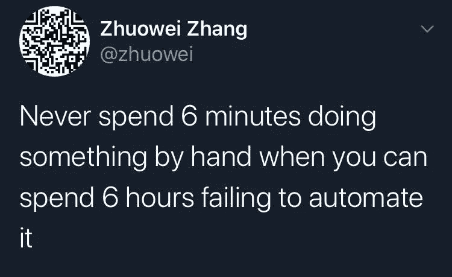

[Original Source](https://www.reddit.com/r/ProgrammerHumor/comments/g9j8c6/cries_in_powershell/)

## 工程不像销售团队想的那么简单

*但是如果顾客很兴奋，就没有理由停下来。*

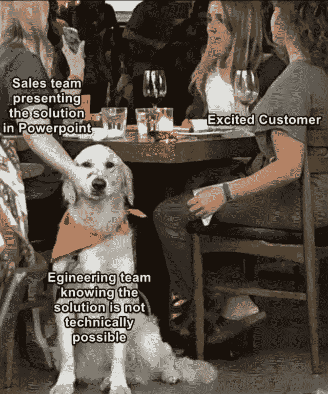

[Original Source](https://www.reddit.com/r/ProgrammerHumor/comments/i5iokv/weve_all_been_there/)

## 这最终会发生的

虽然开始可能是有趣和令人兴奋的。他们也会不可避免的结束。

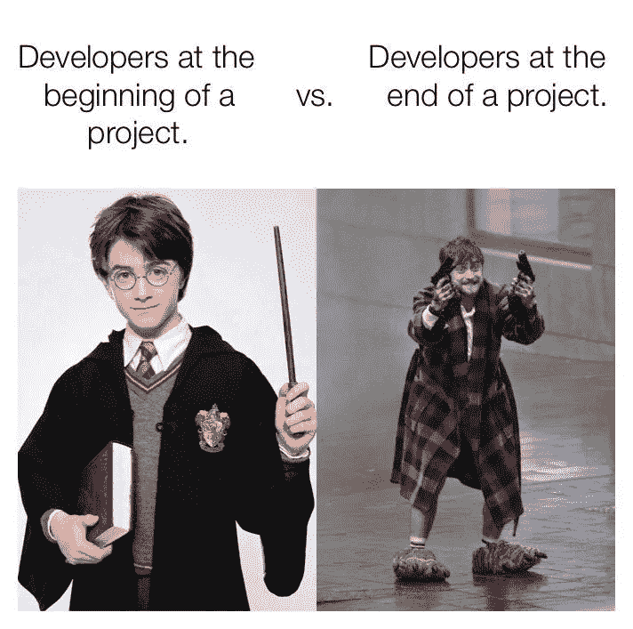

[Original Source](https://www.reddit.com/r/ProgrammerHumor/comments/avj910/developers/)

## 诚实很受欢迎

*尤其是在你的顾客之间。*

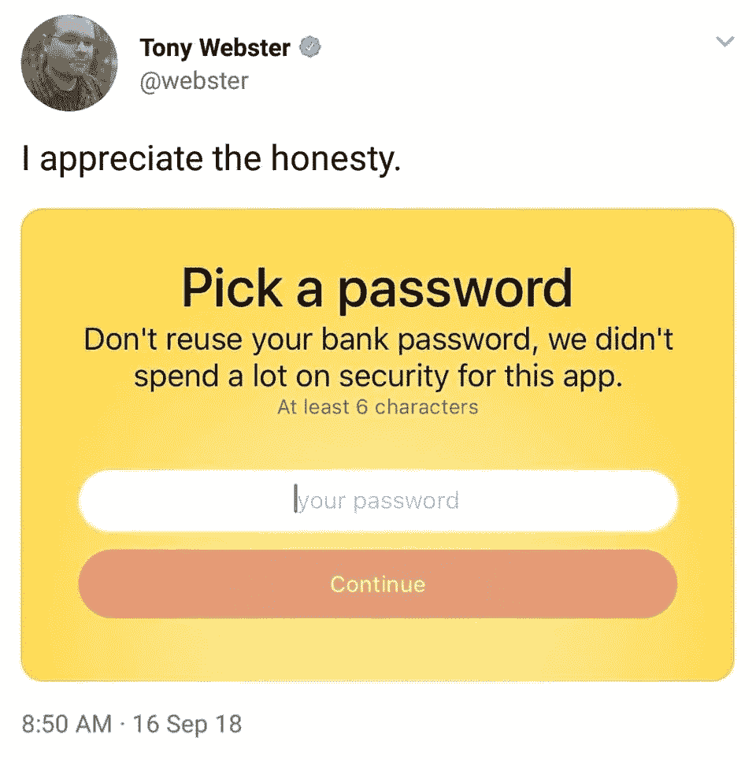

[Original Source](https://www.reddit.com/r/ProgrammerHumor/comments/9gah9v/is_this_the_right_place_to_post_this/)

## 寻找幸福变得更加容易

*事实证明，你可以真正快乐！你自己的活动。*

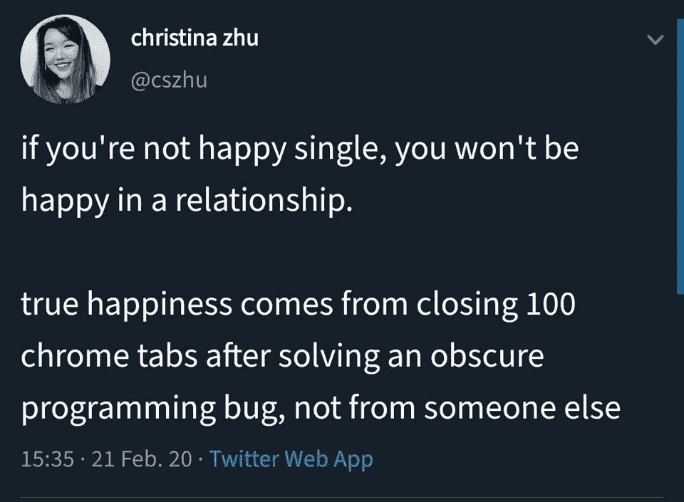

[Original Source](https://www.reddit.com/r/ProgrammerHumor/comments/f7rwra/true_happiness/)

## 后端开发人员做前端时

我可以证明这一点。

[Original Source](https://www.reddit.com/r/ProgrammerHumor/comments/e0iim2/when_backend_developer_does_frontend/)

## 你会选谁？

马丁似乎是问题的根源。

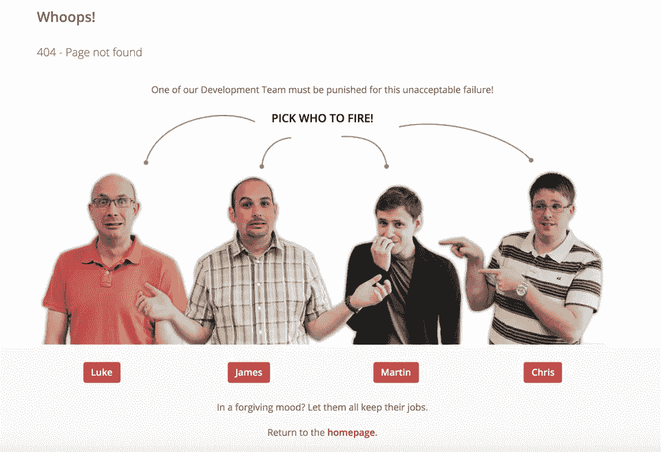

[Original Source](https://www.reddit.com/r/ProgrammerHumor/comments/8rik7h/best_404_page/)

## 别担心，我们很安全

我们会安全很长一段时间。

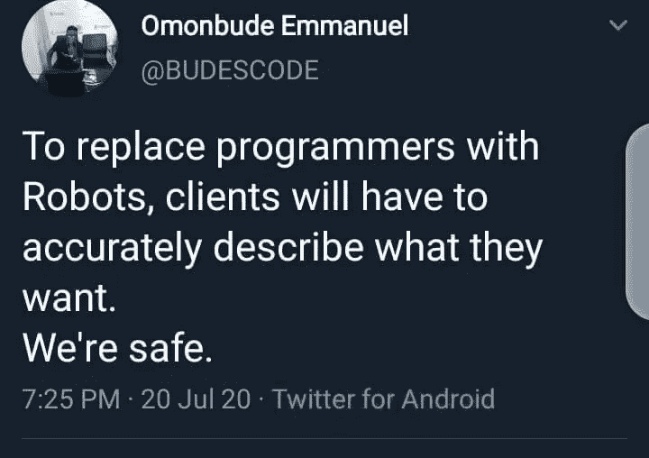

[Original Source](https://www.reddit.com/r/ProgrammerHumor/comments/hx7xfy/were_safe/)

## 这可能会引起争议

*尤其在程序员中。*

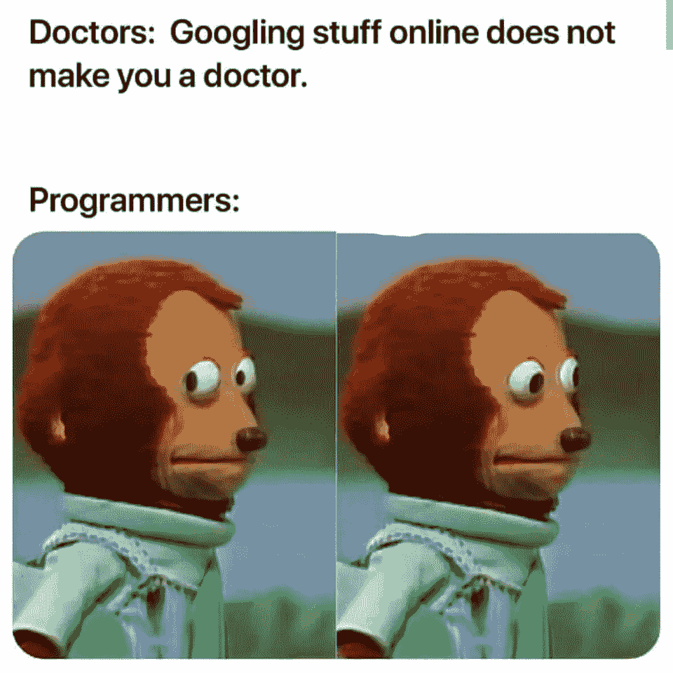

[Original Source](https://www.reddit.com/r/ProgrammerHumor/comments/covgb5/lamo/)

## 任何职业的 3 个阶段

他们在等每个人。

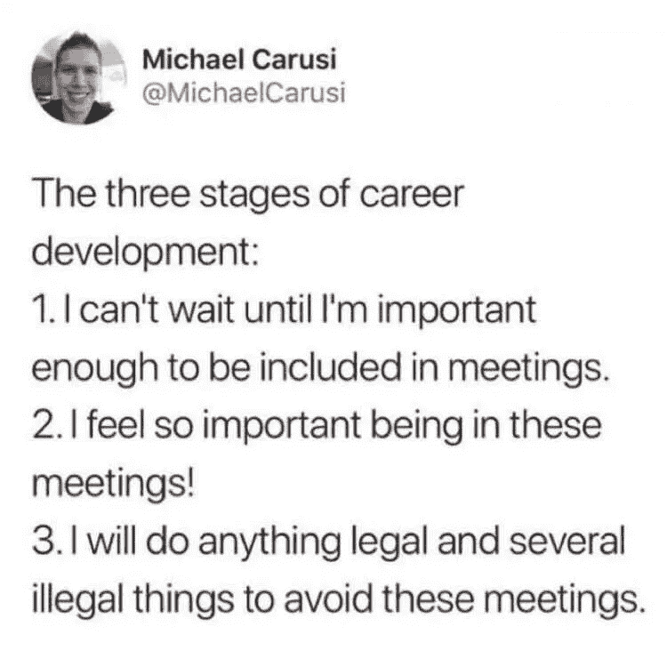

[Original Source](https://www.reddit.com/r/ProgrammerHumor/comments/dq1sxm/meetings_everyone/)

## 如果你打不过他们，就加入他们！

如果你要做，就要有风格。

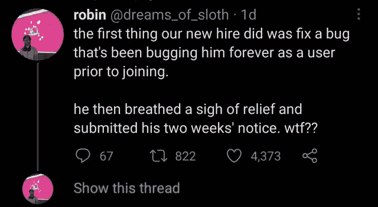

[Original Source](https://www.reddit.com/r/ProgrammerHumor/comments/mi954l/easier_than_submitting_a_bug_report/)

## 有些事情已经改变了。但是到底是什么呢？

也许在学生时代，你没有在团队中工作过。

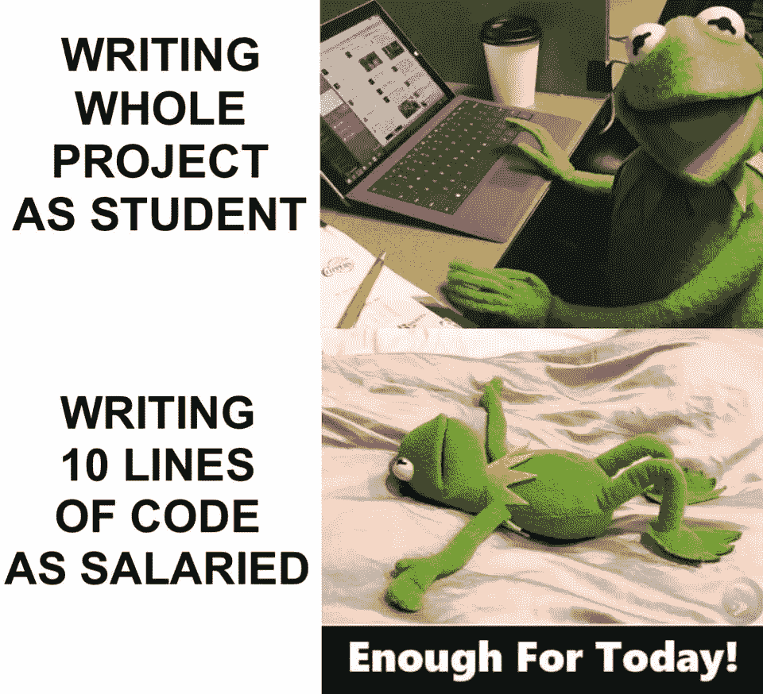

[Original Source](https://www.reddit.com/r/ProgrammerHumor/comments/lgvqyv/something_has_changed/)

## 理解编程迷因不会让你成为开发者

然而，这是一个好的开始。

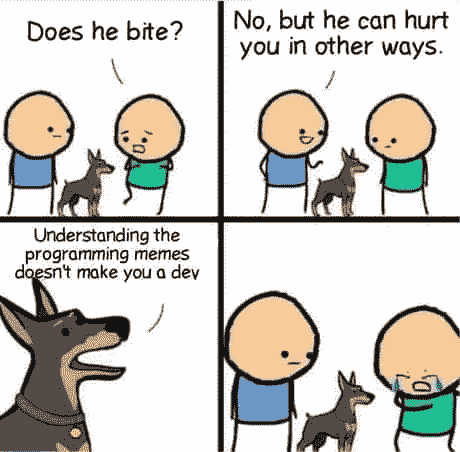

[Original Source](https://www.reddit.com/r/ProgrammerHumor/comments/io0enk/why_would_you_hurt_me_in_such_a_way/)

## 当任务不够明确时

解决方案可能不是你想要的。

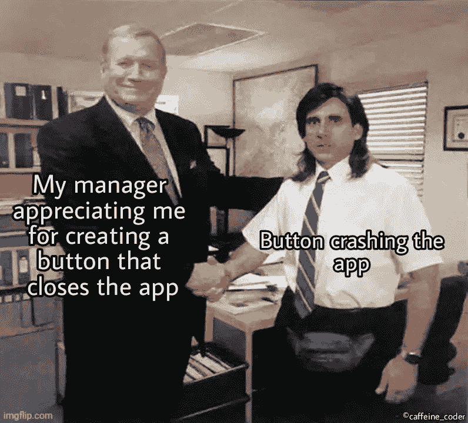

[Original Source](https://www.reddit.com/r/ProgrammerHumor/comments/n3p4e2/confused_screams/)

## 荣耀中的平凡法则

公司里的人通常会不合理地重视琐碎的事情。

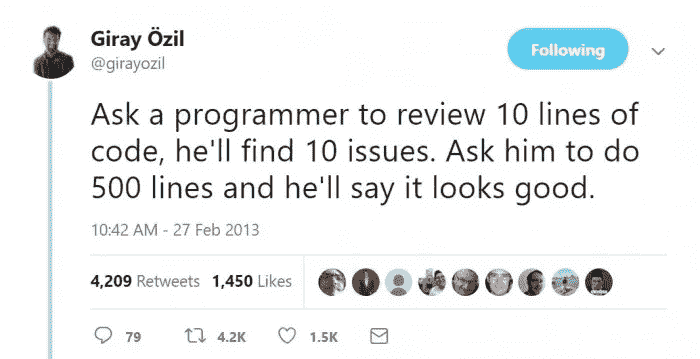

[Original Source](https://www.reddit.com/r/ProgrammerHumor/comments/m1e2sh/what_about_5000/)

## 有家人站在你这边真好

但是如果他们能理解你的工作就更好了。

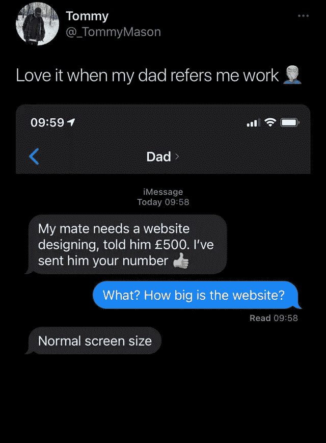

[Original Source](https://www.reddit.com/r/ProgrammerHumor/comments/o27y7g/normal_screen_size/)

## 编程真的那么压抑吗？

*就以埃隆为例来看。*

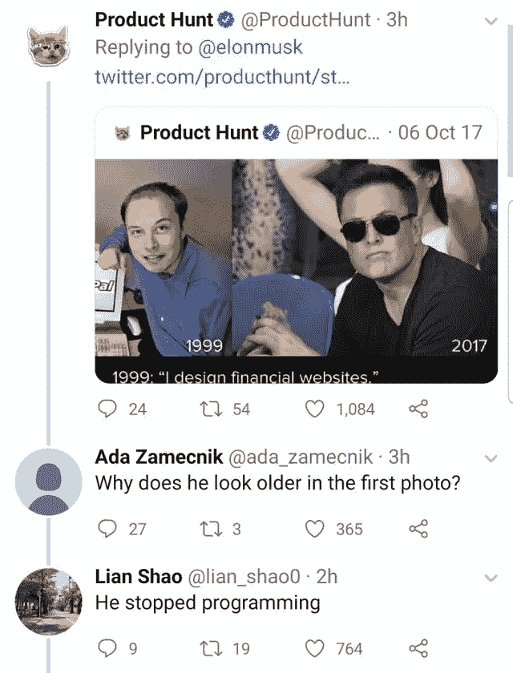

[Original Source](https://www.reddit.com/r/ProgrammerHumor/comments/cga4re/aging_is_hard/)

## 有人试过这个吗？

虽然很有效率，但这看起来并不是正确的做法。

[Original Source](https://www.reddit.com/r/ProgrammerHumor/comments/amfmzr/instructions_unclear/)

## 程序员根据他们的谷歌搜索能力获得报酬

*至少他们很多人是这么说的(包括我自己)。*

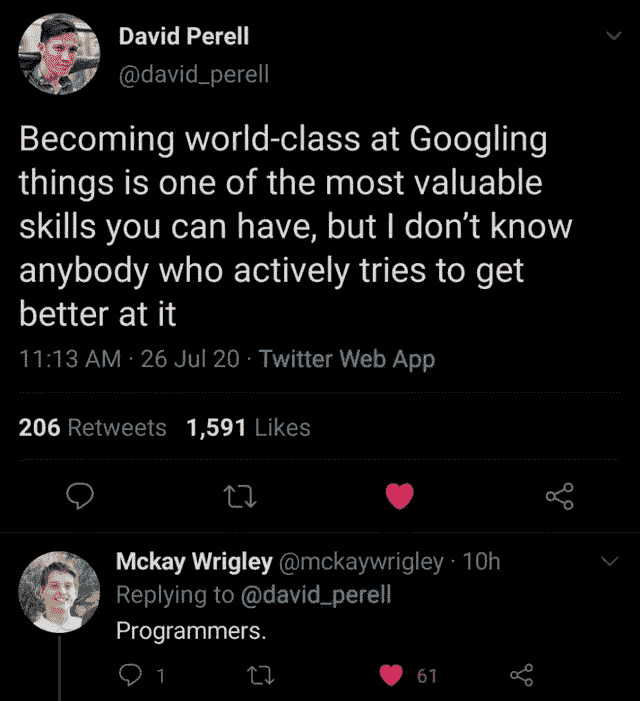

[Original Source](https://www.reddit.com/r/ProgrammerHumor/comments/hy9s9h/just_google_it/)

## 业主真的有一个艺术家在里面

在我成为 Mac 用户之前，我自己就拥有很多。

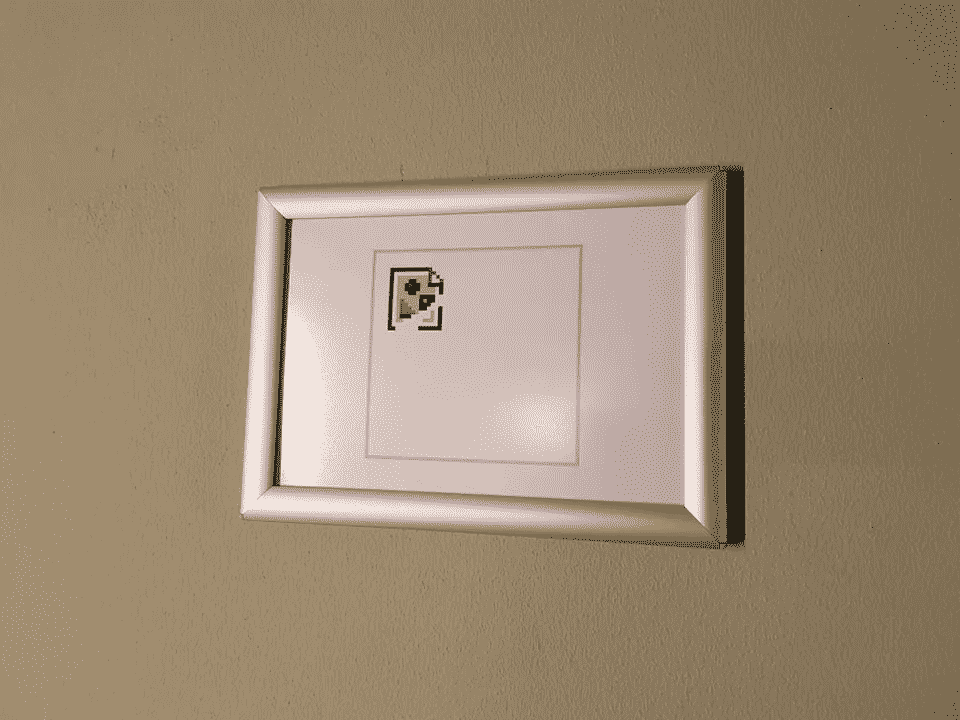

[Original Source](https://www.reddit.com/r/ProgrammerHumor/comments/7i77wn/found_this_beautiful_piece_of_modern_art_in_my/)

## 客户及其截止日期

*没有什么比下面的图画更能描述它了。*

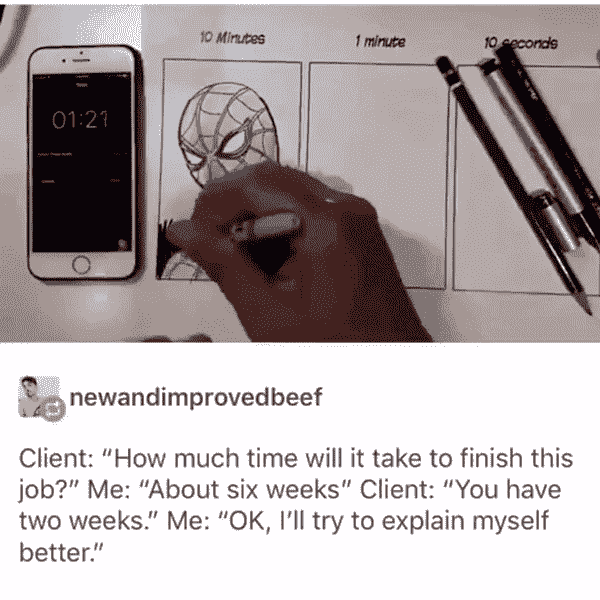

[Original Source](https://www.reddit.com/r/ProgrammerHumor/comments/8z0bky/deadlines/)

# 最后的想法

我希望你读这篇文章的时候过得愉快。如果你坚持到最后，你很有可能开怀大笑。你有很多这样的笑话。我试着挑选真正能引起每个人共鸣的笑话。但是如果你没有得到其中的一些，请随时告诉我！

*更多内容看*[***plain English . io***](http://plainenglish.io/)