# 21 个网站动画工具可以提升你的网页设计

> 原文：<https://javascript.plainenglish.io/21-website-animation-tools-that-can-level-up-your-web-design-1d1749908f73?source=collection_archive---------0----------------------->

## 您喜欢使用的有用工具。

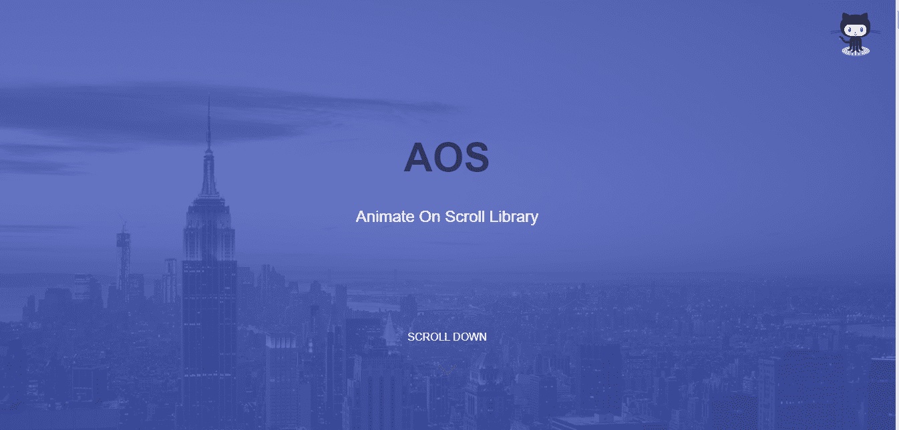

Source: [JavaScript in Plain English](/animate-content-on-scroll-with-just-one-line-of-code-9222af203aff)

动画能为你的网站做的比你想象的更多。好的动画让用户对你的品牌有更好的体验，并能转化为更多的线索。这里有 20 个网站动画工具可以提升你的网页设计。

# 1.左枕前

Ola 是 Javascript UI 库类别中的一个技术栈工具。众所周知，这是一个平滑的数字插值动画库。它仍然是一个受欢迎的开源项目，拥有超过 180 万个 GitHub stars 和 38 个 forks。

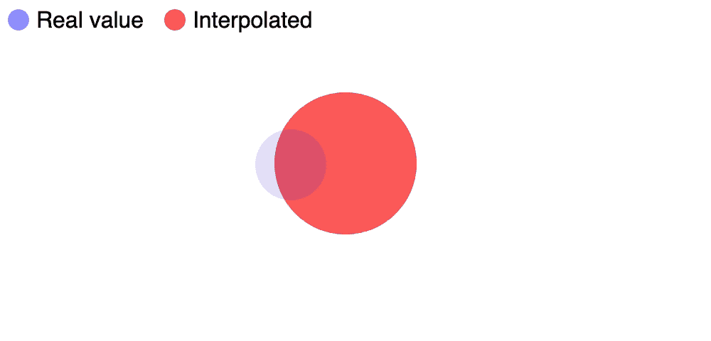

Source: [https://github.com/franciscop/ola](https://github.com/franciscop/ola)

# 2.iTyped

ITyped 是一个为 web 应用程序创建动画打字的简单库。这个库非常容易使用。最有趣的是，这个库没有依赖项，大小只有 2KB。它也没有在内部使用 JQuery。

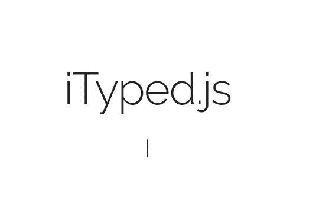

Source: [https://github.com/luisvinicius167/ityped](https://github.com/luisvinicius167/ityped)

# 3.编舞师. js

编排器是一个 JavaScript 库，可以帮助开发人员创建精美的动画。滚动或鼠标移动可以启动这些动画。它还处理复杂的 CSS 动画，为您完成繁重的工作，并允许您使用自定义函数。

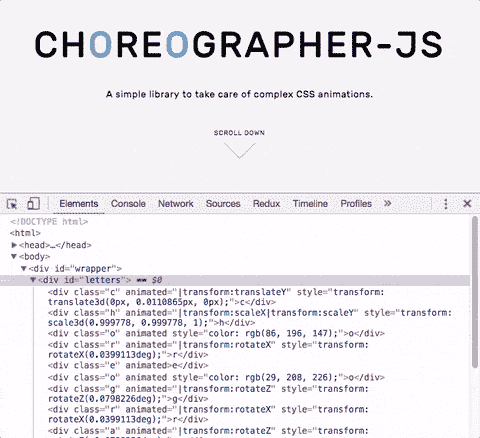

Source: [https://css-tricks.com/choreographer-js/](https://css-tricks.com/choreographer-js/)

# 4.SmoothState.js

js 提供了钩子，用于在导航期间编排元素如何进入和退出页面。它利用动画播放的时间从服务器获取内容，并使用 AJAX 将其注入页面。支持 CSS 动画，还有像 velocity.js 这样的 JS 动画库。

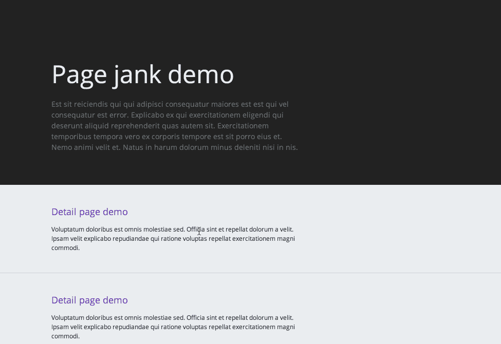

Source: [https://github.com/miguel-perez/smoothState.js](https://github.com/miguel-perez/smoothState.js)

# 5.酷特网

KUTE.js 是一个全功能的动画引擎，可用于创建复杂的动画，其属性或元素无法使用 CSS3 过渡或其他动画引擎进行动画制作。它不支持传统的浏览器，但它有一套广泛的工具和实用程序用于任何浏览器或属性。

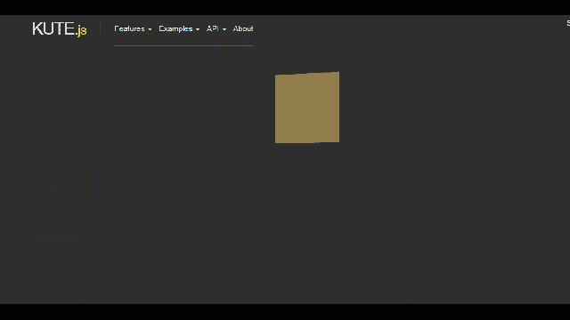

Source: [https://thednp.github.io/kute.js/](https://thednp.github.io/kute.js/)

# 6.草图动画制作插件

animate 可以让你直接从草图中导出简单的动画。它有多种功能，如允许您创建关键帧，编辑它们，使用动画，偏移动画，等等。这些特性对于你可能有的任何动画需求肯定会派上用场。

Source: [http://animatemate.com/](http://animatemate.com/)

# 7.日本动漫

Anime 是一个简单而强大的 JavaScript 动画库，既灵活又有一个轻量级的 API。CSS、单个转换、SVG、DOM 属性和 JavaScript 对象都受支持。

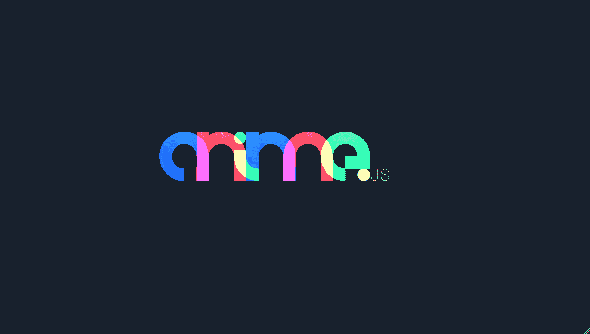

Source: [Freefrontend](https://freefrontend.com/anime-js-examples/)

# 8.简单视差

SimpleParallax 是一个小的 JavaScript 库，允许你给任何图像添加动画视差。不需要使用背景图像，因为视差效果直接应用于图像标识符，就像在大多数其他视差库中一样。视差效果可以用在一个正在运行的网站上，而不会导致网站崩溃。如果需要，可以将视差添加到图像标签/ srcset 图像。

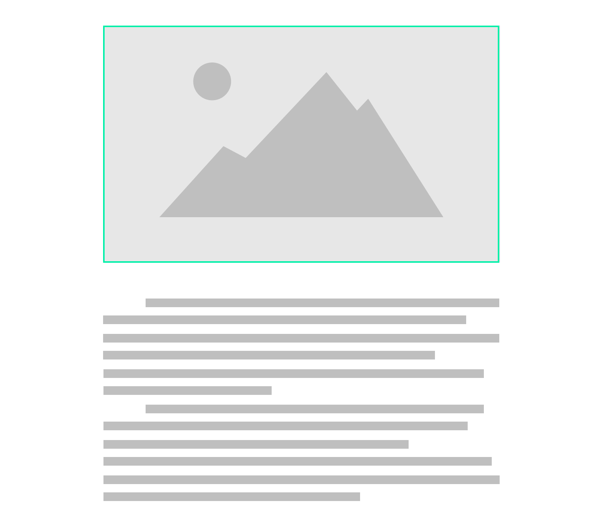

Source: [Medium](https://itnext.io/case-study-create-a-parallax-effect-directly-on-img-tags-with-javascript-35b8daf81471) | [Website](https://simpleparallax.com/)

# 9.Granim.js

Granim.js 被描述为一个轻量级、无依赖性的 JavaScript 库，它使用 JavaScript 中创建的 Granim 实例来帮助在画布元素上创建可配置的、交互式的基于渐变的动画。

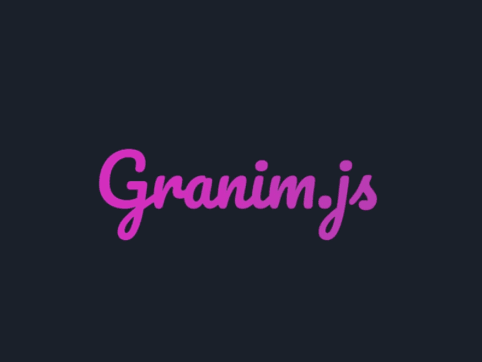

Source: [Uplabs](https://www.uplabs.com/posts/granim-js-text-masking)

# 10.Ember 汉堡菜单

Ember Burger Menu 是一个基于 CSS 过渡的非画布侧边栏组件，具有各种动画和样式。它具有一些功能，如设置画布外菜单，支持可变阈值的滑动手势，能够混合和匹配许多菜单和菜单项动画，允许您轻松创建自己的动画。

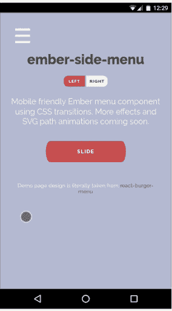

Source: [EmberDaily](http://www.emberdaily.com/2016/07/20/37-ember-side-menu-aka-burger-menu/)

# 11.Starability.css

css 是一个用户友好的评级形式，带有可爱的动画。它的评级是用纯 HTML 和 CSS 编写的，可以通过键盘访问，所以即使是屏幕阅读器也可以使用它们。这个小型库的目标是将这种技术与吸引人的动画结合起来，使其易于整合到您的网站中。

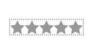

Source: [Github](https://github.com/LunarLogic/starability)

# 12.冲压式喷气发动机

js 通过平滑的动画和过渡，将一个 DOM(文档对象模型)从一种状态变为另一种状态。它给人的印象是两个元素从一个元素转换到另一个元素，而不需要手动动画。它也可以用于图像。

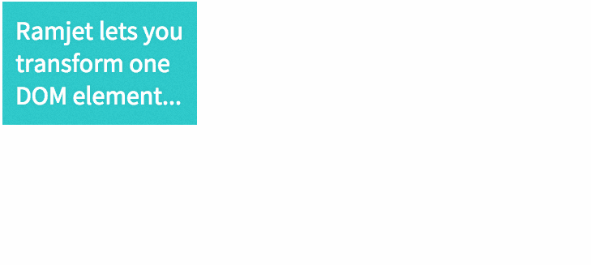

Source: [Ramjet](http://www.rich-harris.co.uk/ramjet/)

# 13.JustGage

JustGage 是一个方便的 Javascript 插件，允许您使用 SVG 创建漂亮整洁的仪表并制作动画。由于使用 Raphael 库进行矢量绘图，它是独立于分辨率和自我调整的。

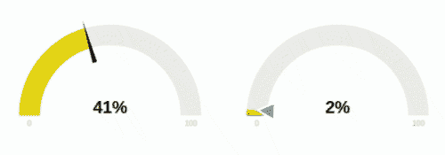

Source: [Github](https://github.com/toorshia/justgage)

# 14.Mo.js

Mo.js 是一个基于 web 的 JavaScript 动作库。它有一个声明性的动作语法，以及创建动画元素的能力。Mo.js 允许您创建的形状和其他对象可能会简化您的工作流程，具体取决于您正在制作的动画。

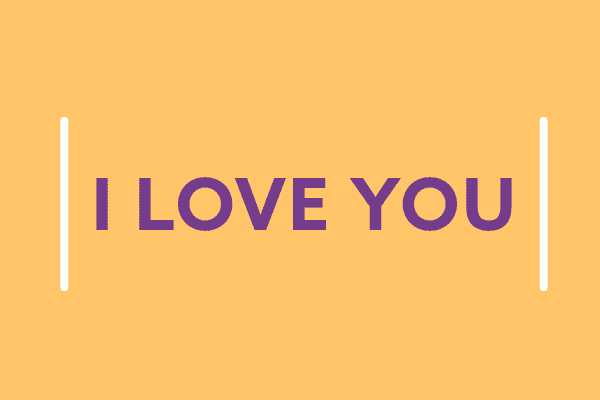

Source: [Dribble](https://dribbble.com/shots/3278810-I-Love-You-Responsive)

# 15.美国歌剧协会(American Opera Society)

AOS 背后的概念很简单:它根据您提供的设置跟踪所有元素及其位置。然后添加或移除 aos-animate 类。当然，在实践中，它并不总是那么简单，但 AOS 背后的概念是。CSS 负责动画的方方面面。

Source: [JavaScript in Plain English](/animate-content-on-scroll-with-just-one-line-of-code-9222af203aff)

# 值得一提

# 16.等等！有生命的

等等！Animate 允许您从头开始制作循环动画，循环之间有自定义的延迟。它计算出在自定义动画关键帧中放置多少暂停，以获得循环之间所需的准确暂停持续时间。还支持任何 CSS3 动画功能，包括旋转和变换。

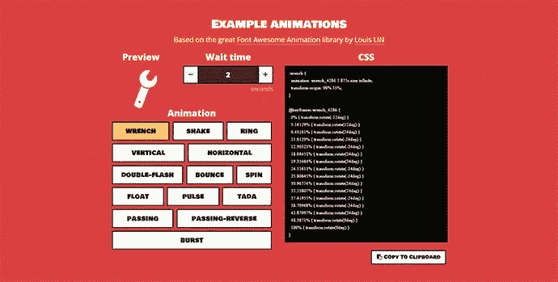

# 17.html 5 工具提示

js 是一个强大的 JavaScript 库，它将干净的 CSS3 动画工具提示附加到特定的 DOM 元素，包含任何 html 内容。

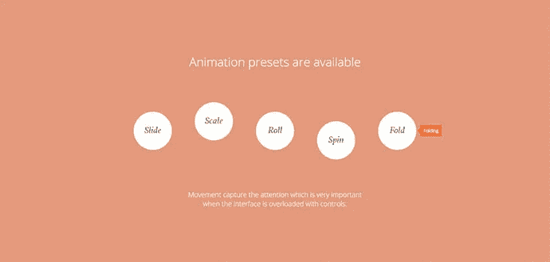

# 18.Flip.js

翻转是一种动画技术，它将昂贵的属性(如宽度、高度、左侧和顶部)重新映射为非常便宜的更改。它通过拍摄两张照片来实现这一点，即元素的第一个位置(F)和元素的最后一个位置(L) (L)。然后，它使用一个变换来反转(I)元素的变化，给人一种元素仍然在第一个位置的印象。

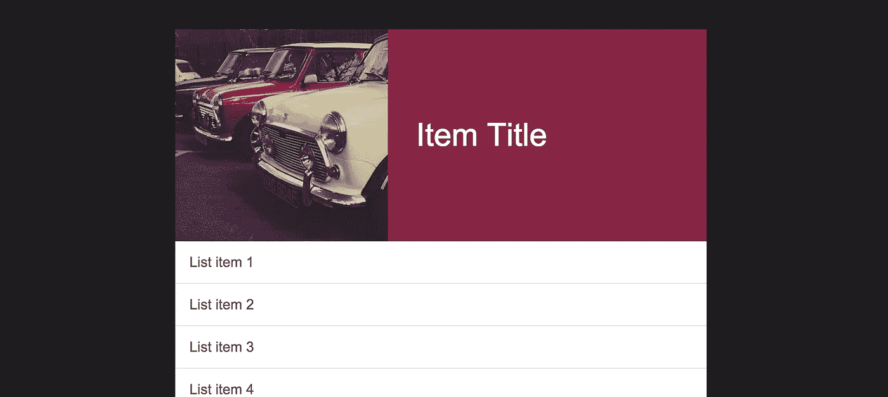

Source: [https://github.com/googlearchive/flipjs](https://github.com/googlearchive/flipjs)

# 19.音速. js

SonicJs 是一个现代化的开源内容管理系统和 web 应用程序框架。它 100%基于 Javascript，并利用 IBM 的回送 ORM 对最流行的数据库系统进行数据访问。

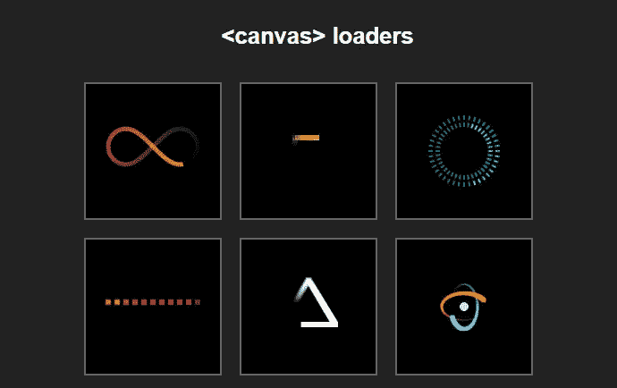

Source: [https://j11y.io/p/Sonic/repo/demo/demo.html](https://j11y.io/p/Sonic/repo/demo/demo.html)

# 20.MixItUp

MixItUp 是一个很棒的插件，可以组织任何类型的分类内容，包括博客、画廊和作品集。MixItUp 还可以用来创建视觉上吸引人的用户界面和数据可视化。

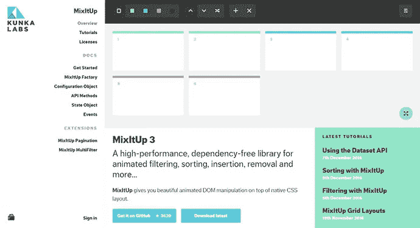

Photo screenshot by the author

# **21。SVG.js**

js 不依赖于任何东西，它的目标是尽可能小，同时覆盖几乎整个 SVG 规范。它速度快，可读性强，语法整洁。它们也有绑定事件到元素，完全支持不透明遮罩和剪辑路径，以及各种有用的插件。

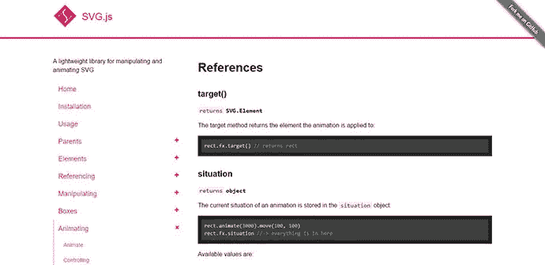

Photo screenshot by the author

使用网页动画的主要目的是让你的网站对你的访问者来说感觉更灵敏和直观。如果经过精心设计，动画可以成为一个强大的工具，帮助你的观众实现他们的目标，并感受到你的内容。