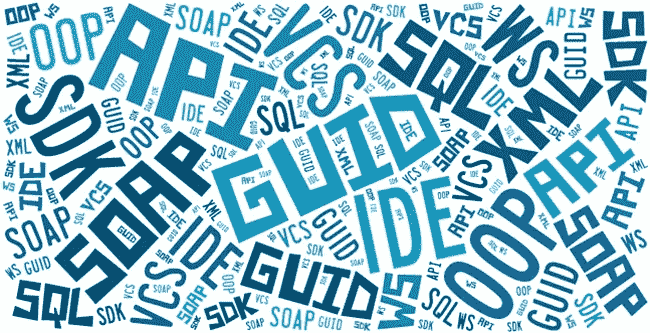
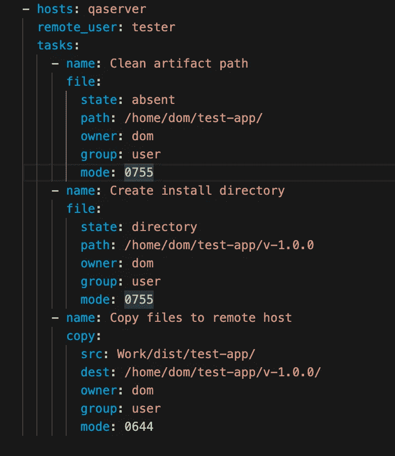
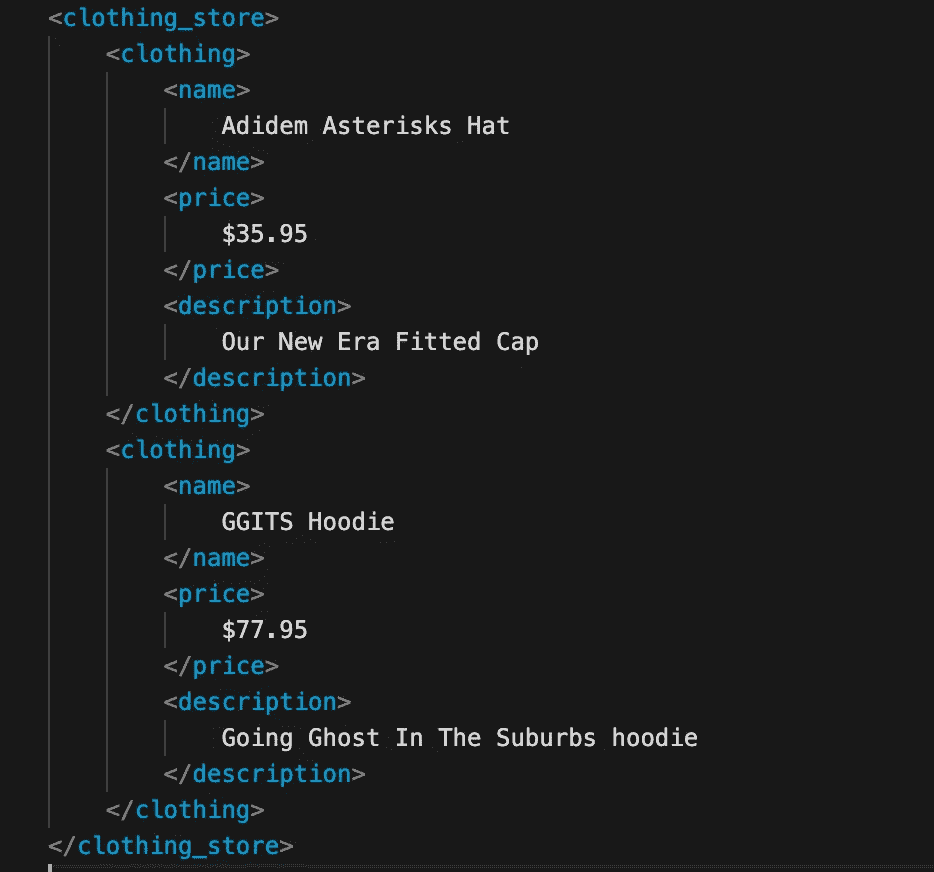
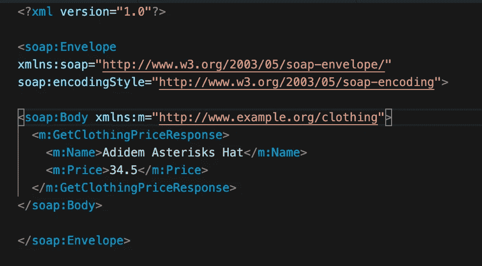
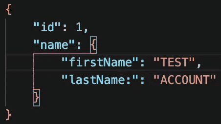

# 每个 Web 开发人员都应该知道的缩写

> 原文：<https://javascript.plainenglish.io/25-acronyms-youll-come-across-inweb-development-4738fdac2a58?source=collection_archive---------19----------------------->

SOAP、API、HTTP、XML、SQL、VCS……这个清单可以一直列下去。

作为开发人员，我相信我们喜欢使用缩写词。主要是因为把它们放在一起使用会让我们听起来更聪明(我开玩笑)。实际上，这使得记住许多协议、语言、标准、技术以及更多与 web 开发相关的东西的长名称变得更加容易。

这里列出了一些你可能已经遇到过的常见首字母缩写词，如果没有，有些你可能已经知道了:

# API —应用程序编程接口

API 本质描述了软件的不同部分是如何相互作用的。它可以被看作是如何使用一些软件的一套规则。API 也有不同的用法，例如，为框架定义的 API 和 Web APIs。你可以在这里找到一篇描述 API 本质的好文章。

# KPI —关键绩效指标

这是指被识别和测量的度量标准，用于定义团队、业务单元或组织在业务价值方面的表现。这些都是用来确定一个公司的工作情况如何。例如，一个关键性能指标可能是新销售门户每月完成的客户订单数量，这将有助于确定这带来的业务价值。

# SEO —搜索引擎优化

基于品牌提高网站流量搜索的可见性和质量的过程。这里重要的部分是，这些关注于通过自然搜索查询(而不是通过付费广告)提高可见性的方法。

# RFC —征求意见

本质上是由 IETF(互联网工程任务组)维护的技术文档，它试图概述与互联网相关的标准。

# YAML/YML — **YAML** 不是标记语言

是的……那正是 YAML 所代表的。这是一个递归的缩写。它是一种人类可读的数据序列化语言(在这方面类似于 JSON)。通常用于配置文件，但也可以用在 JSON 文件被使用的地方。

# HTTP —超文本传输协议

这基本上是今天网络的主干。它是应用层协议，系统通过该协议进行通信和数据交换，通常通过 web 浏览器进行。它遵循客户机-服务器体系结构中的请求/响应协议。

# REST —表征状态转移

是一种软件架构风格，它描述了如何在特定的最佳实践和指导下构建 web 服务。这包括拥有客户机-服务器结构、实现无状态等。您可以在这里找到一篇文章[来解释休息意味着什么。](https://www.codecademy.com/articles/what-is-rest)

# XML——可扩展标记语言

一种标记语言，在风格上类似于 HTML，它是一套对人类和机器可读的文档进行编码的规则。各种其他文档语法来自 XML 语法本身(例如, **SOAP** )。很常见的是，XML 被用作 Web 服务的消息传递格式(尽管现在使用 **JSON** 代替它做得更多)。

# SOAP —简单对象访问协议

SOAP 本质上是 XML，具有以下特性:

*   将 XML 文档标识为 SOAP 消息的信封元素
*   包含标题信息的标题元素
*   包含呼叫和响应信息的 Body 元素
*   包含错误和状态信息的故障元素

此外，以下是 SOAP 需要遵循的重要语法:

*   SOAP 消息必须使用 XML 编码
*   SOAP 消息必须使用 SOAP 信封命名空间
*   SOAP 消息不能包含 DTD 引用
*   SOAP 消息不得包含 XML 处理指令

# RPC —远程过程调用

一种请求-响应协议，定义为让代码在远程服务器上执行，从客户端服务器生成并以消息格式发送。这些消息传递格式可以采用各种标准，例如:JSON-RPC、XML-RPC、SOAP 等等。对于 **gRPC 来说，这是不可混淆的，而**是谷歌为实现 RPC 而构建的框架。

# VCS —版本控制系统

也称 SCM，或称源代码管理。这基本上是任何有助于管理代码可维护性的系统。其中最受欢迎的是 **Git。**

# 供应链管理——源代码管理

实际上与上述相同(VCS)。

# SQL —结构化查询语言(分类)

用于与关系数据库管理系统通信的实际语言。使用以下命令，您几乎可以完成创建和维护关系数据库管理系统所需的所有操作:“选择”、“插入”、“更新”、“删除”、“创建”和“删除”。如果您看到 **MySQL 和 SQL，您不应该感到困惑。** MySQL 是一个关系数据库管理系统，它建立在 SQL 的基础上。

# 关系数据库管理系统

用于维护关系数据库的软件系统。通常，为了查询和编辑这些表，需要定义一个 SQL 来将这些命令传递给数据库。

# DSL —域特定语言(分类)

一种计算机编程语言，适用于特定类型的应用程序。例如用于构建网页的 HTML，用于构建语言解析工具的 YACC，用于与数据库系统通信的 SQL，以及用于图像分析的 MATLAB。

# CDN —内容交付网络

在这些网络中，各种文件和软件包托管在一个公共网络上，该公共网络在地理上是分布式的，以便为最终用户提供高可用性。在以各种脚本的形式开发应用程序时，通常会访问和下载这些脚本。其中一个网络的例子是 CloudFlare。

# FTP —文件传输协议

定义文件如何从服务器传输到客户端的一组规则。当使用 FTP 访问服务器上的文件时，url 类似于**FTP://[user[:password]@]host[:port]/URL-path。**FTP 和 HTTP 的区别可以在这里找到[。](https://techdifferences.com/difference-between-http-and-ftp.html#:~:text=The%20basic%20difference%20between%20HTTP,different%20websites%20on%20the%20internet.&text=HTTP%20is%20efficient%20to%20transfer,uses%20the%20password%20for%20authentication.)

# GUI —图形用户界面

该术语用于描述任何应用程序(web、桌面、移动)的界面，包括具有各种图形组件的显示器，用户使用该显示器与应用程序进行交互。这和说一个 **CLI(命令行界面)**是相对的，它只通过终端提示符接受命令。

# GPL——通用语言

对适用于许多领域的语言进行分类。可以进一步分为标记语言(XML)、建模语言(UML)和编程语言(Python、C++)。

# IDE —集成开发环境

这些应用程序包含各种工具，有助于开发和测试各种语言的软件。你可能已经知道的一些流行的 ide 有 **Intellij IDEA、Visual Studio Code、Eclipse、Android Studio** 等等。

# JS — JavaScript

这是通常在提到 JavaScript 语言时给出的缩写。还有，你可能会看到 **TS，**指的是 TypeScript。

# AJAX — **异步 JavaScript 和 XML**

帮助编写客户端应用程序发出异步请求的一组 web 开发技术。

# CRUD —创建、读取、更新、删除

在数据库环境中，这些是与存储相关的基本操作。

# DNS —域名系统

负责管理和保护计算机、服务和其他资源域名的系统。这可能是在公共或私有网络中。

# SDK —软件开发套件

这是指在可安装模块中打包在一起的特定软件工具。它们通常有一个特定的目标，所以它们可能是特定于操作系统的，或者是特定于语言的，或者是两者的结合。

# AES —高级加密标准

一个非常著名的数据加密规范。你也可能看到它的名字是 *Rijndael，*所以如果你在任何地方看到这个名字，不要混淆。

# URI/URL/URN —统一资源标识符/位置/名称

标识名称或资源的字符串。用最蹩脚的术语来说，这些或多或少都是网址。这三个在一起的原因是因为它们非常相似。

URL —指 URIs，但在网络资源(例如 http://example.org/wiki/Main_Page

URN —指 URIs，但在特定命名空间的上下文中(例如*瓮:ISBN:0–486–27557–4*

# MVC——模型视图控制器

这是一种架构模式，它将应用程序分成三个部分:

模型——这是数据定义存在的地方，定义了要使用的数据类型。

视图—这是表示应用程序实际视图的文件所在的位置。

控制器——这是应用程序所有业务逻辑的所在。它负责获取模型组件中描述的数据，并将其插入视图组件。

# JSON — JavaScript 对象符号

这是一种可以发送数据的文件和数据交换格式，尤其是一种人类可读的格式，并且易于机器解析。一个例子是:

# ASCII — **美国信息交换标准代码**

这是用于电子通信的字符编码标准。本质上，这定义了发送电子信息的规则，电子信息在计算机系统中代表文本。由于机器只能理解 0 和 1，ASCII 表为每个文本字符定义了二进制代码。你可以在这里找到 ASCII 表[。](http://www.asciitable.com/)

如果你认为有什么首字母缩略词应该出现在这个列表中，请告诉我。我也想听听这里有没有你认为可以更好定义的定义，

感谢阅读！

*更多内容请看*[***plain English . io***](http://plainenglish.io)