# 2021 年你需要知道的 25 个 CSS 最佳实践

> 原文：<https://javascript.plainenglish.io/25-css-best-practices-you-need-to-know-69f9192babdd?source=collection_archive---------0----------------------->

编写更好 CSS 的最佳实践

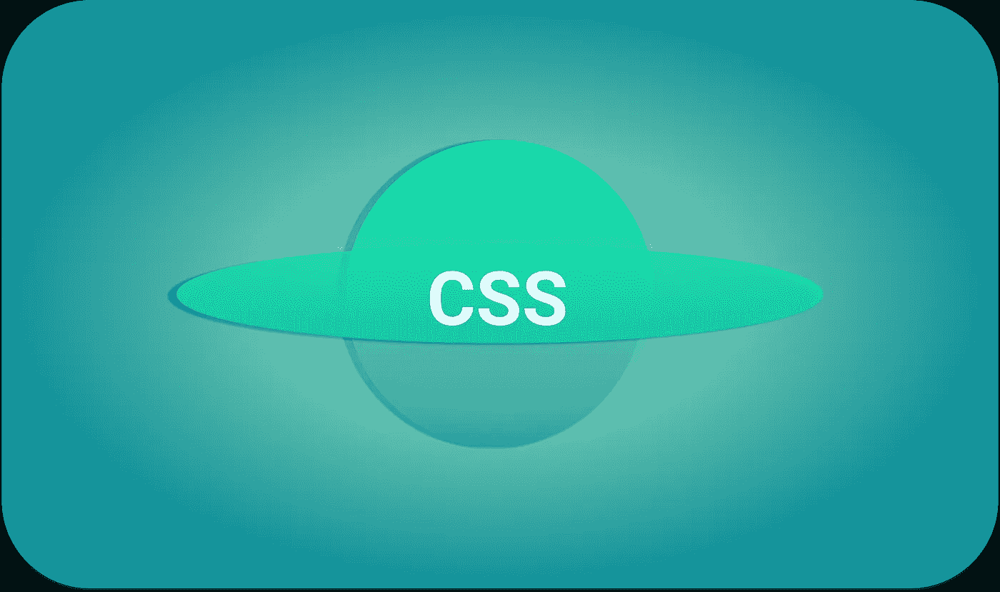

# 1.保持有序

让自己有条理。使用一个连贯的结构，而不是按照 id 和类出现的顺序。它将帮助你记住 CSS 的层叠部分，这将设置你的**样式表**来利用样式继承。

*   首先声明最通用的项目，然后是**不那么通用的**，以此类推。这将让您的 CSS 正确地继承属性，并使您在需要时更容易覆盖特定的样式。如果你需要的话，你可以更快地编辑你的 CSS，因为它将遵循一个易于阅读的结构。

> 使用最适合您的结构，同时考虑到将来的编辑和其他开发人员。

1.  重置和覆盖
2.  链接和类型
3.  主布局
4.  次级布局结构
5.  表单元素
6.  多方面的

# 2.有用的命名约定

有时候你不得不重做一些事情。如果您没有遵循一个好的命名约定，您很可能会对自己的项目感到困惑。

*   CSS 的主要优势之一是能够将**风格**从内容中分离出来。你可以通过修改 CSS 来重新设计你的 web 应用程序，而不需要修改 HTML。不要使用限制性名称，建议使用更通用的命名约定并保持一致。
*   不要在你的**风格**和**id**之外使用职位或风格特定的词语。一类***。link-blue*** 要么会让你做更多的工作，要么会让你的样式表变得很乱，当你的客户后来要求你把那些**蓝色**链接改成**橙色**的时候。根据元素是什么来命名它们，而不是它们看起来像什么。
*   *比如说*、**、*。评论-蓝色*** 远不如 ***全能。评论-beta*** ，和 ***。后置大号字体*** 比 ***更具限制性。后题*。**

# 3.对 CSS 类使用连字符而不是下划线

你应该在编写 ***CSS 类*** 时使用连字符，在编写 ***元素 id 时使用下划线。***

***例如；***

> 示例类:。轮廓-图像
> 
> 示例 ID:#用户图像

# 4.不要重复你自己

只要有可能，就通过对元素进行分组而不是再次声明样式来重用属性。如果您的 **h1** 和 **h2** 元素都使用相同的字体大小、颜色和边距，请使用逗号将它们分组。

# 5.创建逻辑结构

如果你是一个初学者，你很可能会感到没有计划好要创造什么就投入编码的冲动。这就导致你一旦做到一半就出问题了。

*   你应该总是首先为你想要看到的页面创建一个逻辑结构。即使是有经验的开发人员，一开始也是先画草图或线框，然后再进行开发。

1.  先画布局
2.  创建一个支持布局的 HTML 结构
3.  开始研究 CSS

# 6.使用标志组织你的 CSS 样式

将样式表分成特定的部分，分别是**全局样式** — *(正文、段落、列表等)*、**页眉、页面结构、标题、文本样式、导航、表单、注释和附加内容。**

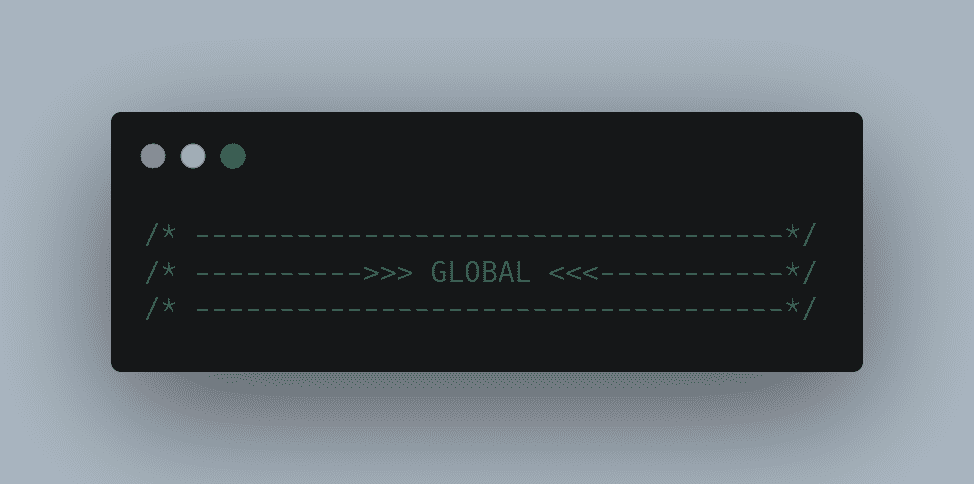

这样做将使 CSS 项目变得简单，因为你将能够更快地找到你需要改变的**类**和元素。

***例如；***

> /结构/排版/等等。

# 7.熟悉每一处房产

虽然您不需要使用 CSS 中存在的每一个属性，但至少知道它们中的大多数是做什么的是一个好主意。为此，您可以看看来自 HTML Dog 的 CSS 属性参考。

# 8.使用速记 CSS

假设您需要为 ***div*** 的每一边留出不同的边距，那么您必须编写以下代码。

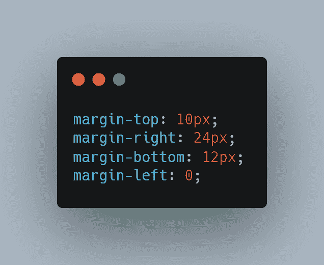

*   当你把这样的东西应用到一个盒子上时，会花费很多时间。使用速记 CSS，代码可以写成一行。

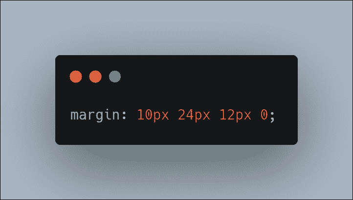

**Shorthand CSS**

> ***注:*** *边的顺序是顺时针，从上往下。* ***(上、右、下、左。)***

# 9.避免使用内嵌样式

使用内嵌样式会混淆内容和表达。内联样式和使用纯粹的表示 HTML 元素一样糟糕，比如 ***字体*** 。这会导致代码混乱，每个 HTML 文件都需要在样式改变时更新，而不是在单个外部样式表中进行全局改变。

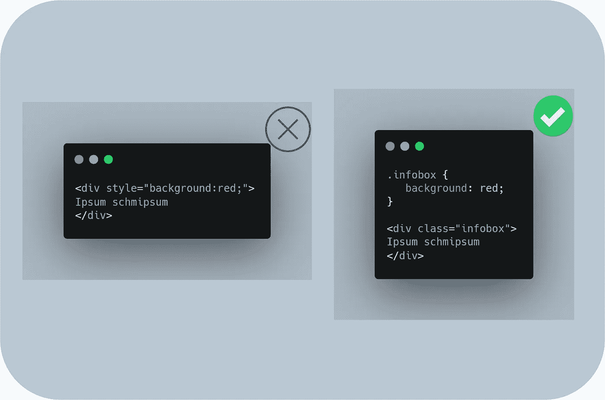

# 10.使用外部样式表

使用外部样式表非常有用。把你所有的 CSS 放在一个外部文件中，并把它包含在你的 HTML 中。这可能是确保你的内容和表现分开的最好方法。

***使用外部样式表的优点:***

*   它有助于将内容与表现分开。
*   可以缓存外部样式表，从而加快页面加载速度。
*   单个样式表可以应用于站点的每个页面，允许对单个文件进行快速样式更改。
*   这使得组织变得更加容易。

要使用外部样式表，只需将下面的代码放在 head 标记之间。一定要用你的 css 文件替换 ***style.css*** 。

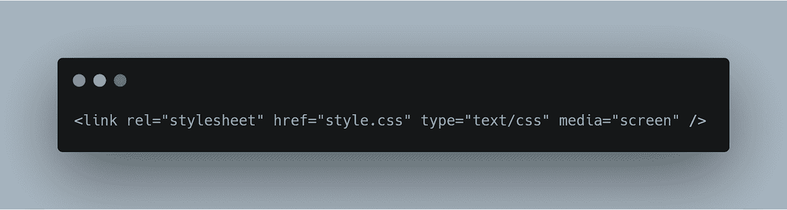

# 11.使用复位

大多数 CSS 框架都有一个内置的重置功能。重置消除浏览器不一致，如**高度、字体大小、页边距、标题等**。重置允许您的布局在所有浏览器中看起来一致。MeyerWeb 和雅虎的开发者重置一样，是一个流行的重置。你也可以自己重置。

# 12.使用颜色参考

很多时候，当你在做网站设计时，你不能准确地记住设计中每个元素的十六进制颜色代码。

*   解决这个问题的方法是在 CSS 文件的顶部包含一个颜色引用。现在，如果您忘记了特定颜色的代码，您可以简单地检查文件的顶部，然后简单地将其复制并粘贴到文件的另一部分。

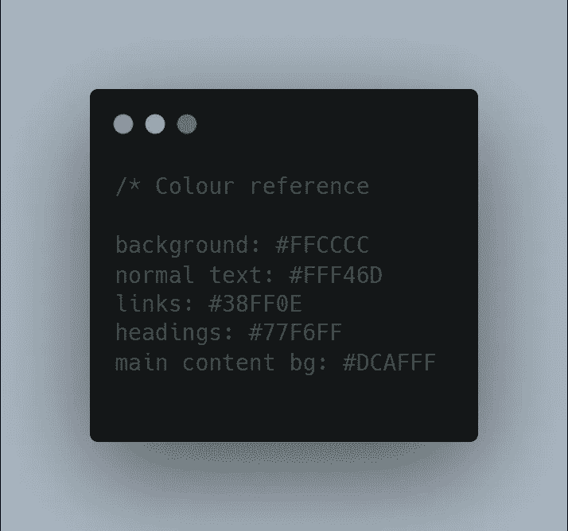

# 13.首先创建你的 HTML

大多数时候，开发人员在创建 HTML 的同时也在创建 CSS。似乎同时创建两者是合乎逻辑的，但是实际上，如果您首先创建整个 HTML 模型，您将节省更多的时间。

*   这种方法背后的原因是你知道网站布局的所有元素，但是你不知道你的设计需要什么样的 CSS。
*   首先创建 HTML 布局使您可以将整个页面视为一个整体，并允许您以一种更全面的、自上而下的方式来考虑您的 CSS。

# 14.使用多个类别

有时向一个元素添加多个类是有益的。假设你有一个想要右浮动的 **< div >** “盒子”，你已经有了一个类**。right** 在你的 CSS 中，它将所有内容都向右浮动。您可以简单地在声明中添加一个额外的类，如下所示。

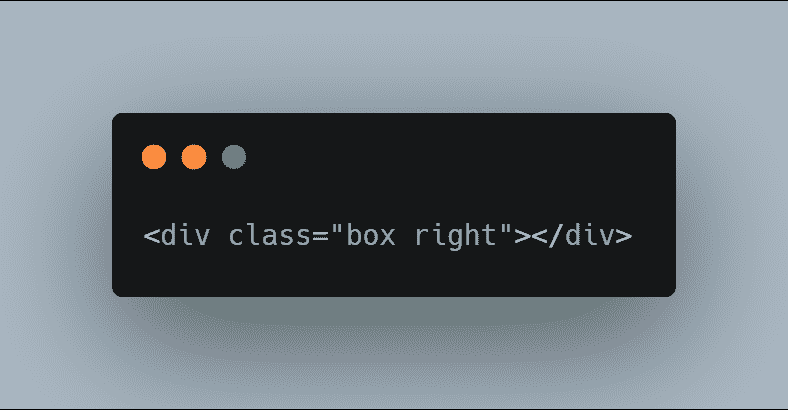

> ***注意:*** *您可以向任何声明添加任意数量的类(用空格分隔)。*

在使用**id**和**类名**时，如**“left”**和**“right】时，一定要小心。让我们想象一下，你决定宁愿看到盒子飘到左边。**

*   在这种情况下，您必须返回到您的 HTML 并更改**类名**来调整页面的显示。这不是抽象的，记住 HTML 是用来标记的，而内容是用来展示的。

# 15.注释您的 CSS

就像任何其他语言一样，分段注释代码是个好主意。您可以添加注释来解释或组织样式表的不同部分。这样做可能看起来像是开发过程中的额外步骤，但是在调试或重新设计您的网站时，注释会非常有帮助。

> 要添加评论，只需在评论后面添加/*，然后用*/关闭评论。

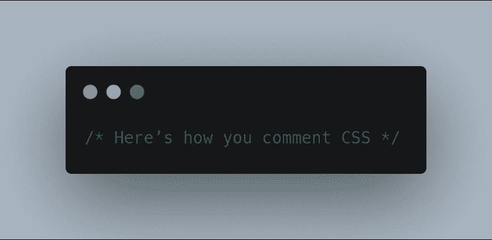

# 16.块与行内元素

块元素是在声明后自然清除每一行的元素，跨越整个可用空间的宽度。内联元素只占用它们需要的空间，并且在使用后不会强制换行。

**以下是内联元素或块元素的列表:**

*span，a，strong，em，img，br，input，abbr，缩写*

**积木元素:**

*div，h1…h6，p，ul，li，table，blockquote，pre，form*

# 17.使用泛型类

你会发现有些样式你会多次使用。您可以创建通用类并将它们添加到 ID 或其他 CSS 类中，而不是将特定的样式添加到每个 **ID** 中。

*   *例如，*您发现自己在设计中反复使用**浮动:右**和**浮动:左**。您只需添加类**。左侧**和**。右**到样式表并在元素中引用它。
*   这样你就不用不停的给所有需要浮动的元素添加 **" *float: left* "** 。

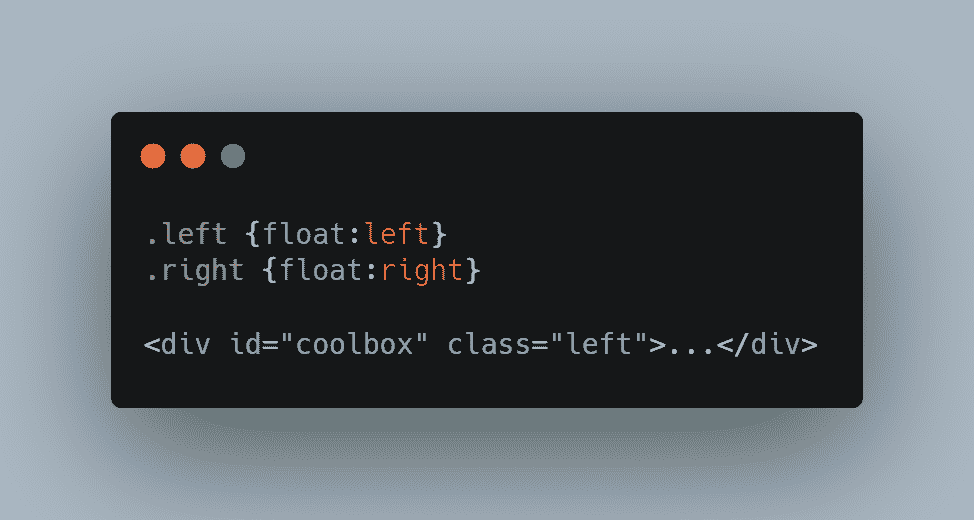

# 18.在它周围环绕一个 div

有时候，开发人员试图用一个 ID 为**或类的 **div** 包装一个元素，并为其创建一种样式。**

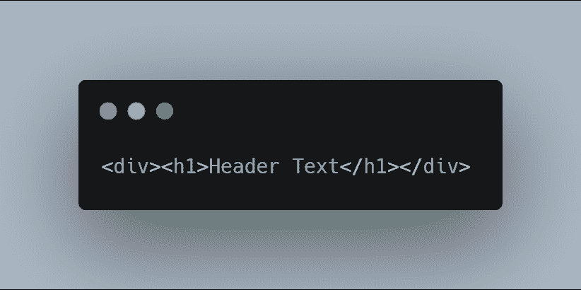

*   有时候，像上面的例子那样创建独特的元素样式似乎更容易，但是这样会使样式表变得混乱。

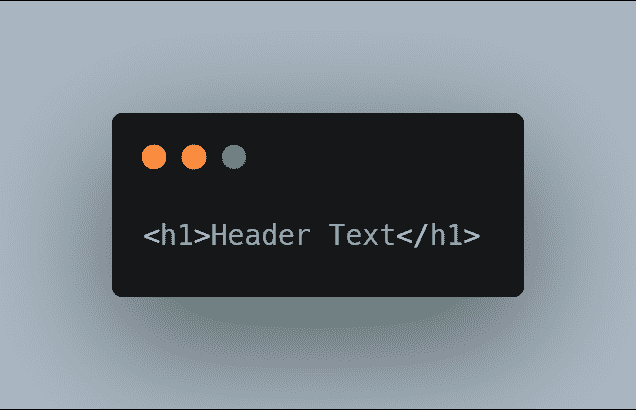

*   如果您给 ***h1*** 而不是父 ***div*** 添加一个样式，也会很容易。

# 19.使用 Firebug

如果你用的是 Firefox，Firebug 是任何一个 web 开发者的必备。在 Firefox 扩展 ***(调试 JavaScript、检查 HTML、查找错误)*** 附带的众多特性中，你还可以实时地可视化检查、修改和编辑 CSS。

*   你可以在 Firebug 官方网站了解更多关于 Firebug 的信息。目前 Firefox 推出了自己的调试工具——所以，你可以使用其中任何一个。
*   如果你正在使用 Chrome，那么你已经有了与 Firebug 非常相似的优秀开发工具。

# 20.不使用列表

列表是以结构化格式呈现数据的一种很好的方式。您不必仅仅将列表用作文本属性。列表对于创建导航菜单之类的东西也很有用。

*   初学者使用 **divs** 来制作列表中的每个元素，因为他们不明白如何正确地利用它们。您将经常看到如下所示的导航链接。

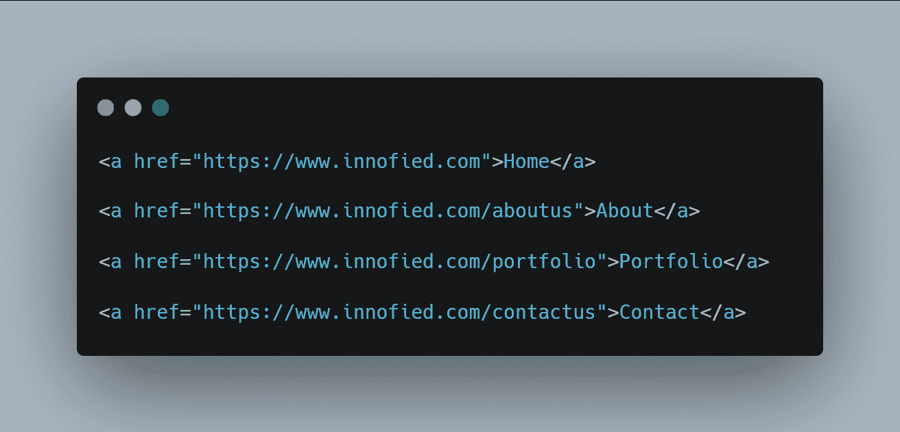

然而，从技术上来说，使用一点 CSS 就可以了。如果要添加链接列表，请使用无序列表。

# 21.避免额外的选择器

很容易在不知不觉中向 CSS 中添加额外的选择器，使样式表变得混乱。添加额外选择器的一个常见例子是列表。

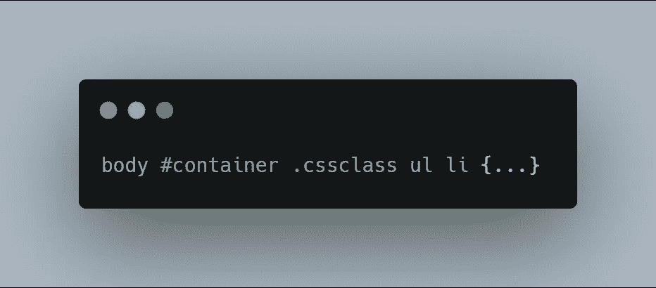

*   在这个例子中， ***。cssclass 李***本来工作得好好的。

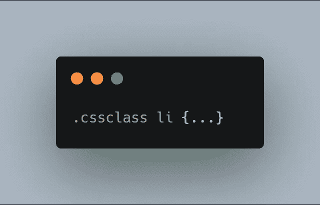

> 添加额外的选择器不会带来任何改进或类似的东西，但是它们会使你的 CSS 变得尽可能的简单和干净。

# 22.使用多个样式表

根据设计的复杂程度和网站的大小，有时制作更小的多个样式表比一个巨大的样式表更容易。这对于设计者来说更容易管理，他们也允许你在某些不需要 CSS 的页面上省去 CSS。

*   **例如，**我可能有一个拥有独特风格的用户程序。我可以只创建一个 **user.css** 和显示用户页面的样式表，而不是在主样式表中包含用户样式。
*   但是，一定要考虑正在发出的 HTTP 请求的数量。许多设计人员使用多个样式表进行开发，然后将它们组合成一个文件。这将 HTTP 请求的数量减少到一个。

# 23.使用主样式表

初学者和中级用户在使用 CSS 时最常犯的一个错误就是没有删除默认的浏览器样式。这导致了不同浏览器之间设计外观的不一致，并最终导致许多设计师责怪浏览器。当然，这是错误的指责。在对网站进行编码时，您应该在做任何其他事情之前重置样式。

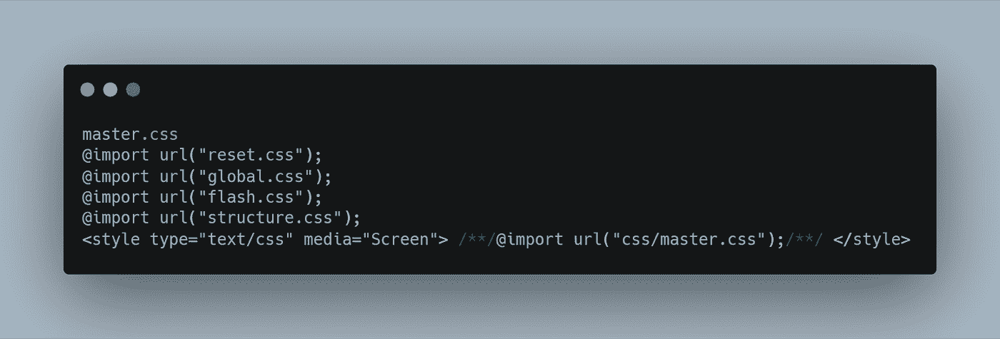 [## 初学 HTML 时你会犯的 7 个错误

### 你应该知道的 HTML 错误

javascript.plainenglish.io](/7-mistakes-you-are-making-as-a-beginner-in-html-e65ca41ad598)  [## Web 开发人员的 9 个专业 CSS 技巧

### 你需要知道的 CSS 技巧

javascript.plainenglish.io](/9-pro-css-tips-for-web-developers-508b8302ff6f)  [## 2021 年终极 React 原生开发者路线图

### 从基础到部署跨平台应用

javascript.plainenglish.io](/ultimate-react-native-developer-roadmap-for-2021-a34a2bf49699)  [## 你需要知道的 Git 的 5 个未知特性

### 你绝不能错过的 Git 特性

javascript.plainenglish.io](/5-unkown-features-of-git-you-need-to-know-99a40bb3622d) 

*更多内容请看*[***plain English . io***](http://plainenglish.io/)