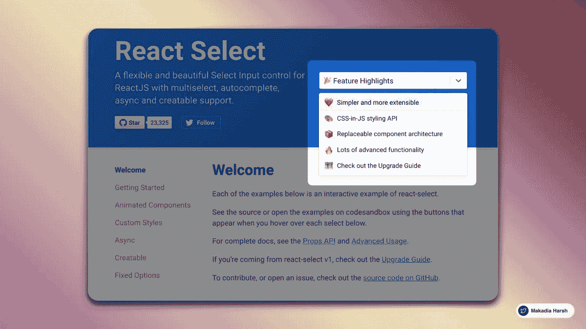
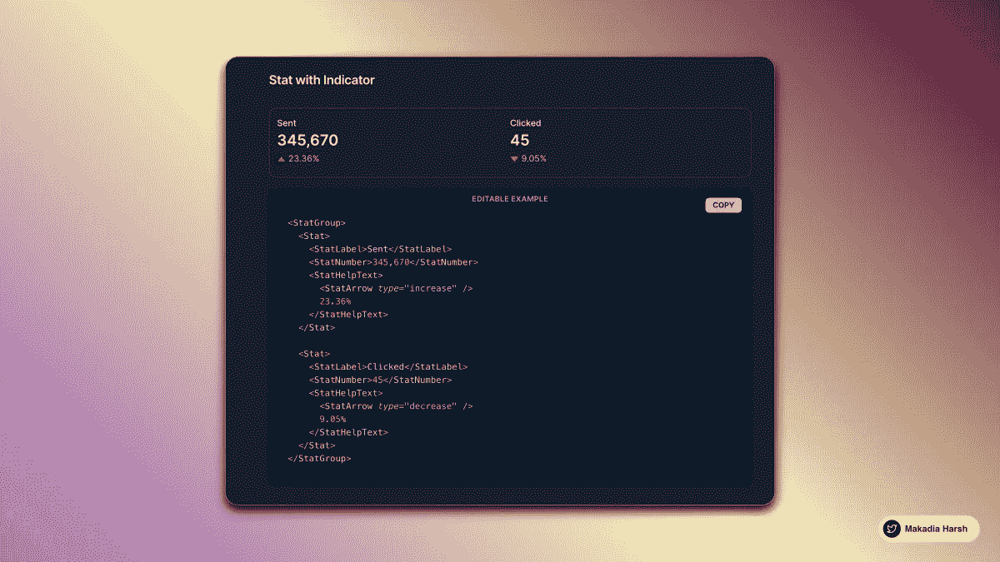
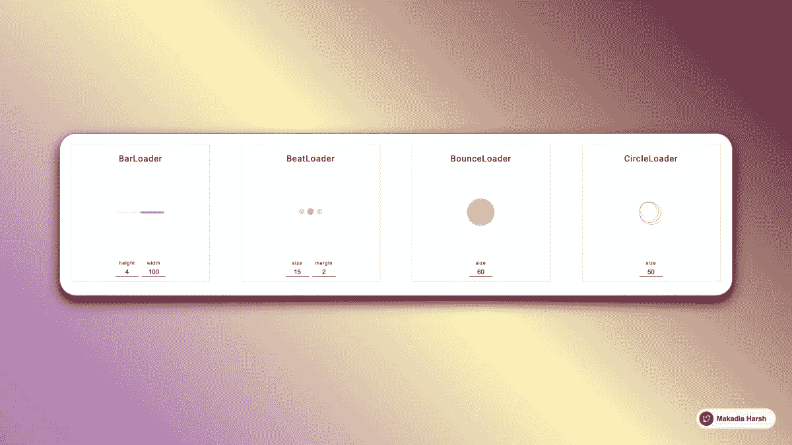

# 25 个你可能不知道存在的 React 库

> 原文：<https://javascript.plainenglish.io/25-hand-picked-react-libraries-you-probably-didnt-know-existed-fbbbfc4bfb8c?source=collection_archive---------0----------------------->

使用这些将会让你的网络开发技能突飞猛进。

这里有一些你可以在 2021 年用来提升你的网络应用的库

## { 1 }对热吐司做出反应

镇上最好的烤面包。冒烟热反应通知。

将漂亮的通知添加到 React 应用程序中

[react-hot-toast.com](https://react-hot-toast.com/)

React Hot Toast

## { 2 } React 内容加载器

SVG 驱动的组件可以轻松地创建占位符加载(像脸书的卡加载)。

skeletonreact.com

React Content Loader

React Content Loader

## { 3 }反应池

上传文件的新方式
-多种输入格式
-图像优化
-快速响应
-异步或同步上传

[pqina.nl/filepond/](https://pqina.nl/filepond/)

## { 4 }对概念 X 做出反应

快速准确的概念反应渲染器。含 TS 电池。⚡ ️

[github.com/NotionX/react-…](https://github.com/NotionX/react-notion-x)

React Notion X

## { 5 }反应选择

一个灵活漂亮的选择输入控件，支持多选、自动完成、异步和可创建。

[react-select.com/home](https://react-select.com/home)

React Select

## { 6 }温馨提示

成功消息、错误消息或信息消息的完美替代

[sweetalert.js.org](https://sweetalert.js.org/)

Sweet Alert

## { 7 }对查询做出反应

React 的高性能和强大的数据同步。

[react-query.tanstack.com](https://react-query.tanstack.com/)

React Query

## { 8 }反应钩形式

代码更少。更高性能

减少您需要编写的代码量，并删除不必要的重新渲染是 React Hook Form 的一些主要目标。
[react-hook-form.com](https://react-hook-form.com/)

React Hook Form

## { 9 }反应无限滚动

使用 React 组件无限加载内容。

【danbovey.uk/react-infinite…】

React Infinite Scroller

## { 10 }反应运动

一个解决你动画问题的弹簧。提升你的动画游戏。

[github.com/chenglou/react…](https://github.com/chenglou/react-motion)

React Motion

## { 11 }做出反应

React 实用程序，帮助您构建复杂的拖放界面，同时保持组件的解耦。

[react-dnd.github.io/react-dnd/about](https://react-dnd.github.io/react-dnd/about)

React DnD

## { 12 } React 桌面

基于脸书 React 库构建的 JavaScript 库，旨在为网络带来原生桌面体验，包含许多 macOS Sierra 和 Windows 10 组件。

[reactdesktop.js.org](http://reactdesktop.js.org/)

React Desktop

## { 13 }斯普利特比

使用 Splitbee 跟踪和优化您的在线业务。您友好的分析和转换平台。

[splitbee.io](https://splitbee.io/)

Splitbee

## { 14 }反应窗口

React 组件可高效呈现大型列表和表格数据。

【github.com/bvaughn/react-…

React Window

## { 15 }个条纹元素

Stripe 元素是丰富的预构建 UI 组件，可帮助您在桌面和移动设备上创建自己的像素级完美结账流程。

[stripe.com/en-in/payments…](https://stripe.com/en-in/payments/elements)

Stripe Elements

## { 16 }脉轮用户界面

一个简单、模块化和可访问的组件库，为您提供构建 React 应用程序所需的构建块。

[chakra-ui.com](https://chakra-ui.com/)

Chakra UI

## { 17 }草案

React 的富文本编辑器框架。

Draft.js 无缝地融入 React 应用程序，用熟悉的声明式 API 抽象出呈现、选择和输入行为的细节。

[draftjs.org](https://draftjs.org/)

Draft JS

## { 18 }图表

使用 Chartjs 在几分钟内创建漂亮的图表，仪表板将看起来前所未有的性感。

[github.com/reactchartjs/r…](https://github.com/reactchartjs/react-chartjs-2)

ChartJS

## { 19 }反应敏捷

反应转盘组件。展示任何东西的最佳滑块之一。

[react-slick.neostack.com](https://react-slick.neostack.com/)

React Slick

## { 20 }反应自动建议

符合 WAI-ARIA 标准的 React 内置自动建议组件

[react-autosuggest.js.org](http://react-autosuggest.js.org/)

React Auto Suggest

## { 21 } React 汉堡菜单

一个画布外的侧边栏 React 组件，使用 CSS 过渡和 SVG 路径动画来收集效果和样式。

[negomi.github.io/react-burger-m…](https://negomi.github.io/react-burger-menu/)

React Burger Menu

## { 22 }反作用旋转器

react 的加载微调器组件的集合

[davidhu.io/react-spinners/](https://www.davidhu.io/react-spinners/)

React Spinners

## { 23 } React 引导数据表

下一代反应引导表。数据表变得前所未有的简单。

[react-bootstrap-table.github.io/react-bootstra…](https://react-bootstrap-table.github.io/react-bootstrap-table2/)

React Bootstrap Datatable

## { 24 }样式组件

styled-components 是我们想知道如何增强 CSS 来设计 React 组件系统的结果。

styled-components.com

Styled Components

## { 25 }语义用户界面

Semantic 是一个开发框架，它使用对人友好的 HTML 帮助创建漂亮的、响应性强的布局。

【semantic-ui.com 

Semantic UI

感谢您停下来查看这些资源，我相信在某个时间点它会对您有所帮助。

如果你喜欢我的内容，我在 Twitter 上很活跃。我在推特上发布关于 web 开发、无代码和低代码的信息，让开发人员的生活变得简单。

快乐学习！💻 😄

*更多内容请看*[***plain English . io***](http://plainenglish.io/)