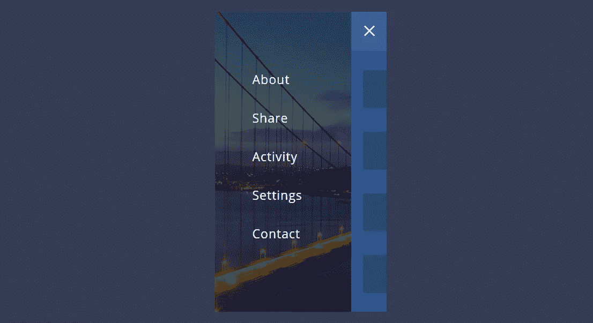

# Web 开发中的 25 个移动响应菜单

> 原文：<https://javascript.plainenglish.io/25-mobile-responsive-menus-in-web-development-7debe1535004?source=collection_archive---------0----------------------->

通常当我们设计一个网站导航时，在手机屏幕上设置它的响应式是必须的。因此，今天我将向您介绍一些在小屏幕设备上既美观又有创意且反应灵敏的菜单。要了解，我们一起去了解一下吧！

# 移动菜单

看看下面的结果吧！

# 响应导航 CSS3

看看下面的结果吧！

# 手机菜单 CSS3

看看下面的结果吧！

# 移动菜单动画 CSS

看看下面的结果吧！

# 移动导航 HTML5 CSS3

看看下面的结果吧！

# 移动菜单 Javascript

看看下面的结果吧！

# 汉堡菜单 CSS

看看下面的结果吧！

# CSS 移动导航动画

看看下面的结果吧！

# 响应导航移动菜单 CSS

看看下面的结果吧！

https://codepen.io/virgilpana/pen/dPKavr

# 放射状移动菜单

看看下面的结果吧！

# 移动菜单 Jquery

看看下面的结果吧！

# 移动菜单动画

看看下面的结果吧！

# 动画移动页脚菜单

看看下面的结果吧！

# 响应循环导航

看看下面的结果吧！

# 响应导航菜单 CSS

看看下面的结果吧！

# 移动菜单 HTML CSS3

看看下面的结果吧！

【https://codepen.io/JokinL/pen/JdPRGo 

# 滑动移动导航

看看下面的结果吧！

# 响应式汉堡菜单

看看下面的结果吧！

# 纯 CSS 移动菜单

看看下面的结果吧！

[https://codepen.io/mecarter/pen/oefsq](https://codepen.io/mecarter/pen/oefsq)

# 全屏移动菜单

看看下面的结果吧！

# 响应式移动导航菜单

看看下面的结果吧！

# 悬停移动菜单

看看下面的结果吧！

# 响应导航移动菜单切换

看看下面的结果吧！

# 移动菜单小部件

看看下面的结果吧！

# 3D 移动菜单 Jquery

看看下面的结果吧！

[https://codepen.io/jdniki/pen/BdzEGe](https://codepen.io/jdniki/pen/BdzEGe)

# 总结:

通过这一点，我希望这篇文章将为您提供有用的移动开发菜单，网站，如果您有任何问题，只需发送电子邮件，我会尽快回复。希望你继续支持网站，这样我就能写更多的好文章。祝您愉快！

相关文章:

*   [用于 Web 开发的 HTML 侧边栏菜单](https://us.niemvuilaptrinh.com/article/30-sidebar-html5-for-web-development)
*   [用于网站设计的导航条 CSS](https://us.niemvuilaptrinh.com/article/35-responsive-navigation-menu-for-website-design)
*   [图书馆为网站创建导航](https://us.niemvuilaptrinh.com/article/16-libraries-create-navigation-for-website)

*更多内容尽在*[***plain English . io***](http://plainenglish.io)