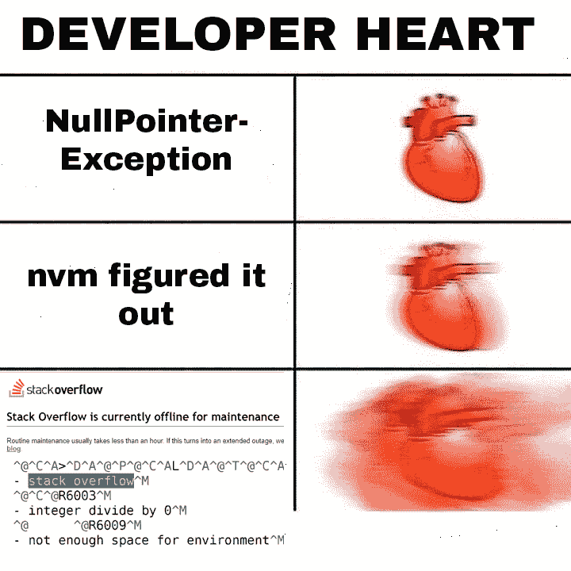
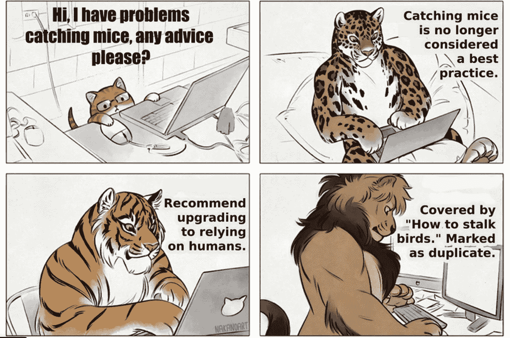
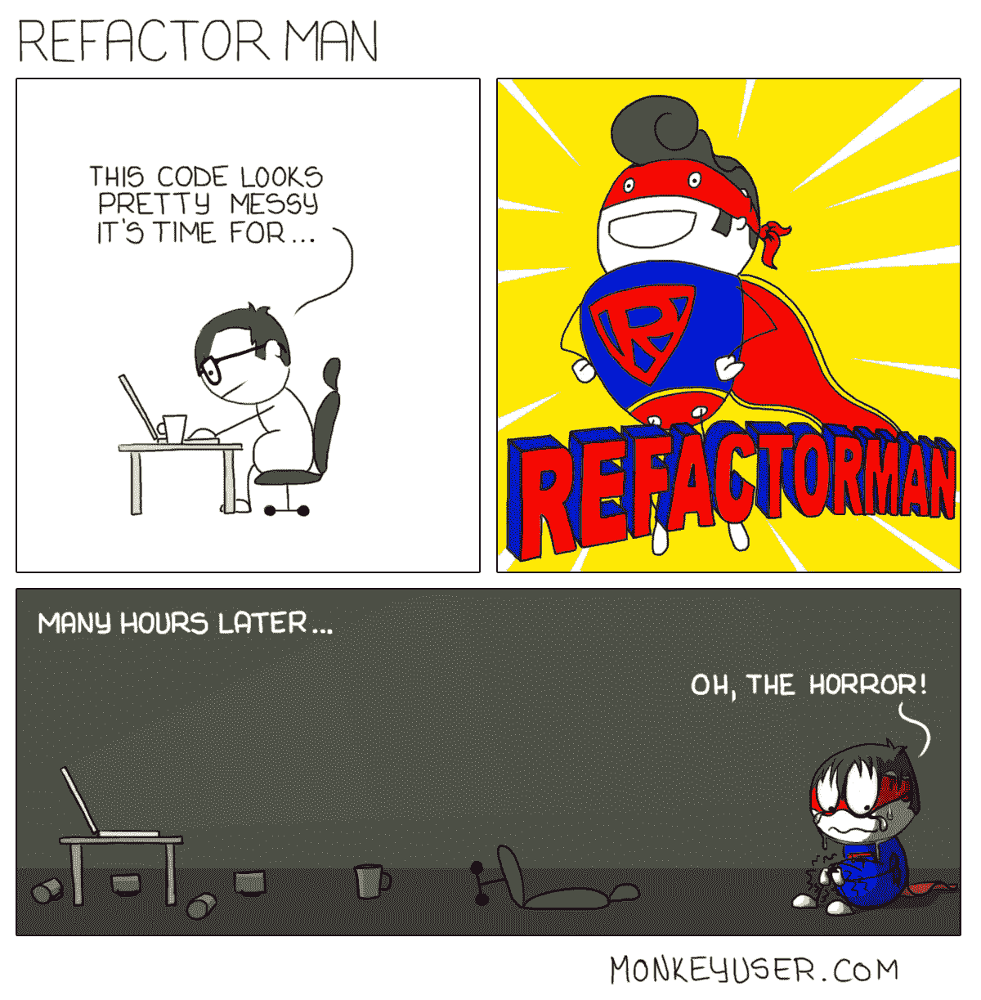

# 25 个以上的 StackOverflow 编程迷因，所有开发人员都可以涉及到

> 原文：<https://javascript.plainenglish.io/25-more-stackoverflow-programming-jokes-that-all-devs-can-relate-to-ebc2f9c11ca3?source=collection_archive---------0----------------------->

## 编程幽默可以通过刷新你的情绪来减轻你的压力

Photo by [Marija Zaric](https://unsplash.com/@simplicity?utm_source=medium&utm_medium=referral) on [Unsplash](https://unsplash.com?utm_source=medium&utm_medium=referral)

每个开发人员都有一个专家朋友，他们可以向他询问任何问题，这个朋友会通过提供一些想法来解决问题。

有人能猜到我指的是谁吗？

是的，你可能和我想的一样——这是 **StackOverflow。**

我遇到过很多编程迷因，想过专门汇编 StackOverflow 笑话，因为当你读这些笑话时，你能感受到和我一样的快乐。

不占用你的时间，我们继续吧。

## 1.不需要信任…我知道你总是对的…

## 2.发生了很多…问了一个非常愚蠢的问题，但专家很乐意提供详细的答案…

## 3.耶！最好这样做，否则，你会因为重复的问题标志而失去一些分数…

## 4.当一个人经历一些事情时，心跳会加快…

## 5.绝对需要一个每天早晚都能给我袖手旁观的人…

## 6.我的代码依赖于你伙计…

## 7.我的代码统计…

## 8.当我们得到一个负分时，最糟糕的噩梦…

## 9.有趣的内部机制。但是专家总是英雄…

## 10.有时候…

## 11.关于结合的非常真实的陈述…

## 12.复制/粘贴是一回事，但你知道粘贴到哪里吗？

## 13.有不同的解决方案吗？让我们一个一个地试一试…

## 14.你们值得这种赞赏…

# 请随意分享您宝贵的掌声和评论，这样我就可以在未来提供更多类似的内容。

 [## 2021 年最佳编程幽默汇编

### 编程迷因可以减轻你的压力

blog.devgenius.io](https://blog.devgenius.io/best-programming-humor-compilations-2021-623473bfb0d)  [## 有趣的编程迷因会让你笑死

### 编笑话来点亮你的周五

blog.devgenius.io](https://blog.devgenius.io/funny-programming-memes-that-will-make-you-die-laughing-1ccd8e139040) 

## 15.是的，你们帮了很大的忙……(只是有趣的时刻，每个人都有自己特定的角色)

## 16.请请帮帮我…哈哈…

## 17.新发明…

## 18.唯一的焦点应该是代码…如果它不起作用，那么让我们检查语句…

## 19.简单……不过，让我们问问……

## 20.又一个可怜的 PJ…

## 21.这并不总是真的…哈哈

## 22.新标题…

## 23.不能这样…我要我的额头…

## 24.您想在 StackOverflow 上更改什么？

## 25.完美的异常处理…

# 奖励时间:

# LOL…之前有严格的开发模式..这是我的代码的内部状态..当一个新变量加入未使用的变量时…

[https://www.facebook.com/photo?fbid=899897387465482&set=gm.2799768736940435](https://www.facebook.com/photo?fbid=899897387465482&set=gm.2799768736940435)

# 作为一名初级开发人员，我学到的第一件事是..不要碰工作正常的东西..它可以增加重新测试的努力，并可以打破其他东西…

[https://www.facebook.com/javascriptJS/photos/1861659490638313](https://www.facebook.com/javascriptJS/photos/1861659490638313)

# 有时候我的 Div 元素隐藏的方式让 z-index 也帮不上忙……:)

[https://www.facebook.com/javascriptJS/photos/1599789793491952](https://www.facebook.com/javascriptJS/photos/1599789793491952)

# 当你看到这段对话时，你有没有更深入地思考这个问题？也许电脑在向每个人询问它的家庭..谁知道…

[https://www.thecoderpedia.com/blog/programming-memes/](https://www.thecoderpedia.com/blog/programming-memes/)

# 如果一个常见的编码问题以这种方式问你会怎么样？

[https://www.facebook.com/DZoneInc/photos/10158915022879712](https://www.facebook.com/DZoneInc/photos/10158915022879712)

# 当我被某事卡住时…我的大脑会想…没有什么比满足感更重要…

[https://www.facebook.com/groups/programming.jokes](https://www.facebook.com/groups/programming.jokes)

# 你见过可以帮助重构的超级英雄吗？抱歉，尚不存在任何内容…

[https://www.monkeyuser.com/](https://www.monkeyuser.com/)

# 总是关注你所有行动的客户…

Source:[https://www.facebook.com/programminggeeks.in](https://www.facebook.com/programminggeeks.in)

# 当我的最后期限延长时…我也有同样的感觉..最佳水平的拖延症…

[https://www.monkeyuser.com/](https://www.monkeyuser.com/)

# 愚人节玩笑？是的，这可以适用于任何一个月…哈哈

[https://www.facebook.com/techindustan/](https://www.facebook.com/techindustan/)

# 请随意分享您宝贵的掌声和评论，这样我就可以在未来提供更多类似的内容。

 [## 2021 年最佳编程幽默汇编

### 编程迷因可以减轻你的压力

blog.devgenius.io](https://blog.devgenius.io/best-programming-humor-compilations-2021-623473bfb0d)  [## 有趣的编程迷因会让你笑死

### 编笑话来点亮你的周五

blog.devgenius.io](https://blog.devgenius.io/funny-programming-memes-that-will-make-you-die-laughing-1ccd8e139040)  [## 编程迷因和幸福之间的联系

### 2021 年最佳编程迷因汇编

blog.devgenius.io](https://blog.devgenius.io/the-connection-between-programming-memes-and-happiness-d768ab85b83d)  [## 10 个能让你心情轻松的最佳编程笑话

### 你读过的关于编程迷因 2021 的最不可思议的文章

medium.com](https://medium.com/geekculture/10-best-programming-jokes-to-lighten-up-your-mood-8870dab2bff7) 

*更多内容看*[***plain English . io***](http://plainenglish.io/)

## 来源:

[https://onsizzle.com/t/stackoverflow-com](https://onsizzle.com/t/stackoverflow-com)

[https://awwmemes . com/I/stack overflow-if-you-can-change-any-about-stack-overflow-what-d2d 999 e2ee 814854 bbf ba 9083 b 423799](https://awwmemes.com/i/stackoverflow-if-you-could-change-anything-about-stack-overflow-what-d2d999e2ee814854bbfba9083b423799)

[https://programmercave 0 . github . io/blog/2019/11/28/Memes-on-copy-pasting-code-from-stack overflow](https://programmercave0.github.io/blog/2019/11/28/Memes-on-copy-pasting-code-from-Stackoverflow)

[https://www . Facebook . com/devcodingmemes/photos/hiring-a-full-stack-developer-dcoding-memes-codingslife/537390823859055/](https://www.facebook.com/devcodingmemes/photos/hiring-a-full-stack-developer-dcoding-memes-codingislife/537390823859055/)

[http://www.quickmeme.com/meme/36ithh](http://www.quickmeme.com/meme/36ithh)

[https://starecat.com/memes/stack-overflow/](https://starecat.com/memes/stack-overflow/)

[https://www.pinterest.ca/pin/778489485571988463/](https://www.pinterest.ca/pin/778489485571988463/)

[https://www . quora . com/Where-can-I-buy-Stack-Overflow-up votes](https://www.quora.com/Where-can-I-buy-Stack-Overflow-upvotes)

[https://www . Reddit . com/r/programmer humor/comments/9zfe 7x/he _ never _ copied _ from _ stack _ overflow/](https://www.reddit.com/r/ProgrammerHumor/comments/9zfe7x/he_never_copied_from_stack_overflow/)

[https://knowyourme . com/photos/1676635-apes-together-strong](https://knowyourmeme.com/photos/1676635-apes-together-strong)

[https://thecodinglove.com/the-stack-overflow-logic](https://thecodinglove.com/the-stack-overflow-logic)

[https://knowyourme . com/photos/1715717-buff-boys-help-out-nerdy-kid](https://knowyourmeme.com/photos/1715717-buff-guys-help-out-nerdy-kid)

[https://www.pinterest.ca/pin/320318592246492834/](https://www.pinterest.ca/pin/320318592246492834/)

[https://9gag.com/tag/stackoverflow](https://9gag.com/tag/stackoverflow)

[https://www . Reddit . com/r/programmer 幽默/comments/cjud 6n/stackoverflow _ is _ down/](https://www.reddit.com/r/ProgrammerHumor/comments/cjud6n/stackoverflow_is_down/)

*多内容于* [***中***](http://plainenglish.io/)