# 学习编程的 26 个 GitHub 开源

> 原文：<https://javascript.plainenglish.io/26-github-open-sources-for-learning-programming-4d0021d9f336?source=collection_archive---------2----------------------->

*在今天的文章中，我将向大家介绍 GitHub 上一些完全免费的编程学习网站，用于网站设计和开发。*

# 30 秒的代码

它是一个集合代码片段的地方，可以帮助您解决在项目中实现代码的过程中遇到的常见问题。它支持流行的语言，如 React、Node.js、Git、CSS、Python，尤其是 JavaScript 算法、实现的 JavaScript ES6、JavaScript 中使用的常见数据结构的教程和示例。

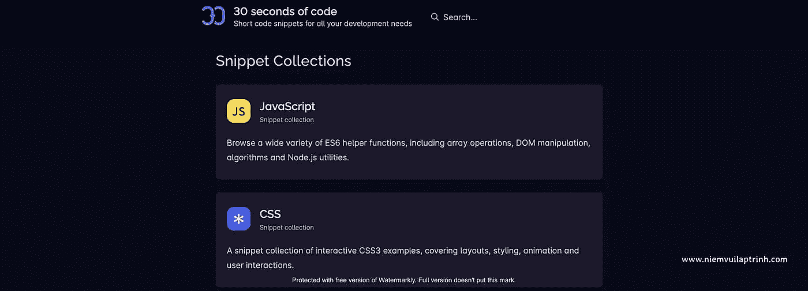

[链接](https://www.30secondsofcode.org/collections)

# Airbnb JavaScript 风格指南

这是一个 GitHub 页面，通过真实的例子总结了编写 JavaScript 代码的最佳方法。

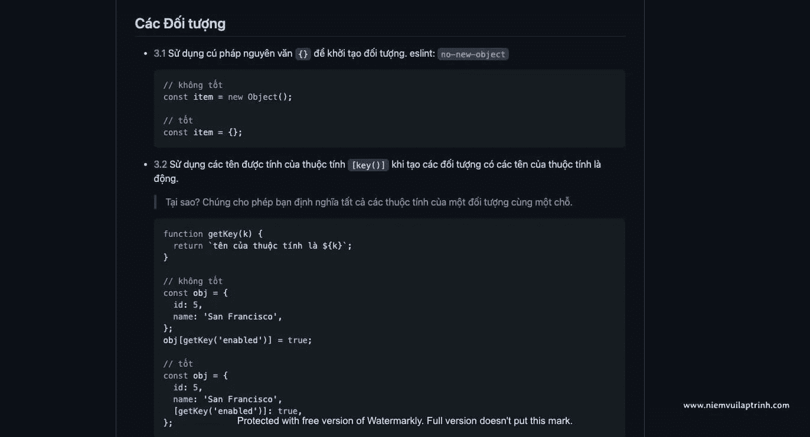

[链接](https://github.com/dangkyokhoang/javascript-style-guide)

# 您可能不需要 jQuery

它是一个帮助你用纯 JavaScript 使用 jQuery 主要功能的网站。

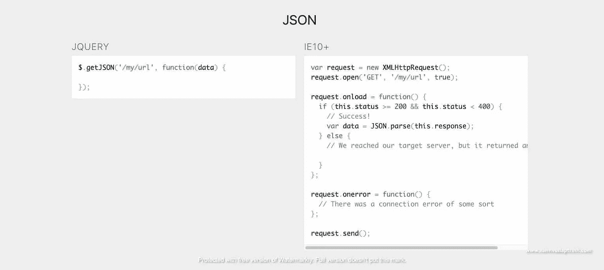

[链接](https://youmightnotneedjquery.com/)

# 现代网络开发魔法书

它是学习资源(如文章、书籍等)的集合。)对 web 开发者有用。

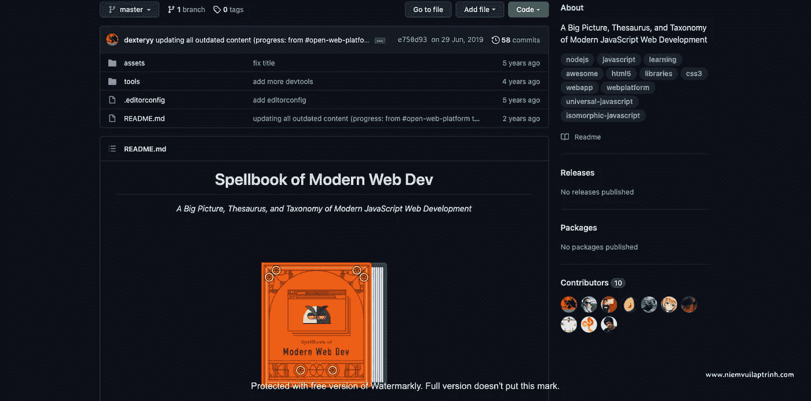

[链接](https://github.com/dexteryy/spellbook-of-modern-webdev)

# 33 个 JavaScript 概念

帮助程序员掌握 JavaScript 概念的详细文章摘要。

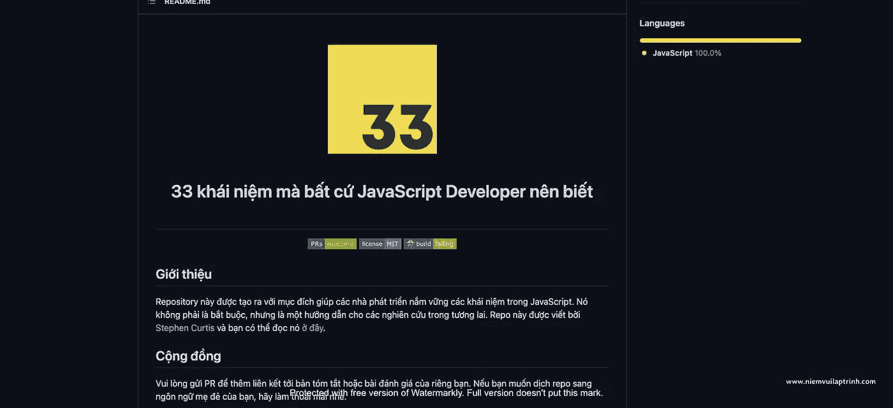

[链接](https://github.com/nguyentranchung/33-js-concepts)

# 项目指南

这是一个 GitHub 页面，当你开始一个网站开发项目时，这里有教程和要点。

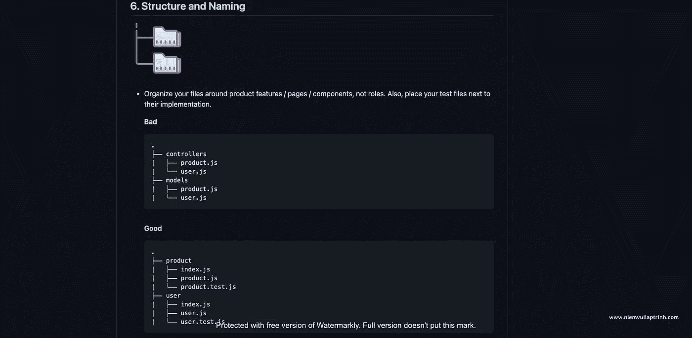

[链接](https://github.com/elsewhencode/project-guidelines)

# Web 开发者路线图

Web 开发人员路线图为您的开发人员发展道路提供了完整的路线图。提供学习编程各个阶段的详细资料，每年更新。此外，它还为前端、后端、DevOps、Android 等不同行业提供了详细的路线图…

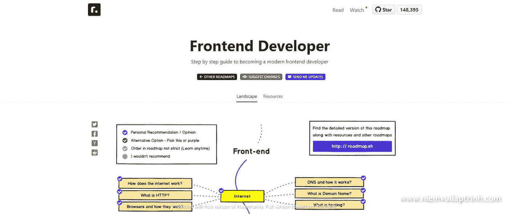

[链接](https://roadmap.sh/)

# 前端开发人员面试问题

一个收集前端面试过程中常见问题的地方。(你将不得不自己寻找答案。)

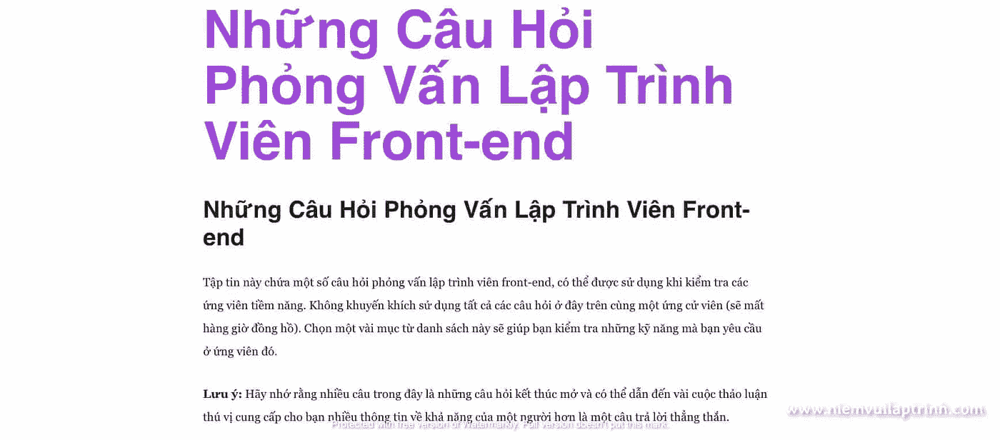

[链接](https://h5bp.org/Front-end-Developer-Interview-Questions/translations/vietnamese/)

# 干净代码 JavaScript

它综合了作者在使用 JavaScript 编程语言的过程中的编码经验。它帮助我们学会编写易于理解、易于重用、提高代码效率的代码…

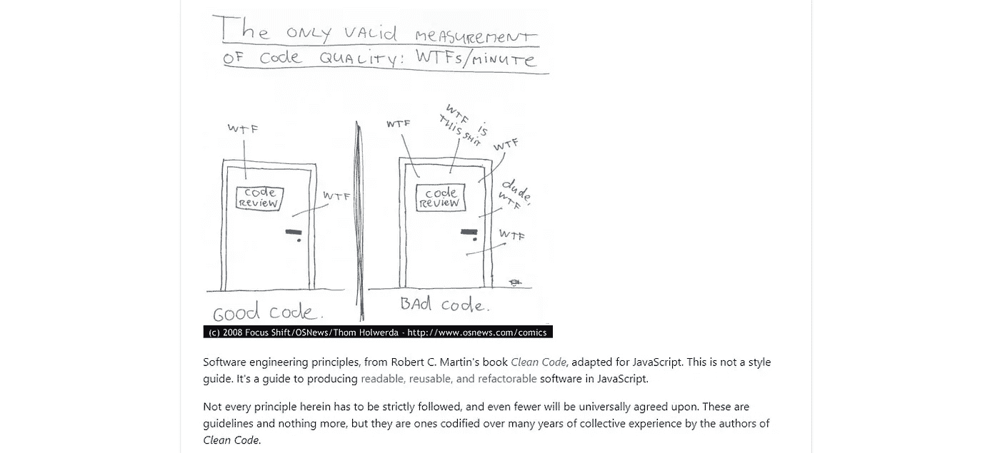

[链接](https://github.com/ryanmcdermott/clean-code-javascript)

# DevDocs

DevDocs 是当今流行的编程语言如 JavaScript、HTML、CSS、PHP、React、Vue.js 等几乎完整文档的集合。

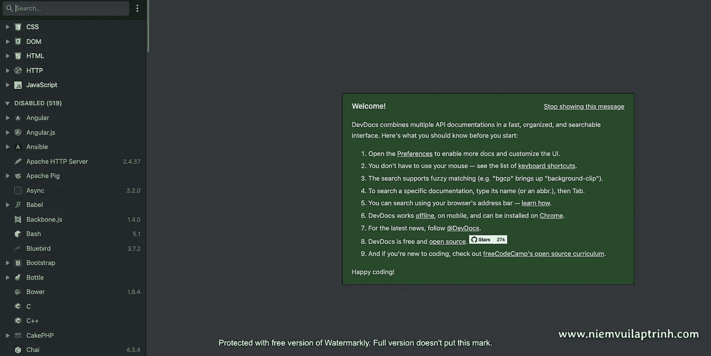

[链接](https://devdocs.io/)

# 每个程序员都应该知道

一个综合一个程序员应该知道的技术知识的地方。

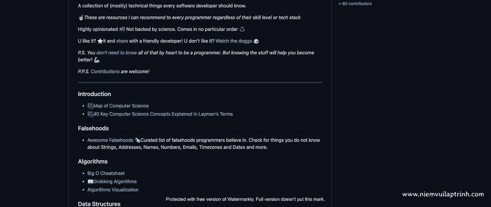

[链接](https://github.com/mtdvio/every-programmer-should-know)

# 技术面试手册

Tech Interview Handbook 是一个为开发人员总结面试经验的网站，例如如何写简历、自我介绍、面试中的常见问题以及编程中的流行算法和技术。

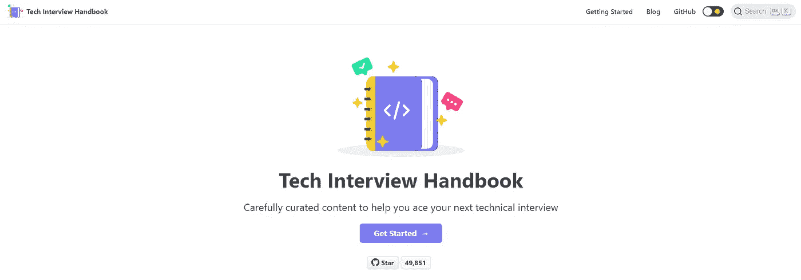

[链接](https://techinterviewhandbook.org/)

# 抓取前端导轨

这个页面将通过 Grab 工程团队的实际操作经验，帮助前端初学者理解基本概念以及 web 项目应该使用什么工具和库。

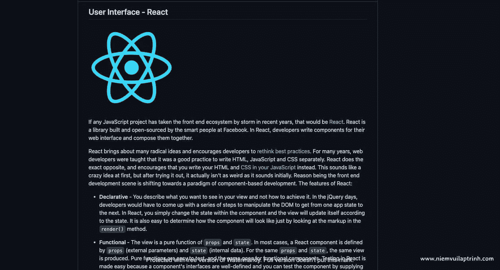

[链接](https://github.com/grab/front-end-guide)

# 学习 Git 分支

通过教程和可视化示例帮助您学习 Git 的地方。

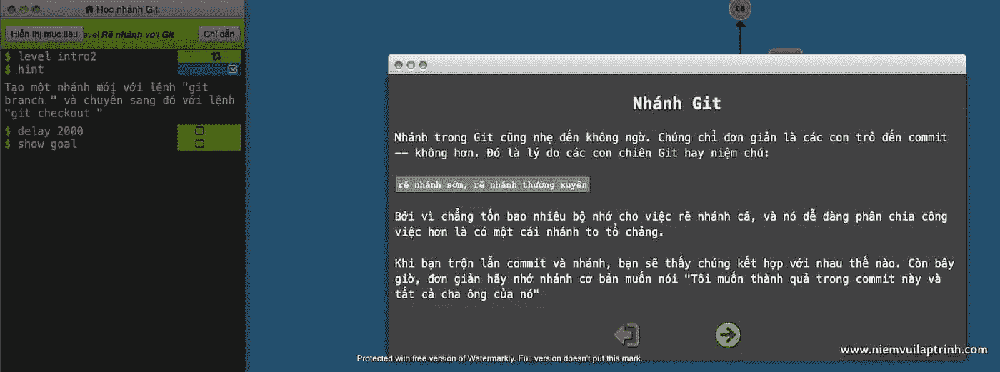

[链接](https://learngitbranching.js.org/?locale=vi)

# 普通 Web 项目

一个通过 20 多个完全免费的项目，帮助你在网站开发中练习纯 javascript 代码的地方。

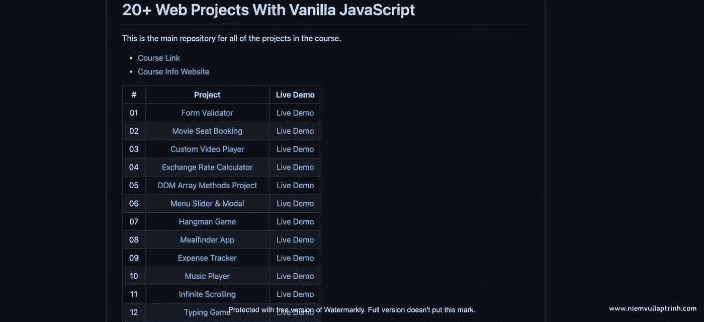

[链接](https://github.com/bradtraversy/vanillawebprojects)

# 免费编程书籍

在我看来，这是一个集合了当今程序员几乎所有免费课程和编程书籍的网站。我在这里最喜欢的一点是，它被分成许多不同的语言，这样我们就可以很容易地选择正确的文档。除了阅读文件，它还为您提供其他格式，如播客，视频，编码程序。

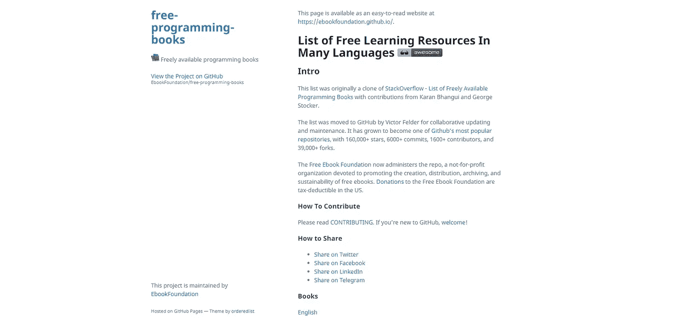

[链接](https://ebookfoundation.github.io/free-programming-books/)

# 现代 JavaScript 备忘单

这个页面是 JavaScript 的备忘单，帮助您解决在构建项目时经常遇到的问题。

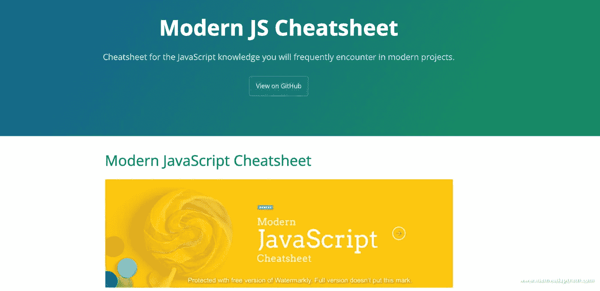

[链接](https://mbeaudru.github.io/modern-js-cheatsheet/)

# 前端清单

前端清单列出了你的网站投入生产前需要具备的所有要素。

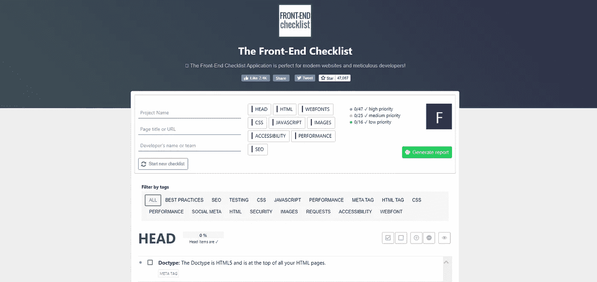

[链接](https://frontendchecklist.io/)

# 前端性能清单

前端性能清单是一个知识和例子的集合，以帮助您的网站加载更快，更优化。

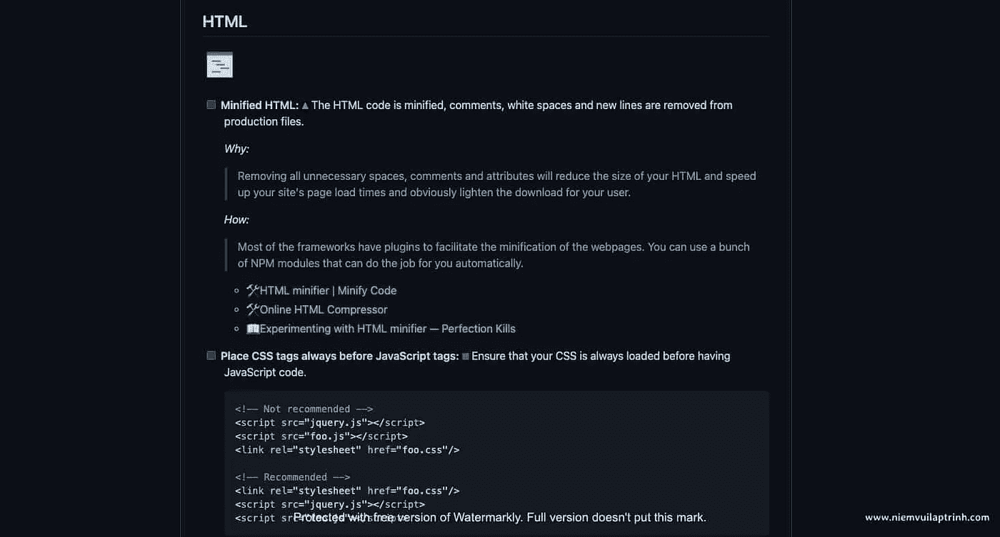

[链接](https://github.com/thedaviddias/Front-End-Performance-Checklist)

# 可怕的

Awesome 是一个几乎完整的书籍、工具、库等的集合。对于当今流行的编程语言和主题。

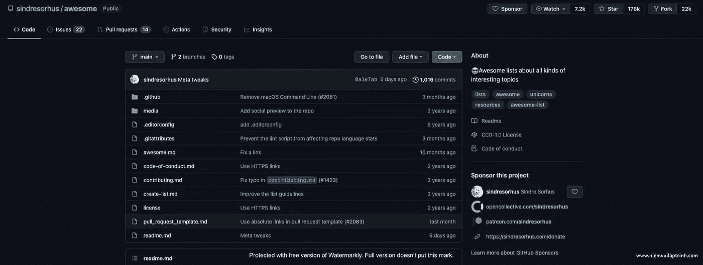

[链接](https://github.com/sindresorhus/awesome)

# 面向开发者的设计资源

开发者设计资源是一个为程序员在网站开发过程中选择颜色、字体、免费模板、CSS 框架等设计工具的集合。

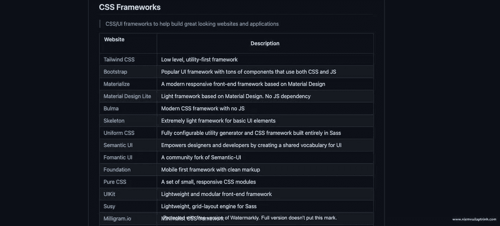

[链接](https://github.com/bradtraversy/design-resources-for-developers)

# 系统设计入门

这是一个 GitHub 教程页面，帮助您学习如何设计、优化和轻松扩展大型系统。

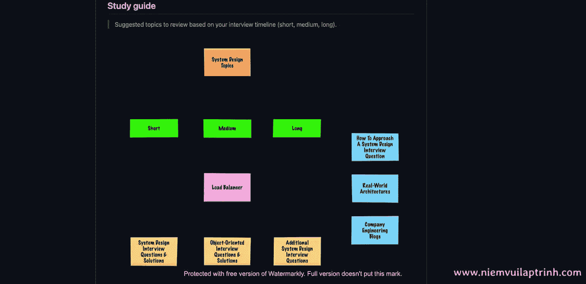

[链接](https://github.com/donnemartin/system-design-primer)

# JavaScript 算法和数据结构

JavaScript 算法和数据结构是流行算法和数据结构的真实例子的完整集合。

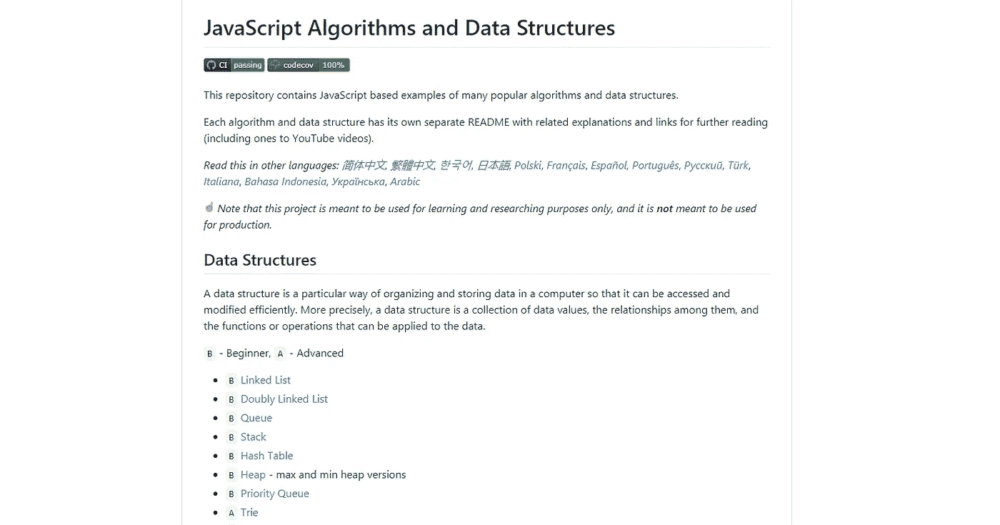

[链接](https://github.com/trekhleb/javascript-algorithms)

# CSS 保护

CSS Protips 是一个专门综合知识帮助你优化网站设计中 CSS 的地方。

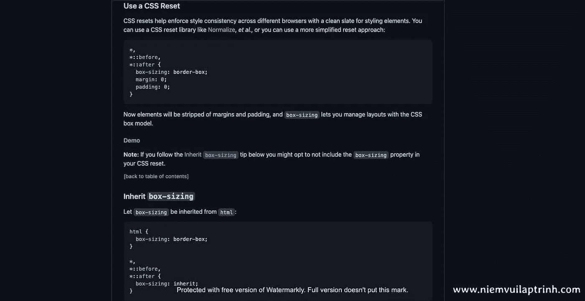

[链接](https://github.com/AllThingsSmitty/css-protips#css-protips-)

# 令人敬畏的网络开发资源

Awesome Web 开发资源是一个面向开发者的免费编程资源聚合器。

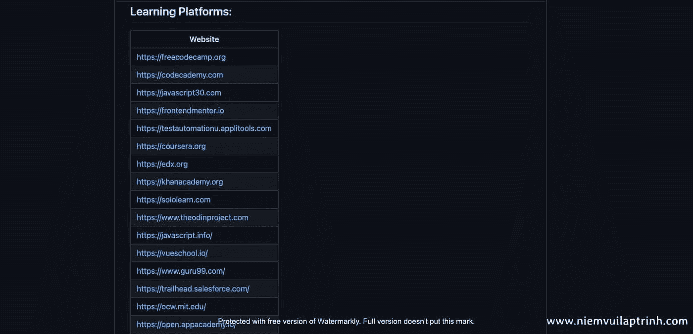

[链接](https://github.com/markodenic/web-development-resources)

# JavaScript 问题

这个网站收集了 JavaScript 编程语言从基础到高级的问题。我最喜欢它的一点是，它对每个问题都有答案和详细的说明。它也被翻译成许多不同的语言。

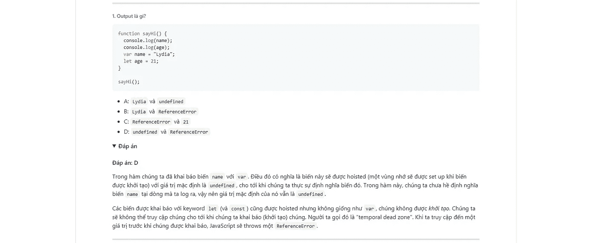

[链接](https://github.com/lydiahallie/javascript-questions/blob/master/vi-VI/README-vi.md)

# 摘要

希望文章能为你提供免费学习网页开发与设计编程的地方，有问题发邮件就好；我会尽快回复。希望大家继续支持网站，让我能写出更多好文章。祝您愉快！

相关文章:

*   [网站分享代码片段在线免费](https://us.niemvuilaptrinh.com/article/15-website-share-code-snippet-free)
*   [30 Web 开发博客](https://us.niemvuilaptrinh.com/article/30-blogs-for-web-development)
*   [免费学习编码的最佳网站](https://us.niemvuilaptrinh.com/article/34-ebooks-courses-free-for-learn-front-end)
*   [Udemy 上十大最佳网络开发课程](https://us.niemvuilaptrinh.com/article/top-10-best-web-development-courses-on-udemy)

*更多内容看* [***说白了就是***](http://plainenglish.io/) ***。*** *报名参加我们的* [***免费每周简讯点击这里***](http://newsletter.plainenglish.io/) ***。***