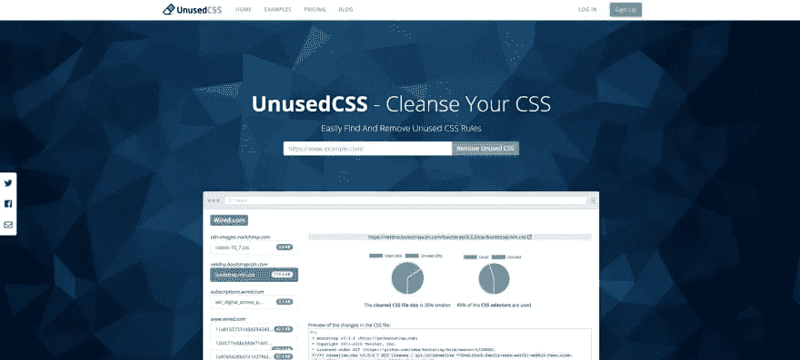
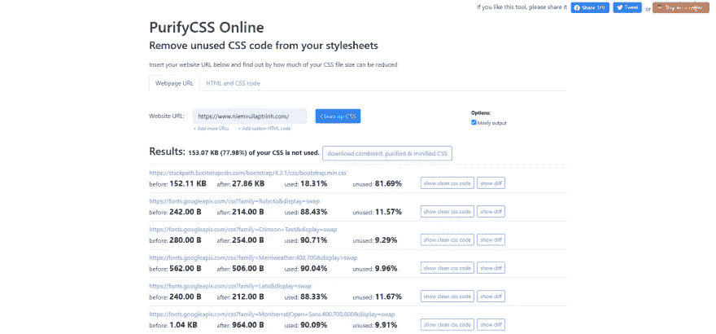
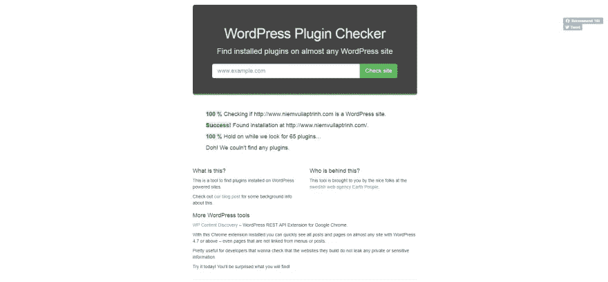
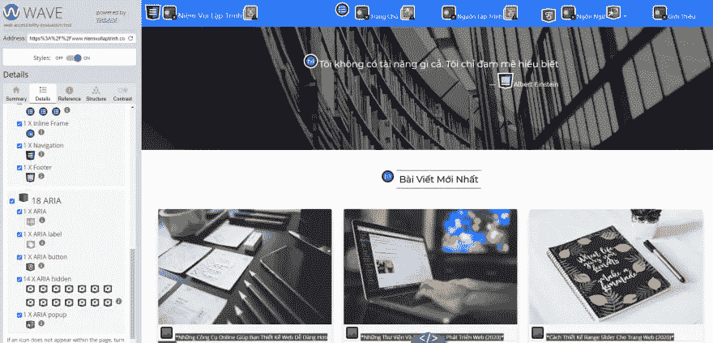

# 27 个免费网站测试工具

> 原文：<https://javascript.plainenglish.io/27-free-website-testing-tools-b59cc37f569d?source=collection_archive---------11----------------------->

## 2021 年流行且不可或缺的免费网站测试工具。

Photo by [Kevin Bhagat](https://unsplash.com/@kevnbhagat?utm_source=medium&utm_medium=referral) on [Unsplash](https://unsplash.com?utm_source=medium&utm_medium=referral)

当我们建立一个网站时，我们必须检查各种设备上的安全性和兼容性问题，以及页面的加载速度和 SEO 兼容性——这些都是非常重要的任务。所以在今天的帖子里，我给大家介绍一下 2021 年流行的网站测试工具！

# 未使用的 CSS

UnusedCSS 是一个工具，它可以帮助您检查您提供的页面 URL 中未使用的 CSS 属性。它将通过图表显示信息，帮助您更直接地查看未使用的 CSS 属性。

UnusedCSS

[未使用的 CSS](https://unused-css.com/)

# 在线净化 CSS

PurifyCSS Online 也是一个帮助你检查页面上未使用代码的工具。有效地上网。CSS 文件缩小前后的信息指示器的引入允许您定义可以在网页中缩小的 CSS 大小。此外，它也有一个下载功能的缩小 CSS 文件，你可以很容易地应用到您的网站。

PurifyCSS Online

[净化 CSS 在线](https://purifycss.online/)

# WhatCMS

WhatCMS 通过你提供的 URL 帮助你检查一个网站是否正在使用 CMS(内容管理系统)。此外，它还有一个功能，检查主机和 WordPress 主题的另一个网站在使用中！

WhatCMS

[WhatCMS](https://whatcms.org/)

# WordPress 插件检查器

WordPress 插件检查器是一个帮助你检查 WordPress 网站正在使用哪个插件的工具。

WordPress Plugin Checker

WordPress 插件检查器

# 图标检查器

Favicon checker 是一个 web 应用程序，允许您检查上述网站中 Favicon 的显示。当今流行的移动设备、应用程序以及浏览器。

Favicon checker

[图标检查器](https://realfavicongenerator.net/favicon_checker)

# 波浪

WAVE 是一个评估用户网站使用体验的工具。它提供了关于网站中 UI 设计错误的全部细节，这样你可以很容易地理解和修复你的网站中的错误。

WAVE

[波](https://wave.webaim.org/)

# 响应检查器

Responsive Checker 是一个 web 应用程序，可帮助您检查网站在各种设备屏幕上的响应显示。

Responsive Checker

[响应检查器](https://www.websiteplanet.com/webtools/responsive-checker/)

# 手机友好型

Mobile-Friendly 是 Google 创建的一个网站，主要任务是帮助你在移动设备上检查网站的友好性。

Mobile-Friendly

[手机友好型](https://search.google.com/test/mobile-friendly)

# 网站分析(Accessify)

网站分析(Accessify)是一个工具，可以帮助您评估整个网站，如页面加载时间，网站优化，IP 地址信息…

Website Analytics

[网站分析访问](https://www.accessify.com/)

# 知道

WOT 是一个通过网络上数百万用户来评估一个网站是否安全的网站。这个平台。它会让你在浏览器上访问陌生网站更加安全。所以你应该把你的网站放在这里，通过用户的评论来帮助改进网站的过程。

WOT

[WOT](https://www.mywot.com/)

# Whois

Whois 是一个网站，允许我们检查有关域名的全部信息，如注册时间。注册，主机名，IP 地址，域名注册国家…

Whois

[谁是谁](https://whois.domaintools.com/)

# 放大器验证器

AMP Validator 是一个允许您检查 AMP 项目结构的工具。

AMP Validator

[放大器验证器](https://validator.ampproject.org/)

# 什么

Whatsmydns 允许您立即执行 dns 查找，以检查您当前的 IP 地址。域名和 DNS 记录了世界不同地区的许多名称服务器的信息。

Whatsmydns

[Whatsmydns](https://www.whatsmydns.net/)

# GZIP 压缩检验器

GZIP 压缩检查器是一个工具，检查是否 gzip 压缩启用了网站主机你的或没有。使用 gzip 压缩可以在网页发送到用户浏览器之前减小网页的大小，主要目的是减少服务器的吞吐量以及网站的加载时间。

GZIP COMPRESSION CHECKER

[GZIP 压缩检查器](https://www.websiteplanet.com/webtools/gzip-compression/)

# 伍兰克

Woorank 是一个简单易用的网络分析工具，用于跟踪和连接数据。你的营销数据。它也有助于优化您的网站的速度和搜索引擎优化，通过提供网站的每个元素的详细说明。

Woorank

[伍兰克](https://www.woorank.com/)

# SSL 检查器

SSL 检查器帮助您在安装 SSL 证书时快速诊断问题。您可以在您的 web 服务器上验证 SSL 证书，以确保它安装正确、有效、可信，并且不会给使用您网站的任何用户带来任何错误。

SSL Checker

[SSL 检查器](https://www.sslshopper.com/ssl-checker.html)

# 阿莱夏

Alexa 是一款免费的自动化网络分析工具，可以帮助你快速了解网站的优势和劣势。它也有一些有用的功能，如字分析关键的网站在同一个领域与你竞争，交通统计，人数互动使用…

Alexa

[Alexa](https://www.alexa.com/siteinfo)

# Webbkoll

Webbkoll 可以测试标准网站的数据安全措施，这将确保您的网站以及用户信息和数据的安全。

Webbkoll

[韦伯科尔](https://webbkoll.dataskydd.net/en)

# 网站价值流量

网站价值流量是一项免费服务，旨在评估网站的价值、每日浏览量、每日访客和每日收入。快速计算价格网站价值和任何网站的全球排名。查看页面流量统计详细网页，包括 Alexa 统计，社交网络脸书上的最后共享链接，国际网站服务器的位置，IP 地址，网站的月收入和年收入。

Site Worth Traffic

[网站值得流量](https://www.siteworthtraffic.com/)

# Sucuri 站点检查

Sucuri SiteCheck 将帮助您检查网站的安全性，例如恶意软件检测。通过扫描您的网站正在使用的开放链接代码来处理受感染的文件，检查您的网站状态是否在安全机构的黑名单上，如 Google、phishtank…确定该网站是否使用过时、易受攻击的 CMS 或插件…

Sucuri SiteCheck

[苏库里站点检查](https://sitecheck.sucuri.net/)

# Urlrate

Urlrate 是一个工具，通过重要的属性来评估您的域名以及您的网站的价值，如访问者、页面浏览量、Google PageRank、Edge Rank 图片、评级、反向链接、Twitter 上的社交提及以及 Delicious、Digg、StumbelUpon、Reddit 上的书签…

Urlrate

[Urlrate](https://www.urlrate.com/)

# 建筑

Builtwith 是一个应用程序，可以很容易地看到一个网站是否正在使用技术来建立一个网站。

Builtwith

[内置于](https://builtwith.com/)

# 谷歌页面速度洞察

Google PageSpeed Insights 可以为你的网站生成性能报告，在手机和桌面上都是免费的。并给出了影响页面加载速度的原因和解决方法。现场速度将以 100 分制进行划分，包括:

*   90 以上就不错了
*   介于 50 和 90 之间被认为需要改进。
*   50 以下被认为是差。

Google PageSpeed Insights

*   [谷歌页面速度洞察](https://developers.google.com/speed/pagespeed/insights/)

# 打开管理工具

Open Admin Tools 是一款通过提供地址 URL 来帮助您分析网站的工具。有用的信息，如流量，使用的网络技术，安全级别，网站的基本信息…

Open Admin Tools

[打开管理工具](https://www.openadmintools.com/)

# 检查主机

Check-Host 是一个现代化的在线工具，用于网站监控和检查服务器、DNS 记录、IP 地址的可用性。它支持最新的技术，如本地化域名(包括 Punycode 和原生格式)、主机名 IPv6 记录(也称为 AAAA 记录)。

Check-Host

[检查主持人](https://check-host.net/)

# 查看 dns

Viewdns 是许多有用工具的集合，可以帮助您找到当前所有者的信息。自己的域名，找到域名的位置，提供关于您的 DNS 设置的完整信息…

Viewdns

[Viewdns](https://viewdns.info/)

# 网站速度测试(上升趋势)

网站速度测试(UPTREND)是一款完全免费帮助你测试网站速度的工具。我最喜欢的是，你可以像在新加坡、伦敦、悉尼那样选择位置来查看页面加载时间

Website Speed Test (UPTREND)

[网站速度测试(上升趋势)](https://www.uptrends.com/tools/website-speed-test)

我希望文章能为你提供必要的免费网站测试工具，如果你有任何问题，请尽快给我发邮件。继续支持网站，这样我就可以写更多的好文章。祝您愉快！

相关文章:

*   [免费网页设计工具](https://us.niemvuilaptrinh.com/article/online-tools-to-make-web-design-easier)
*   [现场审计工具](https://us.niemvuilaptrinh.com/article/23-best-seo-audit-tools)
*   [免费网站速度测试](https://us.niemvuilaptrinh.com/article/12-tools-to-check-website-performance)

*更多内容看* [***说白了. io***](http://plainenglish.io/)