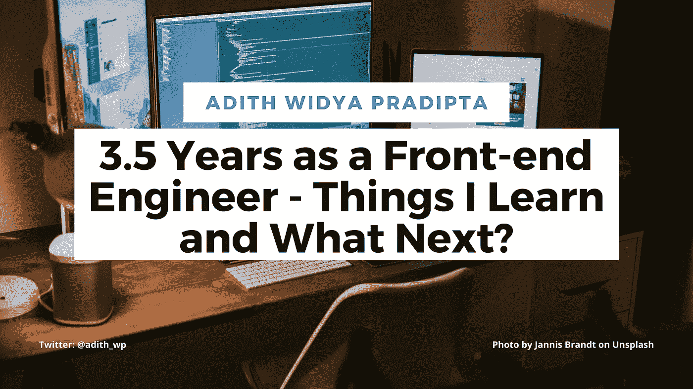

# 作为前端工程师的 3.5 年——我学到了什么，下一步是什么？

> 原文：<https://javascript.plainenglish.io/3-5-years-as-a-front-end-engineer-things-i-learn-and-what-next-e75cb7c00988?source=collection_archive---------22----------------------->

最初发布在[我的博客](https://adith.vercel.app/posts/three-and-a-half-years-as-frontend-engineer-what-i-learn)上。

每隔一段时间，我们软件工程师/开发人员都会面临一个时刻，我们必须放慢脚步，花时间重新思考、重塑，并最终重新规划我们的职业生涯。到目前为止，我们的职业生涯是否走在“明智”的道路上？我们的进步是我们个人发展的最佳决定吗？

到目前为止，在我的软件开发生涯中，我对“推广”有不同的看法坦白地说，我甚至害怕它。我没有假装。现在一切都在择优的“范围”内。举例来说，我应该得到提升吗？这是基于我的技能还是仅仅基于我在公司的经验(我已经工作了多久)？

但在现实中，你无法决定自己关于一切的命运，也没关系。我永远不会准备好一切。我们的职业成长也不例外。

所以，作为我保持我的专业知识(并提高它)并为未来做好准备的尝试。看过一些书，消化了一些教程，创建了课程，推出了一个产品，现在在写博客。所以在这篇文章中，我将分享我迄今为止的学习。

# (试着)像软件架构师一样思考

事实是，我从来没有做过软件架构师。我三年半的软件开发生涯，主要是作为一个开发者。等等，什么？我是否指出了软件架构师和软件开发人员是不同的？是的，我做到了。根据马克·理查兹和尼尔·福特的《软件架构基础》这本书。

心理上的差异是基于“如何从某个角度看问题”但在我深入探讨之前，我需要解释一下为什么我认为这是一本值得一读的好书，并为下一次挑战做好准备。当我读这本书的时候，我找到了我认为正确的道路。最后，我会继续做我现在做的事情。随着我职业道路的发展，我将很少有时间做实际的编码任务，而更多地参与决策。

我学习这本书的收获不会包含这本书的所有内容。它只满足了这本书整体内容的 3-6%。所以大家还是需要把书吸收一下才能得到全部的肉。

我从这本书的主要收获来自第二章:建筑思维。在我的整个职业生涯中，当谈到选择技术堆栈(工具、库或框架)时，我首先从技术选择的好处开始。但是我从来没有分析过其中的取舍。谈到架构思维，我需要查看给定解决方案(或堆栈)的帮助，并探索与解决方案相关的负面影响或交换。

我从李·罗宾逊的推文中举个例子[把链接放在这里]。他是 Vercel 的 DevRel 的负责人，该公司创建了最微妙的 React 框架之一:Next.js。尽管如此，不管 Next.js 的使用有多方便，它也有缺点或缺点。

在权衡利弊之后，才决定使用框架。为了避免发生这种情况，我们的团队已经精通另一种语言/框架，并且不想转换？我们想要构建的网络产品需要大量的 JavaScript 来运行吗？或者也许我们的团队不是一个反应型的人，而更像一个 Vue 人？

在决定堆栈之前，解决这些权衡使得(大多数)开发人员的想法和软件架构师(应该)的想法有所不同。最后，这些问题的实际答案总是“视情况而定”你不能谷歌它。最终的决定必须在我们根据自己的担忧对解决方案进行真正评估后做出。这可能取决于业务需求、环境、人员和许多其他因素。

# 技术广度与技术深度

我之前讲过思考取舍。但这部分是最难的(至少对我个人来说)。当我需要选择什么时候添加东西时，我必须知道，保持对我已经知道的东西的专业知识，并且知道我不知道的东西。它需要非常有效的时间和精力管理。

有人说学习编程的好地方是在工作中。我在工作中学到了很多，但在工作中也学得很少。不要误解我，我完全同意在工作中学习。因为在某种程度上，我觉得我知道如何在工作中做很多事情。当我撞上那堵墙时，很难绕过去。除了我目前正在做的工作，还需要时间去学习。

所以我花了更多的时间在工作之外学习。我在我已经知道的事情上保持我的专业知识(比如参加 Kent C. Dodds 的 Epic React 课程)并且在我不知道的事情上扩展我的专业知识(比如发现铁锈)。但是我觉得这是我永远做不到的事情。让我澄清一下。

作为一名软件开发人员，我的工作要求我具备相当的技术深度来完成我的工作。意味着我需要积累“我知道的东西”但这还不够；我也需要维护它。我从 2017 年开始用 React 做网页开发工作。我可以说我对此很了解。但是现在已经是 2021 年了，如果这些天我不维护和升级我的 React 产品，我的 React 知识已经过时了。这就是为什么我称之为保持“我知道的东西”或技术深度。

快进到未来，通过认识他人的个人经历，技术深度是不够的。我需要对当前专业知识之外的其他技术内容有广泛的了解。因为在职业生涯的不同阶段，技术人员应该拥有的有价值的信息种类是不同的。更多的是在“我知道我不知道的东西”领域。我听说了关于铁锈的好消息；它在语法上与 C++相似，但有许多改进。这一发展甚至得到了一些知名人士的支持，包括 Brendan Eich(JavaScript 的创始人)。我还不会编码这种语言。但我知道 Rust 会用 JavaScript 无法解决的方式解决特定问题。

如果开发人员过渡到架构师或决策角色(如首席开发人员)。这个角色的价值很大一部分是对技术的广泛理解，以及如何使用它来解决特定的问题。知道特定情况下存在三种解决方案比只拥有一种解决方案更有利。

当我的职业生涯涉及到更多的决策时，它必须追求技术专长的深度或广度。对各种解决方案的广泛理解是很有价值的。因此，它必须是技术广度，有更多的权重可供选择，而不是技术深度。

我以前说过，这对我来说是最具挑战性的部分。选择一个选项而不是两个都选。到今天为止，我已经获得的技能是“来之不易的”要么对我来说很难学，要么很贵。总有一天我会和他们所有人“说再见”。只带着基本功去闯过职业生涯的下一个阶段。

# 提高生产力，创造更多价值

在我作为软件开发人员的早期，我不像今天这样珍惜时间。我甚至不知道高效和忙碌的区别。在每个工作日结束时，当我忙碌了一整天时，我会感到满足。那时候很忙的感觉真好。

事实证明他们是不同的。你可以很忙但没有效率。但是你可以很有效，产生很多价值，而一点也不俗气。当我知道“用更少的时间做更多的事”时，我感到很神秘。从那天起，我决定更加坚持生产力。

但是没那么容易。要想获得更高的效率，需要改变很多习惯。我的睡眠习惯不是很好。结果，一切都归结于此。改善我的睡眠习惯为更好的生产力打开了许多可能性。

在我早期，我花了所有的工作时间只是为了完成我全职工作的所有任务。我在一天内完成所有任务的技能和速度并没有那么好。这和我的学习习惯有关。因为每天下班后，我总是觉得筋疲力尽。但是我也为我每天所做的事情感到高兴。没有精力做额外的编码或学习。但这并不意味着我会马上睡觉；相反，我在玩游戏。最终，我睡了很多个深夜。

当我终于改变了我的睡眠习惯。我有更多的精力做更多的事情。我开始做兼职，创作内容，做能给我带来被动收入的生意。这不是关于拉皮条；这只是避免浪费我宝贵时间的一种方式。当我能完成更多的工作时，我会有更多的时间去学习，更好地工作，在生意中创造价值，赚更多的钱来养家。

# 收场白

这是我一生中收获颇丰的时刻。我的工程生涯始于一名编码训练营的毕业生。能够在我的生命中作为一名软件工程师度过一段时间是一次非常充实的经历。三年半(还在继续)做前端工程师的工作为各种可能性铺平了道路，结识了新朋友，创造了更多的价值，为我的家人提供了更好的生活。甚至在做前端工程师之前，我还以为自己永远不会有配偶。

我也应该写一篇博客来总结我的工程前职业生涯。所以我终于可以对所有通过接受我成为工程师而帮助我过上更好生活的人说谢谢。如果你想阅读它，请继续关注进一步的更新！

*更多内容看*[***plain English . io***](http://plainenglish.io/)