# 网站开发人员在整个职业生涯中需要记住的用 HTML 和 JavaScript 处理事件的三点

> 原文：<https://javascript.plainenglish.io/3-bitty-bits-a-web-dev-needs-to-forever-memorize-event-handling-with-html-and-javascript-823890bedc9?source=collection_archive---------10----------------------->

## 您永远不会忘记的示意性事件和听众解释

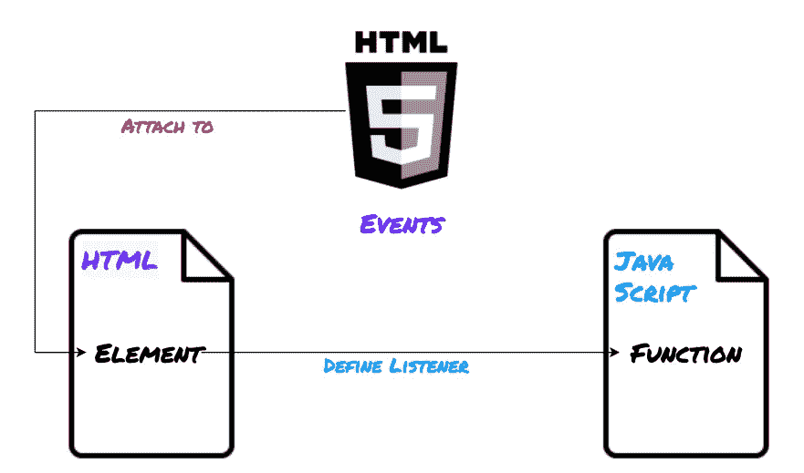

Illustration Made by [Author](http://www.arnoldcode.com) ❤

事件使您的网站发展成为一个互动和有趣的应用程序。

处理代码中(HTML)元素的事件可以实现网页的灵活设计。因此，事件和处理程序也可以在运行时进行调整。有一个很好的理由说明为什么它们是 web 开发中最常用的 JavaScript 结构。

他们允许你通过 ***倾听*** 页面上的事件，比如当用户点击`button`、按下`key`或者当一个元素`loads`时，给 HTML 元素添加交互功能。

## 事件/侦听器概述和方案

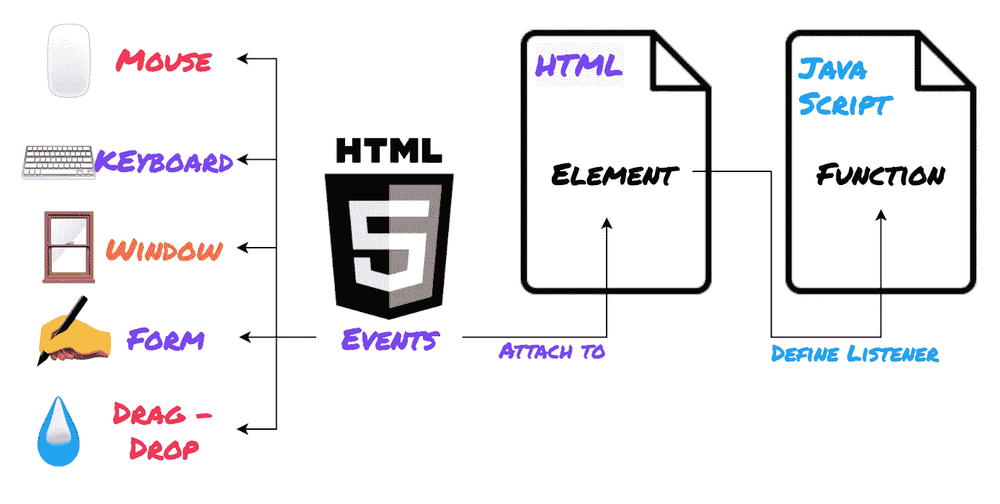

Fig. 1: Schema of Events in HTML & JavaScript

*选择事件类型，附加到一个元素并定义一个监听器。*

这是对 web 用户界面上发生的 JavaScript 事件做出反应的一般方案。您选择一个或多个要绑定的事件类型(图 1*左 5*)，并将其附加到您应该对其做出反应的 HTML 元素中。

对于这个元素，您必须定义一个在特定事件(您已经选择并附加)被触发时调用的函数。该功能是处理功能。

*仅此而已:*

1.  选择事件类型(1 或多个)
2.  附加到 HTML 元素(1 个或多个)
3.  定义处理函数(侦听器)

> 提示:还有一些其他事件，如杂项事件、媒体事件和剪贴板事件。[对于你，好奇的读者](https://www.w3schools.com/tags/ref_eventattributes.asp)。

# 1.直接在 HTML 中的 DOM 事件

## [Onclick](https://developer.mozilla.org/en-US/docs/Web/API/GlobalEventHandlers/onclick)—直接在 HTML 中处理

OnClick 是最常用和最基本的一个。

没有一个网站没有可点击的元素。每当你在任何地方导航时，鼠标点击是一种常见的方式。因此，关于这个事件的知识是任何 web 开发人员的基本要求。

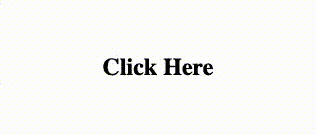

您可以看到鼠标点击是如何通过`<h2>` 元素的`onclick`属性链接的。处理函数不是 JavaScript 函数，但是它通过内嵌的值赋值直接连接到元素本身，并操纵 innerHTML。

## [Onclick](https://developer.mozilla.org/en-US/docs/Web/API/GlobalEventHandlers/onclick)—JavaScript 中的处理程序

JavaScript 函数是实现相同结果的更好方法。

而不是让多个元素拥有自己单独的内联侦听器。您将属性`onclick`重新路由到一个函数调用，以决定应该发生什么。您可以通过传递 HTML 元素本身并以`this`作为参数来创建一个`1:n`关系。将多个元素绑定到单个处理函数允许代码重用。

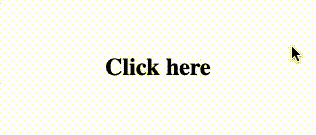

正如您所看到的，该函数改变了内部 HTML。更进一步意味着您可以使用多个元素，并使这个处理函数更加通用。

**同样的程序也适用于按钮。**

## [加载](https://developer.mozilla.org/en-US/docs/Web/API/GlobalEventHandlers/onload) —事件

打开一个网站意味着触发 *onload* 事件。

如果用户浏览网站，就会触发该事件。对你初始化一个网页和特定的程序，例如，cookies 是必不可少的。每个应用程序都需要以某种方式进行初始化，这是您的 web 应用程序的方式。

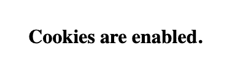

`checkCookies`函数使用[导航器对象](https://developer.mozilla.org/de/docs/Web/API/Navigator)并查询其`cookiesEnabled`属性。该函数直接链接到 *onload* 事件，并从那里被调用。检查后，指定的文本显示在 HTML 元素`<h1>`中，并因此显示在网页中。

该示例显示了只执行一次的代码，任何程序都需要这样的例程。

## [空载](https://developer.mozilla.org/en-US/docs/Web/API/WindowEventHandlers/onunload) —事件

这与 *onload* 事件相反。

一旦用户离开他当前所在的网站，它就会被触发。它可以用来为用户保存一些设置，例如，如果你开发一个浏览器游戏，将一些东西保存到数据库中，这样一旦用户返回，就发送一个欢迎回来的弹出窗口或类似的东西。

## [Onchange](https://developer.mozilla.org/en-US/docs/Web/API/GlobalEventHandlers/onchange) —事件

用户在`input`字段中输入一些东西，你的程序应该做出反应。

例如，如果用户在搜索栏中输入一些内容。然后，您可以侦听该事件，并在用户完成键入时交互地做出反应并显示结果。通常，该事件用于自动验证输入。

在该示例中，文本被输入到输入字段中。例如，一旦退出输入字段，通过按 Tab 键，输入的小写文本会自动转换为大写。

为此，在触发 *onchange* 事件后，调用链接的`upperCase`函数。输入被查询，其字段的内容。然后在函数中读取并存储在变量`input`中。

然后方法`toUpperCase`被调用，它将字符串转换成大写。最后，它被分配回`input.value`。

这样，就有可能直接对网页上的许多变化做出反应。

## [Onkeydown](https://developer.mozilla.org/en-US/docs/Web/API/GlobalEventHandlers/onkeydown) —事件

当用户仍在键入时验证用户输入。

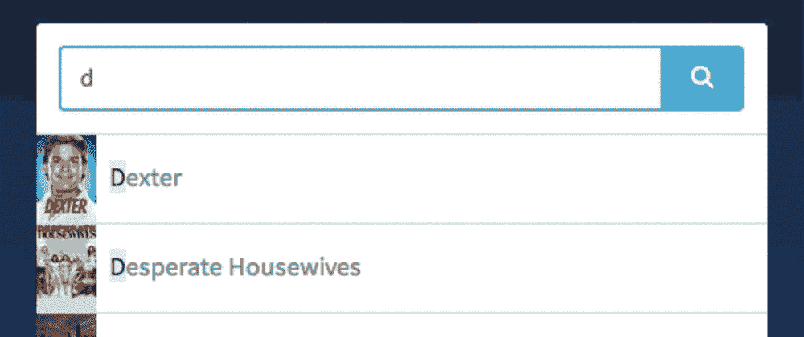

Picture by [Kushal sharma](https://dev.to/sharmakushal) via [dev.to](https://dev.to/sharmakushal/make-autocomplete-input-box-in-pure-javascript-3p3h)

著名的搜索引擎经常在你打字的时候用它们给你建议一个词。在构建这样的应用程序时很有帮助。

在这个例子中，我将再次使用`upperCase`函数，但是当我还在打字的时候，字母会马上被转换成大写。

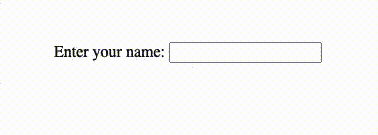

# 2.鼠标事件

## [Onmousedown](https://developer.mozilla.org/en-US/docs/Web/API/GlobalEventHandlers/onmousedown) —跟踪鼠标点击

你只需要一个按钮就可以浏览整个网页:鼠标按钮。

因此，在您的应用程序中引入这部分功能是提供功能性应用程序的关键任务。跟踪鼠标按钮是通过 *onmousedown* 事件完成的。

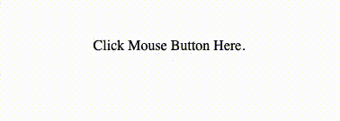

当我点击元素`
`时，触发 *onmousedown* 事件，调用处理函数`mDown()`。

在里面，我抓取了`obj`的参数(在通过带有`this`的事件之前)，它将背景颜色更改为冷蓝色。

## 跟踪鼠标点击

鼠标按下事件并不是唯一重要的事件。

此外，获取 *onmouseup* 也是至关重要的，例如，如果用户将一个可拖动的元素放在屏幕上的某个地方。您将使用此事件来触发拖动库，以验证这是一个可以拖放的元素。这个事件也是任何 web 开发人员的基本技能。

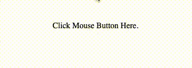

因为我想保持例子简单，所以我为`
`元素做了一个 toggler。如果在这个元素上按下鼠标按钮，与之前相同的颜色将填充背景。一旦我放开鼠标按钮，颜色就会变成绿色。

仔细看:我在同一个 HTML 元素上附加了两个不同的事件监听器。

## [Onmouseover](https://developer.mozilla.org/en-US/docs/Web/API/GlobalEventHandlers/onmouseover) —追踪鼠标移动

跟踪鼠标在网页中的移动是非常重要的。

它通常用于在鼠标指针位于特定 HTML 元素上时触发一个动作。为此，可以查询或使用*鼠标悬停*上的事件。工具提示、聚焦放大功能以及更多功能都是用这个事件编码的。

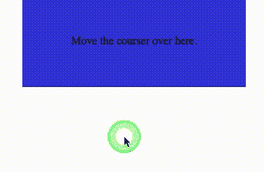

该示例显示，当鼠标移动到元素上时，该事件会自动触发并改变元素的颜色。状态会是一样的，即使你把鼠标移开。

## [Onmouseout](https://developer.mozilla.org/en-US/docs/Web/API/GlobalEventHandlers/onmouseout) —跟踪鼠标移动

这与 *onmouseover* 事件相反。

每当光标离开元素时，就会触发监听功能。这对于你取消工具提示、聚焦放大等功能非常有用。任何鼠标悬停都应该有一个 *mouseout* 对应项。

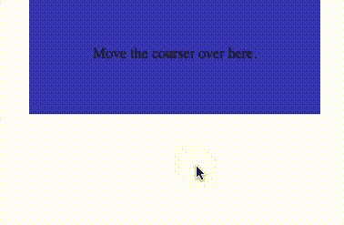

该示例显示了将两个事件( *onmouseover* ， *onmouseout* )绑定到单个对象。这样做是为了在鼠标进入和离开时产生不同的结果。

仅当鼠标停留在该元素上时，才使用这两种方法对该对象进行更改。

# 3.最佳实践—添加和删除— EventListener()

## [AddEventListener()](https://developer.mozilla.org/en-US/docs/Web/API/EventTarget/addEventListener)

通过 HTML 属性绑定元素是好的，但是不好的做法。

为了便于维护，您希望在同一个地方添加所有的事件侦听器。将所有的事件监听器放在一个地方，在那里你可以保证所有你可能想要绑定事件处理程序的元素都可用。绑定事件处理程序最常见的地方是在`DOMReady`事件触发`$(document).ready()`之后。

示例中的实现相对简单。不是直接使用按钮元素的事件属性(`onclick="handler"`)，而是通过 id 查询元素并附加处理程序。这是通过`addEventListener`方法完成的。

向该方法传递了两个参数:

1.  要监视执行的事件的名称，在本例中为`"click"`，
2.  事件触发后应该执行的函数的名称，本例中为`dateDisplay`。

理论上，在一个事件之后可以处理几个函数。使用方法`addEventListener`，几个函数可以分配给一个元素(这适用于所有 DOM 元素)。

## [RemoveEventListener()](https://developer.mozilla.org/en-US/docs/Web/API/EventTarget/removeEventListener)

如果要在运行时删除 EventListener，将使用 removeEventListener 方法。传入事件的类型和处理方法的名称来删除特定的事件监听器(`"click"` & `showDate`)

# 结论

**使用所示技术对用户行为做出反应**。最好通过 JavaScript 而不是 HTML 属性添加侦听器，因为您希望所有事件侦听器都在同一个位置。出于维护的考虑。

**绑定**事件处理程序最常见的地方是在`DOMReady`事件触发`$(document).ready()`之后。

# 外卖食品

*   事件和监听器对于任何 web 开发人员来说都是至关重要的知识
*   用它们来构建一个**令人兴奋的网络应用**
*   **从事件池中附加一个或多个事件**(*鼠标、键盘、窗口、表单、拖放&*)
*   **分配**处理程序**内联** (HTML) **或**附加 **JavaScript 函数**作为处理程序
*   使用 HTML 属性来定义处理程序是**不好的做法**
*   **学会**使用`**addEventListener**` & `**removeEventListener**`
*   把你的`**addEventListener**` & `**removeEventListener**`逻辑收集在一个地方，或者至少在负责 UI 部分的文件中

*想拥有* ***每周一期的开发者见解*** *如何能让******每日一期？*** *达到* ***时间控制*******关注*** *关注* ***重要性*******成功吗？*** *但是你* ***不要*** *要* *要* ***等到*******下周的*** *迅？**[*订阅领取你的* ***第一张*** *列表* ***第五张*** ***见解&技法*** *和应用* ******](http://eepurl.com/hMhFHL)******

***获取 26 个备忘单，只研究你真正需要的东西，以获得你的第一份网络开发工作！***

******

***[Arnold Code Academy 26 Web Developer Cheatsheets](https://arnoldcodeacademy.ck.page/26-web-dev-cheat-sheets)***

****更多内容请看*[***plain English . io***](http://plainenglish.io/)***