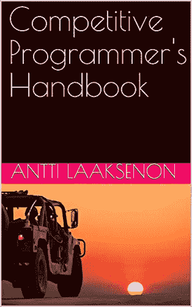
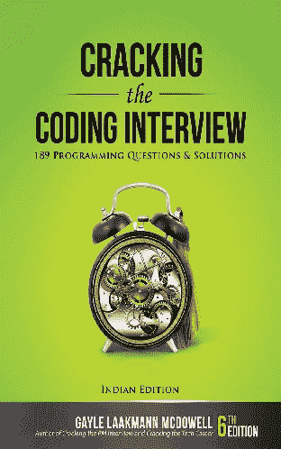
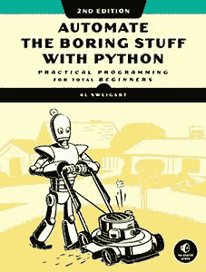

# 每个程序员都应该读的 3 本书

> 原文：<https://javascript.plainenglish.io/3-books-every-programmer-should-read-97ac12422cfb?source=collection_archive---------0----------------------->

## 帮助我理解编程基础的书籍。

Photo by [Emile Perron](https://unsplash.com/@emilep?utm_source=medium&utm_medium=referral) on [Unsplash](https://unsplash.com?utm_source=medium&utm_medium=referral)

最近，我在清理我的书架，我找到了我的旧书，这些书对我的编程很有帮助。

我完全理解程序员总爱动手编程胜过看书的事实。但有时书籍真的能帮助你获得新的可能性，并理解你一直以来缺少的元素。

我知道市场上有很多有**编程**标签的书，非常有利于激励自己成为一名程序员，就像**史蒂夫·乔布斯的书一样。**但我不会列出纪实类书籍；相反，我会推荐那些实际上包含有用算法的书籍，这些算法是你以前从来不知道的。

 [## 零投资起步的 3 个商业理念

### #开始旁敲侧击

javascript.plainenglish.io](/3-business-ideas-to-start-with-zero-investment-e5cf3629fe09) 

**这些书我已经读了两遍甚至三遍，我希望你至少试一试。书单如下—**

## 1.竞争性程序员手册— Antti Laaksenon

Image Supplied by the [Author](http://aniketz.medium.com)

 [## 你应该考虑在 2022 年获得的三大 IT 认证

### 真正值得的软件开发人员最佳证书。

javascript.plainenglish.io](/top-3-it-certifications-you-should-consider-getting-in-2022-be852376b083) 

这无疑是我迄今为止读过的最好的书。这本书包含程序员解决高级编程概念所需的大量算法。如果你正在准备像 [**Google Code Jam**](https://codingcompetitions.withgoogle.com/codejam) 或者 [**Facebook 黑客杯**](https://www.facebook.com/codingcompetitions/hacker-cup/) **这样的大赛，这是一本必读书。**

这本书最棒的部分是，它是官方合法免费提供的 [**PDF 格式**](https://github.com/pllk/cphb/) 或者你甚至可以在不同的平台上购买，如 **Kindle** 。

这本书是用简单的英语写的，所有的算法都用 C++语言表达。但是我们注意到，算法是以这样一种方式编写的，无论你是否懂 C++都可以很容易地理解它们。你甚至可以用你喜欢的编程语言来练习所有的算法。

主要地，这本书的主题是关于你在参加编程竞赛或试图用最优解编写高效代码时可以使用的所有快捷方式。如果你喜欢竞争性编程，那么这本书是必读的，我相信你会爱上它的内容。

 [## 每个程序员都应该关注的 3 个 YouTube 频道

### 我推荐您观看节目内容的最佳 YouTube 频道

javascript.plainenglish.io](/3-youtube-channels-every-programmer-should-follow-66952f1f24e4) 

## 2.破解编码采访——盖尔·拉克曼·麦克道尔

Image Supplied by the [Author](http://aniketz.medium.com)

 [## 如何在不支付任何费用的情况下列出您的第一个 NFT

### 销售 NFT 的初学者指南。

javascript.plainenglish.io](/how-to-list-your-first-nft-without-paying-any-charges-53ead5ee039d) 

由于许多开发人员会进行数百次面试来获得他们的完美工作，所以对于一个完全是新人或经验较少的人来说，面试的主要内容都围绕着同一个主题。

如果你在下个月安排了面试，破解编码面试是最好的书。这本书主要关注关于**数据结构和算法问题的最佳答案。**

如果你的面试官需要一个关于数据结构或时间复杂性的最佳答案，这本书包含了给你留下深刻印象所需的所有提示和技巧。我认为你应该至少读一遍这本书，不管你是否会参加面试。

这本书将让你深入了解如何在不同的条件下为一个给定的问题构建一个解决方案。我对这本书的最后想法是，无论你是否要参加技术面试，你都应该至少读一遍。这本书在所有领先的图书销售平台上都有售。

 [## 绝对初学者的 Python 基础教程

### 用最简单的方式解释了 Python 的基础知识。

python .平原英语. io](https://python.plainenglish.io/fundamental-python-tutorial-for-absolute-beginners-2d848e66850d) 

## 3.用 Python 自动化枯燥的东西— Al Sweigart

Image provided under [cc license](https://creativecommons.org/licenses/by-nc-sa/3.0/) by the [publisher](https://automatetheboringstuff.com/)

几周前，我写了一篇关于 [**Python**](https://blog.devgenius.io/how-i-went-from-noob-to-expert-in-python-programming-8c4e141a0be1) **的文章。我解释了我是如何练习 Python 的，以及你可以使用哪些资源来学习所有的 Python 函数。**

对于那些刚刚开始学习 Python 的人来说,是一本有趣的书。这本书的主题主要围绕 Python 中我们可以有效使用的所有主要内置函数。你还会看到书中提到的新的有用的库。

目前，你可以在这本书的 [**官方出版页面**](https://automatetheboringstuff.com/) 上完全免费阅读这本书，也可以在所有领先的图书平台上购买。

我向所有对学习 Python 感兴趣并且有一些有趣活动的人推荐这本书，比如有效地调试或者使用 Python 库组织文件。

 [## 编程前我优先考虑的 3 条黄金法则

### 即使有困难，我如何处理编程生活方式。

javascript.plainenglish.io](/3-golden-rules-i-prioritize-before-programming-d7286beb566b) 

我希望你会喜欢阅读我提到的这些编程书籍。祝您的编程之旅好运，并继续编程。

[**如果你想购买 Medium 会员来阅读 Medium 上的所有文章，点击这里……**](https://aniketz.medium.com/membership)(它会直接支持我，给我一部分你的订阅)

 [## 通过我的推荐链接加入 Medium-Aniket

### 作为一个媒体会员，你的会员费的一部分会给你阅读的作家，你可以完全接触到每一个故事…

aniketz.medium.com](https://aniketz.medium.com/membership)  [## 2022 年的技术趋势

### 2022 年需要的技能。

javascript.plainenglish.io](/technologies-that-will-trend-in-2022-122d2dcf5ca3)  [## 3 个代码编辑器，我已经用了 3 年了

### 轻便快速的代码编辑器比一些笨重的编辑器更好。

javascript.plainenglish.io](/3-code-editors-i-have-been-using-for-the-past-3-years-33abb5b88c5a) 

*更多内容尽在*[***plain English . io***](http://plainenglish.io/)