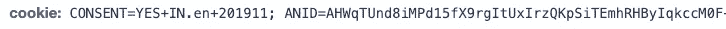
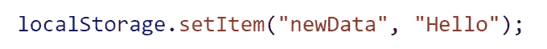
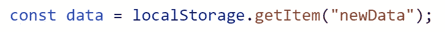
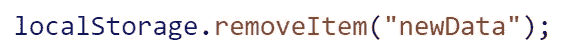
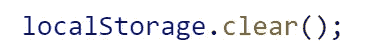
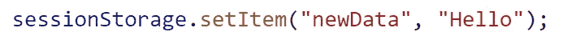
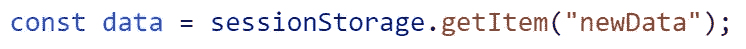
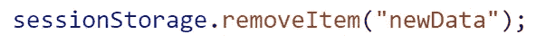
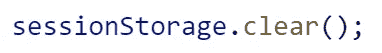
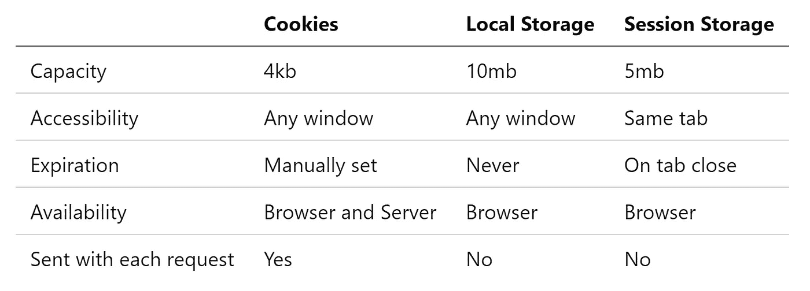

# 您应该知道的 3 种 JavaScript 客户端数据存储技术

> 原文：<https://javascript.plainenglish.io/3-client-side-data-storage-techniques-in-javascript-that-you-should-know-46f96dd7876c?source=collection_archive---------9----------------------->

## JavaScript 中的 Cookies、本地存储和会话存储


Photo by [Christina Branco](https://unsplash.com/@starvingartistfoodphotography?utm_source=medium&utm_medium=referral) on [Unsplash](https://unsplash.com?utm_source=medium&utm_medium=referral)

网站在浏览器上存储用户和基于会话的信息有不同的方式。该数据通常包含偏好、游戏分数、定制等。

在本文中，我们将看到网站在浏览器上存储信息的三种方式。

# 饼干

cookie 是存储在客户端用户机器上的一小段信息，特定于您访问的每个不同站点的用户。这些信息在客户端和服务器端都可以访问。

> 存储在 cookies 中的信息通常由服务器设置，并随每个后续请求一起发送。

这些信息也可以根据需要在客户端设置。当你在浏览器上访问任何网站时，你可以看到服务器使用 **set-cookie** 响应头为你设置了 cookie。


Response header for the user request (Screenshot by author)

对于所有连续的请求，使用 **cookie** 请求头发送相同的信息。



Request header for the user request (Screenshot by author)

存储 cookies 的主要原因是为了交付为特定用户定制的页面。由于服务器可以访问 cookies，因此该信息用于授权用户对服务器的连续请求。它们还用于维护与用户相关的信息，如他们的偏好、定制(主题)、购物车、游戏分数等。所有这些信息都会在特定用户下次访问网站时保留下来。

为每个站点的每个用户存储的所有这些信息被用来为最终用户提供更好的用户体验。

## cookie 的结构和属性

cookie 是由键值对形式的信息组成的字符串。一个 cookie 中可以存储的数据容量是 4kB。

与特定 cookie 相关联的每个属性都被添加到以分号分隔的字符串中。您可以与 cookie 关联的一些属性是该 cookie 的到期日期，并且您可以使 cookie 在您的网站上的特定路径下可用。

您可以在客户端设置一个 cookie，如下所示。

```
document.cookie = “username=Nehal; expires=Thu, 29 Aug 2021 12:00:00 UTC; path=/”;
```

您可以使用 document.cookie 属性读取所有可用的 cookie。

您也可以通过为同一个键分配不同的值来更改 cookie，使其与设置时相同。

```
document.cookie = “username=Nehal Khan; expires=Thu, 29 Aug 2021 12:00:00 UTC; path=/”;
```

您可以通过将过期时间设置为过去的某个时间来删除特定的 cookie。

```
document.cookie = “username=Nehal Khan; expires=Thu, 29 Aug 2020 12:00:00 UTC; path=/”;
```

当 HTML 5 问世时，它带来了两种在客户端存储用户特定信息的新方法。它们是本地存储和会话存储。在那之前，只有 cookies 被用来在客户端存储任何需要的信息。

# 局部存储器

保存在本地存储器中的数据将可用于该特定网站的所有后续浏览器会话。

存储在本地存储器中的数据是特定于协议的。这意味着为通过 HTTP 访问的站点(例如，[http://samplesite.com](http://mysite.com))存储的数据与为通过 HTTPS 协议访问的同一站点(例如，[https://samplesite.com](https://mysite.com))存储的数据存储在不同的本地存储实例中。

存储在本地存储中的数据没有到期时间，除非它被页面中的任何脚本清除，或者用户愿意清除它。

> 一旦用户关闭该标签，在私人/匿名窗口中打开的任何站点的存储在本地存储器中的数据就会被清除。

## 本地存储的结构和属性

使用 UTF-16 格式将数据存储为字符串格式的键值对。如果任何一个键是数字，它们就被转换成字符串。

您可以向 localStorage 添加一些新数据，如下所示



Image by author

您可以在 localStorage 中看到新添加的数据，如图所示



Image by author

您可以将添加的项目删除到 localStorage，如下所示



Image by author

您可以清除本地存储中存储的所有数据，如下所示



Image by author

# 会话存储

与 localStorage 不同，保存在会话存储中的数据仅可用于页面的该会话。

存储在会话存储器中的数据也是特定于协议的。这意味着为通过 HTTP 访问的站点(例如，【http://samplesite.com】)存储的数据与为通过 HTTPS 协议访问的同一站点(例如，[【https://samplesite.com】](https://mysite.com))存储的数据存储在不同的会话存储实例中。

标签或浏览器窗口一关闭，存储在会话存储器中的数据就会被清除。当页面被加载到浏览器的选项卡中时，会为其创建一个唯一的会话。它仅对该选项卡有效。

会话存储在特定网站的页面重新加载和恢复后仍然存在。

> 在浏览器中创建复制选项卡时，原始选项卡的会话存储中的数据也会复制到复制的选项卡中。

## 会话存储的结构和属性

使用 UTF-16 格式将数据存储为字符串格式的键值对。如果任何一个键是数字，它们就被转换成字符串。

**您可以向 sessionStorage 添加一些新数据，如图所示**



Image by author

**您可以在 sessionStorage 中看到添加的数据，如图**



Image by author

**您可以删除添加到 sessionStorage 的项目，如图**



Image by author

**您可以清除存储在 sessionStorage 中的所有数据，如图**



Image by author

## 本地存储和会话存储之间的差异

主要区别在于，存储在 localStorage 中的数据不会过期，但是存储在 sessionStorage 中的数据会在会话结束时过期。

但是您仍然可以使用`localStorage.clear()`从脚本中删除本地存储中的数据，或者从浏览器的开发工具中手动删除。

# 结论

这是用户或基于会话的信息在客户端存储在浏览器中的 3 种不同方式，您所访问的网站可以将它们用于不同的目的。

下面是这三种方式的区别的简要总结。



Differences between the three types (Image by author)

# 资源

*   [MDN 网络文档](https://developer.mozilla.org/en-US/docs/Web/API/Document/cookie)中的 Cookie
*   本地存储在 [MDN 网络文档](https://developer.mozilla.org/en-US/docs/Web/API/Window/localStorage)
*   [MDN 网络文档](https://developer.mozilla.org/en-US/docs/Web/API/Window/sessionStorage)中的会话存储

感谢️reading 和快乐学习！

*更多内容请看*[***plain English . io***](http://plainenglish.io/)