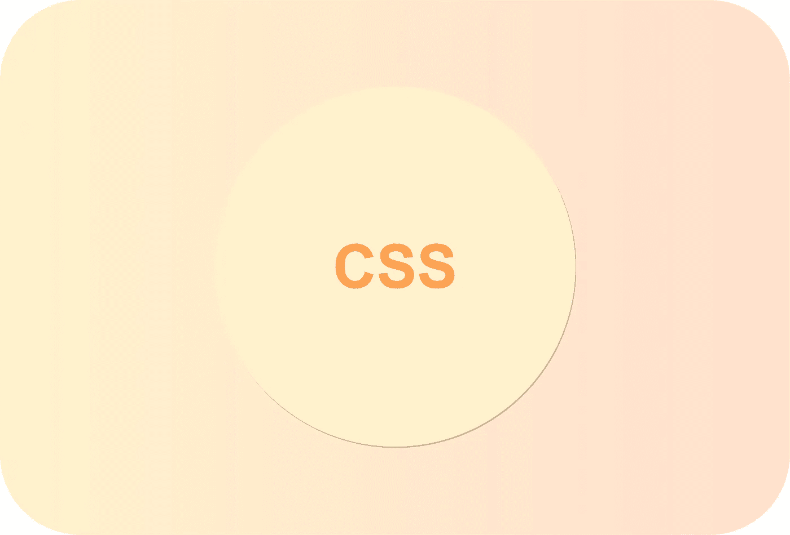
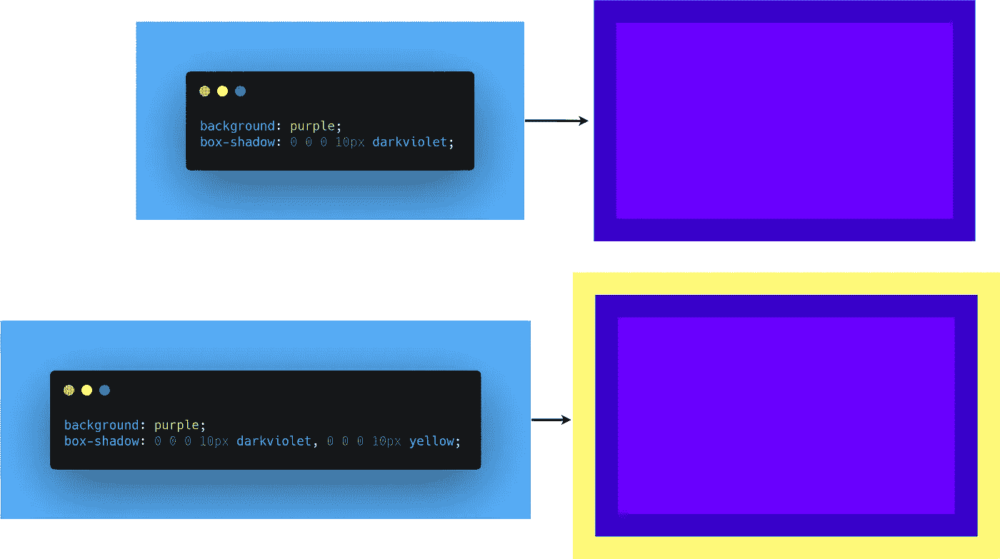
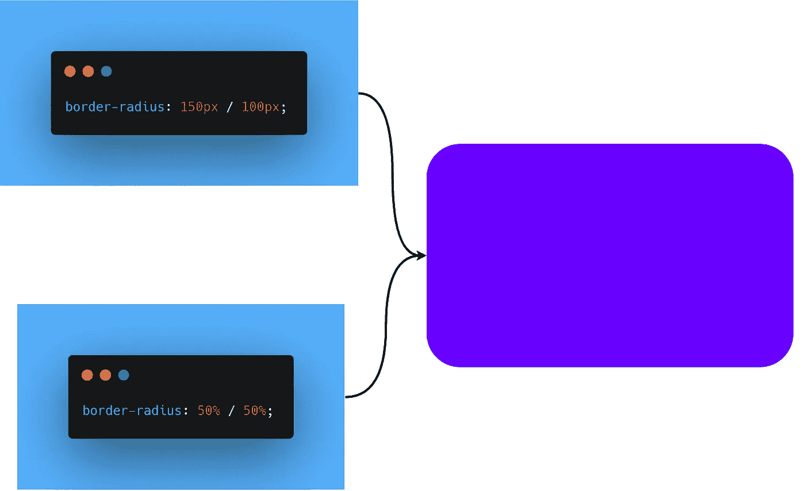
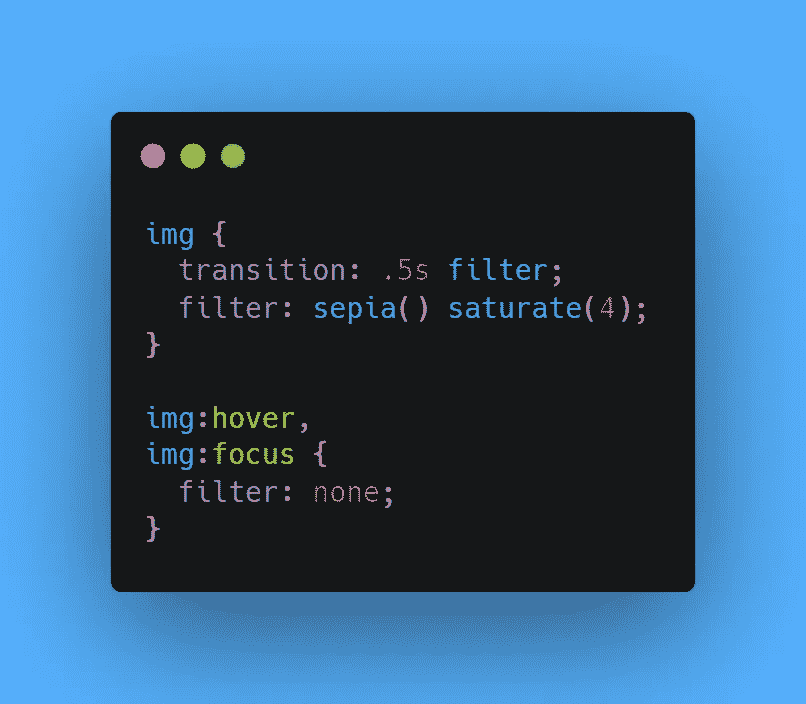

# 作为前端开发人员，你应该知道的 3 个 CSS 特性

> 原文：<https://javascript.plainenglish.io/3-css-features-you-should-know-as-frontend-developer-f1b5536bf179?source=collection_archive---------3----------------------->

## 了解 CSS 鲜为人知的特性

## 1.多重边框

有时候，我们希望用不同的边框和多个边框来设计容器的样式。但是当涉及到在 CSS 中应用多个边框时，开发人员通常会有太多无用的额外元素。

据我所知，有两个很好的解决方案可以在不污染标记代码的情况下应用多个边框。

*   **框-阴影解决方案:**你必须使用*框-阴影*属性来创建阴影。然而，有一个参数叫做**扩散半径**(第四个参数)，它可以根据我们指定的量来放大或缩小阴影。并且一个 ***正*** 扩散半径结合零偏移和零模糊创建一个 ***阴影*** ，看起来完全像一个实心边框。

> ***注意:*******之所以是应用多边框的好选项，是因为我们可以通过在同一个****box-shadow****属性中添加边框来简单地添加更多边框。****

******例如；******

******

*   *****轮廓解决方案:**如果我们只需要两个边框，使用一个带有 ***轮廓*** 属性的普通边框，就可以了。这种方法为我们提供了更多的灵活性，因为我们可以定制我们的边框样式(**我们可以使用虚线边框作为第二个边框)**。同样，我们可以通过**轮廓偏移**属性控制它们与元素边界的距离。***

## ***2.柔性椭圆***

***在将**边界半径**应用到一个具有大边界半径的方形元素时，你必须面对这个问题，它可以变成一个圆。我个人多次面临这个问题，这里有一个快速的解决方案。***

*   *****斜线:**一个鲜为人知的事实是**边界半径**接受不同的水平和垂直半径&如果你使用斜线将两者分开，那么它允许我们在拐角处创建椭圆圆角。***
*   *****Percentage:** 即使我们可以使用 **px** 和其他 **CSS** 单位来定义我们的边框半径属性，它也接受 Percentage，这解决了我们计算在属性中输入多少像素的问题。***

******例如，*** 如果我们有一个尺寸为 **300px X 200px** 的元素，我们可以很容易地将它变成一个半径等于其宽度和高度一半的椭圆。***

******

## ***3.色彩着色***

***一个非常著名的效果，给一组照片一个视觉上的统一，这些效果被静态地应用，并在 ***悬停*** 或一些其他交互时移除。大多数时候，开发人员创建两个不同版本的图像，并使用一些简单的 CSS 来交换它们。不推荐这种方法，因为它增加了更多的*膨胀*和额外的 **HTTP** 请求。***

***使用 CSS，我们可以通过几行代码轻松实现这一效果。***

*   *****使用滤镜:**你只需将**滤镜**属性应用到你的图像上，选择你想要的饱和度。***
*   ***例如，我们可以使用**棕褐色()滤镜**给图像去饱和**橙黄色**色调，并使用 **saturate()** 滤镜更改饱和度以增加每个像素的饱和度。最后，无论用户在何处启动悬停交互，我们都可以应用 CSS 转换来获得最终结果。***

********* [## 在 Web 应用程序中设计表单的 5 个 UI/UX 技巧

### 构建易于使用的表单

javascript.plainenglish.io](/5-ui-ux-tips-to-design-forms-in-web-applications-68896512a46c)  [## 作为开发人员，您应该知道的 11 个 VS 代码特性和技巧

### 对 VS 代码更加自信

javascript.plainenglish.io](/11-vs-code-features-tricks-you-should-know-as-a-developer-47e5ec0c362b)  [## 作为前端开发人员，你应该知道的 8 个 UX 原则

### 用这 8 个技巧构建吸引人的前端应用程序

javascript.plainenglish.io](/8-ux-principles-you-should-know-as-a-frontend-developer-9416a24294d2) 

*更多内容请看*[***plain English . io***](http://plainenglish.io)***