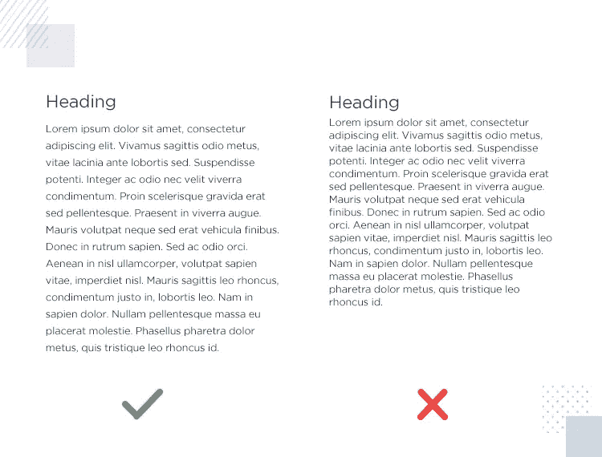

# 每个前端开发人员需要知道的 3 个设计概念

> 原文：<https://javascript.plainenglish.io/3-design-concepts-every-front-end-developer-needs-to-know-fccb072e675c?source=collection_archive---------12----------------------->

## 面向每个前端开发人员的设计理念。

Photo by [Faizur Rehman](https://unsplash.com/@fazurrehman?utm_source=medium&utm_medium=referral) on [Unsplash](https://unsplash.com?utm_source=medium&utm_medium=referral)

想出一个伟大的设计灵感是设计师最重要的技能之一。

前端开发人员和设计师一样，需要了解一些设计的底层原理。这对前端开发人员来说至关重要，因为他们的大部分工作是与设计师合作，带来完美的用户体验。

对任何前端开发人员来说，理解这些设计原则都是有利的。

在本文中，我们将探讨开发人员需要了解的各种设计概念。

## **空白。**

空白的使用对于设计和开发来说是必不可少的。空白确保满足两个条件:可读性和合格性。

根据 webdesign.tutsplus.com 的说法，可读性指的是文字和字块在页面上的排列方式。易读性是指字体是如何设计的，以及一个字符与另一个字符的区分程度。

可读性确保读者可以轻松地访问和阅读网页内容。

留白对于使内容清晰也很重要。

看看下面的例子，比较一下可读性。

image from author

**空白的重要性**

*   提高读者的注意力
*   增加读者的互动率
*   提高读者的注意力

空白的类比和概念在设计和开发中都很有吸引力。这对于改善用户体验也至关重要。

要阅读更多关于空白的内容，请阅读下面的文章

 [## 空白的力量

### 我们想向你展示一个如此重要的工具，它可能会让作为设计师的你大吃一惊。它就像音乐剧之间的沉默一样被低估了…

www.interaction-design.org](https://www.interaction-design.org/literature/article/the-power-of-white-space) 

## **颜色和字体。**

在应用程序开发过程中，想出完美的颜色和字体总是一件难事。恰当地使用颜色和字体是一个重大的突破，会让你的应用脱颖而出。

同样，优秀网站开发的最佳实践之一是字体颜色和字体。这是每一个好设计的基础。

**关键外卖**

*   避免使用过度着色的文字
*   根据你的网站定位选择你的字体和颜色，也就是说，当开发一个教学指南网站时，建议使用可读性强的文本。
*   使用简单明了的文本颜色
*   限制彩色阴影的使用

## **图片**

图像在设计中起着重要的作用。恰当地使用图片对你的网站至关重要。

恰当地使用图片可以抓住用户的注意力，让他们迅速参与进来。图像在向你的用户传达想法时也是强大的，甚至不需要直接使用文字。

根据 Trew-marketing 的说法，图像 SEO(搜索引擎优化)做得好可以提高你的搜索引擎排名，并吸引新的有机访问你的网站。

恰当地使用图片可以增加网站的吸引力，并提高用户保持率。清楚的了解图片的正确使用，是每一个开发人员都要了解和掌握的必备技能。

**关键外卖**

*   使用有意义的图像
*   使用高质量和优化的图像
*   为搜索引擎优化优化图像
*   优化图像以提高性能

要获得更精致的外观和使用图像的方法，请查看下面的文章。

 [## 如何在你的网站上使用图片，应该避免什么

### 很多人都是这样想的——网站上有图片就好。他们让网站看起来不错，填补了空白…

uxplanet.org](https://uxplanet.org/how-to-use-images-on-your-website-and-what-to-avoid-47a9d11c0b46) 

有许多设计概念和原则，本文只涉及一些设计实践。

**出发前**

感谢您阅读本文到目前为止；如果你觉得它有帮助，请在评论区告诉我，不要犹豫分享。

**更多阅读:**

 [## 如何保持编码梦想的活力

### 作为开发人员保持专注。

javascript.plainenglish.io](/how-to-keep-the-coding-dream-alive-eefc6d84e987)  [## 如何用 Markdown 写作:指南

### Markdown 是一种具有纯文本格式语法的轻量级标记语言，由 John Gruber 和 Aaron 于 2004 年创建

javascript.plainenglish.io](/how-to-write-with-markdown-a-guide-2862ddff4688) 

*更多内容请看*[*plain English . io*](http://plainenglish.io/)