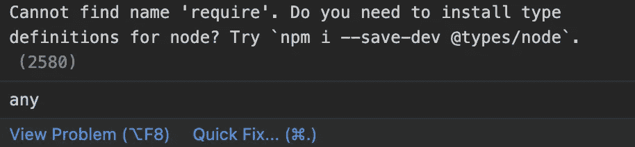
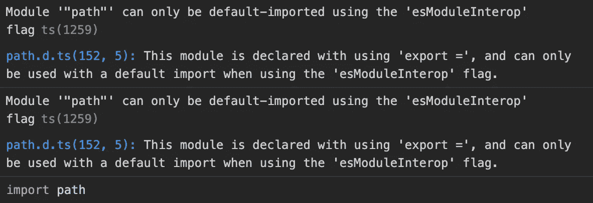

# 在 TypeScript 中导入模块的 3 种不同方式

> 原文：<https://javascript.plainenglish.io/3-different-ways-to-import-modules-in-typescript-7cd02d8e0da3?source=collection_archive---------8----------------------->

## 探索在 TypeScript 中导入模块的不同方法。

Photo by [Jexo](https://unsplash.com/@jexo?utm_source=unsplash&utm_medium=referral&utm_content=creditCopyText) on [Unsplash](https://unsplash.com/s/photos/javascript?utm_source=unsplash&utm_medium=referral&utm_content=creditCopyText)

最近，我一直在通过创建几个应用程序来学习 [TypeScript](https://www.typescriptlang.org/) (一种基于 JavaScript 的开源语言)。

 [## GitHub - weikangchia/gitcg:使用 Milestone 为 GitLab 和 GitHub 定制的变更日志生成器

### gitcg 是一个使用 milestone 为 GitLab 和 GitHub 定制的 changelog 生成器。获取个人令牌(范围…

github.com](https://github.com/weikangchia/gitcg)  [## GitHub-weikangchia/op-Converter:open API 3.0 到 Postman 2.1 的可定制转换器…

### op-converter 是一个用于 OpenAPI 3.0 到 Postman 2.1 集合的可定制转换器。用法:op 转换器选项:- f…

github.com](https://github.com/weikangchia/op-converter) 

我需要学习的一件事是如何导入模块，这似乎有多种方法。在本文中，我将分享导入[路径](https://nodejs.org/api/path.html)模块的不同方法。

# 1.使用 const … require …

如果我们使用这种方法来导入模块而不安装`@types/node`包，我们将会收到 TypeScript 的投诉，因为它不知道`require`是什么。

Screenshot of the complaint

在我们安装了`@types/node`软件包后，投诉就会消失。

# 2.使用导入…需要…

# 3.使用从…导入…

如果我们使用这种方法，如果我们不将`tsconfig.json`中的`esModuleInterop`选项设置为`true`，我们可能会被投诉。

Screenshot of the complaint

在我们将选项设置为 true 后，投诉将会消失。

另一种方法是，如果我们不想将`tsconfig.json`中的`esModuleInterop`选项设置为`true`，我们可以将上面的导入代码改为下面的代码。

现在我们有了。我希望你已经发现这是有用的。感谢您的阅读。如果你喜欢这篇文章，记得关注我的更多更新！

敬请关注更多文章！✌️，如果有更多的建议，请在下面留下你的评论。

如果你还不是灵媒会员，并且想成为灵媒会员，[点击这里](https://weikangchia.medium.com/membership)。

 [## 用我的推荐链接加入媒体-伟康

### 作为一个媒体会员，你的会员费的一部分会给你阅读的作家，你可以完全接触到每一个故事…

weikangchia.medium.com](https://weikangchia.medium.com/membership) 

**参考文献:**

 [## typescript 中“import x = require('x ')”和“const x = require('x ')”之间的区别

### TypeScript 中不存在 require()函数。ECMAScript 的模块系统使用导入和导出关键字。的…

stackoverflow.com](https://stackoverflow.com/questions/52534910/difference-between-import-x-requirex-and-const-x-requirex-in-typ)  [## Typescript 导入/as vs 导入/require？

### 这些基本上是等价的，但是 import *有一些限制...= require 不需要。导入* as 创建…

stackoverflow.com](https://stackoverflow.com/questions/35706164/typescript-import-as-vs-import-require) 

*更多内容看*[***plain English . io***](http://plainenglish.io/)