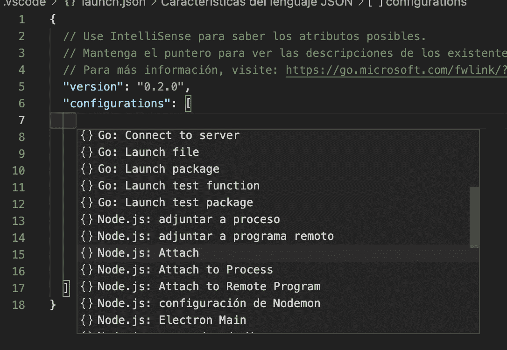

# 调试 Jest 测试的 3 种简单方法

> 原文：<https://javascript.plainenglish.io/3-easy-ways-to-debug-jest-tests-66f26b97b3af?source=collection_archive---------2----------------------->

*   [简介](#33be)
*   [1#原生节点 inspect + Chrome DevTools](#ed67)
*   [2# VSCode 脚本运行器](#8958)
*   [3# VSCode 扩展](#8856)
*   [汇总表](#e83f)
*   [额外要点:异步测试问题](#f769)

编写测试是软件开发的关键部分。更常见的是单元测试或集成测试，这些是与本文最相关的。

调试测试背后的想法是减少对“console.log”表达式的依赖，并帮助找到导致测试失败的原因。在 Javascript 世界中，由于“零编译时间”和更快的启动时间，我们倾向于编写一些“console.log ”,运行并查看输出是什么。在其他编译语言中，这个过程太慢而不实用，调试工具用得更多。我认为这是我们必须作为我们的东西，以提高我们作为开发人员的质量。

在这里，我们将看到在调试模式下运行测试的三种不同方式，从“最难”到“最容易”(对我来说)，至少从在调试模式下运行测试用例的“必须做的事情”的角度来看是这样的。第一种情况将完全独立于 IDE，另外两种将基于 [Visual Studio 代码](https://code.visualstudio.com/)。所有的选项将使用 Jest 作为测试运行程序。

**1。原生节点检查+ Chrome 开发工具**

这种方式需要首先启动命令，在“检查模式”下运行测试，然后打开 DevTools 执行代码调试。

*   运行命令(使用— inspect-brk，我们确保在第一行停止该过程，更多信息[在此处](https://nodejs.org/en/docs/guides/debugging-getting-started/))

*   这将显示类似于

*   现在我们应该打开我们的 Chrome 应用程序，并转到 URL“Chrome://inspect/# devices ”,在那里我们将看到

*   要开始调试，请按“检查”,将显示检查器屏幕

*   如果我们看不到我们的代码，我们只需按“+ Add to workspace”并选择包含我们代码的文件夹。一旦我们看到左侧的文件夹结构，我们就可以导航并打开所需的文件。我们也可以按“CMD+o”(windows 中的 CTRL + o)来按名称搜索文件
*   现在我们可以使用调试器选项(添加断点、转到下一步、单步执行等)来调试或编码

*这里重要的一点是，直到我们关闭 inspector 视图，我们的 test runner 命令才会结束，即使测试代码已经全部处理完毕。*

**2。VSCode 脚本运行器**

VSCode debugger 允许我们做一些不同的事情来调试我们的代码。这里，我们将展示如何替换 Chrome DevTools inspector，并使用 VSCode 直接在代码编辑器中调试代码。

*   第一个任务是选择侧边栏中的调试菜单

*   然后我们点击“Ejecutar y depurar”(这将是您的系统语言)，我们将看到类似这样的内容

*   我们选择 Node.js。这将在我们的目录中创建一个文件。我们的配置将存储在 vscode/launch.json 中。
*   现在我们将添加我们的“附加”配置来调试我们的测试文件。为此，在同一个调试视图中，我们将选择“Agregar 配置”(翻译成您的系统语言)

*   在列表中，我们选择“Node.js: Attach”

*   现在我们有了这样一个“launch.json”文件

*   到目前为止，我们不需要另一个配置，它是在创建文件时创建的。所以我们的文件结尾是

*   现在我们准备开始调试我们的文件。正如我们之前所做的，我们运行命令开始调试

*   然后在 VSCode 中将 de 进程附加到我们的调试器

*   现在我们可以添加断点来调试我们的进程，就像我们在 Chrome inspector 中做的一样，我们可以看到变量值，继续进程，等等。

我们这里的另一个选项是，我们可以先按“Attach ”,然后运行命令来开始测试。如果我们选择这种方法，我们:

*   必须先在代码中添加断点(以确保执行在代码中的某个点停止)
*   我们可以从命令中删除“— inspect-brk”

**3。VSCode 扩展**

调试(和运行)我们的测试用例以及单个测试文件的最简单方法是使用我们的 VSCode 的一个可用扩展。

对于这个例子，我们将使用扩展“Jest Runner”

一旦安装完毕，我们将有一个上下文菜单来运行或调试我们的测试用例。我们只需右击测试文件，就可以选择我们想要的操作

使用安装的扩展运行测试的另一种方法是使用命令工具:

*   Shift + Cmd+ p(在 windows 中为 Shift + Ctrl +p)打开命令选项板
*   写“笑话”

您唯一需要做的事情是在选择“Debug Jest”之前添加所需的断点，调试过程将在您的 VSCode 中开始，并带有所有之前看到的选项来调试我们的代码。

**汇总表**

**额外要点:“运行异步测试时出现问题”**

这个“问题”在我们之前看到的调试测试用例的所有方法中都是常见的。我们来解释一下“问题”。

对于像这样的测试用例

在调试过程中，您可以看到“之后”中的代码可以在“之前”块中的代码结束之前被调用。

这可能是因为测试超时。测试用例结束的最大时间比我们调试代码的时间要短。

要解决这个问题，我们只需增加 jest 超时。有几种方法可以增加测试超时，下面是其中的两种:

*   关于代码:`jest.setTimeout(30000);`
*   在命令上:`--testTimeout`[https://jestjs.io/docs/cli#testtimeout-number](https://jestjs.io/docs/cli#testtimeout-number)

我希望你喜欢它的内容，并开始使用更多我们有的调试工具，而不再使用旧的好工具“console.log”。

如果你有其他方法来调试你的 Jest 测试用例，请在评论中告诉我。

感谢阅读。

*更多内容尽在*[***plain English . io***](http://plainenglish.io/)