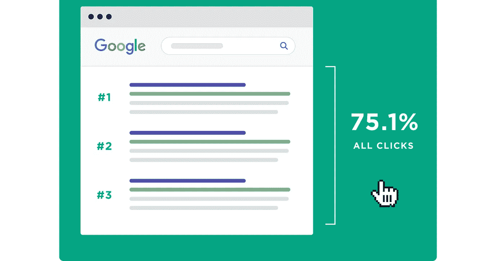
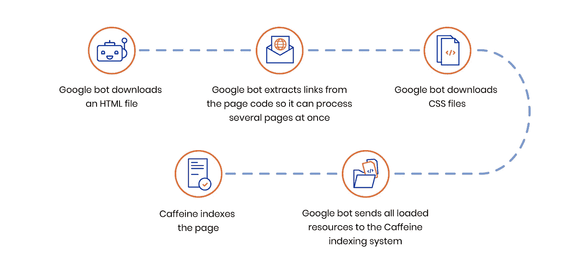
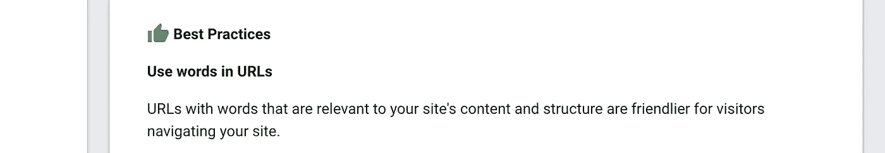
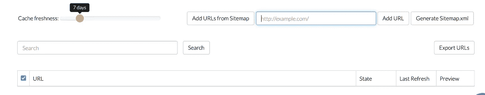

# React 应用中解决 SEO 问题的 3 种简单方法

> 原文：<https://javascript.plainenglish.io/3-easy-ways-to-solve-seo-problems-in-react-applications-d3d7873dc494?source=collection_archive---------11----------------------->

## React 不适合 SEO…还是？

Photo by [Marten Newhall](https://unsplash.com/@laughayette?utm_source=unsplash&utm_medium=referral&utm_content=creditCopyText) on [Unsplash](https://unsplash.com/s/photos/search?utm_source=unsplash&utm_medium=referral&utm_content=creditCopyText)

我们都爱反应。它的性能和简单性令人惊叹。然而，我们经常被告知 React 不是 SEO 友好的。

真的是这样吗？

今天，我们将深入探讨这个话题，看看我们如何解决这些问题并提高 React 应用程序的 SEO 性能。

# 什么是 SEO？

[SEO](https://circuit.ooo/blog/seo-for-beginners) 的意思是搜索引擎优化。它基本上为像谷歌这样的搜索引擎索引你的网站。

你的网站排名越好，它在搜索结果页面上的位置就越高。

# 你为什么要在乎？

根据 [Staskshare](https://gs.statcounter.com/search-engine-market-share#monthly-202001-202004-bar) 的数据，谷歌占有搜索引擎市场大约 92.4%的份额。据 [Backlinko](https://backlinko.com/google-ctr-stats) 统计，排名前三的结果获得了用户 75%的点击量。

Image credit: [Backlinko](https://backlinko.com/google-ctr-stats)

所以如果你在构建什么东西，想让用户通过谷歌搜索找到你的应用，那么你就要关心 [SEO](https://circuit.ooo/blog/seo-for-beginners) 。

# 好吧，但是它是如何工作的呢？

为了索引网页，谷歌使用网络爬虫。这些机器人会定期访问网页，根据特定标准分析页面内容。

通常，机器人下载 HTML 和 CSS 文件，运行分析，并发回结果。

Credit: [RubyGarage](https://rubygarage.org/blog/seo-for-react-websites)

然而，对于单页应用程序，这个过程有一点不同。为了呈现任何内容，浏览器上的 JavaScript 需要在实际的 UI 构建之前首先运行。

# React 的问题

React 的速度和基于组件的架构非常棒，但在 SEO 方面有一些缺点。我们来讨论一下。

## 问题 1:所有页面只有一个 URL

React 应用程序是用一个 HTML 文件构建的。使用条件呈现的概念，我们可以决定在 JavaScript 代码中显示什么。从技术上讲，我们不需要动态 URL。

但是根据 [Google SEO 入门指南](https://developers.google.com/search/docs/beginner/seo-starter-guide)，在 URL 中包含相关信息对 SEO 非常有帮助。

Credit: [Google SEO Starter Guide](https://developers.google.com/search/docs/beginner/seo-starter-guide)

这是 spa 最大的问题。如果网站只有一个页面，这不是问题，但是对于多页面应用程序，如果 URL 不变，爬虫就不可能索引所有页面。

## 问题 2:单一元标签

Meta 标签有助于向机器人描述页面内容。根据[谷歌搜索引擎优化入门指南](https://developers.google.com/search/docs/beginner/seo-starter-guide):

> "一个页面的描述元标签给谷歌和其他搜索引擎一个关于这个页面的概要."

不幸的是，React 生成了一个单页面应用程序，它只提供了一个放置 meta 标签的地方——那就是 public 文件夹下的`index.html`文件。

## 问题 3:全部都是 JavaScript

正如我们之前讨论的，普通网站的抓取过程与 SPA 略有不同。

当爬虫访问网站时，内容不在那里。所以爬虫必须等待 JavaScript 在客户端加载。

如果你的网站很大，第一次渲染需要一些时间，那么爬虫会认为这是一个空页，没有索引就离开了。这导致你的网站搜索引擎优化排名很糟糕。

# 你是在告诉我不要用 React 吗？

答案是肯定的，也是否定的。React 是为快速性能而构建的。它不是为解决你的搜索引擎优化问题而建立的。

如果你真的关心 SEO，那么你应该考虑构建一个[同构应用](https://www.lullabot.com/articles/what-is-an-isomorphic-application)。

[Next.js](https://nextjs.org/) 和 [Gatsby](https://www.gatsbyjs.com/) 是为此考虑的两个很棒的选项。

# 但是我不想用别的

这样的话，我有好消息告诉你。

在不构建同构应用程序的情况下，仍然有可能提高 React 应用程序的 SEO 性能。

今天，我将向你们展示。

## 步骤 1:解决单 URL 问题

有一个名为`[react-router](https://reactrouter.com/web/guides/quick-start)`的很棒的库，可以帮助我们基于 URL 呈现内容。

基本上，我们在代码中声明一些路线，并根据路线变化而不是条件呈现来呈现内容。

Routes.tsx

这解决了我们的第一个问题。

## 步骤 2:解决元标签问题

现在我们将使用另一个名为`[react-helmet](https://www.npmjs.com/package/react-helmet)`的伟大库。

React 头盔为我们提供了一个`Helmet`组件，它获取普通的 HTML meta 标签，并将它们添加到 React 页面的 head 标签中。

## 步骤 3:解决 JavaScript 问题

为此，我们可以使用名为 [Prerender.io](https://dashboard.prerender.io/) 的服务。

这项服务会缓存我们的网页，这样当 Googlebot 进入索引时，它就不需要等待页面被渲染，因为它已经被缓存了。因此，Googlebot 索引我们的页面变得更加容易。

Prerender.io

但是要记住，虽然这个服务是免费的，但是达到一定的限额之后就要付费了。

# 结论

这就是了。我不是 SEO 专家什么的，所以如果你发现什么不对，请在评论里告诉我。

我希望你喜欢读这篇文章，就像我喜欢写它一样。

祝您愉快！

 [## 面向初学者的 SEO

### SEO 或搜索引擎优化是提高网站或网页在搜索中的可见性的过程…

电路. ooo](https://circuit.ooo/blog/seo-for-beginners)  [## 摇滚明星 React 开发者的 7 个特质

### 造成差异的习惯

better 编程. pub](https://betterprogramming.pub/the-7-traits-of-a-rock-star-react-developer-747fbb001c05)  [## 任何大型 React 应用程序的 20 个基本部分

### 如果您正在编写企业级代码，您需要了解这一点

javascript.plainenglish.io](/20-essential-parts-of-any-large-scale-react-app-ee4bd35436a0) 

**通过** [**LinkedIn**](https://www.linkedin.com/in/56faisal/) **或我的** [**个人网站**](https://www.mohammadfaisal.dev/) **与我取得联系。**

# 资源

*   https://backlinko.com/google-ctr-stats
*   Google SEO 指南:[https://developers . Google . com/search/docs/初学者/入门？hl=en](https://developers.google.com/search/docs/beginner/get-started?hl=en)

*更多内容请看*[*plain English . io*](http://plainenglish.io/)