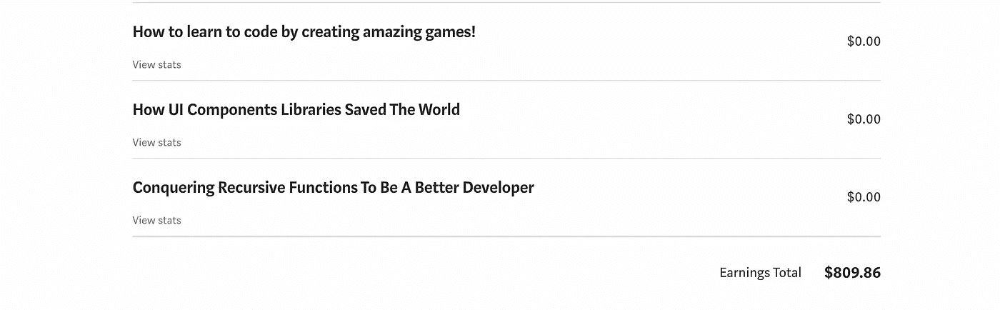

# 学习编码时赚钱的 3 个简单方法

> 原文：<https://javascript.plainenglish.io/3-easy-ways-you-can-make-money-while-learning-to-code-cf3fa05b84ab?source=collection_archive---------0----------------------->

## 不要再等了，现在就赚钱吧

Photo credit by [Pexels](https://www.pexels.com/de-de/foto/frau-schreibtisch-notizbuch-tisch-4475524/)

赚钱是必须的。势在必行。因为这是我们人类生存和生活的方式。

所以，如果你正在学习编码，我能感觉到你的压力，你需要尽快用你的技能开始赚钱。你想尽可能多的学习，然后得到你梦寐以求的高薪工作。

但现实与此不同。比较容易。你不必等上几个月或几年，就可以用你的技能让你的钱包变得更大。即使在学习编码的时候，你也可以开始赚钱。

听起来很棒，对吧？你可以学到你喜欢的东西，同时还能得到报酬。让我们看看你怎么做。

## 1.在介质上书写

一年前我开始在这个平台上写作。我想分享我的学习成果和我作为一名专业开发人员的经历。

我并不总是和我的写作保持一致，但是从我的第二个月开始，我已经跻身每月收入超过 100 美元的作家的前 1%了。

在我写得更多的几个月里，你可以看到我能得到的结果:

My earnings in December 2020 when I was consistent with my writing

在媒体上，尤其是技术和编码，一直是热门话题。有很多很棒的出版物等着你的文章来分享。

因此，如果你想在学习编码的同时接触写作艺术，这可能是一个绝佳的机会。我建议，对于你所学的每一个话题，你都要写一篇关于它的文章。

例如，如果你刚刚学习了 JavaScript 中的循环，你可以写这样的文章:

*   JavaScript 中遍历数组的最佳方式
*   用 JavaScript 编写 for 循环的现代方法

看到了吗？机会是无穷无尽的。在媒体上写作，你可以赚钱，建立网上权威(可能会被招聘公司注意到)，也可以沉淀你所学的东西。

不要因为你不是专业作家而气馁。不完美的文笔往往会导致这个平台上的读者最爱的:人性和温情。

## 2.为支付机构写作

虽然 Medium 是一个在学习编码的同时赚钱的奇妙平台，但它也需要你自己在不断发布方面付出很多努力。一个不太耗时的用写作赚钱的方法是向付费机构申请，寻找可以谈论编程相关话题的作家。

我和许多这样的公司合作过，现在还在和一些公司合作。我向你保证每篇文章的报酬非常高。通常，对于一篇 1500 字的长文章来说，你可以确定带回家大约 300 美元。

虽然这些公司中的一些不需要作家的投资组合来与他们合作，但一些公司会向你索要一些写作样本。这个要求把我们带回到作为初学者的极好选择的媒介，因为即使你不能在媒介上赚钱，你仍然在建立你的作家的背景。

你在进步。你的写作在进步。一旦你有信心这样做，你就可以向潜在的公司展示它。

## 3.当自由职业者

最近，我开始了关于如何成为一名网页开发者的时事通讯。你可以想象，我不是奥普拉或任何其他有影响力的名人。所以你可以想象，没有人真的订阅它，只是因为:“嘿，这是皮耶罗。”

然而，在发布一周后，我的邮件列表已经有了 100 多个订阅者。你知道为什么吗？

因为我不怕亲自接触那些我认为可能对我能为他们做的事情感兴趣的人。我查看了我的 Linkedin 列表和 Gmail 账户，寻找可能有兴趣加入这个列表的人。

我给他们写信，他们愉快地参与了我的项目。这和自由职业有什么关系呢？

嗯，作为一名初级开发人员，自由职业不仅关乎你的技能，还关乎你向潜在客户推销自己的能力。你需要有能力向他们传达你的用处。

给自己列一个清单，列出 20 个可能需要网站的当地企业、朋友、家人。然后，亲自联系他们，向他们推荐你的服务。提供你确信自己有资格创造的专业产品并不可耻。

此外，订阅像 Upwork 和 freelancer 这样的平台，努力获得你的第一批客户。超额完成第一个项目，并要求积极的评价。

你很快就会看到你的客户成倍增加。

## 结论

如果你正在学习编码，你不必把自己关在房间里等着有一天看到隧道尽头的光明。现在就伸出你的头，认识到这项技能在经济上能给你带来的无限可能性，并马上利用它们。

你能做到，如果你遵循我给你的建议，你就会做到。一旦你挣到了第一美元，一千多美元就会到来。

*皮耶罗*

## [想学习如何通过开发挣更多的钱并达到财务自由吗？这是我给你的免费指南。](https://tinyurl.com/MoneyDev)