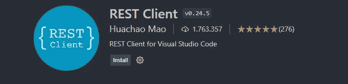

# 掌握 JavaScript 开发的 3 个有效步骤

> 原文：<https://javascript.plainenglish.io/3-effective-steps-to-master-javascript-development-ca494035ec2b?source=collection_archive---------16----------------------->

## 如果你想掌握 JavaScript，应用这三个步骤。

Photo by [ThisIsEngineering](https://www.pexels.com/@thisisengineering?utm_content=attributionCopyText&utm_medium=referral&utm_source=pexels) from [Pexels](https://www.pexels.com/photo/photo-of-code-projected-over-woman-3861969/?utm_content=attributionCopyText&utm_medium=referral&utm_source=pexels)

开始学编程语言的时候，去了一个计算机工程系的大学网站。我查看了他们的课程，想找到一种学习编程语言的方法。在网站上，也有推荐给学生的教科书。所以，我开始阅读它们。

我正在阅读 C/C++书籍，并试图实践我所学到的东西。然而，过了一段时间后，这对我来说是不可持续的，因为书中有很多理论，但缺乏实践。

我的一些计算机工程师朋友建议用其他方法来学习编程语言，而不是看书。我还从各种在线编程课程、YouTube 视频、博客和开发人员论坛中收集了一些最佳建议。过了一段时间，我的进步比我从书本上学到的要好。作为一名自学成才的开发人员，我应用了一些步骤和规则来发展我的编程技能。我用了三个基本步骤来提高我的编程技能。我搜索过的大多数开发者都说他们也使用这些步骤。我认为您也应该使用它们来掌握您的 JavaScript 和任何其他编程开发。

## 1.高效地编写代码

我所说的高效地编写代码是指在一个高效的环境中工作，比如 IDE 和编辑器。我通常用 VS Code 写代码，因为它有简单的设计，你需要的很多扩展，和漂亮的主题。

作为一名开发人员，你大约每天都要写代码。有时，甚至在周末。你的代码编辑器是至关重要的，因为你每天都会看到它，可能比你的家人还多。所以，你看的屏幕应该让你感觉良好。

我一般用 VS 代码。如果你也使用 VS 代码，你可以改变你的 VS 代码的主题。要改变 VS 代码的外观，您可以遵循以下步骤。`Code -> Preferences -> Color Theme Appearance`

在这里，你可以选择你喜欢的最佳主题。此外，如果你认为没有太多的选择，你可以通过搜索 VS 代码扩展找到一些其他的主题。

比如可以在扩展页面写“ **One Dark Pro** ”。它基于 Atom 的一个黑暗主题。它目前在市场上被下载了 400 万次。

One Dark Pro: VS Code Screenshot added by author.

除了主题，您还可以更改代码文件和文件夹的外观。你怎么能这样做？例如，您可以在扩展中搜索“**材质图标主题**”。它包含许多不同类型的文件和文件夹的图标。

Material Icon Theme: VS Code Screenshot added by author.

你可以做的另一件事就是使用快捷方式来编写高效的代码。快捷键对于专注于你的编码是必不可少的。如果你使用它们，你就不会太分心。此外，使用快捷方式将帮助您快速更改和重构代码。

 [## 20 个有用的 VS 代码快捷方式，可以防止你分心

### 你将学习 20 个节省时间的 VS 代码快捷方式

javascript.plainenglish.io](/20-useful-vs-code-shortcuts-that-will-prevent-you-from-distractions-124698c93dc4) 

例如，使用`Ctrl + Backspace`将帮助您删除光标前的单词。您不需要一个接一个地删除所有字符，或者使用 shift 和左箭头键来选择您要删除的单词。

自动格式化代码是高效编写代码的另一种方式。您可以使用快捷方式格式化整个代码文件。

更多选项，还可以用 VS 代码扩展名格式化代码，这个名字比较好看。

Prettier: VS Code Screenshot added by author.

Prettier 是一个代码格式化程序，它通过解析和重新打印自己的规则来使您的代码具有一致的风格。它的一些规则是最大行长度和必要时的换行代码。

目前支持的一些语言有:

`JavaScript, TypeScript, JavaScript+React, TypeScript+React, JSON, GraphQL`

如您所见，使用扩展为您提供了一个高效的环境。为了有一个更有生产力的空间，你可以从 VS 代码中探索扩展。还有两个扩展示例可以让你高效地编写代码。第一个是 ESLint。

ESLint 是 JS 开发人员中最流行的 VS 代码扩展之一。它允许您快速检测和修复规则失效。ESLint 也有助于提高你的代码质量。

ESLint: VS Code Screenshot added by author.

另一个扩展示例是 REST 客户端。您可能知道或不知道，Postman 是一个众所周知的 API 客户端，它允许用户创建和保存 HTTP/s 请求并读取它们的响应。REST 客户端就像 VS 代码扩展中的邮递员。它还允许您发送 HTTP 请求，并直接在 VS 代码中查看响应。

REST Client: VS Code Screenshot added by author.

## 2.知道去哪里寻求帮助

作为一个 web 开发者，你可以使用[MDN(Mozilla Developer Network)](https://developer.mozilla.org/en-US/)搜索各种 web 开发概念。这是一个一般的 web 开发网站，但也是专门针对 JavaScript 的。在 MDN 中，你可以找到几乎所有关于 JavaScript 的东西。JavaScript 中你可以搜索的每一个内置函数和对象。这是一个完美的参考。

例如，如果你在使用一个内置的 JavaScript 函数时遇到困难，你可以在谷歌中搜索`MDN console.log()`。另外，MDN 还包括从[完全初学者](https://developer.mozilla.org/en-US/docs/Learn/Getting_started_with_the_web)到[高级](https://developer.mozilla.org/en-US/docs/Web/JavaScript?retiredLocale=tr#advanced)的 JavaScript 教程。例如，您可以学习从服务器获取数据、异步 JavaScript、使用 JSON 数据、面向对象的 JavaScript 等等。你需要的另一个重要技能是如何谷歌。谷歌搜索是开发人员必须掌握的最重要的技能。专业软件工程师[有效地使用谷歌解决他们的日常编程问题](https://localghost.dev/2019/09/everything-i-googled-in-a-week-as-a-professional-software-engineer/)。这里有一篇文章展示了如何在谷歌中有效搜索的一些技巧。

在谷歌里，你可以找到你卡住的地方的解决方案。你可能会发现一些关于如何思考问题和解决你的问题的其他想法。为了找到合理的解决方案，您可以在问题的开头编写 JavaScript 来缩小您的问题。为了提高你的求助技巧，你也应该学会如何提出好的问题。编程语言发展迅速的主要原因之一是为开发人员提供了一个良好的社区。如果很多人问他们的问题，贡献者的反馈会很快反馈回来。

你提出的每一个问题，也帮助了其他开发者和语言的改进。

[堆栈溢出](https://stackoverflow.com/)对于开发者来说是一个有用的社区，尤其是对于 JavaScript 开发者，因为它是第一个通过了 200 万个问题的语言。您可以使用 Stack-Overflow 提出您的问题，并找到与您的问题或搜索相关的最佳答案。

## 3.调试您的代码

当我刚开始学习编码时，我使用的最佳策略是调试代码。如果你调试你的代码，你也将能够理解你的代码是如何工作的。

在编写和运行代码时，您需要找到并修复这些错误。作为开发人员，您会遇到错误。这很正常，也不会让你成为一个糟糕的开发者。你需要具备的重要技能是学会如何发现你的错误并改正它们。

你能做的就是不要直接跳过错误信息。阅读并利用错误信息。一般来说，错误消息非常清楚。此外，它们通常显示代码行。你应该上纲上线，想办法解决。如果你在解决问题时遇到困难，写信给谷歌寻找答案。

你也可以使用`console.log()`来洞察你的代码。一般是针对逻辑错误。例如，你应该增加一些变量。但是，你忘了增量了。因为这种错误是逻辑错误，所以不会有错误消息。所以，最好是自己找。

此外，您可以使用断点。如果将断点放在要查看的行号上，调试器将在运行代码后暂停代码。在这里，你可以观察你的变量。

在本文中，我告诉了您在 JavaScript 开发旅程中需要掌握的三个基本步骤。这三个步骤也是学习任何其他编程语言的非常有效的方法。

如果你学会了有效地编写代码，你将会富有成效并享受编写代码的乐趣。给自己创造一个有生产力的空间，代码编辑器，是必不可少的。您可以通过使用自动格式化代码扩展、探索扩展、更改您喜欢的主题、使用快捷方式来构建它。最好的开发人员是那些知道如何巧妙地找到帮助的人。无论您是编程之旅的初学者还是高级开发人员，都没有关系。知道去哪里寻求帮助是一项重要的技能。可以使用 Google 和 Stack Overflow 来寻找帮助。调试你的代码教你编程的基础。您可以找到您的逻辑错误，并通过使用调试器来修复它们。同样，您可以使用`console.log()`和断点来找到您的错误。您还应该阅读和利用错误消息。

高效地编写代码，知道哪里可以找到帮助，调试你的代码，这是任何一个开发人员必备的三项技能。您将会看到这三个步骤对于掌握您的 JavaScript 和任何其他开发的重要性。

*更多内容请看*[***plain English . io***](http://plainenglish.io/)