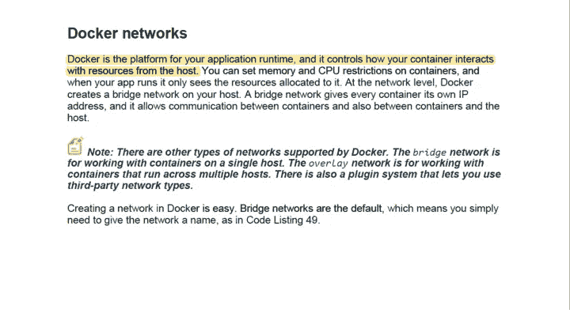
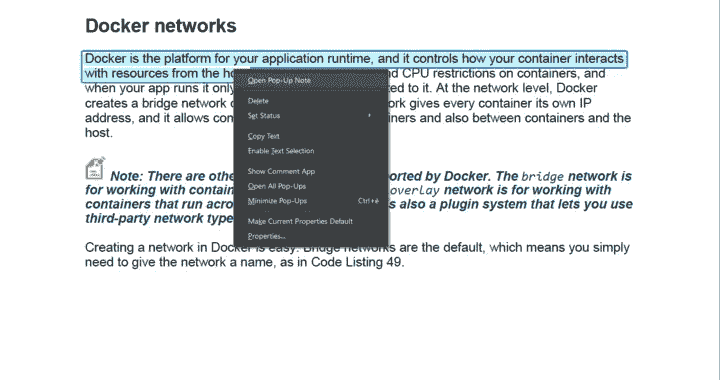
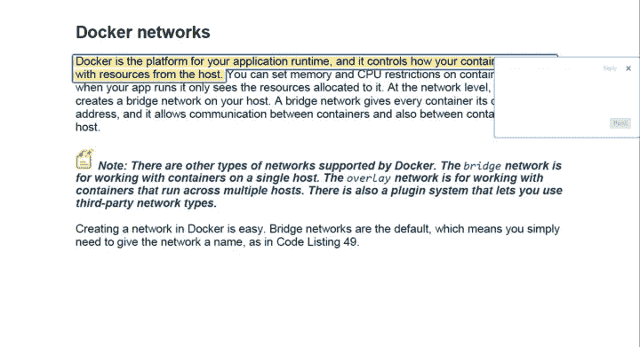

# 阅读软件开发书籍时要做的 3 件有效的事情

> 原文：<https://javascript.plainenglish.io/3-effective-things-to-do-while-reading-books-about-software-development-b27dc3ec08c5?source=collection_archive---------21----------------------->

## 作为一名计算机科学专业的学生，一些对你有帮助的建议

Photo from: [**Unsplash**](https://unsplash.com/photos/505eectW54k)**.**

阅读关于软件开发或计算机科学的书籍在第一章往往是一项艰巨的任务，这与第一印象有关，也与我们在阅读这本书之前的期望有关。

然而，在浏览完这本书的前几章后，你看到的想法会开始联系起来，有趣的部分会显露出来，这本书会更有趣，你正在阅读的概念会开始对你有意义。

在进入这些部分之前，我们跳过了书中的许多概念，因为它让我们沮丧，或者因为它非常复杂；问题不止于此；我们会忘记一些我们学过的概念，那是在书的结尾，或者读了几个星期之后。

为了克服处理复杂概念和忘记简单概念这两个挑战，我采用了一些帮助我的方法，不仅如此，还提高了我读多少书的效率，以及我如何应用我学到的东西。

# 1.获得电子副本

我不想提到这一点，因为对于软件开发或 IT，我们大多数人选择电子副本，但其他人满足于物理副本，然而，要获得本文的大部分内容，请尝试选择您的书的电子副本。

阅读关于软件开发的电子书比你想象的更有趣，想象一下在你的机器上看着 kindle 或 Adobe reader 中的代码，然后直接在你的编辑器中编写代码，你犯的错误会更少，理解代码或概念会比以前更容易

还有其他情况需要考虑，例如阅读依赖于你以前读过的书的技术，因此在你的阅读器上打开多本书并导航到其中最重要的部分将是一件简单的事情。

# 2.突出创意

现在，当你拿起你的书的电子版后，你可以很容易地突出重要的观点，通过选择想要的段落部分，如下图所示。

Photo by the Author (from The Docker Succinctly ebook).

在像 Adobe reader 这样的阅读器中突出显示想法的有趣之处在于，你可以选择突出显示应该获得的颜色，阅读器本身会计算你已经突出显示了多少次，再加上保存它们在书中的位置，这样你就可以很容易地找到它们。

# 3.做笔记

在我读书的第一天，我记得有多少信息都是徒劳的，因为我没有做笔记，这是你决定选择一本书时应该做的事情，甚至在看教程时，忽略这本书，你最终总是会忘记你所学的东西。

因此，每当你发现有趣的想法时，记下笔记。突出想法和做笔记的区别在于，你可以用一种看起来简单易懂的方式来构建笔记，以便下次检查时理解..

我用两种不同的方式写笔记，第一种是写在文本文件或个人笔记中，第二种是写在重点旁边，如下图所示。

Photo by the Author (from The Docker Succinctly ebook).

如上例所示，点击“打开弹出便笺”后，您会在突出显示的旁边看到一个小字段，您可以在其中写下您的便笺，在这些示例中，我使用的是 Adobe Pdf 阅读器，其他阅读器可能没有这些功能。

Photo by the Author (from The Docker Succinctly ebook).

# 结论

当谈到软件开发或任何与计算机科学相关的东西时，你必须在通过阅读书籍或观看教程来学习之间做出选择。

几年前我决定通过阅读书籍和文章来学习东西，然而，这并不意味着我不看课程和教程，如果我没有找到适合我的书，或者如果我试图理解的概念不需要大量的工作，我可能会选择教程。

应用我上面提到的三种方法对我帮助很大，即使它们看起来很辛苦，但它们对我来说已经成为一种规范，这是因为一个原因，它让我读的每本书都有用。

*更多内容看*[***plain English . io***](https://plainenglish.io/)