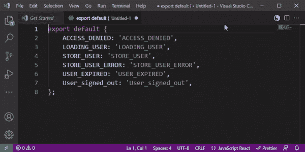
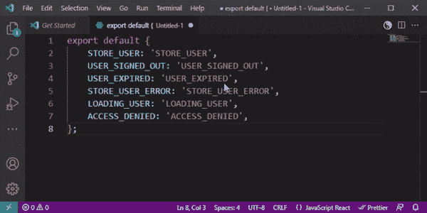
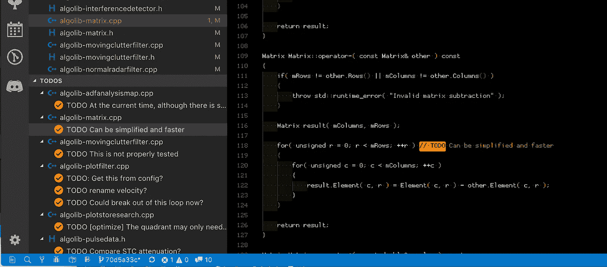

# 3 个基本的 Visual Studio 代码扩展

> 原文：<https://javascript.plainenglish.io/3-essential-visual-studio-code-extensions-c5d9b5d0caa7?source=collection_archive---------2----------------------->

最近，我遇到了一些 Visual Studio 现成代码中缺少的简单东西。以下是我认为每个人都需要的插件。

# 1.切换-大写

我大部分时间都在 full visual studio 中，并且一直使用大小写切换快捷键。我很惊讶 VS 代码没有内置这个快捷方式。

通过在高亮显示的文本上点击 CTRL+U，切换大写字母插件可以很好地在大写字母和茶色字母之间切换。

Example showing CTRL+U changing case

【https://marketplace.visualstudio.com/items? itemName = eprincev-egor . toggle-大写

# 2.Visual Studio 代码排序

我经常喜欢对参数或其他代码行进行排序，这是 VS 代码中缺少的另一个捷径。

Visual Studio 代码插件的[排序非常棒。突出显示一些代码行，按 SHIFT+ALT+S 就排序了，再按一次反转。](https://marketplace.visualstudio.com/items?itemName=henriiik.vscode-sort)

Example showing lines being sorted and reversed with SHIFT+ALT+S

[https://marketplace.visualstudio.com/items?itemName = Henri iik . vs code-sort](https://marketplace.visualstudio.com/items?itemName=henriiik.vscode-sort)

# 3.待办事项树

用代码跟踪 TODOs 是很棒的。我之前提到过[更好的注释插件](/6-visual-studio-code-extensions-i-cannot-live-without-fd00ae70efb6)的使用，当你查看单个文件时它很棒，但是如果你想在一个列表中看到你所有的待办事项，那么检查一下[待办事项树 Visual Studio 代码插件](https://marketplace.visualstudio.com/items?itemName=Gruntfuggly.todo-tree)。

这个扩展可以在您的工作区中快速搜索注释标记，如 TODO 和 FIXME，并在 explorer 窗格的树视图中显示它们。

单击树中的待办事项将打开文件，并将光标放在包含待办事项的行上。

Todo tree UI

[https://marketplace.visualstudio.com/items?itemName = gruntfugly . todo-tree](https://marketplace.visualstudio.com/items?itemName=Gruntfuggly.todo-tree)

# 更多伟大的扩展..

> 查看我的帖子[“我离不开的 6 个 Visual Studio 代码扩展”](/6-visual-studio-code-extensions-i-cannot-live-without-fd00ae70efb6)

*更多内容看* [*说白了。报名参加我们的*](http://plainenglish.io/) [*免费每周简讯*](http://newsletter.plainenglish.io/) *。在我们的* [*社区*](https://discord.gg/GtDtUAvyhW) *获得独家写作机会和建议。*