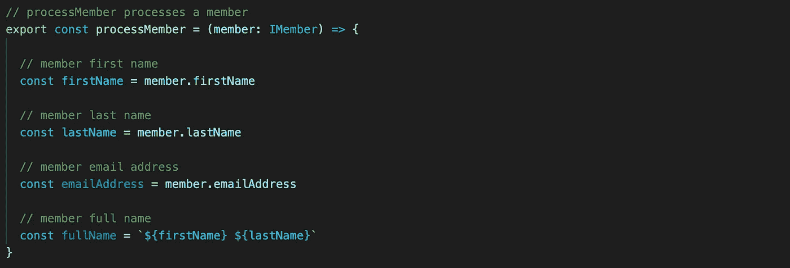
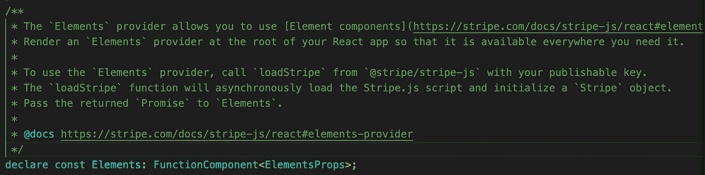
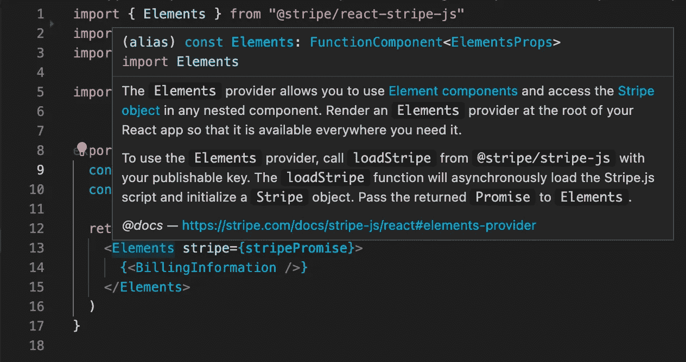

# 我发现代码注释有帮助的 3 个例子

> 原文：<https://javascript.plainenglish.io/3-examples-where-i-find-code-comments-helpful-a42d74bee69?source=collection_archive---------11----------------------->



我认为代码注释应该少用。

我发现描述性的变量和函数名使得代码库更容易阅读。然而，添加注释绝对有帮助的时候。这里有 3 个例子，我发现代码注释很有用。

**1。第三方库怪癖**

我一直使用第三方库(React developer)。我时不时会遇到一个 bug 或奇怪的特性，包的配置可能不会马上有意义。

几年前，我在使用一个流行的图表库，它只有在宽度为 99%的情况下才会显示响应图表。我通过搜索他们公开的 GitHub 问题发现了这一点。我认为如果其他人看到这个组件，给他们留下评论会很有帮助。

**2。需要更多背景的行为**

我最近开发了一个应用程序，可以持续扫描二维码，并对编码数据进行查找。我不得不在我的查找功能中建立一个人工等待期，让用户有时间将他们的设备从扫描仪上移开，以避免对同一代码进行多次扫描。没有任何上下文，这个特性就没有任何意义。我觉得一个简单的评论可以帮助其他人避免未来的挠头。

**3。库文档**

如果您正在构建一个 NPM 包或者在一个大型团队中工作，并且希望为导出的模块提供更多的上下文，那么您可以在声明的上方添加代码块。大多数 IDE 会将鼠标悬停在导入的模块上，在预览中显示您的注释。我将用 Stripe 作为这个例子。他们的评论真的很好，包括链接。

示例注释



导入的视图



您所需要做的就是在声明行的上方添加这种格式的代码块。

```
/**
*
* add your comments inside this block
*
*/
```

就这些了。让我知道，如果有任何其他情况下，你发现评论是有帮助的。

*更多内容看* [***说白了就是 io***](http://plainenglish.io/) *。报名参加我们的* [***免费每周简讯点击这里***](http://newsletter.plainenglish.io/) ***。***