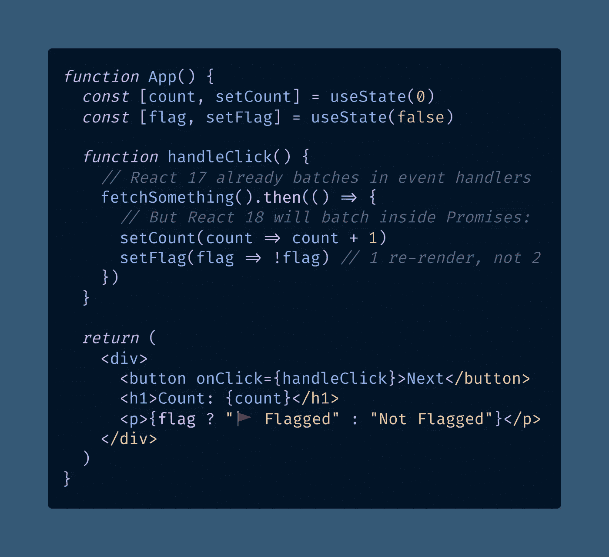
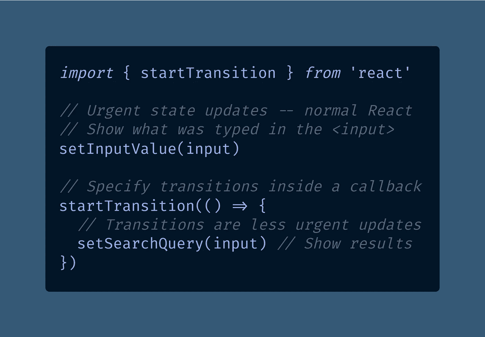

# React 18 中 3 个令人兴奋的新功能:批处理、过渡和悬念

> 原文：<https://javascript.plainenglish.io/3-exciting-new-features-in-react-18-batching-transitions-and-suspense-d14a98e530bd?source=collection_archive---------10----------------------->

## React 18 的新功能将包括性能改进，能够优先考虑某些渲染，以及改进的服务器端渲染。

Photo by [Hannah Busing](https://unsplash.com/@hannahbusing?utm_source=medium&utm_medium=referral) on [Unsplash](https://unsplash.com?utm_source=medium&utm_medium=referral)

我一直试图忽略 React 18 新闻，因为下一个新闻刚刚出来，但谢天谢地[阿比纳夫·安舒尔。](https://medium.com/u/396b0b0c23bf?source=post_page-----d14a98e530bd--------------------------------)在 Dev.to 上写了一篇关于 React 18 即将推出的所有[功能的帖子。🙏](https://dev.to/workshub/react-18-is-here-what-s-new-ah4)

有很多要谈的，但是我们可以轻松地花 2 个小时来讨论所有的大的新特性，所以我们不要这样做。😀

以下是 React 18 中我最兴奋的 3 件事，React 18 是 React [于 2021 年 6 月](https://reactjs.org/blog/2021/06/08/the-plan-for-react-18.html)发布的下一个主要版本。🥳

# React 18 中的自动配料

我喜欢对[网络性能和核心网络要素](https://bettermarketing.pub/googles-pass-fail-core-web-vitals-make-performance-matter-for-seo-b8490a5ca5ec)感到厌烦，因为我认为一个响应迅速、敏捷的用户体验是不可讨价还价的。

也许我有偏见，因为我当地超市的网站需要 30 秒才能从我的购物车中删除一件商品，但研究非常清楚地表明[每个人都讨厌慢网站](https://www.nytimes.com/2012/03/01/technology/impatient-web-users-flee-slow-loading-sites.html)。

我从 PT 转行回到软件工程的一个重要原因是大多数医疗 EHR 系统的用户界面缓慢而笨拙。

鉴于关于 React 的小道消息一直是“React 很慢 LOL”和“只要学习 JavaScript，你就没事了”，我对[批处理](https://github.com/reactwg/react-18/discussions/21)很感兴趣，这是 React 18 即将推出的性能改进之一。

> “批处理是指 React **将多个状态更新组合成一个单独的重新渲染**以获得更好的性能。”丹·阿布拉莫夫

下面是即将到来的`[createRoot](https://github.com/reactwg/react-18/discussions/21)`方法(将取代 React 18 中的`[render](https://reactjs.org/docs/react-component.html#render)`)的自动批处理的样子。

在这个例子中，[承诺](https://developer.mozilla.org/en-US/docs/Web/JavaScript/Reference/Global_Objects/Promise)(`[.then()](https://developer.mozilla.org/en-US/docs/Web/JavaScript/Reference/Global_Objects/Promise/then)`块)中的两个状态更新将在 React 18 中自动批处理。

换句话说，React 只会在结束时重新渲染组件一次，这就是批处理，批处理可以提高性能。呜！

# 2 —在 React 18 中开始转场

每个第一次使用 React 的开发者都会制作某种类型的[搜索演示](https://tomasdanjonsson.github.io/monsters-rolodex/)，在每次按键后自动搜索。这是经典的 JavaScript 魔术——不需要“回车”键。🧙‍♂️

当您已经准备好所有数据时，这很好，但是如果您曾经用大量数据或实时 API 调用尝试过，那么 React 将会滞后。

滞后来自 React 试图重新呈现每次击键时的所有内容。作为用户，搜索框的更新感觉比搜索结果更迫切，所以滞后的搜索框感觉不自然和笨拙。

React 18 中的新`[startTransition](https://github.com/reactwg/react-18/discussions/41)` [功能将允许你优先处理某些渲染，让一切看起来更快。](https://github.com/reactwg/react-18/discussions/41)

使用`startTransition` API 意味着你必须考虑哪些组件是紧急的，哪些实际上是“转换”

但是除此之外，代码只是抛出一个额外的回调，就像你在[使用 React 钩子](/how-to-add-to-an-array-in-react-state-3d08ddb2e1dc)添加一个条目 React 状态时可能做的那样。

# 3 —补水反应 18 带悬念

我对最新的悬疑新闻没有悬念，因为有时看起来这个故事片处于假死状态。

*是的，我去了，我可能会被暂停在博客上说双关语一段时间，但也许我只会穿吊带裤。*

改进 React 处理服务器端渲染(SSR)是[在 React 18 中重新架构](https://github.com/reactwg/react-18/discussions/37) `[<Suspense>](https://github.com/reactwg/react-18/discussions/37)` [API](https://github.com/reactwg/react-18/discussions/37) 的全部原因。

> “React 18 允许你使用`<Suspense>`将你的应用分解成更小的独立单元，这样你应用中最慢的部分就不会拖累快部分。”— [丹·阿布拉莫夫](https://medium.com/u/a3a8af6addc1?source=post_page-----d14a98e530bd--------------------------------)

在 React 18 中使用所有`[async](https://developer.mozilla.org/en-US/docs/Web/JavaScript/Reference/Statements/async_function)`的要点是，你不必等到服务器完成所有事情后，它才能[水合](https://github.com/reactwg/react-18/discussions/37)。

> “终结组件并附加事件处理程序被称为“水合”。这就像用交互性和事件处理程序的‘水’来浇灌‘干涸’的 HTML。”丹·阿布拉莫夫

对于像我这样喜欢尝试不同的静态站点生成方法的与会者来说，水合已经是旧闻了，他们用 Stackbit 演示原型，但是水合在 React 18 中变得更好了。

我们甚至会说，补水很重要，即使只能补水一点点，也还是比完全不补水强。虽然这是另一个可怕的双关语，但也是对`<Suspense>`功能的恰当描述。

React 18 中悬念 API 的两大卖点是:

1.  在获取所有数据之前，在服务器上流式传输 HTML
2.  对客户的选择性水合作用

使用`<Suspense>`的一个例子是使用`[React.lazy](https://reactjs.org/docs/code-splitting.html)`对异步代码进行代码分割，例如在注释小部件加载之前对应用进行水合。这将提高可感知的性能。

最后，我应该提到 SSR 和[服务器组件](https://reactjs.org/blog/2020/12/21/data-fetching-with-react-server-components.html)是不一样的。服务器组件是一个实验性的特性，没有计划在 React 18 中发布，但它们最终会与悬念一起工作。

# 结论 React 18 中即将推出的新功能

虽然[阿比纳夫关于开发的文章](https://dev.to/workshub/react-18-is-here-what-s-new-ah4)和[官方公告](https://reactjs.org/blog/2021/06/08/the-plan-for-react-18.html)概述了 React 18 计划的所有功能，但我最兴奋的是:

1.  定量
2.  过渡
3.  焦虑

由于 [React 17](/the-biggest-change-in-react-17-that-no-one-is-talking-about-b62905beb2d2) 主要是一个维护版本，这将是 React 16 以来我们第一次获得一些很棒的新功能。

总的来说，我喜欢 React 团队决定的方向，即远离“全在”并发模式，允许逐步更新。

在 React 18 中，你对什么感到兴奋？这个版本是不是完全是无中生有的炒作？请在回复中或在 Twitter 上[告诉我。](https://twitter.com/AskDoctorDerek)

**快乐编码！**🥏👩‍💻🪁👨‍💻🛸

德里克·奥斯汀博士是《职业规划:如何在 6 个月内成为一名成功的 6 位数程序员》一书的作者，该书现已在亚马逊上出售。