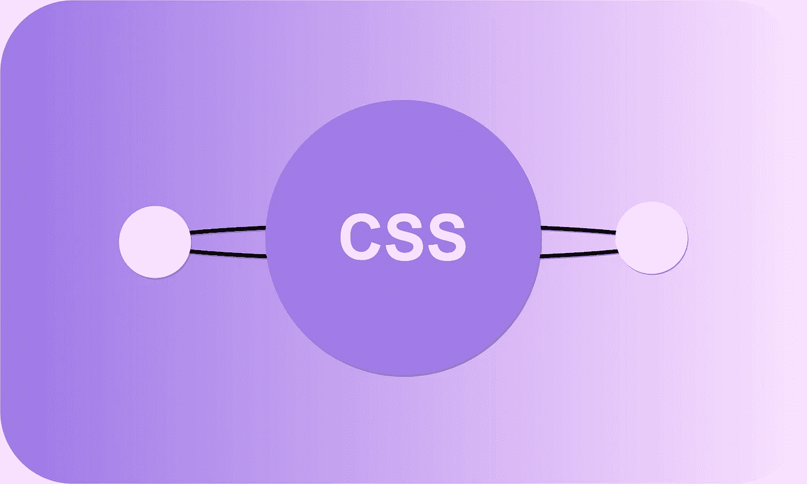
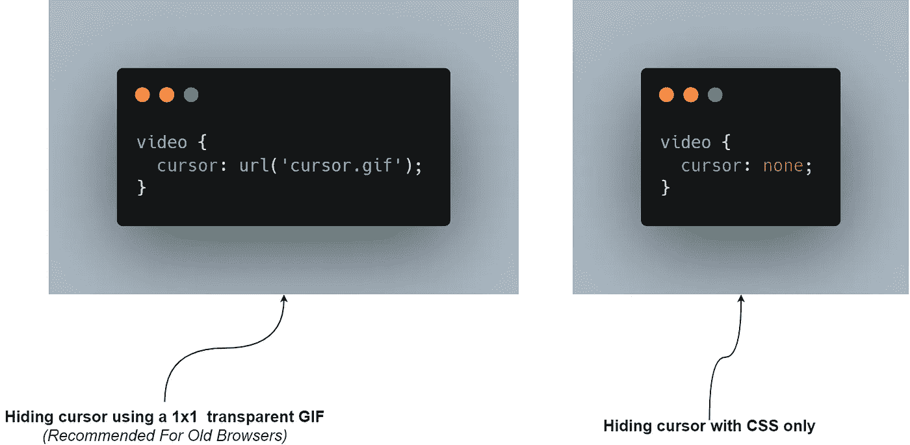
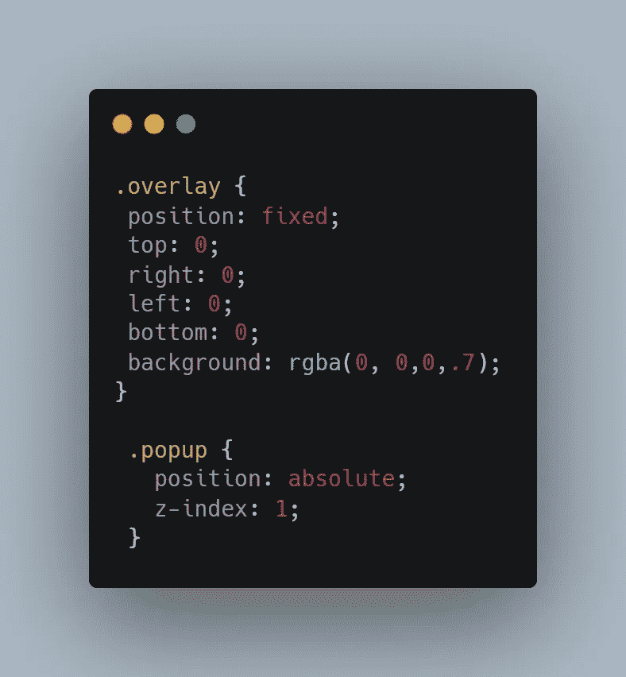
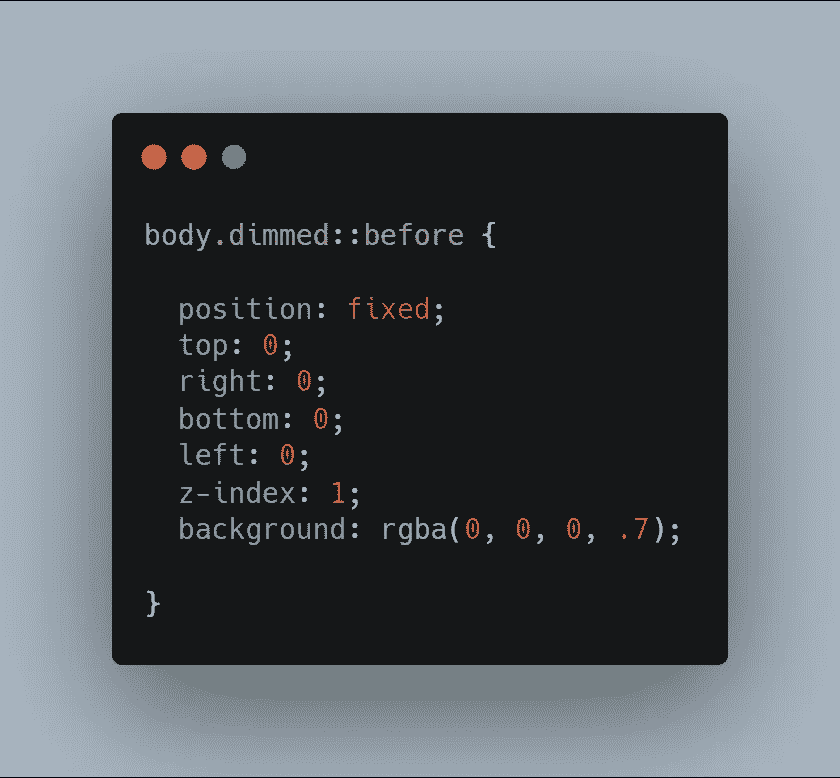
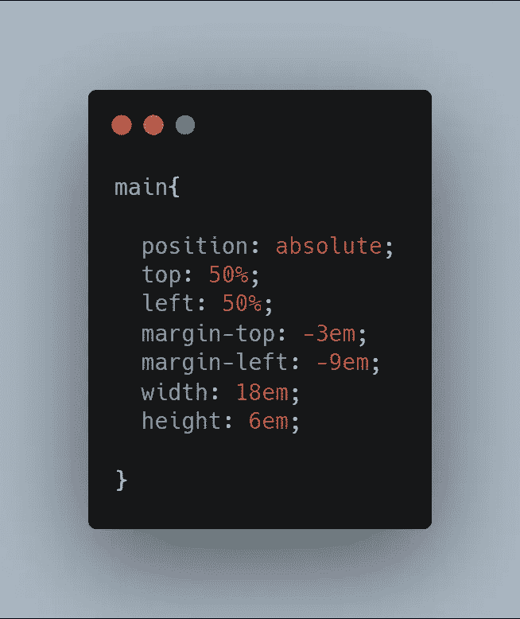
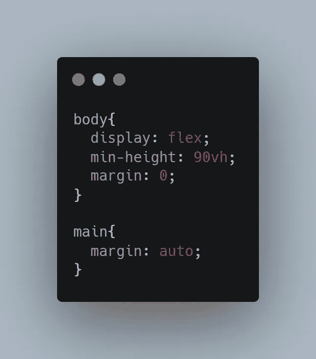

# 3 个隐藏的 CSS 功能

> 原文：<https://javascript.plainenglish.io/3-hidden-features-of-css-566e8c27597f?source=collection_archive---------1----------------------->

## 对前端开发者有用的 CSS 特性

## 1.挑选光标

目前 web 应用程序中的一个主要问题是在应用程序的不同部分缺少正确的光标显示。鼠标指针的目的不仅仅是在屏幕上显示一个原始的光标，而是显示在应用程序的不同部分可用的可能的操作。如果你的用户因为你的光标在整个应用程序中的反应是一样的而忽略了应用程序中的某个部分，那就奇怪了。

> ***注意:*** *有 30 多种不同类型的光标可以在你的 CSS 应用中使用。*

*   此外，不要试图用多个光标淹没 UX，这会让用户发疯。 ***例如*** ，如果你在视频播放器中隐藏光标，也不要在播放控制下隐藏。

## 2.变暗

现代 web 应用程序中非常常用的样式，通过半透明的深色覆盖层将元素后面的所有内容变暗，以吸引用户对某个 UI 元素的注意。实现这种效果最常见的方法是使用一个额外的 HTML 元素来变暗，并为最终结果应用一些 CSS。

这种方法已经足够好了，但是当要在应用程序的多个部分应用相同的样式时，每次都必须使用额外的 ***HTML*** 来处理，这对于这样一个小的效果来说需要做很多工作。不要添加额外的 HTML 层，建议使用给出的两种技术，这两种技术只需要几行 CSS。

*   **伪元素解决方案:**这个解决方案是一个更好的方法，唯一的问题是你需要查看 **body** 标签，并且你还需要使用 *JavaScript* 来应用 **dimmed** 类。然而，这种方法在大多数情况下都足够好，只有当您必须在应用程序中很少的部分应用这种风格时，才推荐使用*伪元素*，因为这种方法对于在应用程序中处理多个部分来说不是那么容易移植。

## 3.垂直居中

在 CSS 中垂直居中元素很容易变成一场噩梦。当涉及到在 CSS 中垂直居中元素时，开发人员最终会使用一些技巧来使事情正常工作。如果你坚持使用正确的方法，你可以很容易地将 CSS 中的元素居中，这不需要任何复杂的方法。

*   **绝对定位法:**使用**绝对**位置将 CSS 中的元素居中的最简单方法之一，它所需要的只是一个固定的**高度**和**宽度。**它将元素的左上角放在*视窗*的中心，使用负边距将其向上和向左移动。这种方法的唯一问题是它需要固定的尺寸。

*   **Flexbox 解决方案:**你可以带着任何疑问使用这个解决方案，因为它很简单，而且现在所有浏览器都支持它。它只需要两个声明，即 **display: flex** 和 **margin: auto** 对要居中的子对象。

 [## 作为前端开发人员，你应该知道的 3 个 CSS 特性

### 了解 CSS 鲜为人知的特性

javascript.plainenglish.io](/3-css-features-you-should-know-as-frontend-developer-f1b5536bf179)  [## 作为前端开发人员，你应该知道的 8 个 UX 原则

### 用这 8 个技巧构建吸引人的前端应用程序

javascript.plainenglish.io](/8-ux-principles-you-should-know-as-a-frontend-developer-9416a24294d2)  [## REST API 设计的 8 个最佳实践

### 构建更好的 REST APIs

javascript.plainenglish.io](/8-best-practices-for-rest-api-design-3fd1b837b283) 

*更多内容请看*[***plain English . io***](http://plainenglish.io)