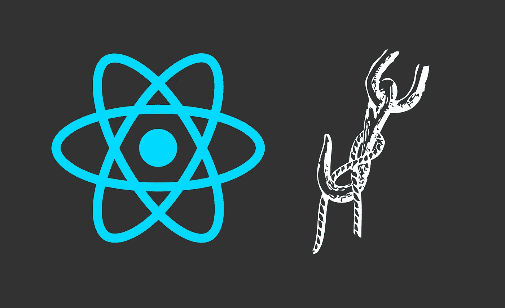
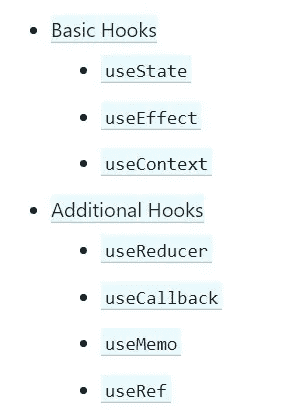

# 每个 React 开发人员都应该知道的 3 个问题

> 原文：<https://javascript.plainenglish.io/3-hooks-every-react-developer-should-know-a8e1bd218acc?source=collection_archive---------7----------------------->

## 了解不同的挂钩，知道何时使用正确的挂钩



Source: Author. Created with [Canva](https://www.canva.com/).

我最近使用基于类的组件组合以及使用 [Hooks API](https://reactjs.org/docs/hooks-intro.html) 构建了一个项目，我不禁注意到 React Hooks 如何更易于使用，并且也没有许多基于类的组件失败。

React Hooks 提供了对功能组件内部的状态和生命周期方法的访问。从而消除了将功能组件重构为类组件的需要。

React 挂钩是一组内置函数(您也可以创建它们),支持功能组件中的状态管理和副作用。

然而，知道何时使用哪个内置钩子以及该函数的确切功能有时会变得令人困惑，尤其是如果您是新手的话。



Different React Hooks. [Source](https://reactjs.org/docs/hooks-reference.html).

下面是一些最重要的 React 挂钩，在你开始使用它们之前你应该知道:

# 1.使用状态

`useState()`函数是我学到的第一个钩子，也是最常用的&普通 React 钩子

顾名思义，这个钩子处理组件的状态。换句话说，和`this.setState`很像。

你可以在这个钩子中传递一些本地状态，只要函数重新呈现，它就会被保留。

这个钩子返回两个值:第一个是反应数据，第二个是允许您更新它的函数。

```
import React, { useState } from 'react';
function Example() {
  // Declare a new state variable, which we'll call "count"  const [count, setCount] = useState(0);
// count is the data whereas setCount is an update function return (
    <div>
      <p>You clicked {count} times</p>
      <button onClick={() => setCount(count + 1)}>
        Click me
      </button>
    </div>
  );
}
```

这里我们将 0 作为参数传递给了`useState()`函数，它将用值 0 初始化我们的常量“count”。

React hooks 利用了 JavaScript 的析构特性，如果你不知道的话，可以看看我的博客，讨论一些现代实践。

[](https://medium.com/javascript-in-plain-english/5-modern-practices-of-javascript-that-every-developer-should-know-1a61dc9a6ee0) [## 每个开发人员都应该知道的 JavaScript 的 5 种现代实践

### 编写干净代码的 5 个最佳技巧和实践

medium.com](https://medium.com/javascript-in-plain-english/5-modern-practices-of-javascript-that-every-developer-should-know-1a61dc9a6ee0) 

您也可以传递其他参数。

```
const [age, setAge] = useState(42);
const [fruit, setFruit] = useState('banana');
const [todos, setTodos] = useState([{ text: 'Learn Hooks' }]);
```

# 2.使用效果

`useEffect()`是一个多功能挂钩，可以执行多达三种生命周期方法。

`componentDidMount`、`componentDidUpdate`和`componentWillUnmount`功能由这个单钩执行。

使用`useEffect()`实现`componentDidMount`功能非常简单，理解这一点后，你也将了解如何实现`componentDidUpdate()`功能。

为了使解释更加清楚，我们将通过首先理解它所采用的参数来研究如何从`useEffect()` API 中实现这些方法。

这个钩子接受两个参数——一个函数和一个数组。

第一个参数指定每次更新组件时要执行的操作，而第二个参数让您控制何时更新组件。

如果你传递一个空数组，当组件被挂载时，`useEffect()`将只运行一次，这执行了`componentDidMount`方法。

```
function Example() {
  ....
  useEffect(() => {
    document.title = `This runs once`;
  },[]);
}
```

如果你根本没有通过第二个参数，你实际上同时运行了*、`componentDidMount`和`componentDidUpdate`方法。*

```
function Example() {
  ....
  useEffect(() => {
    document.title = `This runs once`;
  });
}
```

您可以通过将数据传递到第二个参数的数组中，使`useEffect()`仅在某些数据发生变化时触发重新渲染，如下所示:

```
import React, { useState, useEffect } from 'react';
function Example() {
  const [count, setCount] = useState(0);

  // Similar to componentDidMount and componentDidUpdate:  useEffect(() => {    
// Update the document title using the browser API    
document.title = `You clicked ${count} times`; 
},
[count]);
  return (
    <div>
      <p>You clicked {count} times</p>
      <button onClick={() => setCount(count + 1)}>
        Click me
      </button>
    </div>
  );
}
```

下面的`useEffect`只会在“计数”变量改变时触发重新渲染。

现在如何使用这个钩子执行`componentDidUnmount`？

为此，您可以从作为第一个参数在`useEffect()`钩子中传递的函数中返回一个函数。当您看到代码时，这将变得更加清楚:

```
useEffect(
  () => {
    const subscription = props.source.subscribe();
    return () => {
      subscription.unsubscribe();
    };
  },
  [props.source],
);
```

在这里，你可以看到我们返回了一个只有一行代码`subscription.unsubscribe();`的函数。

现在，这个函数将在组件卸载时执行。

# 3.使用上下文

这个钩子使您能够实现和使用 React 的上下文 API。

如果你不知道上下文 API，这是一个消除了传递道具需求的系统。

在大型应用程序中，将道具从顶层(父)组件向下传递到底层(子)组件可能会变得令人厌烦，因此，上下文 API 可能会非常有用和节省时间。

这个钩子允许您使用上下文 API，接受一个上下文对象，并返回那个特定上下文的最新的当前上下文值。

我们通过一个例子来理解这一点。

```
const message={
  passed:'Congrats, you passed the test',
  failed:'You failed this time, try again!'
}
const MessageContext=createContext(message);
function App(){
  return (
    <MessageContext.Provider value={message.passed}>
        <DisplayMessage />
    </MessageContext.Provider>)
}
function DisplayMessage (){
  const result= useContext(MessageContext);
      return <h1>result</h1>
}
```

这里，我们使用上下文 API 和`useContext()`钩子将数据从父组件传递到子组件。

每当父提供程序中的值发生变化时，子组件中的值也会发生变化。

如果你熟悉上下文 API，你一定已经注意到我们没有使用消费者方法，这是因为`useContext()`钩子本质上是消费者方法的更好、更干净的替代品。

*但是在您开始使用这个 API 之前，请记住，只有当数据需要被不同嵌套层次的许多组件访问时，才使用上下文，因为这使得组件难以重用。*

# 结论

React Hooks 是 React 框架的一个相对较新的补充，也是非常需要的。

React Hooks 本质上让你“挂钩”到基于类的组件所提供的状态管理和生命周期方法，这是一种新的方式来改变我们在 React 中的编码习惯。

从 React 版本 16.8.0 开始，您可以使用 Hooks API 并使用它构建完整的应用程序。最好的部分是类组件不会去任何地方，你也可以自由地坚持类组件。

然而，值得注意的是，这种从类组件转移到功能组件的实践可能会[让你的队友感到困惑，如果他们习惯了其他语言和框架](https://medium.com/better-programming/i-almost-got-fired-for-choosing-react-in-our-enterprise-app-846ea840841c)的话，正如 [Razvan Dragomir](https://medium.com/u/2f6bca23648e?source=post_page-----a8e1bd218acc--------------------------------) 所解释的那样。

尽管如此，钩子提供了一种方式，以一种非常干净、直观和快速的方式将一些最重要的 React 概念如道具、上下文、状态等结合起来。

希望你喜欢阅读这篇文章！