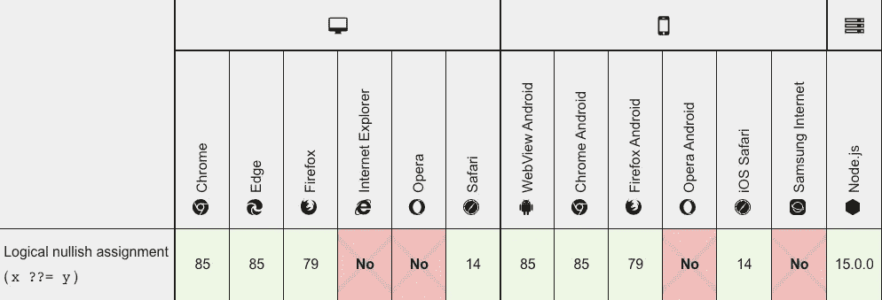
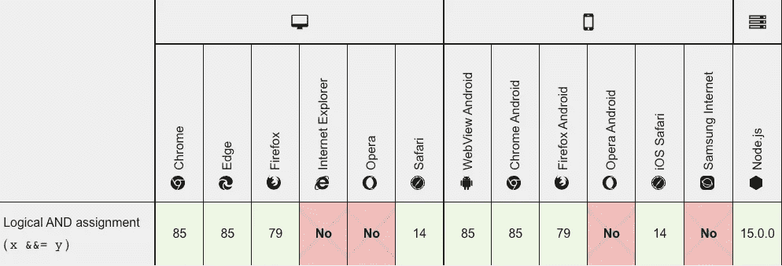

# 3 个新的 JavaScript 操作符

> 原文：<https://javascript.plainenglish.io/3-new-javascript-operators-that-you-can-use-today-649da09df09d?source=collection_archive---------13----------------------->

## 你今天可以使用的


受 Ruby 的启发，下一个 ECMAScript 版本有 3 个新的操作符，您现在就可以使用。

> 这里有这篇文章的视频版本:[https://youtu.be/siqhEc3QnxE](https://youtu.be/siqhEc3QnxE)

# 逻辑零赋值(？？=)

假设您有以下类:

并且您想要设置🐈严格地说，只有在必要的时候，并且只有在它是 nullish 的情况下，因为这是一个开销很大的操作，涉及到一些 DOM 操作，会弄乱页面状态。

## JavaScript 的现状

今天你要做的事情如下:

这就是我们通常测试一个值是否为 falsy 的方法，实际上是为了检查是否为零。

让我提醒您，`!a`检查虚假值，如`false`、`0`、`''`、`NaN`、`null`、&、`undefined`，当我们实际上想要测试无效值(`null`、&、`undefined`)时，bang 语法不会帮助我们。)

## 举例说明 falsy 和 nullish 之间的区别

这里我们不想把`Pepo`指定为猫的名字，规则是，当且仅当那里什么都没有时才指定(nullish。)

当然，我们可以根据新的 Nullish Coallisng 运算符重写我们的赋值。

## 零融合算子

尼利斯👏👏不过，有一点要提醒你，你还记得我们的昂贵的二传手吗？它一直在被调用。

```
Console:
get called Pepo
set called Pepo < but the name was already set, there was no change!
get called Pepo
```

我们可以试着让它变得更懒。让我们试试那个。

## 带有无效合并运算符的惰性设置器

控制台怎么样？

```
get called Pepo
get called Pepo
*************** <- perfect, no call here!
get called Pepo
set called undefined
get called undefined
set called Cleo
get called Cleo <- perfect, now it was called!
```

太好了！但是你不同意`x ?? (x = y)`写起来很复杂吗？

对于这种类型的赋值，我们应该有一个类似于`+=`、`*=`、`-=`的简短语法，但不是算术性质的，而是逻辑性质的:“如果值为 null，则赋值”。

## 逻辑无效赋值

现在，这就是我所说的！

简洁的语法，其中:

*   Setters 不会被不必要地调用。
*   而且，没有重复的代码！

做得好，JavaScript！

## 和睦相处



# 逻辑 AND 赋值(&&=)

你还能想到什么其他的逻辑赋值？

如果我们有“如果为空则赋值”，我们肯定需要“如果为真则赋值”，某种更新操作符。

## 短路评估

与前面的逻辑 Nullish 运算符相同，逻辑 AND 赋值具有内置的短路。

从 MDN Web 文档:

> 从左到右对[逻辑 AND](https://developer.mozilla.org/en-US/docs/Web/JavaScript/Reference/Operators/Logical_AND) 运算符进行评估，使用以下规则测试可能的短路评估:
> 
> `(some falsy expression) && expr`是对 falsy 表达式的短路评估；
> 
> 短路意味着上面的`*expr*`部分没有被**求值**，因此这样做的任何副作用都不会生效(例如，如果`*expr*`是一个函数调用，则调用永远不会发生)。
> 
> 逻辑和赋值短路也意味着`x &&= y`相当于:
> 
> `x && (x = y);`
> 
> 并且不等同于将总是执行赋值的以下内容:
> 
> `x = x && y;`

好光滑！🐼

## 和睦相处



# 逻辑 OR 赋值(||=)

现在，如果测试作业中的错误值是我们想要做的呢？

这就是逻辑或任务的来源！🦸‍♂️

## 短路评估

短路机制与前面的运算符相同，来自 MDN:

> 逻辑 OR 运算符的工作方式如下:
> 
> `x || y;
> // returns x when x is truthy
> // returns y when x is not truthy`
> 
> 逻辑 OR 操作符短路:只有当第一个操作数还没有确定结果时，才计算第二个操作数。
> 
> 逻辑 OR 赋值也会短路，这意味着只有当逻辑运算要对右边求值时，它才会执行赋值。换句话说，`x ||= y`相当于:
> 
> `x || (x = y);`
> 
> 并且不等同于将总是执行赋值的以下内容:
> 
> `x = x || y;`
> 
> 请注意，这种行为不同于数学运算符和按位赋值运算符。

## 和睦相处


# 结论&健康的自我推销

这些新的操作符和 JavaScript 下一版本的新建议真的很令人兴奋，使我们的代码简洁明了，我邀请你在下面的链接中查看 TC39 的工作建议，但在两个问题之前:

1.  您是否发现自己在代码中使用了这些操作符？
2.  你还期待看到哪些 JavaScript 提案最终定稿？

## 如果你想以任何方式支持我

*   [加入我的 YouTube 频道。](https://www.youtube.com/channel/UCIrkqvbX0xx7Rm88kSGJ72Q)
*   订阅我的每月简讯。

# 参考

*   [TC39 提案](https://github.com/tc39/proposal-logical-assignment)。
*   [TC39 规格。](https://tc39.es/proposal-logical-assignment/#sec-assignment-operators)
*   [Node.js v15 宣布支持这些运营商。](https://nodejs.medium.com/node-js-v15-0-0-is-here-deb00750f278)
*   [V8 博客支持新运营商。](https://v8.dev/blog/v8-release-85)
*   [MDN 逻辑无效赋值(？？=)](https://developer.mozilla.org/en-US/docs/Web/JavaScript/Reference/Operators/Logical_nullish_assignment)
*   [MDN 逻辑与赋值(& & =)](https://developer.mozilla.org/en-US/docs/Web/JavaScript/Reference/Operators/Logical_AND_assignment)
*   [MDN 逻辑或赋值(||=)](https://developer.mozilla.org/en-US/docs/Web/JavaScript/Reference/Operators/Logical_OR_assignment)