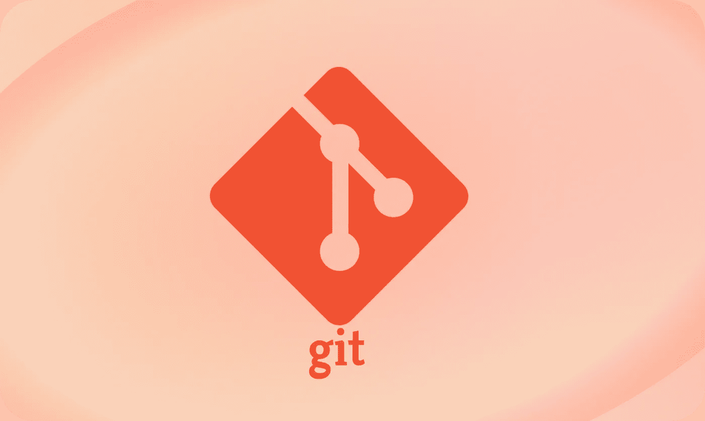
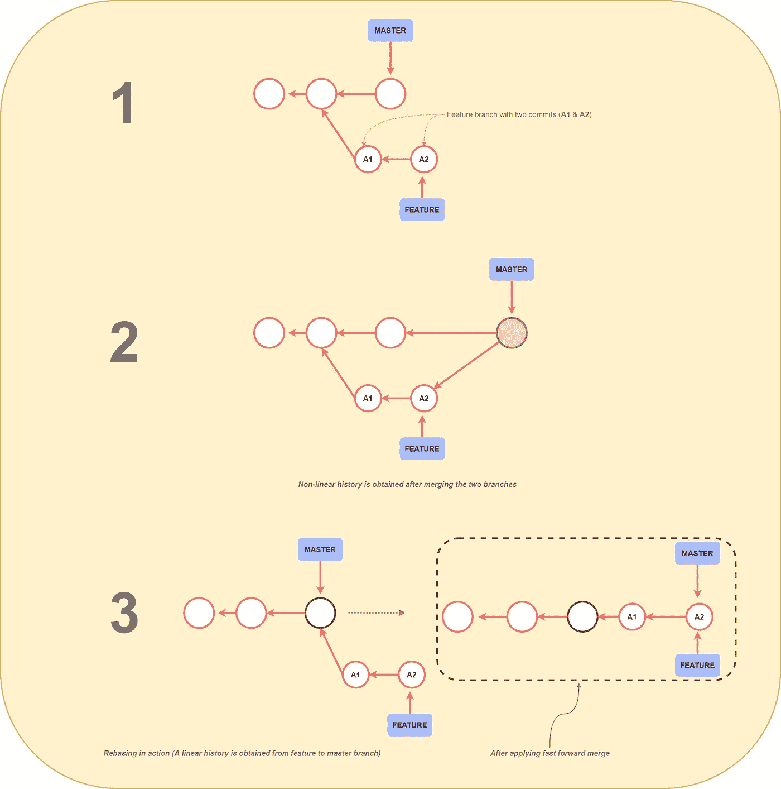
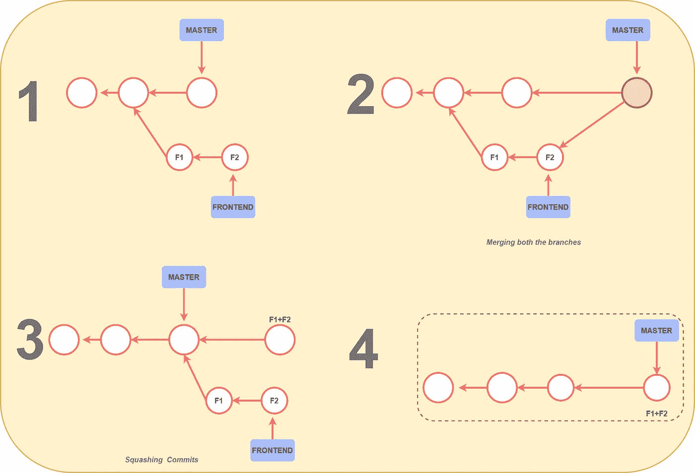
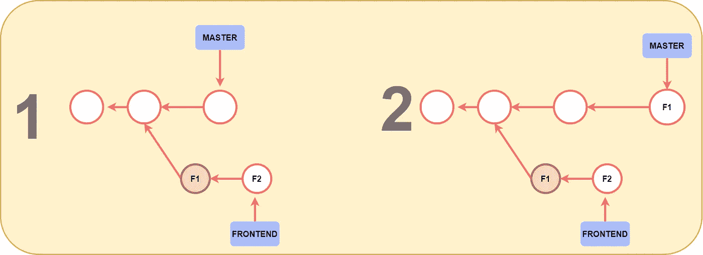

# 面向专业开发人员的 3 个专业 Git 特性

> 原文：<https://javascript.plainenglish.io/3-pro-git-features-for-pro-developers-1b8c649e3f4e?source=collection_archive---------17----------------------->

## 面向专业开发人员的高级 Git 特性。

## 1.重置基础

Rebasing 是 ***Git*** 最好的特性之一，在这里你可以集成从一个分支到另一个分支的变更。在大多数情况下，开发人员在处理特性分支时会用到这个特性，他们可以将当前工作分支的基础从一个提交更改为另一个。这也相当于从不同的提交创建一个分支。

> 从下面的例子中你会更好地理解**换基**:

*   假设您正在处理一个带有几个*提交的**特性**分支。*在这个阶段，如果你想 ***合并*** 这两个分支，你最终会在工作树中有一个非常复杂的*非线性*历史，如下图所示。
*   使用 Git 中的 Rebase 特性，您可以轻松地将**特性**分支移动到**主**分支上的最新提交。合并两个分支后，您将看到一个非常线性的历史。

> ***注意:*** *一旦提交被发布到****公共存储库上，你就不应该对它们进行重新排序，因为重新排序***会用新的替换旧的***。*****

## ****2.挤压合并****

****简而言之，挤压允许您将分支历史中的多个提交合并成一个提交。这样，开发人员可以让他们的存储库更具可读性。****

*******例如:*******

*   ****比方说，您正在一个名为 **FRONTEND** 的不同分支中工作，在那里您已经将多个提交作为 **F1** & **F2 进行了推送。******
*   ****现在，在这个阶段，你可能已经提交了这些不代表*单个逻辑链*的多个提交，或者它们在质量上不如你之前创建的每个提交。****

> ****这就是挤压发挥作用的地方。****

*   ****现在我们不必关心我们的**前端**分支的历史，这允许我们使用 Squash 合并。****

********

*   ****首先，我们必须撤销合并并创建一个新的提交，如下所示( **F1+F2** )。这个提交包含了我们在**前端**分支下所做的所有更改。****
*   ****最后，我们必须在**主**分支的顶部应用这个提交，我们完成了压缩我们的提交。****

> ****注意，在压缩提交后， ***前端*** 分支被移除。****

> ****请注意，我们的最终提交(F1+F2)不是合并提交。它没有对 F1 或 F2 的引用，这只是一个常规的提交，仅此而已。****

## ****3.樱桃采摘****

****Git 的一个强大特性，它允许我们通过引用选择任意的提交并附加到当前的工作头。简而言之，挑选是从另一个分支中挑选一个提交并将其应用到另一个分支的过程。****

*******例如:*******

*   ****比方说，在分支**前端**中，您有一个提交( **F1** )，它包含了您想要在最终版本中使用的一组特殊特性。****
*   ****现在在这个阶段，您可以使用 *Cherry Picking* 轻松地选择这个提交并将其应用到**主**分支上。****

********

> *******注意:*** *不建议总是使用 Cherry Picking，因为它会导致重复提交，有时您可以使用简单的合并来代替 Cherry Picking。*****

**** [## JavaScript 中的 Object.freeze()与 Object.seal()

### 理解 JavaScript 中的不变性

javascript.plainenglish.io](/object-freeze-vs-object-seal-in-javascript-4f66f7d24754)  [## 4 分钟解释大 O 符号

### 用更好的代码构建可伸缩的应用程序

javascript.plainenglish.io](/big-o-notation-explained-in-8-minutes-ded09f8f0f0a)  [## OAuth 在 4 分钟内解释

### 使用 OAuth 进行快速简单的授权

javascript.plainenglish.io](/oauth-explained-in-4-minutes-84081720a4f7) 

*更多内容请看*[***plain English . io***](http://plainenglish.io/)****