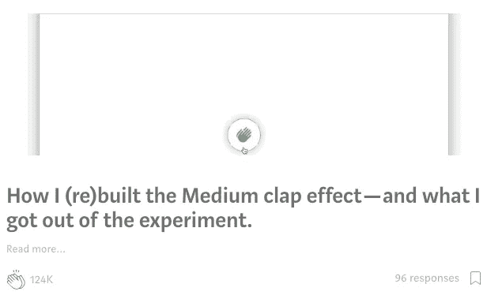

# 3 个你可以在周末做的编程项目想法

> 原文：<https://javascript.plainenglish.io/3-programming-project-ideas-you-can-do-on-a-weekend-3effa685b546?source=collection_archive---------9----------------------->

## 提高你作为程序员的技能。

Photo by [S O C I A L . C U T](https://unsplash.com/@socialcut?utm_source=medium&utm_medium=referral) on [Unsplash](https://unsplash.com?utm_source=medium&utm_medium=referral)

虽然这可能是老生常谈，但熟能生巧。因此，当我们谈论软件或 web 开发时，拥有一些个人编程项目对于那些想要在市场上竞争从而证明自己在一些特定语言或框架方面的技能的人来说至关重要。

此外，创建一个编程项目也是为了走出你的舒适区，挑战你自己去学习新的东西和吸收所有的东西。

从这个意义上来说，你需要记住的第一件事就是你想要创造什么。所以如果你已经有了一个想法，那就把它从纸上写下来！

现在，如果你还没有，不如从我特别为你创作的这个选集里获得灵感？这肯定会增加你的投资组合的价值，并在你的职业生涯中产生影响。

# **重做已经存在的东西**

没创意了？从已经完成的作品中获得灵感。

Photo screenshot by the author [here](https://medium.com/search?q=clap)

即使市场上充满了好的例子，选择一些并重做，应用你认为必要的改进。通过这种方式，您将确保扩展您的知识，同时确保一个功能性的、差异化的应用程序能够真正为用户提供价值。

例如，您可以制作一个类似 Trello 的界面。这样，您将学习如何创建新对象(如列表和卡片)，使用本地存储，在数据库中保存信息，以及验证和操作您的输入。

另一个想法是制作一个简化版的 Spotify，用户可以:

*   保存您的登录信息；
*   确定您最喜欢的艺术家、专辑和曲目。
*   搜索乐队和播放列表；
*   喜欢的物品；
*   并在附近的设备上播放音乐。

# 社会项目

另一个提升你的作品集的好方法是展示多样化的经历，比如志愿者工作。当谈到编程项目时，你可以在开发一个社交项目时将有用和愉快结合起来。

为此，你需要一些倡议、机构、非政府组织或机构(如日托中心、疗养院和孤儿院)的帮助。之后，您应该确定该位置的主要问题，并创建 IT 解决方案来解决这些问题。

这可以从组织库存和供应的系统到计算收到的捐款的软件，无论是否是财务捐款。当然，这完全取决于你想要支持的位置。

# **项目——根据你的口味**

你知道你喜欢的电影、电视剧或游戏吗？创作一些受他们启发的编程项目怎么样？也许你可以创建带有新角色的交互式版本，甚至是测试其他用户知识的测验。

乍一看，这可能看起来很简单，但它肯定会让您在编程生涯中脱颖而出。此外，您将需要选择使用哪些语言、库和框架，这肯定会给您提供新的课程，尤其是在决定体系结构中包含什么和遗漏什么的时候。

你，你已经选择了你的个人编程项目吗？嗯，正如您所看到的，选择比比皆是，现在由您决定！

选择一个或多个编程项目并努力工作。你花在这个过程中的时间并不重要。重要的是你在开发这些项目时会用到的技能和知识。

记住:编程项目更多的是关于你想去哪里。因为创造新的解决方案只是我们工作的一部分。也请享受并与我们分享您的想法。我们很乐意跟踪您的进展，并期待看到您的结果。好运！

*更内容于* [*通俗易懂*](http://plainenglish.io/)