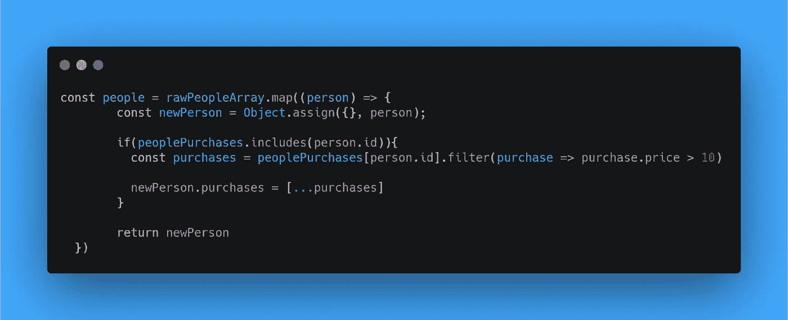
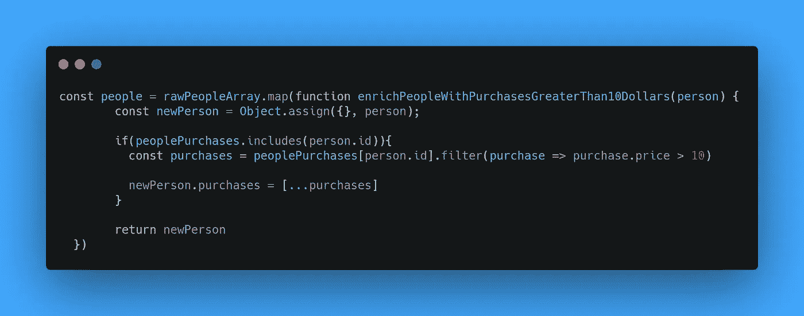
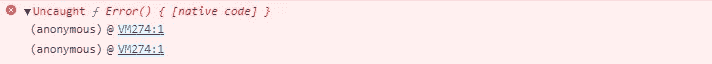
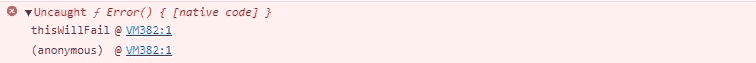

# 不在 JavaScript 中使用 ES6 函数的 3 个理由

> 原文：<https://javascript.plainenglish.io/3-reasons-not-to-use-es6-functions-in-javascript-9e99cc489211?source=collection_archive---------11----------------------->


最近，我看到很多媒体的帖子宣称掌握成为一名优秀程序员的秘密。这些文章经常声称使用“ES6 函数”更好，除非你正在使用它们，否则你不是“JavaScript 开发高手”。

我相信**使用 ES6 函数而不考虑它对整个应用程序的影响是有害的**。就像人们研究数学证明却不明白到底是怎么回事一样。

# 可读性

用写作的轻松来换取阅读的痛苦是不可取的。编码不仅仅是告诉你的计算机做什么，很明显，它是与你团队的其他成员就事情如何完成进行交流。这使得可读性成为编写程序的一个关键概念。考虑这个例子:



你看着这段代码，你会想，好吧。让我们试着理解这里发生了什么。如果我告诉你**而不是**使用 ES6 功能会让我们的生活变得更轻松，你会怎么想？请考虑以下情况:



我们给这个函数起了个名字“enrichpeoplewithpurchasesgreaterthan 10 dollars”，这当然是一个很长的单词，但是现在我们不需要重新阅读这段代码就可以知道发生了什么。我们可以浏览它，而不用投入太多的精力去检查它是否达到了我们的预期。*我们向我们的团队传达了意图，让他们更容易阅读*。

这可能不是一个理想的例子，因为我们在这里脱离了上下文，但我在许多代码库中遇到过很多例子，这可能是你想在代码的某些部分应用的东西。

# 排除故障

当您使用 Node.js 时，通常会有某种日志系统。它可以是外部服务、简单的控制台日志记录，或者将它们流式传输到文本文件。

当我们在代码中遇到异常时，我们想知道它们发生在哪里。无法查明问题的确切原因可能会给你和你的团队带来相当大的挫折。这就是为什么您可能要重新考虑在代码的某些部分使用 ES6 粗箭头函数。

在您的浏览器控制台中，编写如下内容:

```
(() => { throw Error })();
```

我们基本上是自动执行一个抛出异常的函数。结果将是这样的:



太好了。(匿名)。想象一下这是由你的后端代码抛出的。祝你好运找到你的异常的原因。

现在，在您的浏览器控制台中，编写以下内容:

```
(function thisWillFail() { throw Error })();
```

这将导致以下错误:



注意到区别了吗？我们知道“thisWillFail”函数出错了。这就是为什么我提倡在调试很重要的场景中使用函数表达式。相信我，应用这个可以防止你每次遇到那些讨厌的匿名错误时用头撞墙。

# 回调函数

在 JavaScript 中,`this`是一个棘手的关键字，如果你是一个 JavaScript 开发人员，你会遇到这个问题。`this`关键字非常强大，因为它允许我们根据调用函数的方式来改变上下文。

然而，使用胖箭头函数，当你的函数被声明时，上下文是静态绑定的，并且不能被改变。有时你可能想在全局范围内使用`this`关键字，然而，对于事件回调函数来说，情况并不总是这样。

考虑:

```
const btn = document.getElementById('example-btn');
btn.addEventListener('click', () => {
    this.innerHTML = 'Clicked button';
});
```

这没用的。在 ES6 函数中，如果函数在全局上下文中注册，`this`关键字指的是窗口。在这个例子中，这意味着`this.innerHTML`等于`window.innerHTML`，这并不是我们真正想要的。

在这种情况下，我们需要使用函数表达式:

```
const btn = document.getElementById('example-btn');
btn.addEventListener('click', function changeText() {
    this.innerHtml = 'Clicked button';
});
```

这能行！我们的回调函数的上下文现在指向我们的按钮`this`，运行`this.innerHTML`将导致按钮文本的改变。

你可能会说我们可以使用传递给我们函数的事件对象，但是，我们必须解析我们正确的目标，你可能已经注意到其他的边缘情况可能会支持。

# 结论

在这篇文章中，我分享了为什么使用 ES6 功能并不总是更好的 3 个原因。写代码没有最好的方法。应用程序差别很大。您可能不希望在 react-native 中使用函数表达式进行调试，因为它们没有什么价值。但是，它在 Node.js 应用程序中可能有很大的价值。

与您的团队就这些主题进行交流，并尝试找到中间立场，在这个立场上**可读性、调试和性能**是关键指标。

*更多内容请看*[***plain English . io***](http://plainenglish.io/)