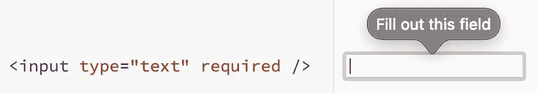
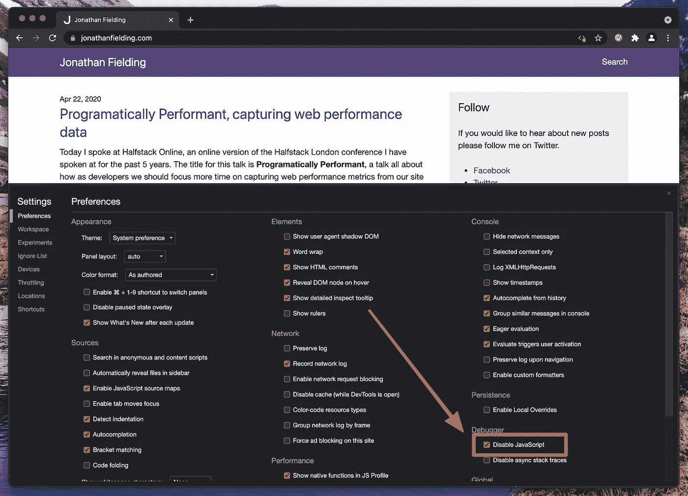

# 你的网站的 JavaScript 不能像你期望的那样运行的 3 个原因

> 原文：<https://javascript.plainenglish.io/3-reasons-why-your-websites-javascript-might-not-run-like-you-expect-b9fe66f75e7e?source=collection_archive---------7----------------------->

Photo by [Andrew Neel](https://unsplash.com/@andrewtneel?utm_source=unsplash&utm_medium=referral&utm_content=creditCopyText) on [Unsplash](https://unsplash.com/s/photos/website-error?utm_source=unsplash&utm_medium=referral&utm_content=creditCopyText)

我最近在帮助一个正在学习建立网站的人，并且正在寻找一些有用的资源与他们分享，这时我看到了凯瑟琳·霍奇的这篇文章:

 [## 如何用 JavaScript 创建交互式网站

### 了解如何使用 JS 使静态网站具有交互性

medium.com](https://medium.com/@blondiebytes/how-to-create-interactive-websites-with-javascript-627a6d998fed) 

在建议他们检查一下之后，他们说他们发现这非常有帮助，因为他们真的很喜欢 Kathryn 通过在页面上添加 JavaScript 来说话的方式。

他们真的很喜欢如何使用 JavaScript 来增加交互性，当我们交谈时，我提到他们不应该总是依赖它，因为有时它并不总是可用的。

这引发了一场关于当 JavaScript 由于网络问题或者甚至当用户主动禁用 JavaScript 时会发生什么的长时间讨论，这也启发我写了这篇文章，列出了 JavaScript 可能无法在用户浏览器中运行的三个原因。

# 为什么您的 JavaScript 不能在用户浏览器中运行？

首先，让我们更详细地了解一下为什么您编写的 JavaScript 可能无法被您的用户浏览器执行。

虽然 JavaScript 可能无法执行的原因有很多，但大多数原因可以归为三个不同的类别:

## 用户在其浏览器中禁用了 JavaScript。

在这个场景中，用户(或者他们的 IT 部门)已经做出了禁用 JavaScript 的明智决定。最常见的原因是对安全性的担忧，尤其是在旧式浏览器中，JavaScript 的沙箱也没有实现。

在这种情况下，这是用户做出的选择，如果你在 reddit 上看到[这个帖子，你是否应该支持这些用户可能是一个有争议的话题。不支持这些用户的最常见的理由是，他们已经选择禁用开发人员需要依赖的核心平台功能。](https://www.reddit.com/r/webdev/comments/c0bbhr/should_we_continue_developing_for_users_without/)

虽然我个人认为在一定程度上支持这些用户是有意义的，但这不会是我选择支持没有 JavaScript 的用户的主要原因。

## 用户浏览器在呈现您的页面时失去连接，JavaScript 无法下载

在第二个场景中，想象一下你的用户在火车上，他们的互联网连接很糟糕，他们设法下载了你的网站的 HTML 和 CSS，但是他们没有下载你的 JavaScript。

作为一名用户，这种情况已经发生过很多次了，在我下班回家的路上，我的火车开进了隧道。如果页面完全依赖 JavaScript 运行，我通常会发现在这种情况下，网站会变得完全不可用。如果页面本质上是信息性的，并且不依赖于 JavaScript，我至少可以在等待我的连接再次可用时阅读内容，这样网站就不会在这种情况下完全崩溃。

## JavaScript 中的异常导致 JavaScript 无法执行。

在最后一个场景中，用户的浏览器已经下载了包括 JavaScript 在内的所有资源，但是一个异常导致 JavaScript 停止执行。

用户可能会遇到 JavaScript 异常的原因有很多，其中包括:

*   网站 JavaScript 正在使用其浏览器不支持的 JavaScript API
*   第三方依赖项(如 Google Analytics)没有加载，主 JavaScript 在引用它时出错
*   开发人员将应用程序的不完整版本部署到生产环境中(我们都经历过，不要担心)
*   应用程序逻辑中的边缘情况可能会导致意外错误

在这种情况下，除了用手指交叉刷新页面之外，用户没有办法自己解决问题。它们可能是开发人员发现问题并解决问题的突发奇想。

# 如果没有 JavaScript，你能做些什么来支持用户呢？

现在我们了解了哪些情况会导致您的 JavaScript 无法在您的用户浏览器中执行，让我们看看在这些情况下您可以做些什么。

## 与 JavaScript 实现相比，更喜欢使用浏览器实现特性

在没有 JavaScript 的情况下，处理好站点的第一种方法是依赖浏览器的功能实现，然后逐步增强以添加额外的功能。

一个很好的例子就是表单验证，因为 HTML5 在 2014 年完成，我们有一种方法可以直接在用户浏览器中进行表单验证。完整的文档可以在 MDN 上找到([https://developer . Mozilla . org/en-US/docs/Learn/Forms/Form _ validation](https://developer.mozilla.org/en-US/docs/Learn/Forms/Form_validation))

Example of a required field with HTML5 validation

在您对没有 JavaScript 的工作方式感到满意之后，您可以用 JavaScript 增加内置的验证功能，使其更符合您和您的团队的需求。这意味着，只要您的表单请求也能被您的服务器处理，即使 JavaScript 不可用，表单也能很好地工作。

## 在浏览器中禁用 JavaScript 的情况下进行测试

Google Chrome screenshot of the disable JavaScript dialog.

支持没有 JavaScript 的用户的另一种方法是自己测试你的网站，这样你就可以看到在这种情况下什么是行不通的。

出于测试目的，大多数主流浏览器都支持禁用开发工具中的 JavaScript。以 Chrome 为例(如上图),你可以在 Devtools 的 settings 标签中找到设置。

一旦您禁用了 JavaScript，您可以重新加载页面，它将加载没有 JavaScript。然后你应该像平常一样测试你的网站，检查你的链接是否还能正常工作，用户是否还能提交你的表单等等。

## 当某些东西可能不工作时告诉用户

最坏的情况是你的网站上有一些功能是不可能提供后备的，在这种情况下，最好的选择是让他们知道哪里出了问题，以及他们如何自己解决问题。

对于那些禁用了 JavaScript 的人来说，这相当简单，因为您可以使用`<noscript>`标签来显示消息。

对于那些启用了 JavaScript 的用户来说，这个问题通常会更难解决，检测他们的 was 问题也会更难。您可以尝试的一个技巧是在 HTML 文档中内嵌一点 JavaScript，它会显示一条消息，提示加载应用程序时出错。告诉用户如何尝试自己解决问题(通常是刷新或清除 cookies 本地存储)，或者如何寻求支持帮助。

# 概括起来

正如我们所看到的，在很多情况下，用户可能会体验到没有 JavaScript 的站点。在这种情况下，你应该至少提供一个基本的体验，让你的用户仍然能够使用你的网站。

有些情况下，没有 JavaScript 就无法提供任何体验，比如桌面替代应用，如 Google Docs 或 GitHub CodeSpaces。在这些情况下，重要的是向用户提供清楚的消息，告诉他们如果出错会发生什么，如果可能的话，使用像 service worker 这样的技术来允许后续的页面加载已经有可用的 JavaScript。

*更多内容尽在*[***plain English . io***](http://plainenglish.io)