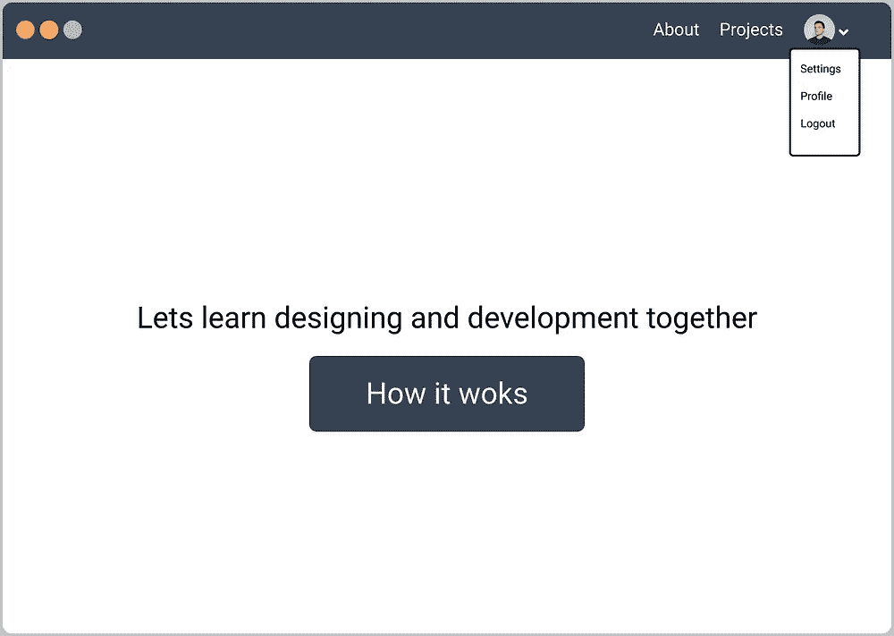
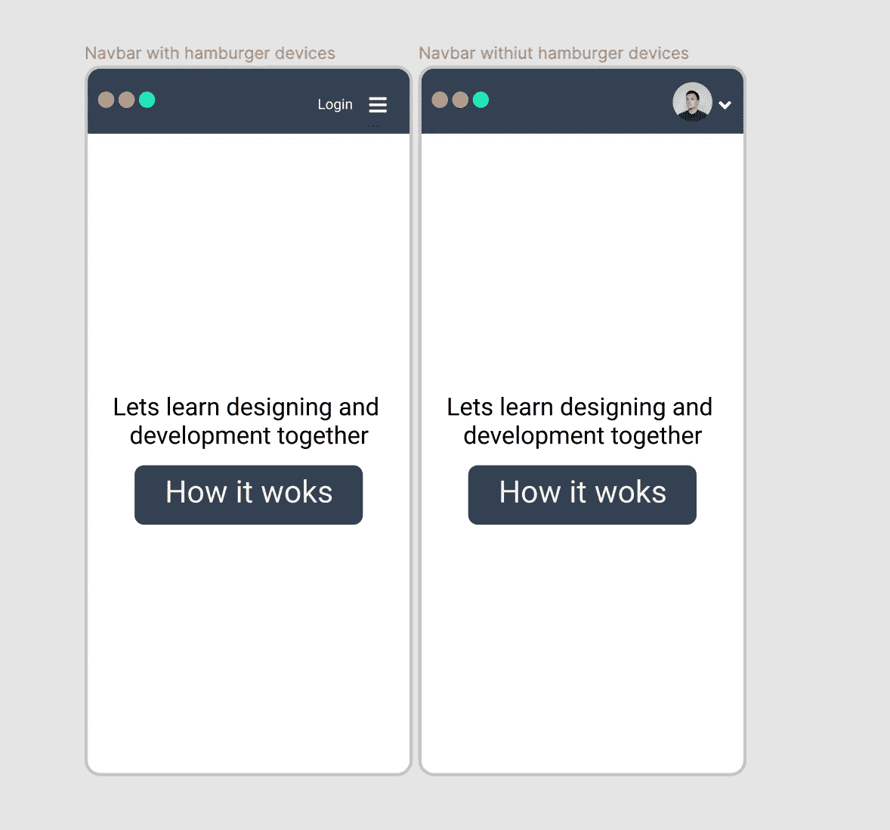
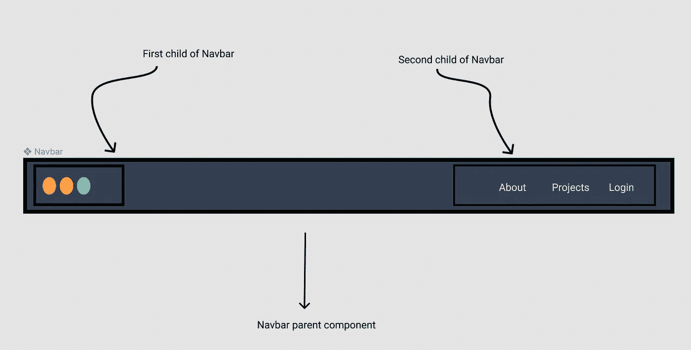

# 开发响应性 navbar 的 3 个步骤

> 原文：<https://javascript.plainenglish.io/3-steps-for-developing-responsive-navbar-af5a145cf662?source=collection_archive---------20----------------------->

在 50 毫秒内，用户对你的网站产生了第一印象。


[Website](http://ihatereading.in)

# 在后台

Navbar 是将用户重定向到应用程序的正确路径和页面的地方。为什么反应能力起着重要的作用？因为非对称排列的路线会给用户留下非常糟糕的印象。根据一份报告，只有 50 分钟的用户会给你的网站留下第一印象。专注于你网站上的特定关键文本需要 2.6 秒。

```
[https://cxl.com/blog/first-impressions-matter-the-importance-of-great-visual-design/](https://cxl.com/blog/first-impressions-matter-the-importance-of-great-visual-design/)
```

没有一个响应迅速的导航条和正确的路线肯定会降低用户保留率。因此，理解和考虑响应能力很重要。我们将直接跳到开发响应性 navbar 的过程和方法。

## 声明显示和隐藏的路由

你可能会认为我会从设计开始，然后编写代码。不，第一步也是最重要的一步应该是你认为应该显示的路线，隐藏的路线应该清楚。这使得设计和开发都很容易。



The Navar for logged in and logout user

路由列表既包括受保护的路由，也包括应在较小设备的下拉列表中显示的路由。列出所有路线和类别及其可见性状态。

*   **登录** —这应该在所有设备中都可以看到，并且只有在用户没有登录的情况下才能看到
*   **首页图标**——在任何情况下都应该出现在所有设备上。
*   **配置文件** —应仅针对登录用户出现，并将显示在所有设备的下拉列表中。
*   **注销**——这应该只出现在已登录的用户身上，并且会显示在所有设备的下拉列表中。
*   **关于-** 该路线应该对所有用户可见，对于较小的设备将显示在下拉列表中
*   **用户头像**——头像将只显示给登录的用户，这将是一个下拉列表，具有注销和作为孩子的个人资料。
*   登录&用户头像不能完全出现。

这些情况取决于路由的数量和应用程序的类型。在开始开发或设计部分之前，一定要试着写下来。

## 设计所有设备尺寸的 navbar

下一部分是设计 navbar 的基本外观。设计每一个屏幕大小的导航条和使用一些设计软件并不是强制性的。您甚至可以用笔和纸来打造 Navbar 的外观。这大大有助于使代码可重用，并处理边缘情况，如跨所有设备的响应。



The navbar in smaller devices with icon and avatars for logout and logged-in users.

## 将 Navbar 视为两个盒子的组合

这种单一的方法对我帮助很大。我能够将网络和桌面应用程序中的所有东西视为一张卡片，这确实有助于我快速开发组件，并使它们可重用。如果你不相信通过阅读本文来获得更多的理解，我用了一个真实世界的例子来证明这个类比有很大的帮助。

[](/everything-in-react-native-starts-with-cards-and-ends-with-cards-7d35979f6023) [## React Native 中的一切都是以卡开始，以卡结束

### 开发可重用组件的秘密。

javascript.plainenglish.io](/everything-in-react-native-starts-with-cards-and-ends-with-cards-7d35979f6023) 

让我快速解释一下，我们有一个 navbar 组件，它有两个框元素，一个是公司的徽标，另一个是路线的集合。navbar 组件是简单的排列和对齐元素的伸缩顺序，在它们之间的空间，在中心垂直对齐。



The analogy of treating everything as a box element in UI

这样，父 navbar 组件就不必关心显示哪条路线和隐藏哪条路线。这个决定应该由导航栏的第二个子组件做出。navbar 组件唯一的工作就是按照 flex 顺序排列它们。

这两个子组件是徽标组件和路线组件。徽标组件决定徽标的响应和排列，同样，路由组件将决定在哪些设备上以何种特定顺序显示哪条路由。

> 基本上，每个组件都应该注意它唯一的直接后代的排列。

# 摘要

*   决定何时在哪些设备上显示哪条路线
*   为登录和注销的用户创建跨多种设备的 navbar 示例设计。
*   将 UI 中的所有东西都视为一个盒子元素，这样可以创建一个响应性的导航条和可重用的代码。

# 结论

今天就到这里，别忘了跟着我，我会很高兴和受到鼓励。下次再见，祝大家愉快。

```
For more such stories visit our website 💻 [**iHateReading**](http://ihatereading.in)
```

[](https://medium.com/nerd-for-tech/theming-and-theme-switching-in-react-8dc99797ed49) [## React 中的主题化和主题切换

### 这是一个有趣而强大的游戏，让我来教你怎么做。

medium.com](https://medium.com/nerd-for-tech/theming-and-theme-switching-in-react-8dc99797ed49) [](https://medium.com/geekculture/using-bootstrap-with-react-application-66037e808db5) [## 在 React 应用程序中使用引导程序

### 通过 React 使用最流行的前端框架。

medium.com](https://medium.com/geekculture/using-bootstrap-with-react-application-66037e808db5) 

*更多内容尽在*[*plain English . io*](http://plainenglish.io/)