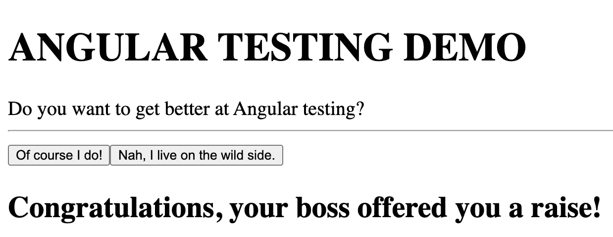
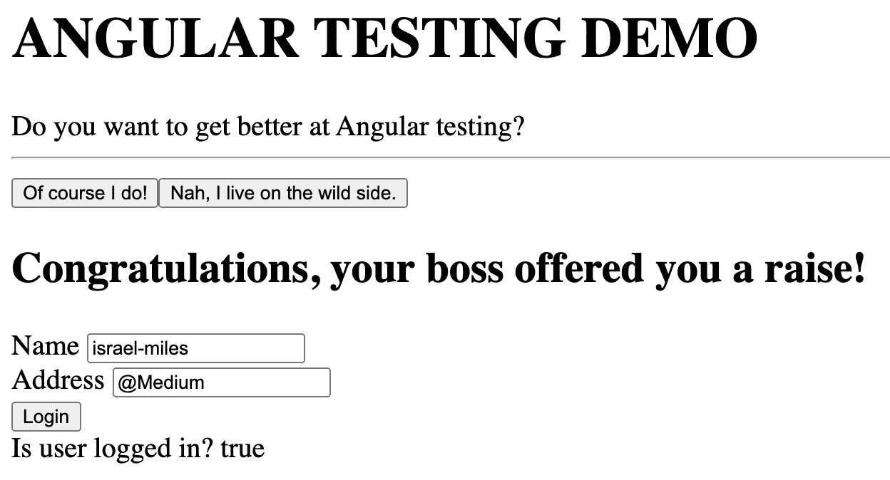

# 3 个测试策略来提升你的角度发展

> 原文：<https://javascript.plainenglish.io/3-testing-strategies-to-level-up-your-angular-development-d70bc43d88a6?source=collection_archive---------4----------------------->

## 测试用户界面，窥探对象等等！


Made with [DeepDreamGenerator](https://deepdreamgenerator.com/), feel free to share!

一套健壮的单元测试对于创建可维护和可扩展的软件仓库至关重要。全面的测试套件确保工程师所做的任何更改都不会破坏任何先前的功能。您的测试覆盖的行为案例越多，您就越有信心创建出行为符合预期的软件。

在本文中，我们将介绍使用 Jasmine 和 Karma 为 Angular web 应用程序编写有效测试的多种方法。这些测试策略将允许您创建更多的适应性测试套件，文章的结构如下:

1.  **项目设置**
2.  **测试 HTML 元素**
3.  **添加用于测试的假登录组件**
4.  **如何测试间谍**
5.  **如何进行模拟测试**

如果您只是对测试感兴趣，粗体显示的步骤是为您准备的！

**注:**本教程假设您对 Jasmine 和 Karma 的打字稿和角度测试有基本的了解。

# 1.项目设置

我们将从头开始一个新的项目来测试。这一部分值得一读，因为我们也将回顾测试配置。首先，我们需要创建一个新的角度应用程序。然后我们将创建一个名为`dashboard`的新组件。

```
$ ng new testing-demo
? Strict type checking ? yes
? Angular routing ? no
? Which stylesheet ? Less
$ ng generate component dashboard
```

在您喜欢的代码编辑器中打开`testing-demo` Angular 项目。删除`app.component.html`中的所有代码，替换为`<app-dashboard></app-dashboard>`标签。

删除`app.component.spec.ts`中的`'should render title'`测试。

现在我们可以移动到组件本身了！

## 仪表板.组件. ts

我们的组件类只有一些简单的逻辑来基于一些按钮更新文本。我们将有两个变量`title`和`userFeedback`来验证我们的测试。

## dashboard.component.html

我们组件的视图将只有几个`div`元素。这将代表一个用户仪表板，它包含了我们需要的基本 UI 测试的所有细节，比如类和 ID 标志中包含的信息。我们还将`sayYes()`和`sayNo()`功能附加到它们各自的按钮上。

如果您单击其中一个按钮，该网站将如下所示:



## 仪表板.组件.规格

现在我们已经有了组件的视图和类，我将给出一个简短但重要的关于我们相应的测试类的概述。这些代码应该都是自动生成的，但是知道为什么我们有两个`beforeEach()`调用是很有用的。

我们有两个原因与 Jasmine 测试的异步特性有关。第 8 行的第一个`beforeEach()`负责编译一个组件。它通过`.compileComponents()`函数来实现，这是异步的。

在我们确定组件已经编译之后，我们可以在第 15 行开始的第二个`beforeEach()`中创建组件的一个实例。然后我们在`fixture`上调用`detectChanges()`来验证任何异步更改。

好了，现在我们有了基本的应用程序，我们可以继续我们的测试策略了！

# 2.测试 HTML 元素

首先，我们需要更新导入的库。我们将使用`fakeAsync`和`tick`来使我们的异步代码看起来同步。我们还将使用`By`库来访问组件的 HTML 属性。

## 定义测试和组件之间的契约

接下来，我们需要定义测试套件和视图之间的契约。一个简单的方法是定义常量，我们将使用这些常量来验证组件中的值。在这样做的时候，我们可以把我们的测试看作是我们的应用程序应该如何出现和表现的真实来源。如果你有一个更有效的方法来定义你的测试和代码之间的契约，请在文章的最后评论你的反馈！

继续，在`'DashboardComponent'`测试套件的`dashboard.component.spec.ts`中添加以下常量。

## 我们的第一个 HTML 验证测试

从这里，我们可以根据显示的 HTML 创建我们的第一个测试。第一行只是验证我们的组件与我们的测试套件具有相同的`title`值。在第 3 行，我们使用`By`库来访问视图中的`h1`标签。然后，我们可以在测试中验证视图的`title`与契约的`componentTitle`是否相同！

## 根据 HTML 类和 id 值进行测试

我们显然希望比标准的 HTML 标签更具体。为了访问特定的`class`或`id`中的值，我们必须使用一些有趣的 TypeScript 一行程序。我们可以通过访问`fixture.debugElement.nativeElement.querySelector('<id>')`来引用 HTML id 值。

这样，我们可以通过上面定义的合同常量值来验证`yes-btn`和`no-btn`是否具有预期的文本。此外，我们可以在第 11 行使用`By`库引用整个类来进行仪表板内容测试。在第 14 行，我们验证了该类的 HTML 不为空，然后我们可以在第 15 行验证该类中有 0 个以上的元素。

## 使用 fakeAsync & tick 验证按钮单击事件行为

Jasmine 测试的当前最佳实践是使用`fakeAsync()`和`tick()`使异步代码看起来同步。我们不需要嵌套`fixture.whenStable()`调用，而是可以在一个异步事件(比如`button.click()`)之后调用`tick()`来等待任何逻辑完成，然后再移动到下一行代码。

在这个测试中，我们还验证了单击我们的一个按钮会导致 id `#user-feedback`中的 HTML 不为空。

现在，您应该有 5 个通过测试，验证了大部分 UI 逻辑。不错！

# 3.添加假登录组件

为了继续我们的最后一节，使用间谍和模拟进行测试，我们需要在我们的应用程序中有更多的逻辑来测试。我们将创建一个剥离下来的角度形式，伪造用户登录。本文的重点不是向您展示如何在 Angular 中创建服务，所以我们将尽可能保持事情的简单性。

首先，创建一个名为 login 的新组件。

```
$ ng generate component login
```

我们还需要在`app.module.ts`中包含正确的表单库，应该是这样的:

现在开始定制我们的组件。

## login.component.html

我们将使用一个简单的表单，它有两个字段，`name`和`address`。当我们点击`Login`时，我们将调用`(ngSubmit)`，它将引用`login.component.ts`中的`onSubmit()`方法。我们在末尾还有一个`div`,显示用户是否登录的布尔值。

## 登录.组件. ts

保持事情超级简单，我们只是在组件中有一些东西。我们在类构造函数中使用传入的`_formBuilder`创建`checkoutForm`。然后我们用`onSubmit()`方法伪造登录逻辑。

如果你点击通过网站，它现在应该看起来像这样。



好了，现在我们有了一点逻辑，回到测试！

# 4.如何用间谍测试

对于一个简单的任务——检查代码的某些部分是否被调用，间谍是一个有趣的名字。在`login.component.spec.ts`文件中，我们添加了以下代码。

重要的测试从第 31 行开始。我们在 Angular 中使用了`spyOn`关键字，这样我们就可以“观察”组件中的`onSubmit`方法。然后我们创建一个登录按钮的测试实例。再次使用`fakeAsync()`和`tick()`，我们异步调用登录按钮上的`click()`事件。最后，我们可以验证是否调用了`onSubmit()`组件方法，并利用 spy 实现我们的第一个测试！

虽然这是一个有限的例子，但有角的间谍非常简单灵活。通过利用 Angular 中的`spyOn`关键字，您可以覆盖非常广泛的测试用例。例如，您可以监视`console`来查看日志或错误字段。

你甚至可以窥探`window`房产！假设你有某种方法，如果历史长度大于 1，它会把你送回上一页。您可以监视`window.history`的`'back'`方法。然后，您可以监视属性`window.history`并将值设置为 2。在调用您的方法之后，您可以验证`window.history.back`确实被调用了。

> 通过利用间谍，你可以确保你的代码逻辑按照你期望的方向和顺序流动。这是一个非常强大的工具，所有工程师都应该在需要时使用。

# 5.如何用模拟测试

共同目标的另一个有趣的名字。比方说，我们的登录组件实际上调用一些 API 作为依赖来验证用户是否有帐户。如果您想要编写一个针对`onSubmit()`方法的测试，您不会想要引用任何外部依赖。如果服务中断了怎么办？服务的延迟是什么？如果 API 调用是有成本的呢？

您希望您的测试完全独立于这种逻辑。让我们修改我们的`login.component.ts`类，使之包含一个助手类，我们将把它看作一个依赖项来验证用户是否创建了一个帐户。

我们创建了一个助手类`FakeLoginVerificationService`，它有一个方法`verifyLogin`，以名字和地址作为参数。显然，这里验证用户帐户的逻辑要多得多，但是我们的例子可以很简单。注意我们如何使用类的`Injectable()`包装器，通过使用依赖注入作为框架，Angular 非常强大。

**提示:**使用依赖注入允许模拟轻松替换测试套件的依赖。如果你需要关于依赖注入的回顾，这里有一个很棒的视频:

这是最终的结构:

现在，`onSubmit()`将引用这个助手类作为依赖项。我们现在可以制作一个模拟来代替测试中的`FakeLoginVerification`类！

首先我们需要将`FakeLoginVerificationService`导入到我们的`login.component.spec.ts`测试文件中。然后我们创建一个新的类`MockLoginVerificationService`，它拥有我们在登录组件`verifyLogin()`中使用的方法。记住，`verifyLogin()`通常是对一些外部 API 依赖的调用。我们希望我们的测试是独立的。

因此，在`MockLoginVerificationService`中，我们定义`verifyLogin()`来返回我们想要的任何布尔值。就是这样！这样做，我们可以创建测试来验证我们自己的代码逻辑，而不必依赖于我们是否可以访问外部依赖项。

现在在我们的测试设置中，我们需要告诉测试使用我们的`MockLoginVerificationService`而不是`FakeLoginVerificationService`。我们首先在第 4 行实例化服务，然后使用`providers`声明我们想要使用模拟服务来代替第 15–17 行的假服务。

现在我们准备在测试中使用模拟！这里我们添加了两个测试，通过声明`authenticated`值为真或假来模拟`FakeLoginVerificationService`。然后，当我们调用`component.onSubmit()`时，它有一个测试服务可以调用，我们可以验证一个经过身份验证的用户是否应该将`isUserLoggedIn`设置为 true，反之亦然。

**注意:**我们也可以模拟出`component.checkoutForm.value.name`，但是对于有角度的内置表单通常不需要，因为我们可以覆盖这个值。

这似乎是一个有限的例子，但是就像 spied 一样，只要遵循 Angular 中使用的依赖注入模式，就可以很容易地使用模拟来替换依赖。通过这种方式，您总是可以用您自己的方法替换您自己的模拟，以便您可以控制您的测试的确切行为。只需在您的模拟类中包含与函数依赖项相同的签名，并带有您可以指定的返回值！

您现在已经学习了三种在 Angular 中测试的新方法，使用 HTML 的`By`库、函数调用的 spies 和替换外部依赖的 mocks。干得好，走了这么远！

# 最后的想法

以下是这篇文章中关于如何提高 Angular 测试技巧的重点！回顾一下，您希望在未来确保使用的要点和最佳实践包括:

*   应该总是使用 Jasmine 框架中的间谍来测试服务。
*   针对具有服务依赖关系的组件的测试应该总是使用模拟服务来代替真正的服务。
*   两次调用`beforeEach()`方法很重要。确保异步组件编译逻辑在第一次调用中，同步组件初始化逻辑在第二次调用中。
*   总是通过`debugElement`而不是`nativeElement`访问 DOM。这将防止不必要的错误，因为`debugElement`也将提供来自底层运行时环境的抽象。
*   知道`By.css`和`.queryselector`的区别，`By.css`是首选方法，因为`.queryselector`只在浏览器中起作用。如果应用程序在服务器上运行，测试可能会失败。

我希望这篇文章值得你花时间，并且你能够学到一些新的东西。这篇文章涉及了大量的设置，所以如果你想知道更多关于这些测试策略的细节，请告诉我！我在这些教程上花了很多时间，所以如果你有任何建设性的批评或者你想让我涵盖的新话题，请在下面留下评论。感谢阅读！