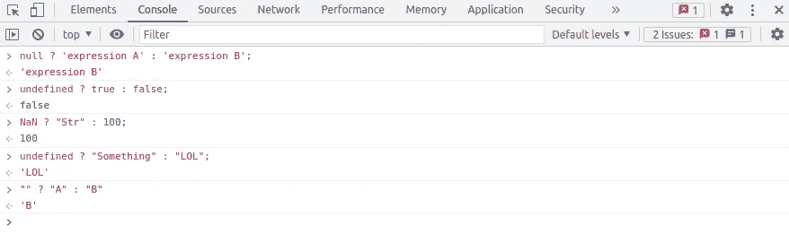
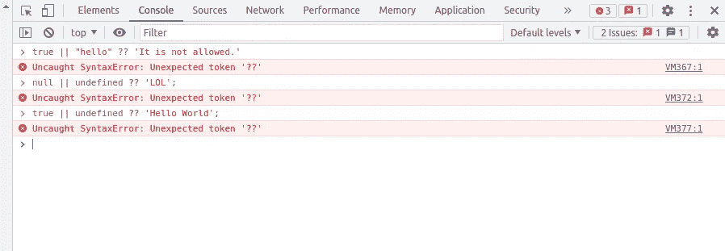
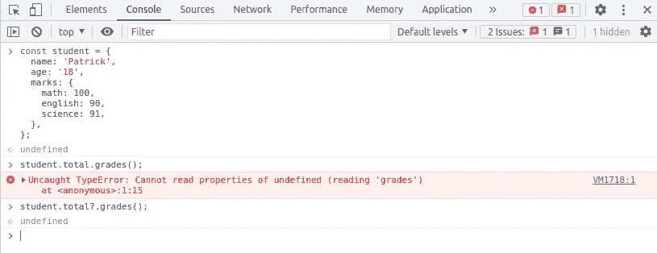

# “？”的 3 种用法在 JavaScript❓

> 原文：<https://javascript.plainenglish.io/3-uses-of-in-javascript-why-pro-developers-love-using-javascript-operator-565bc8b235a4?source=collection_archive---------3----------------------->

## 怎么(？/ ?？/ ?。)运算符在 JavaScript 中工作，以及为什么开发人员喜欢使用它们

在这篇文章中，我将讨论**的 3 种可能的用例。**在 JavaScript 中。专业级开发人员喜欢使用 JavaScript **？**运算符，因为它缩短了代码，使代码更简洁。

**让我们开始**

1.  ( ?)三元/条件运算符
2.  ( ?？)无效合并运算符
3.  ( ?。)可选链接


Photo by [Emily Morter](https://unsplash.com/@emilymorter?utm_source=medium&utm_medium=referral) on [Unsplash](https://unsplash.com?utm_source=medium&utm_medium=referral)

# 1️⃣ ( ?)三元/条件运算符

JavaScript 问号运算符**(？)**被称为三元/条件运算符。三元运算符基本上是传统的[**if…else**](https://developer.mozilla.org/en-US/docs/Web/JavaScript/Reference/Statements/if...else)**语句的简写。如果你的 if…else 语句在 **if** 和 **else** 的代码块中只有一条语句，那么使用**的最佳位置是？**操作员。这将减少代码行的数量，并且代码看起来更加整洁。**

**✔️ **语法****

```
Condition **?** expression A : expression B;
```

**我们检查条件是否为**真**，**表达式 A** 将被返回，如果条件为**假**，则表达式 B 将被返回。**

**➡️ **举例子****

**让我们假设**恒定速度= 125** ，我们想根据速度值设置**罚值**。**

****使用 if…else****

```
let penalty;if(speed > 0 && speed < 120) {
  penalty = 0;
} else {
  penalty = 50;
}console.log(penalty);
// 50
```

****使用三元运算符(？)****

```
const penalty = (speed > 0 && speed < 120) ? 0 : 50;
console.log(penalty);
// 50
```

**从上面的比较中可以看出，if…else 代码通过使用三元(？)运算符。**

## **🧠 **牢记在心****

**除了假条件外，如果条件值为 **null** 、 **NaN** 、 **0** 、 **undefined** 或一个**空字符串**，那么结果也将是**表达式 B** 。**

****

**If condition is null, NaN, 0, undefined or an empty string then how ? operator works**

# **2️⃣ ( ?？)无效合并运算符**

**列表中的第二个操作符是一个非常有用的 JS 操作符。JavaScript 双问号运算符**(？？)**被称为零化凝聚算子。它是一个逻辑运算符，当其左侧操作数为 [null](https://developer.mozilla.org/en-US/docs/Web/JavaScript/Reference/Global_Objects/null) 或 [undefined](https://developer.mozilla.org/en-US/docs/Web/JavaScript/Reference/Global_Objects/undefined) 时，返回其右侧操作数，否则返回其左侧操作数。让我们看看它的语法，然后是例子。**

**✔️ **语法****

```
expression A **??** expression B;
```

**简单来说，如果**表达式 A** 导致**空**或**未定义，**那么结果将是**表达式 B**；否则，结果将是**表达式 A** 。如果你还是不明白，不要着急，我们来看看下面的一些例子。**

****

**Photo by [Jamie Haughton](https://unsplash.com/@haughters?utm_source=medium&utm_medium=referral) on [Unsplash](https://unsplash.com?utm_source=medium&utm_medium=referral)**

**➡️ **例子****

```
const A = null ?? 'default for A';
const B = '' ?? 'default for B';
const C = 42 ?? 0;console.log(A); 
// 'default for A'
console.log(B); 
// '' (as the empty string is not null or undefined)
console.log(C);
// 42
```

**简单好记:如果**左侧？？**表达式结果/值为**空**或**未定义，****结果将在**右侧？？**。除此之外，结果将是表达式结果/值的左侧。希望现在有意义了。****

****🚫**需要记住的特殊情况？？运算符(不允许)******

****不允许在**左侧使用**和** ( & &)和**或**运算符(||)？？**操作员。在这种情况下，它将抛出一个 SyntaxError。如果您尝试下面的代码，您会看到它会在控制台中抛出错误。****

```
true || 'hello' ?? 'It is not allowed.';null || undefined ?? 'LOL'; true || undefined ?? 'Hello World'; 
```

****

**Syntax Error Cases for Nullish Coalescing Operator ( ?? )**

# **3️⃣ ( ?。)可选链接**

**第三个操作符是我在这个列表中最喜欢的。JavaScript 问号点(？。)运算符，称为可选的链接运算符。它使您能够读取位于连接对象链深处的属性值，而不必检查子对象是否确实存在于对象深处。让我们把它变得更简单。**

**➡️ **例题****

**如果您的代码试图获取一个不存在的对象属性，它会在运行时触发一个错误。在下面的例子中，你有一个**学生**对象，它有一个**名字**、**年龄**和**标记**属性。它不包含学生**总计**属性。所以如果你尝试执行一个命令 **student.total.grades()** ，你会得到一个运行时错误。**

```
const student = {
  name: 'Patrick',
  age: '18',
  marks: {
    math: 100,
    english: 90,
    science: 91,
  },
};student.total.grades();
// Uncaught TypeError: Cannot read properties of undefined (reading 'name') at <anonymous>:1:11
```

**但是多亏了**？。**操作符，它将把我们从运行时错误中拯救出来，而只是返回未定义的。**

```
student.total?.grades();
// undefined
```

****

**( ?. ) Optional Chaining Example**

**让我们再看一个例子。**

```
const car = {
  brand: 'Porsche',
  model: {
    year: '2021',
  },
};const year = car.model?.year;
console.log(year);
// '2021'const color = car.model?.color;
console.log(color);
// undefinedconst ownerName1 = car.owner?.name;
console.log(ownerName1);
// undefinedconst ownerName2 = car.owner.name;
console.log(ownerName2);
// Uncaught TypeError: Cannot read properties of undefined (reading 'name') at <anonymous>:1:11
```

**我希望这篇文章帮助你理解了所有的用例(？/ ?？/ ?。)，您将会喜欢在未来的项目中使用它们。如果你喜欢这篇文章，请在评论中告诉我，以便我将来为你写更多的文章。**

# **关于作者**

**我在 [Lucid 担任全栈开发人员。工作室](https://medium.com/u/cb727ce3b3c0?source=post_page-----4ef4ecbdcc1b--------------------------------)我非常有兴趣学习并与社区分享我的知识。如果你喜欢我的作品，请在 LinkedIn 上联系我:Sayyed Hammad Ali 。还有，以后更多内容关注我。**

# **你可能想读的其他文章**

**[](/27-essential-one-line-javascript-functions-used-by-developers-daily-2cda9826700e) [## 开发人员日常使用的 27 个基本的单行 JavaScript 函数

### 在本文中，我编译了一个 27 行 JavaScript 函数的列表，这些函数每天都在使用，每个人都需要…

javascript.plainenglish.io](/27-essential-one-line-javascript-functions-used-by-developers-daily-2cda9826700e) [](/10-must-have-chrome-extensions-for-web-developers-ed40e3e1081f) [## 网络开发者必备的 10 个 Chrome 扩展

### 对开发者最有用的 Chrome 扩展

javascript.plainenglish.io](/10-must-have-chrome-extensions-for-web-developers-ed40e3e1081f) 

**来源的信用**

1.  [https://developer . Mozilla . org/en-US/docs/Web/JavaScript/Reference/Operators/Conditional _ Operator](https://developer.mozilla.org/en-US/docs/Web/JavaScript/Reference/Operators/Conditional_Operator)
2.  [https://developer . Mozilla . org/en-US/docs/Web/JavaScript/Reference/Operators/Nullish _ coalescing _ operator](https://developer.mozilla.org/en-US/docs/Web/JavaScript/Reference/Operators/Nullish_coalescing_operator)
3.  [https://developer . Mozilla . org/en-US/docs/Web/JavaScript/Reference/Operators/Optional _ chaining](https://developer.mozilla.org/en-US/docs/Web/JavaScript/Reference/Operators/Optional_chaining)
4.  [https://www . freecodecamp . org/news/how-the-question-mark-works-in-JavaScript/](https://www.freecodecamp.org/news/how-the-question-mark-works-in-javascript/)

*更多内容请看*[***plain English . io***](http://plainenglish.io/)**