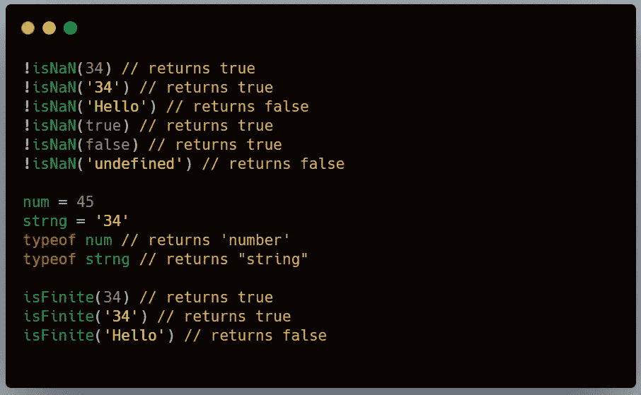

# 如何在 JavaScript 中检查变量是否为数字

> 原文：<https://javascript.plainenglish.io/3-ways-to-check-if-variable-is-a-number-in-javascript-bd8157301274?source=collection_archive---------4----------------------->

## 这里有三种方法可以让你检查

前几天我在 Vue 中构建一个表单，我必须为字段编写数字验证，所以必须编写逻辑来检查输入值是否是数字。我想列出我学到的一些可能对别人有帮助的方法。



***注意:*** *在 JavaScript 中，像* `*NaN*` *、* `*Infinity*` *和* `*-Infinity*` *这样的特殊值也是数字——尽管如此，我们将忽略这些值。*

# 1)使用 isNan()

`[**isNaN()**](https://developer.mozilla.org/en-US/docs/Web/JavaScript/Reference/Global_Objects/isNaN)`决定一个值是否为`[NaN](https://developer.mozilla.org/en-US/docs/Web/JavaScript/Reference/Global_Objects/NaN)`。我们可以利用这一点来确定一个变量是否是数字类型。

```
!isNaN(34) // returns true!isNaN('34') // returns true!isNaN('Hello') // returns false!isNaN(true) // returns true
!isNaN(false) // returns true !isNaN('undefined') // returns false
```

## 局限性:

1.  它返回布尔值`true`，因为布尔值被相应地转换为数字 0 和 1，所以有时会产生误导。
2.  我们对`null`值也有同样的问题。它返回 true，因此在编写代码时必须小心。

# 2)使用 typeof()

`[**typeof**](https://developer.mozilla.org/en-US/docs/Web/JavaScript/Reference/Operators/typeof)`运算符返回一个表示未赋值操作数类型的字符串。

```
num = 45
strng = '34'typeof num // returns 'number'
typeof strng // returns "string"
typeof undefined // returns "undefined"
typeof null // returns "object"
```

如果变量是 number 类型，它将返回字符串`**’number’**`。我们可以用这个来确定变量是否是数字类型。

`typeof()`比`isNaN()`表现好很多。它正确地确定了一个字符串变量，`null`和布尔值不是数字。

# 3)使用 Number.isFinite()

函数`[**isFinite()**](https://developer.mozilla.org/ja/docs/Web/JavaScript/Reference/Global_Objects/isFinite)`确定传递的值是否是有限的。参数首先被转换成数字，然后检查该值是否是有限的。与其他方法相反，这种方法对未定义的和布尔的操作很好，因此这是上面提到的所有方法中最好的方法。

```
Number.isFinite(34) // returns trueNumber.isFinite('Hello') // returns falseNumber.isFinite(undefined) // returns falseNumber.isFinite(true) // returns falseNumber.isFinite(null) // returns false
```

## 结论

尽管这些方法对于未定义的布尔值和空值会变得棘手，但它们有助于解决日常生活中的一些问题。人们只需要根据自己的需要小心编写代码。

***概括起来就是这样！感谢您的阅读。如果您有任何反馈或想法，请在下面评论。***