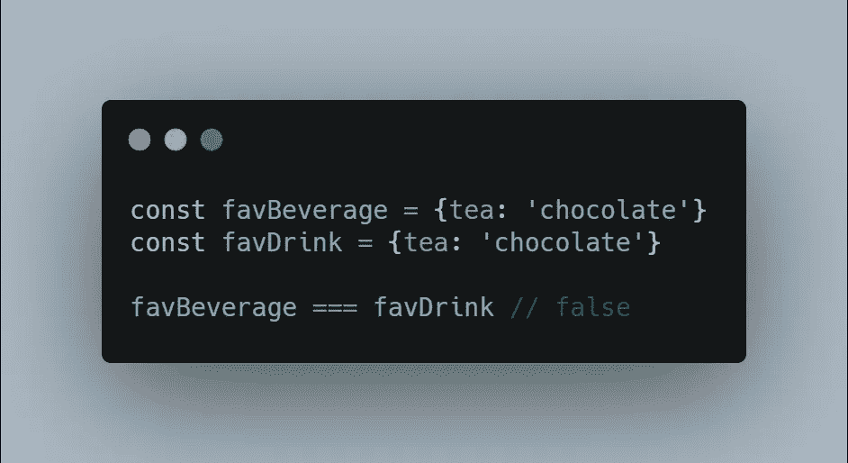
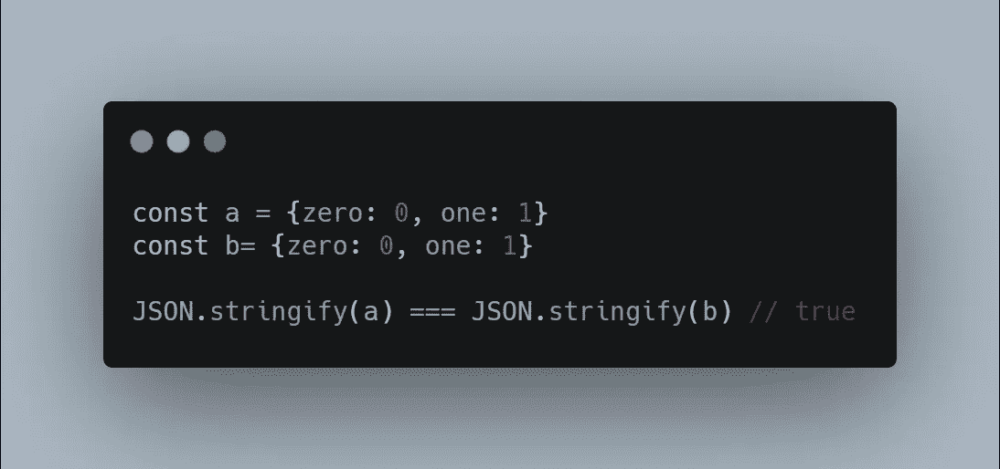
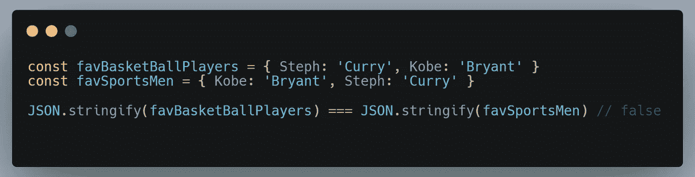
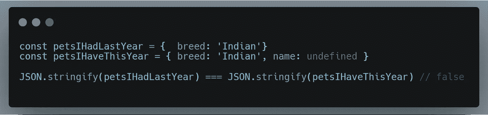
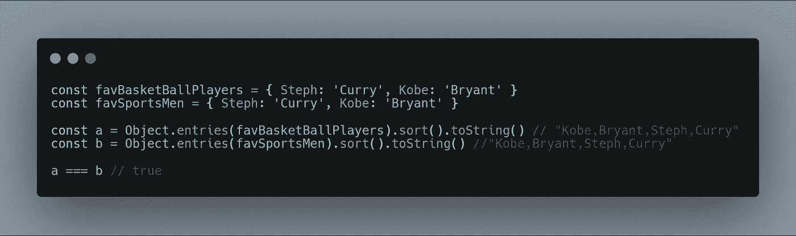
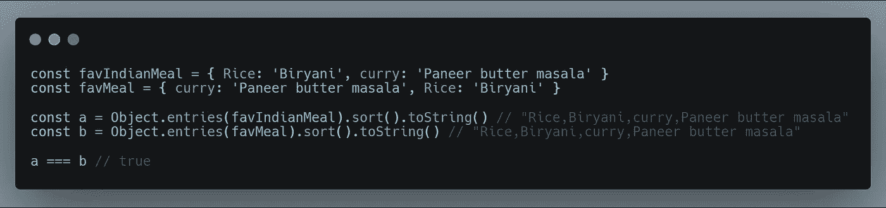
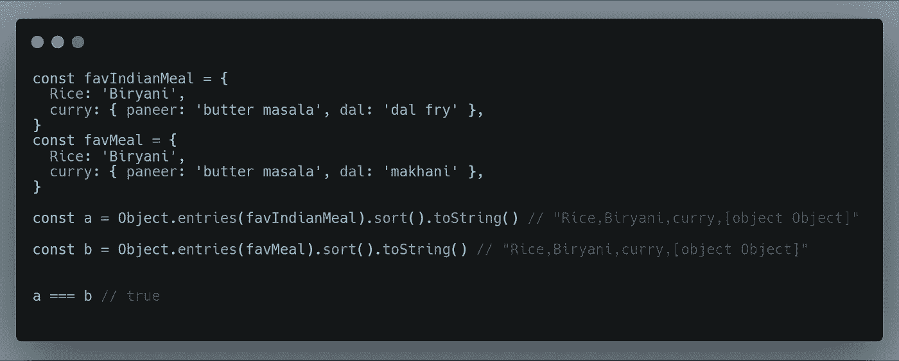
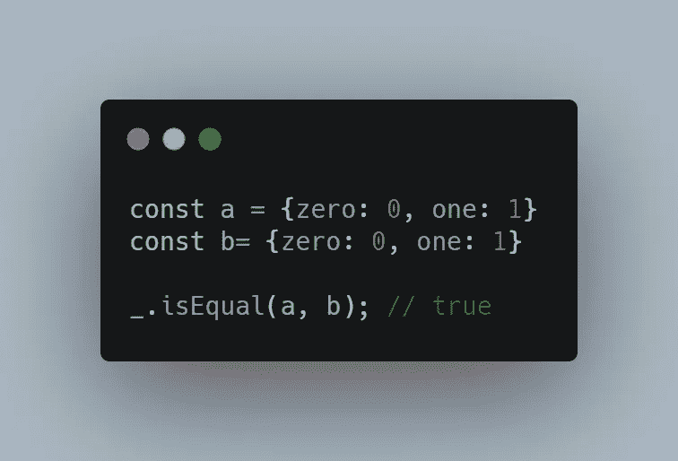

# 比较 JavaScript 对象的 3 种方法

> 原文：<https://javascript.plainenglish.io/3-ways-to-compare-javascript-objects-fc9e95543385?source=collection_archive---------5----------------------->

本文讨论了比较 JavaScript 对象的简单方法，并阐述了这些方法的优缺点。

让我们开始吧。

在 JavaScript 中，对象是一个[***引用类型***](https://www.javascripttutorial.net/javascript-primitive-vs-reference-values/)*(相比整数，字符串是*原语*类型)。两个不同的对象永远不会相等，即使它们具有相同的属性。如果比较两个具有相同值和键的对象，将产生`false`。只有将同一个对象引用与其自身进行比较才会产生 true。*

*因此，我们需要想出一个解决方案，让我们可以轻松地比较对象。让我们讨论这样做的三种方法。*

**

# *1)使用 JSON.stringify()*

*这是比较对象的简单方法。JSON。字符串化你的对象，并把它们作为字符串进行比较。这对*嵌套数组*非常有效。*

*考虑两个相同的物体。*

```
*const a = {zero: 0, one: 1}
const b= {zero: 0, one: 1}*
```

*`a===b`会给出`false`，但是当你把它转换成字符串并检查时，它会把这个值作为原始类型进行比较。*

**

***限制:***

*然而，这种方法有其自身的局限性。*

1.  *属性的顺序应该是相同的。否则它将抛出一个错误。考虑下面的例子。*

**

*Limitations of using JSON.stringify method*

*2.并非所有类型都可以在 JSON 中表示。`JSON.stringify()`函数将日期转换为字符串，并忽略值为`undefined`的键。*

**

# *2)使用对象方法条目、排序和字符串(ES6 方式)*

*这是使用 ES6 方式比较两个 JavaScript 对象的方法之一。我们在这里使用 ES6 对象方法提取对象属性作为数组，对它们进行排序并将其转换为字符串，然后进行比较。这消除了我们在使用`JSON.Stringify()`方法时的一些限制，但是这种方法不适用于嵌套数组。*

**

*即使对象处于相同的顺序，它也能很好地工作。这是 JSON.stringify 的局限性。*

**

*This method compares the objects irrespective of the orders of properties in the two objects*

***限制:***

*这种方法对嵌套对象不太适用，因为它不会检查内部嵌套的属性。*

*考虑这个例子。它应该抛出`false` ，但是它却抛出了`true`。因为值`dal`在两个对象中有不同的键，所以这个对象不能相同。*

**

*Limitations of ES6 way*

# *3)使用 Lodash 方法:*

*我们可以使用 lodash `[isEqual()](https://lodash.com/docs/4.17.15#isEqual)`函数来比较两个对象。这种方法处理各种各样的情况，是比较两个对象的最复杂的方法。*

*你可以在这里 **了解更多洛达什 [**。**](https://www.educative.io/edpresso/what-is-lodash)***

**

## *结论:*

*总结一下。我列举了一些我最近学到的方法。如果你知道任何其他比较 JavaScript 对象的方法或者我上面列出的方法的限制，请在下面评论。谢谢你。*

**更多内容请看*[***plain English . io***](http://plainenglish.io/)*