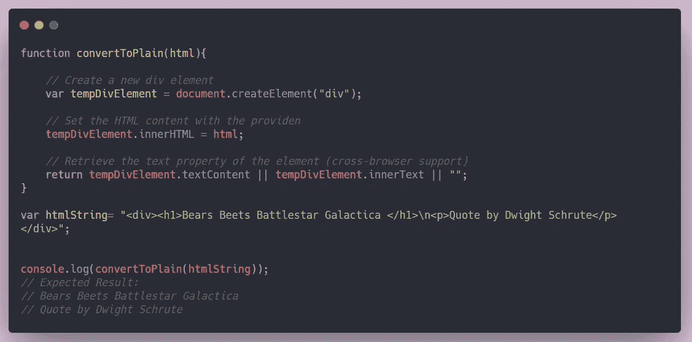

# 3 种将超文本标记语言转换成纯文本的不同方法

> 原文：<https://javascript.plainenglish.io/3-ways-to-convert-html-text-to-plain-text-strip-off-the-tags-from-the-string-4c947feb8a8c?source=collection_archive---------3----------------------->

前几天，我和一个富文本编辑器一起工作，需要从字符串中剥离 HTML 标签，并将其存储在数据库中。在这样做的过程中，我学会了一些不同的方法来达到这个目的。我想和你分享这个信息，因为它对任何试图这样做的人来说都是有用的。

我们试图做的是从字符串中移除标签，并使字符串可以作为纯文本打印。让我们潜入水中，看看它是如何工作的。



# 1.使用。替换(/ ]*>/g ' ')

该方法是从文本中移除标签的一种简单有效的方法。该方法使用字符串方法`.replace(old value, new value)` ，用空字符串替换 HTML 标记值。`/g`用于使其全局发生(如果使用/g，则用指定的替换字符串中的每个值)。

这种方法的缺点是我们不能删除一些 HTML 实体。不过，它仍然运行良好。

# 2.创建一个临时 DOM 元素并检索文本

这是完成任务最有效的方法。创建一个虚拟元素并将其分配给一个变量。我们以后可以使用元素对象进行提取。将 HTML 文本分配给虚拟元素的内部 HTML，我们将从文本元素对象中获得纯文本。

# 3.html 到文本的 npm 包

这是我最近发现的包裹。这是一个解析 HTML 并返回优美文本的转换器。它有很多选项可以将其转换为纯文本，如`wordwrap`、`tags`、`whitespaceCharacters`、`formatters`等。

使用包需要 Package.json。我们需要先安装软件包，然后在我们的文件中使用它。

您可以在这里找到包裹[的正式文件。我把它用在我的 vue 项目中，效果很好。](https://www.npmjs.com/package/html-to-text)

**安装:**

```
npm install html-to-text
```

**用法:**

# 结论

这就是全部！您可以在这里找到项目示例[。](https://github.com/Sanchithasharma/htmlToText)

谢谢你！