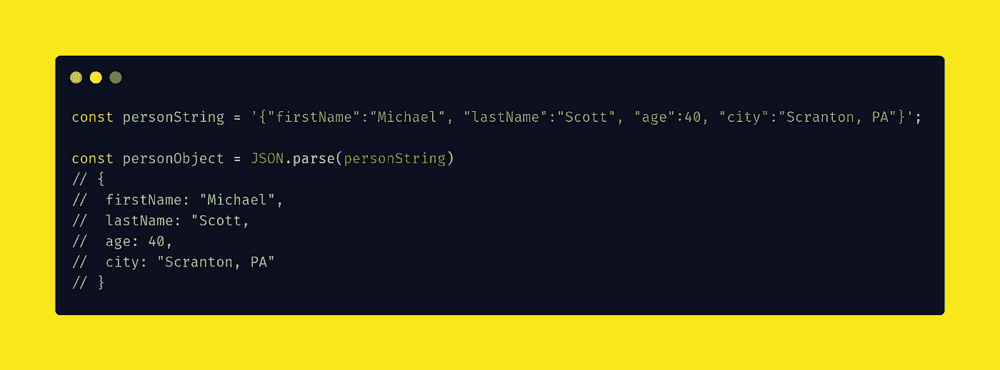
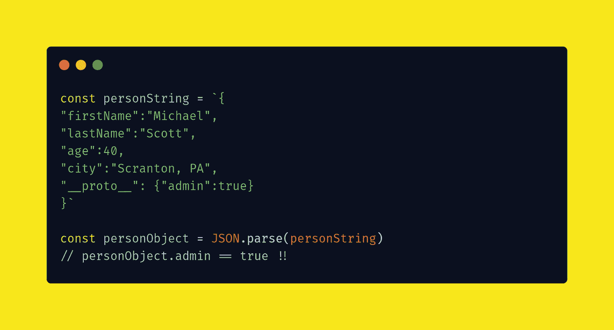
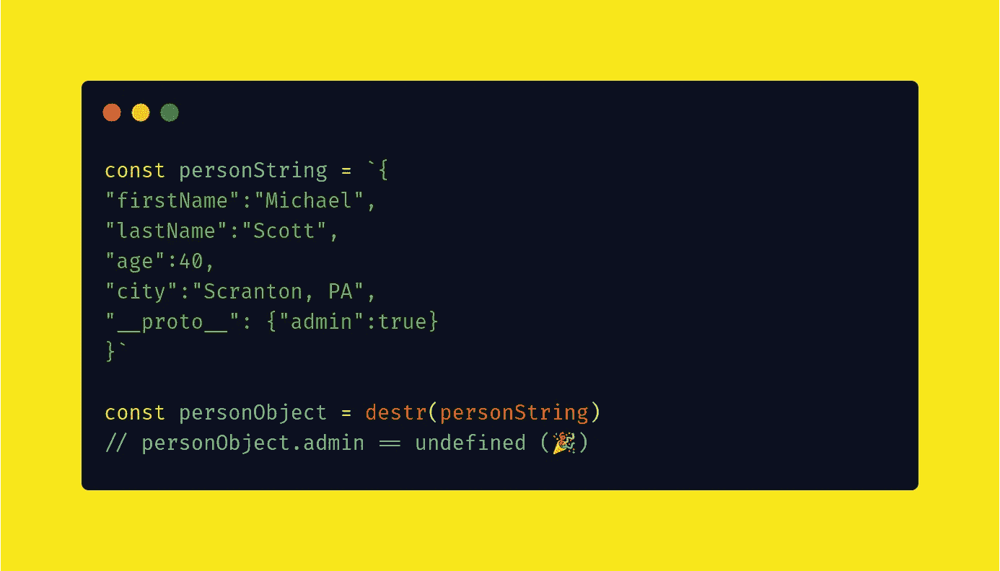
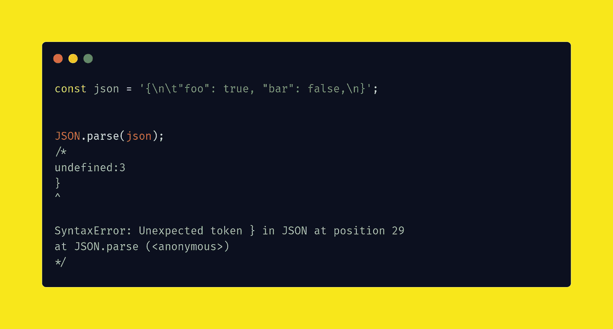
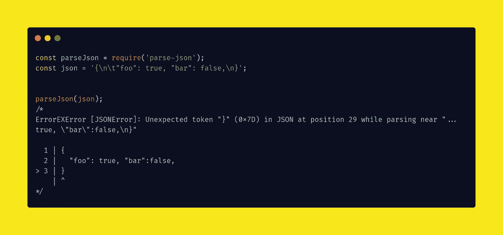

# 将 JSON 转换成 JavaScript 对象的 3 种方法

> 原文：<https://javascript.plainenglish.io/3-ways-to-convert-json-to-a-javascript-object-5d77c238b4ee?source=collection_archive---------10----------------------->

Photo by [Paul Esch-Laurent](https://unsplash.com/@pinjasaur?utm_source=medium&utm_medium=referral) on [Unsplash](https://unsplash.com?utm_source=medium&utm_medium=referral)

当你反序列化 JSON 的时候，你需要注意一些事情，这些事情可能一开始并不明显。为您的团队提供额外的安全性和调试能力是他们所欣赏的。

在这篇博文中，我将比较 3 个库，它们可以帮助您找到在项目中反序列化 JSON 的最佳时机。

# 1.JSON。解析()

第一个是 Javascript 自带的，可能大多数人都知道。它允许简单、高效地将 JSON 解析成 Javascript 对象。

您现在可以使用`personObject.firstName`(或任何其他字段)而不会在代码的其他部分出现任何问题。

注意，也可以用这个方法解析嵌套的 JSON 数据。

# 2.destr()

`[destr](https://www.npmjs.com/package/destr)`是我们要讨论的第二个库。`destr`解析标准 JSON 比较慢，因为它会防止所谓的“原型污染”。

原型污染/中毒对于从请求体接受 JSON 的应用程序来说是一个真正的安全风险。您可能知道，JavaScript 允许您使用`__proto__`属性调用来访问对象的原型。

如果您使用`JSON.parse`来反序列化您的字符串，它也会反序列化对象的原型:

如您所见，如果 personObjects 字段来自请求，我们可能会检查它们(这是您应该经常做的事情)。但是在这种情况下，攻击者添加了一个`__proto__`管理字段并将其设置为 true！这对您的应用程序可能是灾难性的。

所以才发明了`destr`。当使用`destr`解析字符串时，您不必担心原型中毒，因为它们将确保使用反序列化移除原型:

# 3.帕西逊()

我们考虑的第三种方法是使用`[parse-json](https://www.npmjs.com/package/parse-json)`库。Parse JSON 为我们提供了获取更多关于文本反序列化期间可能发生的任何异常的深入信息的能力。

考虑下面这段我们用`JSON.Parse()`反序列化的 JSON

正如您所看到的，错误消息中几乎没有什么信息可以让我们快速找到错误的原因。请注意，这是一个小对象，如果是一个更大的对象，可能会更加困难。

现在考虑同样使用`parse-json`

看看我们如何得到一个更详细的错误？这将允许您更快地找到异常的原因。这取决于你来决定这是否对你的项目有任何价值。

# 结论

根据您的项目，您可能对更具体的 JSON 解析库感兴趣。在本文中，您已经了解到`destr`可能用在客户机 JSON 请求正常的环境中。

如果您更有可能得到有问题的 JSON，或者如果您只想能够更快地调试任何与 JSON 相关的异常，那么`parseJson`库可能更适合您。

像往常一样，考虑各种可能性，与您的团队讨论，为您的项目找到最合适的解决方案。祝你好运！

*更多内容尽在*[***plain English . io***](http://plainenglish.io/)