# 修复累积布局偏移的 3 种方法

> 原文：<https://javascript.plainenglish.io/3-ways-to-fix-cumulative-layout-shift-53df8bea1e0f?source=collection_archive---------0----------------------->

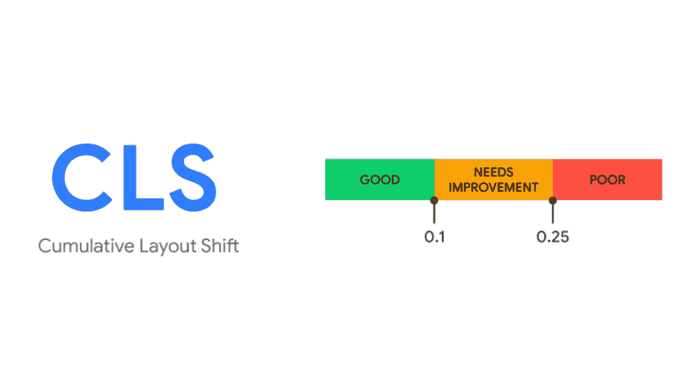

# 什么是累积布局偏移？

累积布局偏移，或简称为 CLS，是一个衡量在页面生命周期中页面布局意外移动量的基准。 **CLS 是谷歌用来衡量具有良好用户体验的网页的三个核心网络要素之一。这些指标对 SEO 至关重要，并将随着时间的推移而发展。**在下图中，我们可以看到一个 CLS 问题(用黄色标记)，以及对我们搜索印象的相应影响。这是一个信号，在 CLS 事件期间，没有具有良好页面质量的页面的搜索印象。

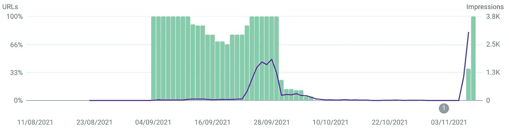

number of impressions of ‘good’ pages drop to 0 due to CLS issue

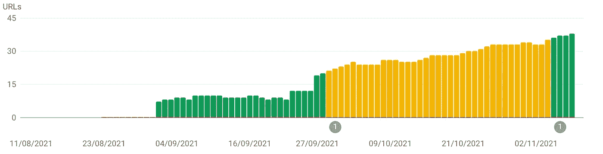

emerging CLS issue flagged by Google Search Console

布局偏移由视口内的元素定义，该元素在两个帧之间的默认书写模式下改变其开始位置。当从左到右和从上到下阅读时，这意味着**任何改变其顶部或左侧位置的元素**。

布局偏移分数被计算为布局偏移前后不稳定元素的可见区域与不稳定元素移动的距离(距离分数)的乘积。

> 最初，布局偏移分数仅基于*影响分数*进行计算。引入*距离分数*是为了避免过度惩罚大元素少量移动的情况。

你的 CLS 分数是通过将所有元素的布局偏移分数相加而确定的。CLS 分数> 0.1 会将您的页面标记为`needs improvement`，分数> 0.25 会标记为`poor`。这是一个重要的排名因素，较高的 CLS 分数会对你的排名产生负面影响。

# 什么导致了累积布局偏移？

布局偏移只有在用户不期望的时候才是不好的。所以要记住的一点是**用户交互引起的布局偏移(500 毫秒内)是可以的！**在加载页面时，或者当用户不希望布局移动时，布局移动是不可以的。

> 在用户输入后 500 毫秒内发生的布局移动将设置`[hadRecentInput](https://wicg.github.io/layout-instability/#dom-layoutshift-hadrecentinput)`标志，因此它们可以从计算中排除。

高 CLS 最常见的原因是

*   不稳定 DOM
*   自定义字体
*   糟糕的动画
*   没有维度的图像或 Iframes

## 不稳定 DOM

CLS 的很大一部分是由初始文档加载后插入的 DOM 元素引起的。幸运的是，这也是最容易解决的问题之一。

使用 Javascript 框架时，大部分 DOM 是在文档加载后构建的。尽管现代框架速度很快，但中间状态仍然会导致元素短时间移动，直到页面达到最终状态。

内容变化的另一个原因是为了吸引用户的注意力而插入的动态内容(比如行动号召或横幅)，或者是在从后端加载一些数据(比如产品列表)之后插入的。

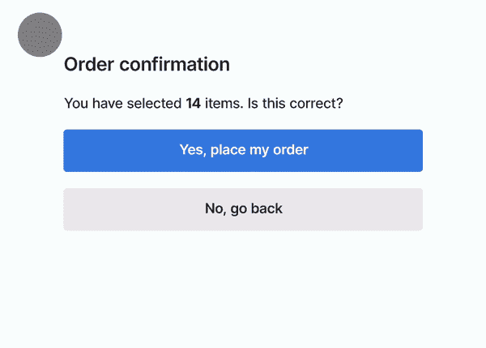

CLS is not only annoying but can cause your users to perform unintended actions

## 自定义字体

通常，网站使用的字体不是用户设备的本地字体。在这种情况下，浏览器首先需要下载该字体，然后才能显示它。同时，文本被隐藏，或者根据`font-display`属性使用备用字体。这两种情况都会导致布局偏移。

在下面的例子中，左边有一个带有自定义字体的标题，右边使用的是设备的备用字体。你可以清楚地看到标题下面段落的变化。标题不会影响 CLS 得分，因为它的顶部和左侧位置保持不变。真正的影响来自于它推开的元素(或在这种情况下向上移动)。

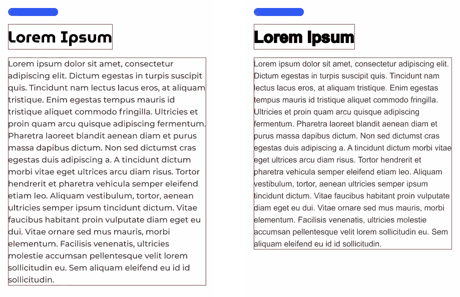

example of styled text versus unstyled text

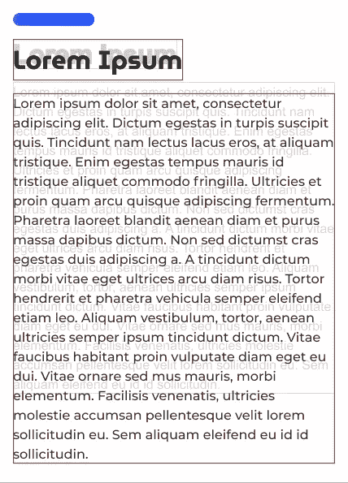

resulting layout shift due to unstyled text

## 糟糕的动画

动画是让用户为即将到来的变化做好准备的好方法。然而，一些动画是昂贵的，并且触发布局改变或重画。这样，一个简单的彩色动画会对你的 CLS 分数产生负面影响。导致浏览器重新计算布局或绘画的动画将总是导致布局偏移。

详细解释请参考关于[浏览器如何工作的文章](https://developers.google.com/web/updates/2018/09/inside-browser-part3)。

## 没有尺寸的图像和其他嵌入

图像对网络至关重要，几乎每个网页都以这样或那样的方式使用图像。

在引入响应式网页设计之前，图像的大小通常是通过使用图像的`width`和`height`属性来确定的。这意味着在加载图像之前，图像元素已经有了固定的尺寸。

在引入 RWD 之后，图像主要由 CSS 调整大小，定义一个响应宽度，然后让图像元素自动计算高度。尽管这是一种显示图像的响应方法，但它可能会对您的布局产生不利影响，因为图像元素的初始高度将为 0，然后会突然扩展到加载图像的高度。

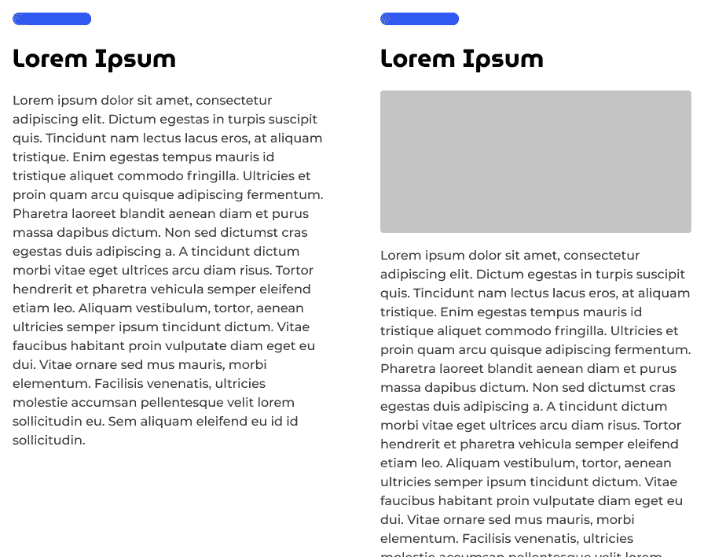

The loaded image will push down content

# 如何找出导致累积布局变化的原因？

首先，看看你的网站，分析内容。有没有你能立即找到的不稳定因素？一个简单的方法就是使用 Chrome 性能开发工具。这允许您在页面加载期间记录所有框架，并分析任何布局变化。最重要的是，您可以模拟较低的网络速度或较低的 CPU 速度。

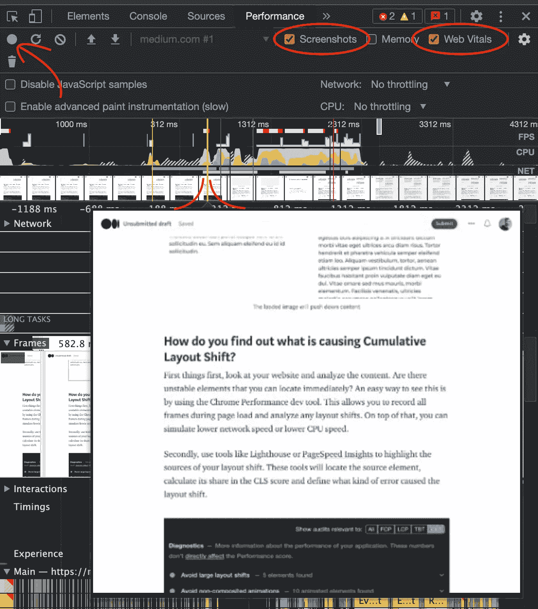

Chrome Performance dev tool lets you analyze Core Web vitals and frames find detail

其次，使用像 Lighthouse 或 [PageSpeed Insights](https://developers.google.com/speed/pagespeed/insights/) 这样的工具来突出你的布局变化的来源。这些工具将定位源元素，计算其在 CLS 评分中的份额，并定义哪种错误导致了布局偏移。

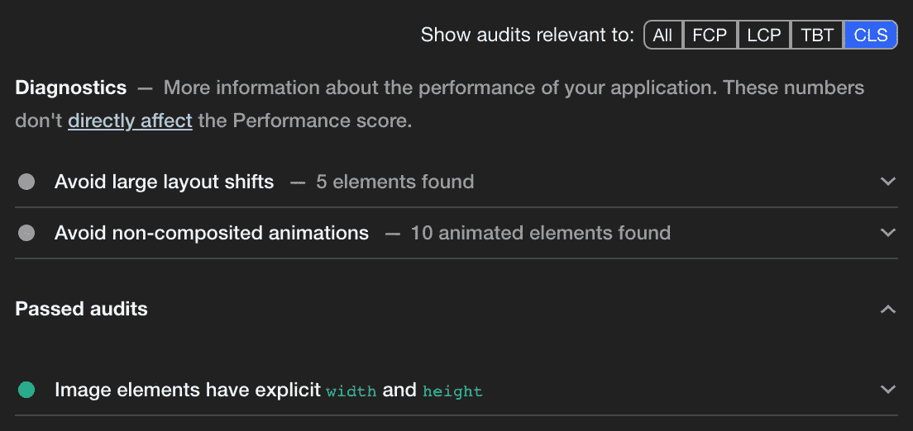

跟踪 CLS 的一个好方法是使用[网络生命体征扩展](https://github.com/GoogleChrome/web-vitals-extension)。这不仅会显示你当前的网站生命，还会显示你的用户在 28 天内如何体验你的页面。

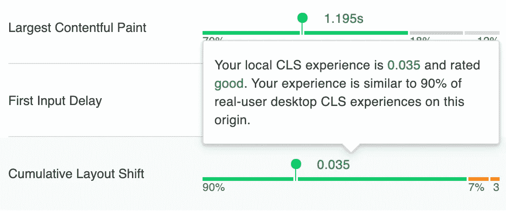

Web Vitals Extension

有时，即使这样也会让你困惑，为什么这个元素会引起布局的变化。一个很好的工具是[网页测试](https://webpagetest.org/)。此工具可显示布局移动前后的框架。这通常足以说明为什么元素会导致布局偏移。

## 注意:flexbox

当渲染 flexbox 布局时，浏览器有时无法在同一帧中绘制所有元素。在这种情况下，当渲染较少的项目时，它们将沿`flex-direction`轴不同地对齐。解决这个问题的唯一方法是根据`flex-direction`给 flexbox 元素一个明确的宽度或高度。

# 如何解决累积布局偏移问题？

## 使用自定义字体时，避免大的布局偏移

在这一节中，我不会详细讨论加载 web 字体的性能部分。我宁愿解释当你不能达到“近即时”加载时你能做什么。

**行高**

简单的第一步是确保所有文本元素都有一个固定的`line-height`。因为`line-height`是相对于字体家族而言的。

> 取决于用户代理。桌面浏览器(包括 Firefox)根据元素的`font-family`使用大约`**1.2**`的默认值。

将`line-height`设置为固定值。例如，`font-size: 2rem;`的标题可以有一个`line-height: 2.5rem`。无论加载什么字体，fallback 还是 final 字体，文本元素的高度都将是`2.5rem`。这已经修复了许多单行元素，如标题、按钮、链接、标签等，并将防止下面的布局发生任何变化。

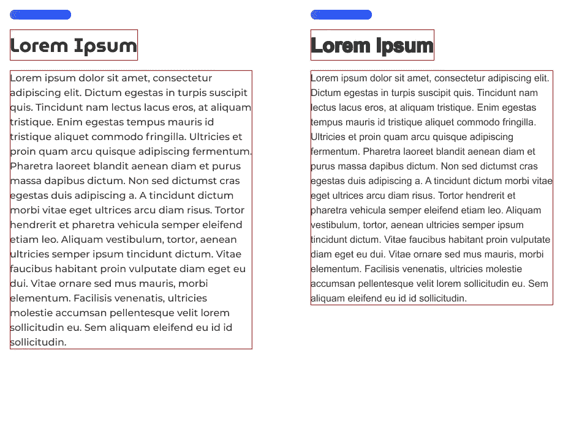

但是，当字母间距和字母宽度在两种字体中呈现不同数量的行时，这不会修复多行元素。在这种情况下，有几个选项可以减轻布局偏移，定义最小高度，并使用匹配的备用字体。

**最小高度**

如果你知道后备字体更密集，我知道当实际字体最终加载时，你会有更多的行。**使用静态内容**，你可以在元素上定义一个`min-height`，为额外的行保留空间。

**匹配回退字体**

另一个好方法是确保你的系统后备字体，匹配你的网页字体的字体属性。当你有一个非常大的网络字体时，确保你定义了一个非常宽的后备系统字体。

## 避免非合成动画

渲染管道是一系列步骤的过程，浏览器按照这些步骤将 HTML、CSS 和 JS 转换为屏幕上的像素。管道中的每一步都将前一步的结果作为其输入。查看管道，我们可以确定更昂贵的动画，因为它们需要更多的步骤来重新计算。因此，最后一步，即所有层的组合，是最便宜的。

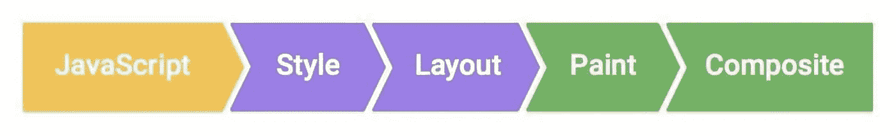

The rendering pipeline

让我们以`width`为例，当我们动画宽度时，浏览器将需要重新计算布局。这将导致重新计算油漆和合成步骤。

如果我们看`color`动画，浏览器需要重新计算画图。这将导致重新计算合成步骤。

因此，我们的目标应该是只激活那些只影响合成步骤的安全 CSS 属性。当动画元素在自己的合成器层上时，可以安全制作动画的属性有`transform: translate(x, y)`、`transform: scale(x)`、`transform: rotate(n)`和`opacity: x`。

## 定义图像的明确宽度和高度

通过定义这些维度，浏览器可以为这些元素在最终加载时在布局中保留空间。在响应式设计中，这并不总是容易做到的，但最好以固定高度的图像为目标，以避免大的布局变化。

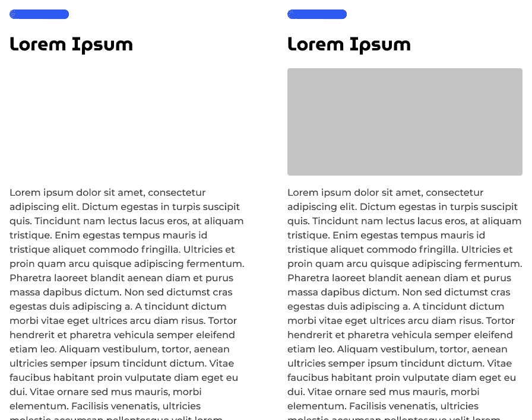

Image height is reserved and will not cause layout shift

# 提供良好的用户体验是提高排名的最好方法

虽然 CLS 经常被忽视，但它通常是一个容易解决的问题。然而，修复 CLS 的主要目标不应该是取悦排名算法，而是取悦你的用户。

*更多内容请看*[***plain English . io***](http://plainenglish.io/)*。报名参加我们的* [***免费周报***](http://newsletter.plainenglish.io/) *。在我们的* [***社区***](https://discord.gg/GtDtUAvyhW) *获得独家获得写作机会和建议。*