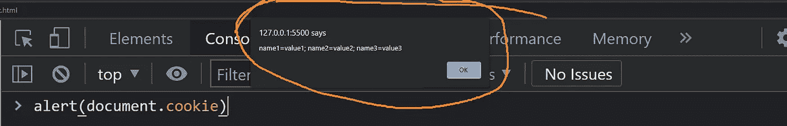

# 在浏览器中存储数据的 3 种方式

> 原文：<https://javascript.plainenglish.io/3-ways-to-store-data-in-the-browser-db11c412104b?source=collection_archive---------3----------------------->

## Cookies、本地存储和会话存储


Photo by [Firmbee](https://www.pexels.com/@firmbee-22729701?utm_content=attributionCopyText&utm_medium=referral&utm_source=pexels) from [Pexels](https://www.pexels.com/photo/person-using-macbook-drinking-coffee-6941871/?utm_content=attributionCopyText&utm_medium=referral&utm_source=pexels)

有时，从浏览器访问数据比向服务器发送请求更好。在浏览器中存储数据的 3 种方式是**cookie**、**本地存储**和**会话存储**。根据需要，它们中的任何一个都用于在浏览器中存储数据。

在今天的文章中，我们将深入讨论本地存储、会话存储和 cookies 之间的比较。让我们开始吧。

```
**Table of Contents:**· [Cookies vs Local Storage vs Session Storage](#5bd9)
· [Cookies](#8069)
  ∘ [Access cookies with JavaScript](#286e)
· [Local Storage](#42e6)
  ∘ [Access local storage with JavaScript](#9c24)
· [Session Storage](#3d57)
  ∘ [Access session storage with JavaScript](#4a92)
· [Choose What To Use When](#276b)
```

# Cookies vs 本地存储 vs 会话存储

要对它们之间的相似之处和不同之处有一个基本的了解，请参见下面的图表:


Cookies vs local storage vs session storage | [Reference](https://youtu.be/GihQAC1I39Q)

所以这三者之间有一些相似之处，也有一些不同之处。本地存储和会话存储有更多的相似之处，并且它们相对较新。Cookie 是其中最古老的，在许多方面与其他两个不同。

他们三个都是独立于浏览器的。这意味着如果一些数据存储在一个浏览器中，它将不会存储在同一台机器上的不同浏览器中。例如，存储在谷歌 Chrome 中的数据不会存储在同一台计算机上的 Firefox 中。

此外，不同的用户之间不共享 cookies 或本地存储。因此，如果为一个用户设置了一些数据，其他用户将看不到这些数据。

如果您从浏览器打开[开发者工具](https://developer.mozilla.org/en-US/docs/Learn/Common_questions/What_are_browser_developer_tools)并进入“应用”部分，您将能够看到 3 种类型的存储。


3 types of storage from the browser | Screen captured by the author

现在，让我们分别谈谈他们中的每一个人。

# 饼干

Cookies 是在浏览器中存储数据的最古老的方式。它有 HTML4 和 HTML5 两种版本。Cookies 基本上是一些带有名称-值对的基于文本的数据。Cookies 只能存储 4 KB 的数据，这比本地存储和会话存储要小得多。

Cookies 是一种在网站上从一个会话向另一个会话传送数据的便捷方式。它可以用于身份验证，也可以用于识别用户的状态。比如说—

*   当用户登录网站时，服务器会设置一个 cookie。因此服务器可以识别出用户登录了其他会话。
*   当从电子商务网站购物时，如果用户向购物车中添加商品，通常会设置一个 cookie。因此，如果用户刷新页面，商品仍将在购物车列表中，用户可以从该状态添加更多商品。

## 用 JavaScript 访问 cookies

我们可以使用`document.cookie`属性从浏览器访问 cookies。`document.cookie`的值由`name=value`对组成。请参见下面的示例。

```
document.cookie = ‘name1=value1’
```

上述表达式将用值“value1”更新名为“name1”的 cookie。

通过检查页面，您可以看到添加到浏览器中的 cookie。


一个`document.cookie=`表达式可以添加一个 cookie。我们再加两块饼干吧。

```
document.cookie = ‘name2=value2’
document.cookie = ‘name3=value3’
```


现在输入`document.cookie`将显示所有三个 cookies。


您也可以使用`alert(document.cookie)`发出警报。



# 局部存储器

根据浏览器的不同，本地存储的容量为 5-10 MB。它是在 HTML5 中引入的。本地存储仅在浏览器中存储数据，除非手动删除，否则永不过期。可以从任何窗口访问本地存储。这意味着如果用户关闭浏览器，本地存储将在用户下次再次打开它时保存。

## 用 JavaScript 访问本地存储

您可以使用`localStorage`属性访问本地存储。本地存储是带有键值对的字符串值。请参见下面的示例。

```
localStorage.setItem(‘key1’, ‘val1’);
localStorage.setItem(‘key2’, ‘val2’);
localStorage.setItem(‘key3’, ‘val3’);
```

添加本地存储中的三个项目。


`setItem()`方法为本地存储设置值。`getItem()`方法将从本地存储中获取项目。你需要把键放在`getItem()`里面来得到一个值。使用`console.log()`你可以打印数值。

```
console.log(localStorage.getItem(‘key1’));
console.log(localStorage.getItem(‘key2’));
console.log(localStorage.getItem(‘key3’));
```


`localStorage.clear()`将清除整个本地存储。

要删除一个项目，您可以使用`localStorage.remove()`。同样，您需要将密钥放在方法中。

```
localStorage.removeItem(‘key1’);
```

移除`value1`后，T11 将返回`null`。

您也可以将数组保存到本地存储。

```
*let* arr = [‘val1’, ‘val2’, ‘val3’];
localStorage.setItem(‘keys’, arr);
```

数组`arr`将存储在本地存储器中。但是整个数组将被存储为一个字符串。要解决这个问题，您可以使用`[JSON.stringify()](https://developer.mozilla.org/en-US/docs/Web/JavaScript/Reference/Global_Objects/JSON/stringify)`和`[JSON.parse()](https://developer.mozilla.org/en-US/docs/Web/JavaScript/Reference/Global_Objects/JSON/parse)`和*。*

```
*let* arr = [‘val1’, ‘val2’, ‘val3’];
localStorage.setItem(‘keys’, JSON.stringify(arr));
x = JSON.parse(localStorage.getItem(‘keys’));
console.log(x);
```

现在它将被存储为一个 JavaScript 对象。


因此，本地存储中有四种主要操作:

```
localStorage.setItem();
localStorage.getItem();
localStorage.removeItem();
localStorage.clear();
```

# 会话存储

会话存储与本地存储非常相似。唯一的区别是会话存储将在会话后被删除。这意味着，如果您在会话存储中保存了某些内容并关闭了浏览器，则在再次打开浏览器后，您将无法看到这些数据。会话存储容量为 5 MB。

## 用 JavaScript 访问会话存储

本地存储中描述的所有操作也适用于会话存储。要访问会话存储，您需要使用`sessionStorage`属性。其他的和本地存储差不多。

要将数据添加到会话存储中，您将使用带有键值对的`sessionStorage.setItem()`。

```
sessionStorage.setItem(‘key1’, ‘val1’);
```


> 注意:`IsThisFirstTime_Log_From_LiveServer`在那里是因为我使用了来自 VS 代码的实时服务器扩展。

如您所见，`val1`被添加到会话存储中。`sessionStorage.getItem()`、`sessionStorage.removeItem()`和`sessionStorage.clear()`的工作方式与本地存储完全相同。

如果关闭浏览器选项卡，会话存储将会消失。

本地存储和会话存储统称为 web 存储。网络存储用于保存数据以便快速访问。喜欢用户自定义数据。比如说—

*   假设一个网站有亮/暗模式。如果用户在浏览器中设置黑暗模式，数据可以存储在本地存储器中。数据仅为该用户保存在本地存储中。这样，当用户再次从浏览器打开网站时，将自动启用黑暗模式。

# 选择何时使用什么

那么如何在三者之间做出选择呢？这取决于你的需求。如果您需要将一些数据存储在浏览器中，并始终为用户保存这些数据，您将使用本地存储。另一方面，如果您想在每次会话后清除数据，您将使用会话存储。如果服务器需要一些数据，如认证密钥，您将使用 cookies。

所以用例取决于需求。

今天到此为止。我希望您从这篇文章中很好地掌握了 cookies、本地存储和会话存储。感谢阅读！

*更多内容请看*[***plain English . io***](http://plainenglish.io/)