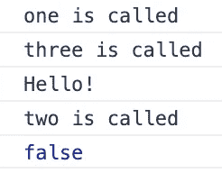

# 如何使用？字符在 Javascript 中编写更清晰的代码

> 原文：<https://javascript.plainenglish.io/3-ways-to-write-cleaner-javascript-code-using-the-character-ce034386dfbb?source=collection_archive---------11----------------------->

## 无效合并、可选链接和三元运算符

Photo by [Emile Perron](https://unsplash.com/@emilep?utm_source=medium&utm_medium=referral) on [Unsplash](https://unsplash.com?utm_source=medium&utm_medium=referral)

JavaScript 中的`?`字符以三种奇妙但不相关的方式提供了语法糖，帮助开发人员以更短、更简洁的方式编写代码。

在 JavaScript 中，`?`字符派上用场的不同方式是为用户提供三个有价值的操作符:

*   无效合并运算符(`??`)
*   可选链接运算符(`?.`
*   条件(三元)运算符(`?`

# 1.无效合并

`nullish coalescing operator` ( `??`)是一个逻辑运算符，如果左边的操作数是`null`或`undefined`，则返回右边的操作数，其他情况下返回左边的操作数。

在`??`操作符出现之前，一个类似的操作符是`logical OR` ( `||`)，如果左边的操作数是任意的`falsy`值(`‘’`、`0`、`NaN,`、`false`)，它将返回右边的操作数，而不仅仅是`null`或`undefined`。在某些情况下，使用`||`操作符可能会导致一些意想不到的行为，在这些情况下，您需要将`‘’`和`0`视为可接受的值，将默认值赋给变量。

让我们来看一些例子，看看当给定由不同类型组成的同一组值时，`||`和`??`操作符是如何工作的。

**示例中的** `**||**` **运算符有**`**falsy**`**`**null**`**，** `**undefined**` **值****

**当`logical OR operator` ( `||`)遇到任何`falsy`值，如`‘’`、`0`、`false`，包括`undefined`和`null`作为左侧操作数时，它将返回右侧操作数，在本例中为`Hello there!`、`25`、`true`、`John`和`New York`。如果用户将`‘’`、`0`和`false`视为有效值，这种行为可能会导致一些意外问题。**

****示例中的** `**??**` **运算符有** `**falsy**` **、** `**null**` **、** `**undefined**` **值****

**使用`nullish coalescing operator` ( `??`，只有`undefined`和`null`值作为左侧操作数返回右侧操作数，在本例中为`John`和`New York`。**

**但是当`??`运算符遇到任何`falsy`值，如`‘’`、`0`、`false`作为左侧操作数时，它将返回左侧操作数本身，因为它们被认为是有效值。**

****短路函数调用**的 `**??**` **运算符示例****

****

**`nullish coalescing operator` ( `??`)的行为方式与`logical AND` ( `&&`)和`logical OR` ( `||`)相同。当左手边表达式返回`undefined`或`null`时，调用右手边表达式，或者在对左手边表达式本身求值后短路进一步求值。**

**在上面的例子中，当`one()`执行时，它记录消息`one is called`，当它返回`undefined`时，右边的`three()`也计算记录消息`three is called`并返回`Hello!`。**

**当`two()`执行时，它记录消息`two is called`，并且当它返回`false`时，评估本身在那里短路。**

# **2.可选链接**

**`optional chaining operator` ( `?.`)允许用户读取对象中深层链接的属性，而无需用户验证链接中的每个属性引用是否有效。`chaining operator` ( `.`)的工作方式也类似，但是如果引用是`null`或`undefined`，那么`?.`操作符不会抛出错误，而是通过返回`undefined`的值来简化表达式。**

**当`?.`操作符用于函数调用时，如果函数不存在，则返回`undefined`。**

**使用`?.`可以在访问对象内的链接属性时得到更短更简单的表达式，其中可能会缺少引用。**

****不使用** `**?.**` **运算符**以不同方式访问嵌套对象的示例**

**如示例所示，在可选链接之前，要检查嵌套对象是`undefined`还是`null`，用户需要使用条件检查来对照`null`或`undefined`检查它们。另一种方法是使用`logical AND operator` ( `&&`)将它们链接起来，以缩短进一步的评估。**

****使用** `**?.**` **和** `**undefined**` **/** `**null**` **引用**访问嵌套对象的示例**

**在上面的例子中，当您试图访问属性`state`时，正如它所定义的那样，`New York`被记录。因为属性`country`在链接的`address`对象中不可用，所以`undefined`没有抛出错误，而是被记录下来。**

****使用** `**?.**` **运算符**进行表达式求值的示例**

**您还可以使用属性访问器的*方括号符号，使用`?.`操作符访问属性来计算表达式。***

****使用** `**?.**` **运算符**访问数组项的例子**

**您也可以使用`?.`操作符来访问数组元素。如果给定索引的值不存在，那么`?.`操作符将返回`undefined`，而不是抛出一个错误。**

****将** `**?.**` **运算符用于函数调用**的示例**

**您可以使用`?.`操作符来检查一个函数在调用时是否是通过在`()`之前使用`?.`操作符来定义的，如上例所示。**

****使用** `**?.**` **运算符与回调和事件处理程序**的示例**

**您也可以在回调函数中使用 `?.`操作符。如果有`undefined` / `null`的值，它会返回`undefined`，而不是抛出一个错误。在上面的例子中，您可以看到使用和不使用可选链接的区别。**

****访问属性时堆叠可选链接的示例****

**在上面的例子中，您可以看到`?.`操作符被用于访问不同级别的对象，方法是在表达式中标记它。**

# **3.条件(三元)运算符**

**三元运算符通常用作`if-else`语句的快捷方式。**

**三元运算符有三个操作数:**

1.  **要检查的条件，后跟一个`**?**`。**
2.  **如果条件为`true`，后跟`**:**`，则计算表达式。**
3.  **条件为`false`时要计算的表达式。**

****检查简单条件的示例****

**上面是一个简单的例子，展示了使用`?`操作符检查一个条件。
您提供一个要检查的条件，后跟`?`，然后是评估条件是否满足的表达式，接着是`:`，以及评估条件是否为`false`的表达式。**

****检查空值的示例****

**在上面的例子中，您可以看到使用`?`更容易地检查`null`值，并相应地评估表达式。**

****条件链接示例****

**您可以使用三元运算符来链接条件检查，相当于`if..else if..else`。它可以用一种更短、更简洁的方式来完成，如上面的例子所示。**

# **结论**

**这些是您可以在 JavaScript 中使用`?`字符做的三件不同事情的列表，它们将帮助您用简单、简短和干净的外观编写更好的代码。**

**我希望你喜欢这篇文章，感谢阅读！**

## **参考**

*   **[MDN 文档](https://developer.mozilla.org/en-US/docs/Web/JavaScript/Reference/Operators/Nullish_coalescing_operator)上的 Nullish 合并运算符(`??`**
*   **[MDN 文档](https://developer.mozilla.org/en-US/docs/Web/JavaScript/Reference/Operators/Optional_chaining)上的可选链接运算符(`?.`**
*   **[MDN 文档](https://developer.mozilla.org/en-US/docs/Web/JavaScript/Reference/Operators/Conditional_Operator)上的条件(三元)运算符(`?`**