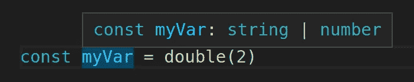
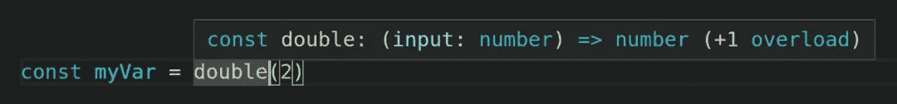
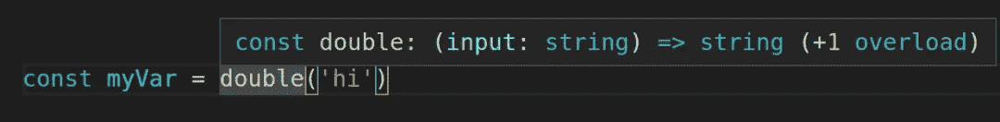
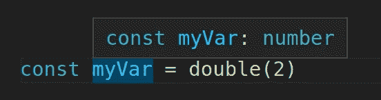
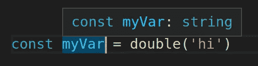

# 用 JSDoc & TypeScript 编写函数重载的 3 种方法

> 原文：<https://javascript.plainenglish.io/3-ways-to-write-function-overloads-with-jsdoc-typescript-e57f46f3286c?source=collection_archive---------5----------------------->


我喜欢 [TypeScript](https://www.typescriptlang.org/) ，但是我更喜欢用 [JSDoc](https://jsdoc.app/) 语法来编写它。如果你读过我的任何一篇 [JavaScript 文章](https://austingil.com/category/javascript/)，尤其是[以简单的方式开始使用 TypeScript](https://austingil.com/typescript-the-easy-way/)，这应该是显而易见的。

到目前为止，我还没有遇到过无法使用 JSDoc 实现与 TypeScript 相同的功能的情况。

直到我需要实现 JavaScript [函数重载](https://docs.microsoft.com/en-us/cpp/cpp/function-overloading?view=msvc-160)的类型定义时，我才开始认真地质疑这一点。

# 什么是函数重载？

如果你已经知道，可以跳过这一步，但是如果你不知道，让我们先了解什么是函数重载。

函数重载是指为了获取不同的功能而多次定义同一个函数。

这里有一个人为的例子。假设我们想要创建一个名为`double`的函数。它需要一个参数。如果参数是一个数字，它将乘以 2 并返回结果。如果它是一个字符串，它会将该字符串连接到自身并返回它。

这是一个愚蠢的例子，但它可能看起来像这样:

```
function double(input) {
  return input * 2
}
function double(input) {
  return input + input
}
```

漂亮！

只有一个问题。JavaScript 不支持函数重载。相反，我们必须这样做:

```
function double(input) {
  if (typeof input === 'number') {
    return input * 2
  }
  return input + input
}
```

# 天真的解决方法

如果我们要写这个函数的类型定义，就有点复杂了。我们知道输入可以是一个`string`或者一个`number`，输出也差不多。

我们可以用一个[“联合”类型](https://www.typescriptlang.org/docs/handbook/2/everyday-types.html#union-types)来完成。联合允许我们将类型定义为“这个”或“那个”。在我们的例子中，不是一辆`string`就是一辆`number`。

这里我们将使用 JSDoc 的 and 关键字将输入和输出分配给一个`string`和`number`的并集。

```
/**
 * @param {string | number} input 
 * @returns {string | number}
 */
function double(input) {
  if (typeof input === 'number') {
    return input * 2
  }
  return input + input
}
```

这里的问题是，无论如何，当我们调用我们的函数时，我们总是会得到一个联合。



我们真正想要的是根据输入的内容返回一个特定的类型。这就是函数重载的由来。

# 在 JSDoc 中定义函数重载

TypeScript 已经有了专用于函数重载的[文档。在他们的例子中，他们展示了如何记录一个简单的函数:](https://www.tutorialsteacher.com/typescript/function-overloading)

```
function add(a:string, b:string):string;

function add(a:number, b:number): number;

function add(a: any, b:any): any {
  return a + b;
}

add("Hello ", "Steve"); // returns "Hello Steve" 
add(10, 20); // returns 30
```

注意同一个函数是如何被定义三次的。两次用于类型定义，一次用于功能。

不幸的是，JSDoc 却不是这样。

经过大量的搜索，我终于找到了一个似乎足够好的解决方案。我们可以定义一个变量，它的值是一个匿名函数。就在这个变量定义之上，我们可以使用 JSDocs 关键字来定义这个变量的类型，在这个类型定义中，我们可以描述我们的函数重载。

在这种情况下，我们想要描述两个箭头函数。一个接受类型为`number`的输入，其返回类型为`number`，一个接受类型为`string`的输入，其返回类型为`string`:

```
/**
 * @type {{
 * (input: number) => number;
 * (input: string) => string;
 * }}
 */
const double = (input) => {
  if (typeof input === 'number') {
    return input * 2
  }
  return input + input
}
```

上面的例子使用了一个[箭头函数](https://developer.mozilla.org/en-US/docs/Web/JavaScript/Reference/Functions/Arrow_functions)。这可能不适合关注[范围](https://www.w3schools.com/js/js_scope.asp)的场景。幸运的是，我们可以用一个[函数表达式](https://developer.mozilla.org/en-US/docs/Web/JavaScript/Reference/Operators/function)完成同样的工作:

```
/**
 * @type {{
 * (input:number) => number;
 * (input:string) => string;
 * }}
 */
const double = function(input) {
  if (typeof input === 'number') {
    return input * 2
  }
  return input + input
}
```

因此，根据输入是数字还是字符串，我们将看到函数的不同类型定义。

当我们的输入是一个数字时，我们函数的类型定义显示它返回一个数字。



当我们的输入是一个字符串时，我们的函数的类型定义显示它返回一个字符串。



更重要的是，我们得到了变量类型定义的预期结果。当输入是一个数字时，我们的变量是一个数字。



当输入是一个字符串时，我们的变量是一个字符串。



定义函数重载的语法有点奇怪，但是在实践中足够好。我发现的唯一警告是，它依赖于将函数赋给变量。它不适用于[函数声明](https://developer.mozilla.org/en-US/docs/Web/JavaScript/Reference/Statements/function)(即`function double(input) { /* ... */ }`)。

老实说，我想不出你**必须**使用函数声明而不能使用函数表达式的场景，但是如果你真的需要一个解决方案，有一个变通办法。

TypeScript 还提供了[泛型](https://www.typescriptlang.org/docs/handbook/2/generics.html)，您可以将这些泛型与[条件类型](https://www.typescriptlang.org/docs/handbook/2/conditional-types.html)相结合，以确定输入类型，并根据输入内容有条件地返回特定类型。多亏了关键字`@template`(没有很好的文档记录)，所有这些甚至可以与 JSDoc 一起工作。

将它应用到我们上面的例子中会是这样的:

```
/**
 * @template numOrStr
 * @param {numOrStr} input
 * @returns {numOrStr extends number ? number : string}
 */
function double(input) {
  if (typeof input === 'number') {
    return input * 2
  }
  return input + input
}
```

我们将泛型定义为`numOrString`，将其作为输入类型，然后在返回类型中，我们检查输入类型是否扩展了数字类型。如果是，返回值是一个数字类型。如果不是，就是字符串类型。

# 关闭

TypeScript 很棒，JSDoc 也很棒，但是偶尔复杂事物的文档很稀疏。

我写这篇文章是因为我确信我将来需要寻找如何做这件事，我不想再经历整个寻宝过程。相反，它可以生活在这里的一个地方，也许可以帮助像你这样的人。

我们讨论了许多复杂的类型脚本，比如联合、重载、泛型和动态类型。我希望我能够清楚地解释它们。如果你是 TypeScript 新手，我建议你去读一下[我的初学者指南](https://austingil.com/typescript-the-easy-way/)。

非常感谢您的阅读。如果你喜欢这篇文章，[请分享它](https://twitter.com/share?via=Stegosource)，如果你想知道我何时发表更多文章，[注册我的简讯](https://austingil.com/newsletter/)或[在 Twitter 上关注我](https://twitter.com/Stegosource)。干杯！

*原载于*[*austingil.com*](https://austingil.com/typescript-function-overloads-with-jsdoc/)*。*