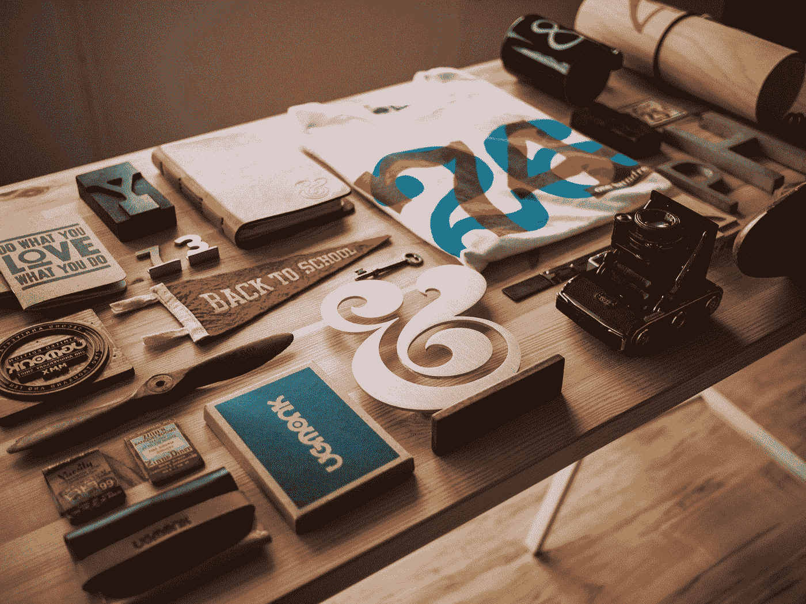

# 我作为程序员买的 3 样奇怪的东西

> 原文：<https://javascript.plainenglish.io/3-weird-things-i-bought-as-a-programmer-5ab5bf90ed73?source=collection_archive---------12----------------------->

## 我希望我开始编程的时候能轻松一点

Photo by [Jeff Sheldon](https://unsplash.com/@ugmonk?utm_source=medium&utm_medium=referral) on [Unsplash](https://unsplash.com?utm_source=medium&utm_medium=referral)

开始你的编程和软件开发之旅是相当棘手的。你总是想达到知识的顶峰，因此，你的标准随着你的日常编程需要而提高。

3 年前，当我进入大学的时候，我开始了我的编程之旅，从那时起，我的目标一直在改变。在顶尖科技公司工作，认识到传播知识和为社区做贡献的重要性。

在我的旅程中，我经历了人生的各个阶段，比如“**编程不是我的茶**”和“**我不够有天赋**”。我对所有正在进入我所经历的阶段的新手的简单建议是**坚持下去，不断练习，迟早你会实现你所希望的一切。**

我总是喜欢在 YouTube 上观看专业软件开发人员，并意识到他们有一个完美的编码设置，同时，我创建了一个小设置，我希望我没有带一些我从未使用过的奇怪东西。

以下是我投资的项目清单，我认为它可以帮助我成为一名高级程序员，但是，唯一真正对我有用的是实践—

## 1.游戏椅

我总是看到**抽动彩带**流几个小时舒适地坐在他们的游戏椅上。有趣的是，我想如果我有一把椅子，我可以舒服地坐几个小时写程序。

我花了 300 美元从最近的家具店买了一把红黑相间的游戏椅，你猜怎么着，我用这把椅子来放我的书，相反，我又买了一把价值 70 美元的金属椅子，后来我发现它最适合我。坐在金属椅子上比坐在游戏椅上我会更有效率。

## 2.WIFI 扩展器

相信我，作为一个技术爱好者，我总是觉得与人联系比什么都重要。在我的公寓里，Wifi 是固定在卧室里的，我离开房间的时候通常连不上。因此，我的一个朋友建议买一个 wifi 扩展器。我同意了，从亚马逊给自己买了一个价值 45 美元的 wifi 扩展器。

后来发现 wifi 扩展器一般传输 wifi 范围到远程但是上网速度明显降低。因此，在打开我的主 wifi 设置页面时，我发现我可以通过切换到 2.5 Hz 连接来增加范围，而不需要任何 wifi 扩展器。我完全后悔买了一个 wifi 扩展器，现在，我已经几个月没有碰过我的 wifi 扩展器了，它对我来说完全没用。

## 3.Udemy 课程

相信我，作为一名程序员，每当我们看到我们的同行比我们拥有更多的知识时，我们就会面临很多提升技能的竞争。在这种情况下，我从不同的老师那里带来了大约 **6** 门课程，到目前为止，我每门课程只完成了 **20%** 。

目前，如果我需要学习一项新技能，我更喜欢看主要来自 **FreeCodeCamp** 频道的 YouTube 视频，而不是看 Udemy 课程。我仍然不会更喜欢那些课程，因为我认为它们缺乏一些 YouTube 频道完全免费提供的深入解释。

我知道，我买了一些疯狂的东西，这些东西对其他程序员来说可能更重要，但对我来说却毫无用处。

我希望你喜欢这篇文章。我确信，我会很快在易贝上转售这些物品，或者借给我的朋友。在那之前，**继续练习**和 k **eep 编程…**

对于任何**“赞助/写作项目”**你可以联系我，电话:——**writeaniketz@gmail.com**

 [## 通过我的推荐链接加入 Medium-Aniket

### 作为一个媒体会员，你的会员费的一部分会给你阅读的作家，你可以完全接触到每一个故事…

aniketz.medium.com](https://aniketz.medium.com/membership)  [## 每个程序员都应该读的 3 本书

### 帮助我理解编程基础的书籍。

javascript.plainenglish.io](/3-books-every-programmer-should-read-97ac12422cfb)  [## 2021 年十大编程语言

### 你是使用顶级编程语言的用户之一吗？

javascript.plainenglish.io](/top-10-programming-languages-of-2021-d2d48c634ae7)  [## 我是如何从新手成为 Python 编程专家的

### 我一直使用的资源汇编

blog.devgenius.io](https://blog.devgenius.io/how-i-went-from-noob-to-expert-in-python-programming-8c4e141a0be1)  [## 每个开发人员都应该知道的内置数据结构。

### 易于实现的便捷数据结构

blog.devgenius.io](https://blog.devgenius.io/inbuilt-data-structures-every-developer-should-know-2c2cb513193a) 

*更多内容看* [***说白了. io***](http://plainenglish.io/)