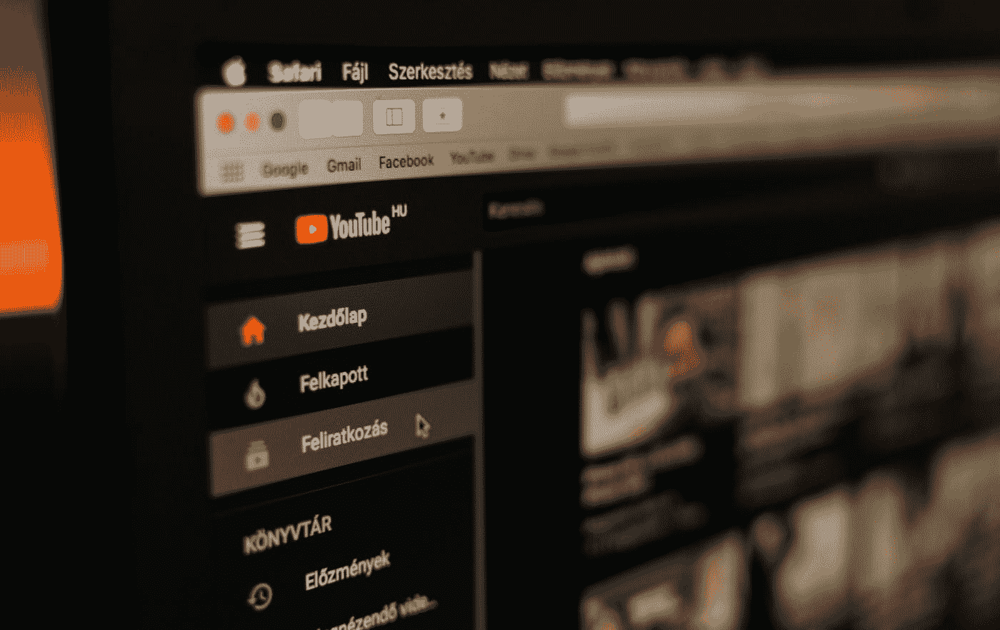

# 每个程序员都应该关注的 3 个 YouTube 频道

> 原文：<https://javascript.plainenglish.io/3-youtube-channels-every-programmer-should-follow-66952f1f24e4?source=collection_archive---------2----------------------->

## 我推荐您观看节目内容的最佳 YouTube 频道

Photo by [Szabo Viktor](https://unsplash.com/@vmxhu?utm_source=medium&utm_medium=referral) on [Unsplash](https://unsplash.com?utm_source=medium&utm_medium=referral)

最近，我发现了一些我一直在关注的很棒的内容来提升我的技能，最棒的是这些内容可以在 YouTube 上免费获得。就我个人而言，我更喜欢 YouTube 作为最好的免费视频流媒体平台。

你可以把 YouTube 用于建设性和破坏性的目的。我真的相信一个新手程序员应该坚持使用 YouTube 教程，而不是从 **Udemy** 或 **Coursera** 购买任何课程。我并不讨厌课程平台，但我认为根据他们的教学技能，有些课程定价过高。

以下是我已经关注了几个月的三个 YouTube 频道，我认为你应该考虑至少访问它们一次，看看它们免费提供的精彩内容

 [## 什么是区块链，为什么所有程序员都应该了解它

### 一篇关于区块链的信息性文章。

javascript.plainenglish.io](/what-is-blockchain-and-why-all-programmers-should-know-about-it-897d73c24a75) 

## 自由代码营

毫无疑问，这是最好的 YouTube 频道，也是全世界所有程序员的完整圣经。

[**FreeCodeCamp**](https://www.youtube.com/c/Freecodecamp) 有一个使命是“**帮助人们免费学习编码**”，我很确定他们已经成功完成了自己的使命。

他们有**数据科学**、 **AWS** 、**全栈开发**、 **Python** 、 **C++、数据结构、**等等广泛完整的教程…

我个人目前在 FreeCodeCamp 频道上最喜欢的视频是[**chuck 博士的**](https://www.youtube.com/watch?v=8DvywoWv6fI)Python for Everybody**这个视频最好的部分是它是一个完整的 Python 编程语言初学者教程，时长 **14** 小时，你可以在 **Coursera** 上购买相同的视频内容，只需支付大约**100 美元的月订阅费。你可以决定同一门课你喜欢哪个选项。****

## ****优点——****

*   ****关于计算机科学的所有主题都有大量的视频。****
*   ****几乎所有编程语言都有深入的教程****
*   ****Coursera 和 Udemy 等平台的付费课程可以在免费代码营 YouTube 频道上免费合法地获得****

## ****缺点—****

*   ****没有(我是认真的，这些人对编程社区做出了巨大的贡献)****

**** [## 绝对初学者的 Python 基础教程

### 用最简单的方式解释了 Python 的基础知识。

python .平原英语. io](https://python.plainenglish.io/fundamental-python-tutorial-for-absolute-beginners-2d848e66850d)**** 

## ****CS50****

****想想哈佛大学的人是如何学习编程的，如果你已经没有想象力了，我有一个完美的 YouTube 频道给你。****

****[**CS50**](https://www.youtube.com/c/cs50/featured) 是一个用于存储哈佛大学部分会议记录的频道。这个频道的主要焦点是计算机科学课程，而不是教程。****

****如果你打算深入了解与计算机科学基础相关的所有方面，你可以参考这个频道。****

## ****优点——****

*   ****计算机科学基础的最佳视频****
*   ****来自卓越教师的卓越录音课程****

## ****缺点—****

*   ****不存在完整的系列****
*   ****当谈到像**云计算**、**机器学习、**和 **Web 开发这样的话题时，有点缺乏当代人的需求。******

****我希望你会喜欢看这些 YouTube 频道上的精彩节目。坚持编程，坚持练习。祝你的编程之旅好运！****

****[**花 5 美元购买 Medium 会员，阅读 Medium 上的所有文章——点击这里**](https://aniketz.medium.com/membership) **(当你使用这个链接时，我会得到一小部分)******

**** [## 通过我的推荐链接加入 Medium-Aniket

### 作为一个媒体会员，你的会员费的一部分会给你阅读的作家，你可以完全接触到每一个故事…

aniketz.medium.com](https://aniketz.medium.com/membership) 

对于任何**“赞助/写作项目”**你可以通过—**writeaniketz@gmail.com**联系我

## **也读作—**

*   [**2022 年的技术趋势**](/technologies-that-will-trend-in-2022-122d2dcf5ca3)
*   [**3 最佳代码编辑**](/3-code-editors-i-have-been-using-for-the-past-3-years-33abb5b88c5a)
*   [**每个程序员都应该读的 3 本书**](/3-books-every-programmer-should-read-97ac12422cfb)
*   [**十大编程语言**](/top-10-programming-languages-of-2021-d2d48c634ae7)
*   [**Noob 为 Python 专家**](https://blog.devgenius.io/how-i-went-from-noob-to-expert-in-python-programming-8c4e141a0be1)

*更多内容请看*[***plain English . io***](http://plainenglish.io/)****