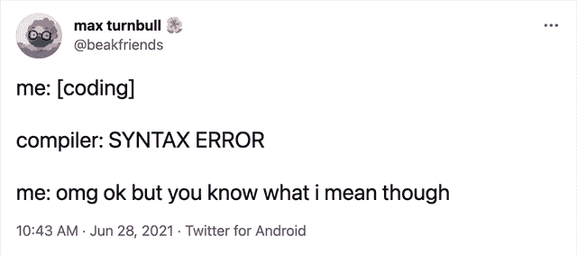

# 30 个搞笑的编码评论让你笑死

> 原文：<https://javascript.plainenglish.io/30-funny-coding-comments-to-make-you-die-laughing-aaaf90d76769?source=collection_archive---------2----------------------->

## 你能评论一下代码吗？

## 程序员实际上写的有趣评论的汇编。


Photo by [Artur Shamsutdinov](https://unsplash.com/@roketpik?utm_source=medium&utm_medium=referral) on [Unsplash](https://unsplash.com?utm_source=medium&utm_medium=referral)

**评论。**当这个词在程序员中出现时，要么是写来增加“**声纳**报告，要么是“**履行评审意见。**“你写评论吗？

有时我们倾向于写有创意的评论——有时我们被自己的想象力冲昏了头脑。任何人看了这些评论都会笑。

# (请分享你遇到的有趣的评论来扩展这个列表)

> 那我们开始吧，

```
# To understand recursion, see the bottom of this file
.
. (at the end of the code...)
.
# To understand recursion, see the top of this file
```

```
// I dedicate all this code, all my work, to my wife, Darlene, who will 
// have to support me and our three children and the dog once it gets 
// released into the public.
```

```
// sometimes I believe compiler ignores all my comments
```

```
/*
 * You may think you know what the following code does.
 * But you dont. Trust me.
 * Fiddle with it, and youll spend many a sleepless
 * night cursing the moment you thought youd be clever
 * enough to "optimize" the code below.
 * Now close this file and go play with something else.
 */
```

```
// I am not sure if we need this, but too scared to delete.
```

```
// Catching exceptions is for communists
```

```
// If I from the future read this I’ll back in time and kill myself.
```

```
float boat;   // must be a float, otherwise it sinks.
```

```
try {} finally { // should never happen 
}
```

```
// They made me write it, against my will.
```

```
// it was hard to write
// so it should be hard to read
```

```
// If this code works, it was written by Atit Patel. If not, I don't know
// who wrote it
```

```
// If you are reading this, that means you have been put in charge of my previous project. I am sorry, so sorry for you. Godspeed.
```

```
// Yesterday I had a scare,
// I ran some code that wasn't there,
//  It wasn't there again today;
//  Oh, how I wish that it would stay.
```

```
// If this code is still being used when it stops working, then 
// you have my permission to shoot me.  Oh, you won't be able 
// to - I'll be dead...
```

```
/* Ultra-hot screen management package 
                James Gosling, January 1980                     */ 
/*              Copyright (c) 1981,1980 James Gosling           */ 
/**************************************************************** 
                        /-------------\ 
                       /               \ 
                      /                 \ 
                     /                   \ 
                     |   XXXX     XXXX   | 
                     |   XXXX     XXXX   | 
                     |   XXX       XXX   | 
                     \         X         / 
                      --\     XXX     /-- 
                       | |    XXX    | | 
                       | |           | | 
                       | I I I I I I I | 
                       |  I I I I I I  | 
                        \              / 
                          --         -- 
                            \-------/ 
                    XXX                    XXX 
                  XXXXX                  XXXXX 
                  XXXXXXXXX         XXXXXXXXXX 
                          XXXXX   XXXXX 
                            XXXXXXX 
                          XXXXX   XXXXX 
                  XXXXXXXXX         XXXXXXXXXX 
                  XXXXX                  XXXXX 
                    XXX                    XXX 
                          ************** 
                          *  BEWARE!!  * 
                          ************** 
                        All ye who enter here: 
                    Most of the code in this module 
                      is twisted beyond belief! 
                          Tread carefully. 
                    If you think you understand it, 
                              You Don't, 
                            So Look Again. 
 ****************************************************************/
```

```
// If this comment is removed the program will blow up
```

```
// Sheetal wrote this, nobody knows what it does, don't change it!
```

```
// This is black magic
// from
// *Some stackoverlow link
// Don’t play with magic, it can BITE.
```

```
// For the sins I am about to commit, may James Gosling forgive me
```

```
// This code worked before, but my cat decided to take a 
// trip across my keyboard...
```

```
// private instance variable for storing age
public static int age;
```

```
// I am not sure why this works but it fixes the problem.
```

```
long time; /* know C */
```

```
/* Ah ah ah! You'll never understand why this one works. */
```

```
// set break point here - you'll never reach it
```

```
// If you're reading this, then my program is probably a success
```

```
// This is crap code but it's 3 a.m. and I need to get this working.
```

```
// Increase i by one
i++;
```

```
// Steve did not send attribute so happy creativity 
// lets recreate it using available information
// this logic should nod be here and I am waiting impatiently to //throw it away// TODO: DAN to fix this. Not Wes. No sir. Not Wes.
```

```
// Times New Roman? What was wrong with the old Romans?
```

```
// return
return;
```

```
private
  //PRIVATE means PRIVATE so no comments for you
  function LoadIt(IntID: Integer): Integer;
```

```
// yes, this is going to break in 3001, but, one, I'll be dead, and two, we really ought to be using
// a different system by then
if (yearPart >= 01)
{
    // naughty bits removed....
}
```

```
/**
 * Implements the PaymentType interface.
 */
public class PaymentTypePo implements PaymentType
```

```
/* this is a hack.
 ToDo: change this code */
```

```
//Whoa, now that's a big if condition.
```

```
//Forgive me if you can!
```

```
// Dear maintainer:
//// Once you are done trying to ‘optimize’ this routine,
// and have realized what a terrible mistake that was,
// please increment the following counter as a warning
// to the next guy:
//// total_hours_wasted_here = 42//
```

```
#define TRUE FALSE// Happy debugging suckers6
```

```
/**Always returns true.*/public boolean isAvailable() 
{
return false;
}
```

```
int getRandomNumber()
{
       return 5; //chosen by fair dice roll.
                 //guranteed to be random
}
```

```
long long ago; /* in a galaxy far far away */
```

```
stop(); // Hammertime!
```

# 想要更多的幽默剂量吗？

# 展示自己的作品总是更好… LOL


[https://www.facebook.com/DZoneInc/photos/a.336758034711/10159513354989712](https://www.facebook.com/DZoneInc/photos/a.336758034711/10159513354989712)

# 发生了很多次…我总是去不同的页面…


[https://www.facebook.com/DZoneInc/photos/a.336758034711/10159513354989712](https://www.facebook.com/DZoneInc/photos/a.336758034711/10159513354989712)

# 为什么编译器不够智能，无法自动修复所有问题？



[https://www.facebook.com/DZoneInc/photos/a.336758034711/10159505422369712/](https://www.facebook.com/DZoneInc/photos/a.336758034711/10159505422369712/)

# 看起来很管用…那应该够了…哈哈…


[https://www.facebook.com/DZoneInc/photos/a.336758034711/10159501229644712/](https://www.facebook.com/DZoneInc/photos/a.336758034711/10159501229644712/)

# 我们周一继续吧…


[https://www.facebook.com/photo?fbid=2965577677092733&set=gm.2875612219372995](https://www.facebook.com/photo?fbid=2965577677092733&set=gm.2875612219372995)

# 时间是可以定义的，程序员


[https://www.facebook.com/photo?fbid=352070916544458&set=gm.2875632262704324](https://www.facebook.com/photo?fbid=352070916544458&set=gm.2875632262704324)

# 你身后藏着可怕的东西…


[https://www.facebook.com/DZoneInc/photos/10159479172079712](https://www.facebook.com/DZoneInc/photos/10159479172079712)

# 那种和平是无法想象的…


[https://www.facebook.com/javascriptJS/photos/a.1387402908063976/2251831714954420/](https://www.facebook.com/javascriptJS/photos/a.1387402908063976/2251831714954420/)

# 在家工作…饼图…老实说，不是真的…


[https://www.facebook.com/yuva.krishna.memes](https://www.facebook.com/yuva.krishna.memes)

# 开发与质量保证版本…


[https://www.monkeyuser.com/2018/happy-flow/?sc=true&dir=random](https://www.monkeyuser.com/2018/happy-flow/?sc=true&dir=random)

# 当任务管理器有责任关闭没有响应的东西时…


[https://www.facebook.com/photo?fbid=10159630257979673&set=gm.2870233513227290](https://www.facebook.com/photo?fbid=10159630257979673&set=gm.2870233513227290)

[](/funny-comparisons-programmers-vs-normal-people-3aa7002f62f0) [## 有趣的比较:程序员与普通人

### 是什么让程序员与众不同？

javascript.plainenglish.io](/funny-comparisons-programmers-vs-normal-people-3aa7002f62f0) [](/10-ulitmate-jokes-for-programmers-4cc070cbbcf5) [## 给程序员的 10 个 Ulitmate 笑话

### 最佳编程笑话汇编 2021 系列

javascript.plainenglish.io](/10-ulitmate-jokes-for-programmers-4cc070cbbcf5) [](/10-humorous-memes-to-check-out-if-you-are-a-programmer-3244248e3e7e) [## 检验你是否是程序员的 10 个幽默模因

### 程序员的周五幽默

javascript.plainenglish.io](/10-humorous-memes-to-check-out-if-you-are-a-programmer-3244248e3e7e) 

**来源**:

[](https://stackoverflow.com/questions/184618/what-is-the-best-comment-in-source-code-you-have-ever-encountered?page=1&tab=votes#tab-top) [## 你遇到过最好的源代码注释是什么？

### 你遇到过最好的源代码注释是什么？

你遇到过最好的源代码注释是什么？stackoverflow.com](https://stackoverflow.com/questions/184618/what-is-the-best-comment-in-source-code-you-have-ever-encountered?page=1&tab=votes#tab-top) [](https://meetpd.com/funny-code-comments/) [## 每个开发人员都应该阅读的 28 条有趣的代码注释

### 他们说:“如果你需要注释来解释你的代码，代码并没有表现出足够好的意图。但是，如果…

meetpd.com](https://meetpd.com/funny-code-comments/)  [## 史上最搞笑的 40 条代码注释

### 这些是从…借来的

fuzzzyblog.blogspot.com](https://fuzzzyblog.blogspot.com/2014/09/40-most-funny-code-comments.html) 

*更多内容请看*[***plain English . io***](http://plainenglish.io/)