# 每个人都能理解的 30 个有趣的编程笑话

> 原文：<https://javascript.plainenglish.io/30-funny-programming-jokes-which-everyone-can-relate-to-26a1a5b81328?source=collection_archive---------9----------------------->

## 2021 年最佳编程迷因汇编

Photo by [Amanda Sofia Pellenz](https://unsplash.com/@amanda_sofia_?utm_source=medium&utm_medium=referral) on [Unsplash](https://unsplash.com?utm_source=medium&utm_medium=referral)

当你在这里结束时，我完全理解你是在寻找一些乐趣，而不是无聊的写作。

因此，这是一剂让你精神振奋的良药。

# 他们爱我…

[https://www.facebook.com/yuva.krishna.memes/photos/a.105527467815845/433182401717015/](https://www.facebook.com/yuva.krishna.memes/photos/a.105527467815845/433182401717015/)

# 当你以前使用的所有库都更新后…

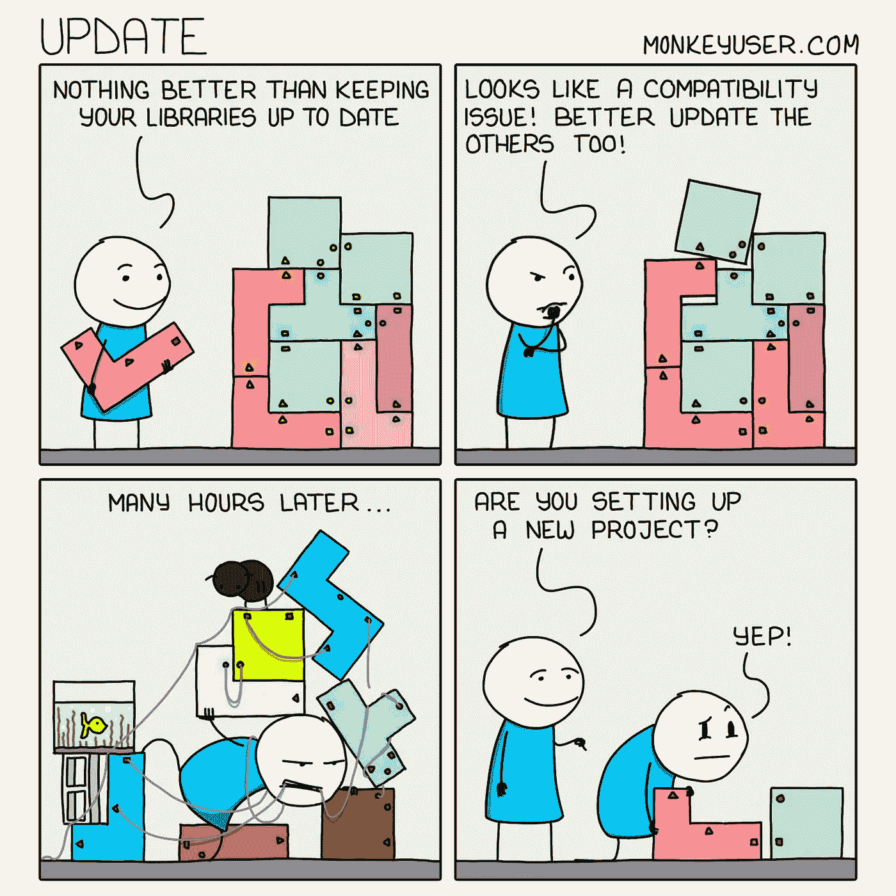

[https://www.monkeyuser.com/](https://www.monkeyuser.com/)

# 罕见中的罕见…

[https://www.facebook.com/yuva.krishna.memes](https://www.facebook.com/yuva.krishna.memes/photos/a.105527467815845/433182401717015/)

# 直到问题得到解决，你才能入睡…

[https://www.facebook.com/yuva.krishna.memes](https://www.facebook.com/yuva.krishna.memes/photos/a.105527467815845/433182401717015/)

# 这些错误…没有可用的步骤…

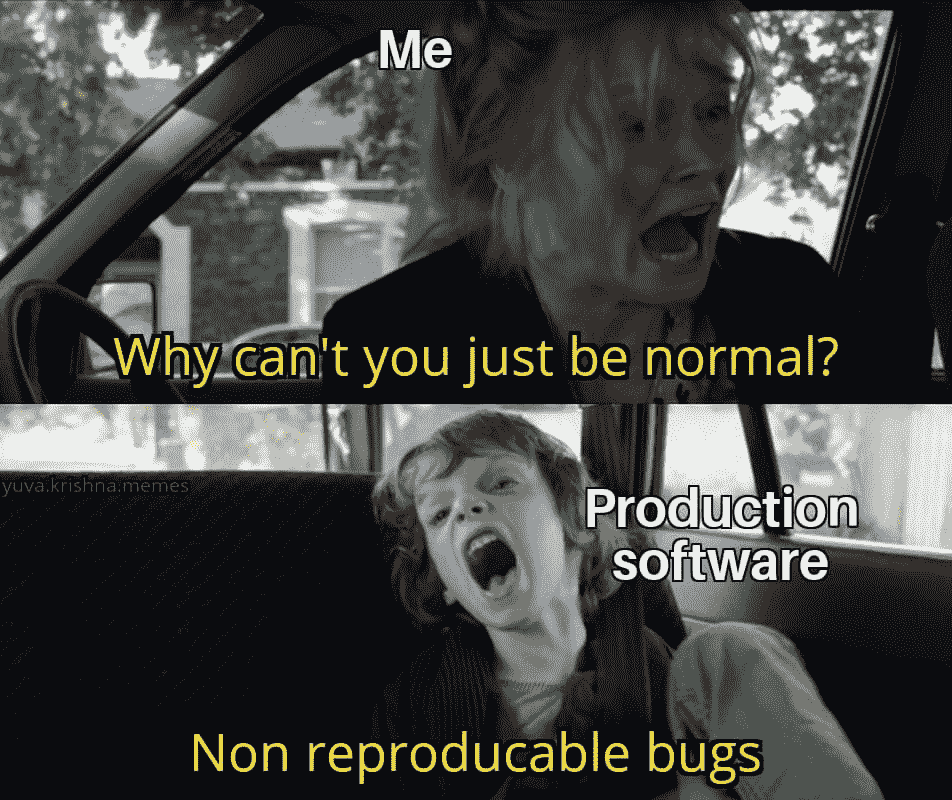

[https://www.facebook.com/yuva.krishna.memes](https://www.facebook.com/yuva.krishna.memes/photos/a.105527467815845/433182401717015/)

# 不管怎样，尝试都有痕迹。

[https://www.facebook.com/yuva.krishna.memes](https://www.facebook.com/yuva.krishna.memes/photos/a.105527467815845/433182401717015/)

# 差距？也许我按了空格键…

[https://www.facebook.com/yuva.krishna.memes](https://www.facebook.com/yuva.krishna.memes/photos/a.105527467815845/433182401717015/)

# 副业 vs 竞技编程…鱿鱼游戏版

[https://www.facebook.com/yuva.krishna.memes](https://www.facebook.com/yuva.krishna.memes/photos/a.105527467815845/433182401717015/)

# 也许 Dev 或 QA 漏掉了什么…

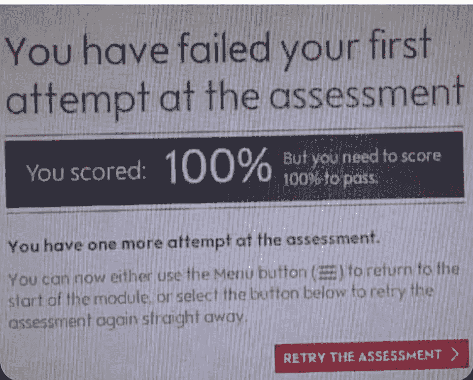

[https://www.facebook.com/yuva.krishna.memes](https://www.facebook.com/yuva.krishna.memes/photos/a.105527467815845/433182401717015/)

# 这是功能还是 bug？

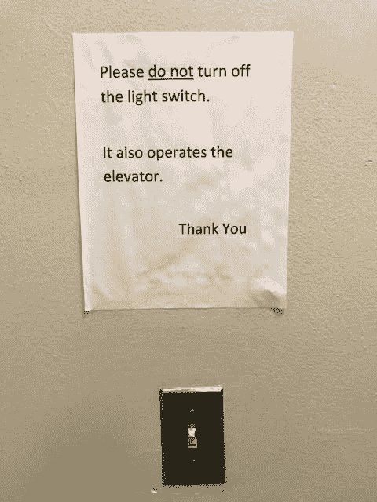

[https://www.facebook.com/yuva.krishna.memes](https://www.facebook.com/yuva.krishna.memes/photos/a.105527467815845/433182401717015/)

# OMG…为什么问这个？

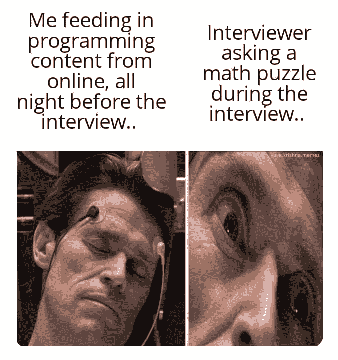

[https://www.facebook.com/yuva.krishna.memes](https://www.facebook.com/yuva.krishna.memes/photos/a.105527467815845/433182401717015/)

# 没什么问题…这是预期的工作 LOL

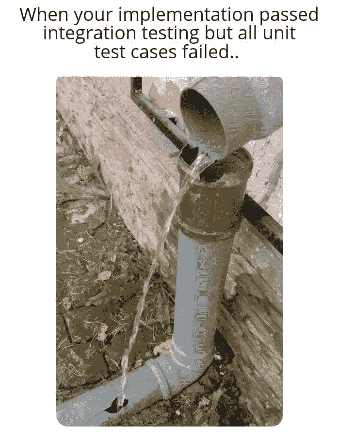

[https://www.facebook.com/yuva.krishna.memes](https://www.facebook.com/yuva.krishna.memes/photos/a.105527467815845/433182401717015/)

# 希望你明白这一点…

[https://www.facebook.com/yuva.krishna.memes](https://www.facebook.com/yuva.krishna.memes/photos/a.105527467815845/433182401717015/)

# 新的东西…

[https://www.facebook.com/yuva.krishna.memes](https://www.facebook.com/yuva.krishna.memes/photos/a.105527467815845/433182401717015/)

# 你需要多长时间？

[https://www.facebook.com/yuva.krishna.memes](https://www.facebook.com/yuva.krishna.memes/photos/a.105527467815845/433182401717015/)

# 为什么一遍又一遍地问同样的问题？

[https://www.facebook.com/yuva.krishna.memes](https://www.facebook.com/yuva.krishna.memes/photos/a.105527467815845/433182401717015/)

# 我也有同样的感觉…

[https://www.facebook.com/yuva.krishna.memes/photos/a.105527467815845/363821001986489/](https://www.facebook.com/yuva.krishna.memes/photos/a.105527467815845/363821001986489/)

# 直到你从 bug 中制作出一个特性，你才是有创造力的

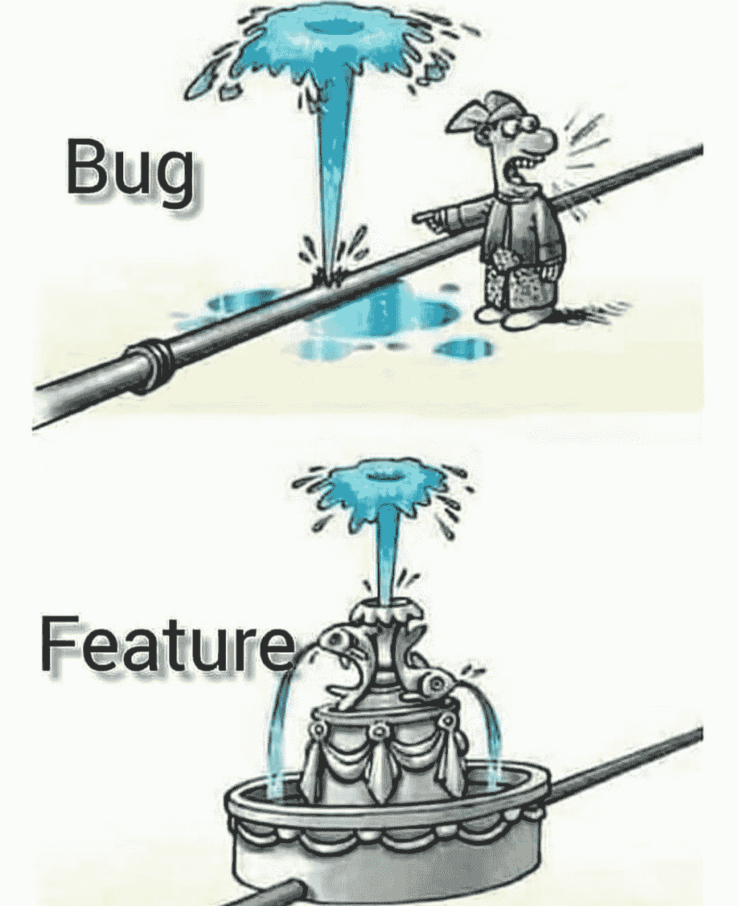

[https://www.facebook.com/photo?fbid=1317127708689107&set=gm.936323553609909](https://www.facebook.com/photo?fbid=1317127708689107&set=gm.936323553609909)

# 不应该移动任何东西…如果你碰了什么东西，我不能保证…

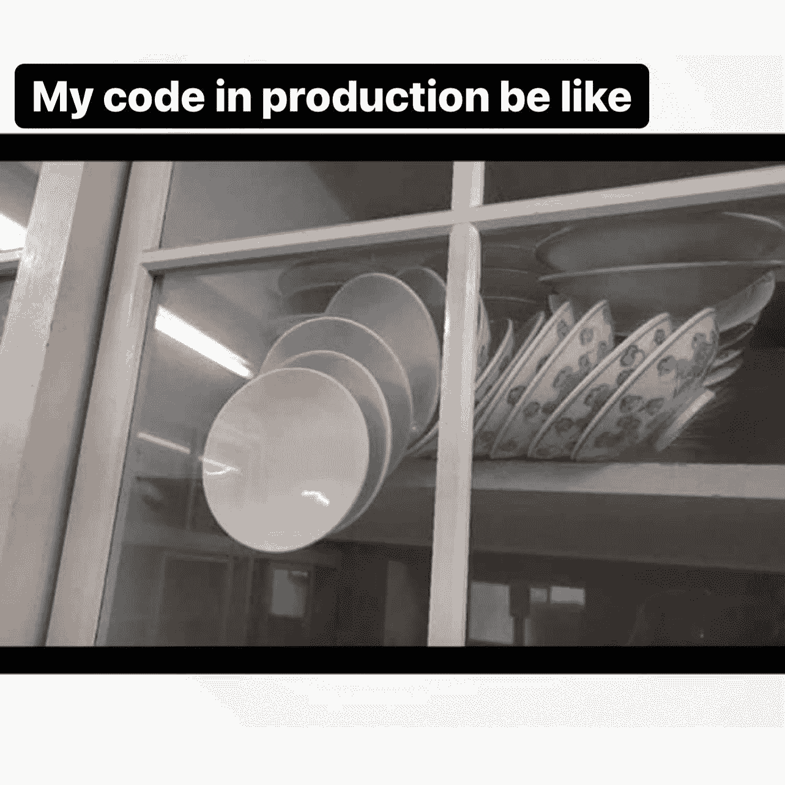

[https://www.facebook.com/javascriptJS](https://www.facebook.com/javascriptJS)

# 其实我是周末开发者… LOL

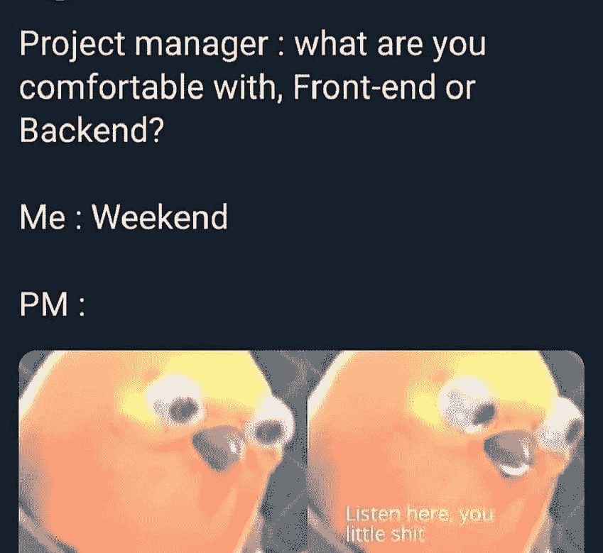

[https://www.facebook.com/javascriptJS](https://www.facebook.com/javascriptJS)

# 没有压力…但是压力…

[https://www.facebook.com/yuva.krishna.memes/photos/a.105527467815845/367903954911527/](https://www.facebook.com/yuva.krishna.memes/photos/a.105527467815845/367903954911527/)

# 没人管…看起来不错…

[https://www.facebook.com/programmemer](https://www.facebook.com/programmemer)

# 再补充一些评论吧…

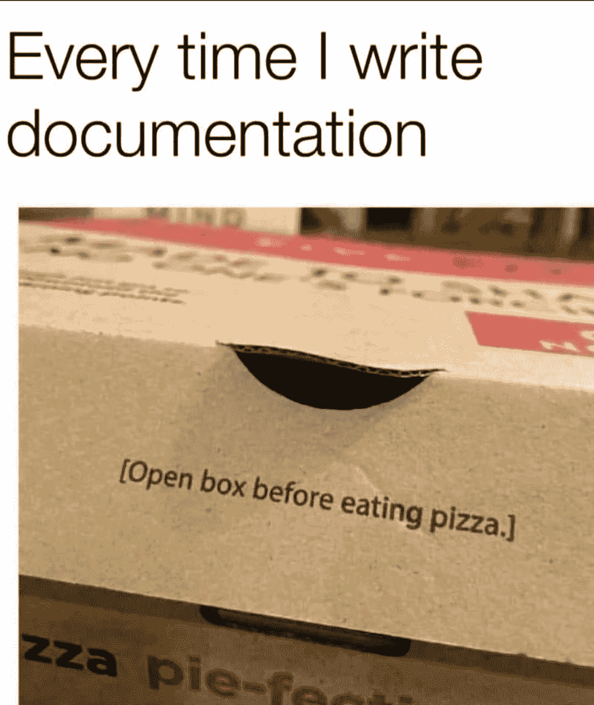

[https://www.facebook.com/programmemer/photos/a.699976850452408/1208843916232363/](https://www.facebook.com/programmemer/photos/a.699976850452408/1208843916232363/)

# 你用过记事本做编码吗？

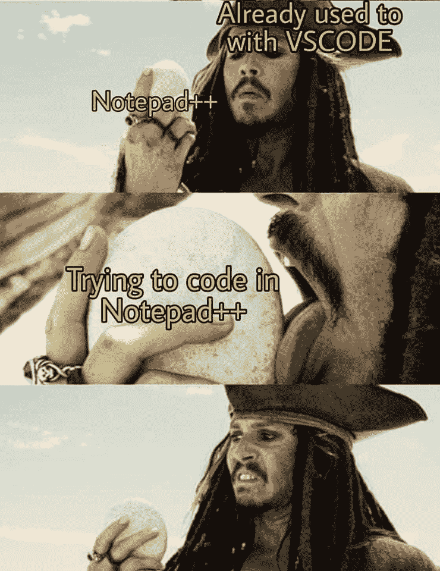

[https://www.facebook.com/programmemer/photos/a.716674348782658/1053189811797775/](https://www.facebook.com/programmemer/photos/a.716674348782658/1053189811797775/)

# 程序员只知道这种关系

[https://www.facebook.com/programmemer/photos/a.716674348782658/1040981369685286/](https://www.facebook.com/programmemer/photos/a.716674348782658/1040981369685286/)

*更多内容看*[***plain English . io***](http://plainenglish.io/)