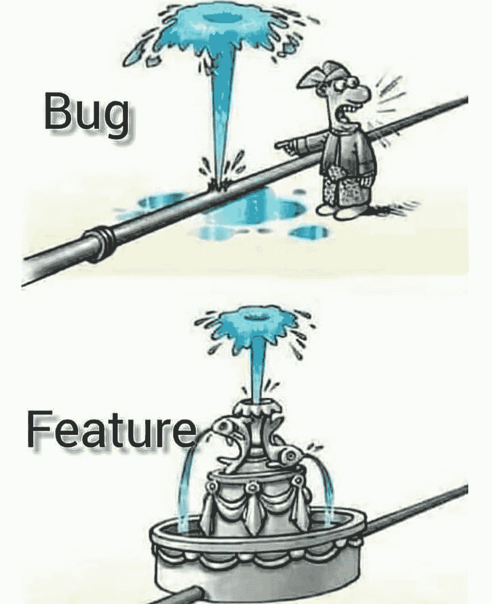
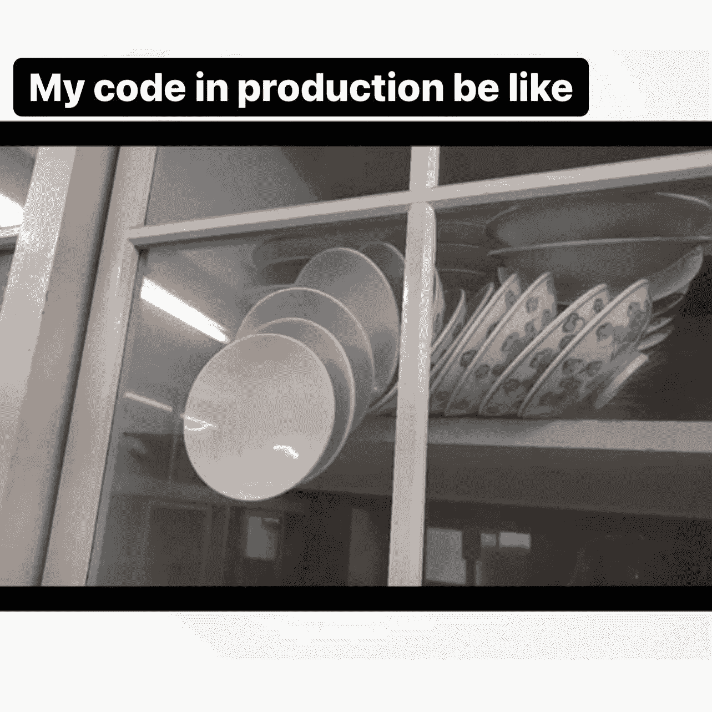
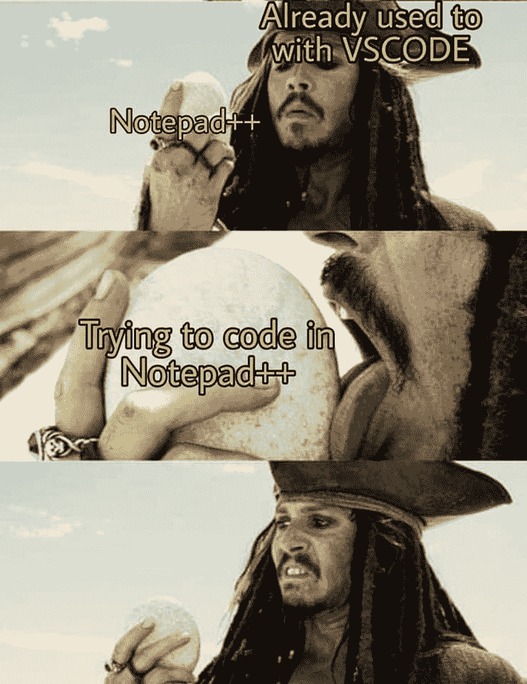

# 编写能让你发笑的注释

> 原文：<https://javascript.plainenglish.io/30-more-funny-code-comments-d2b08a46a62e?source=collection_archive---------11----------------------->

## 因为笑是压力最好的良药！


Photo by [Chris Ried](https://unsplash.com/@cdr6934?utm_source=medium&utm_medium=referral) on [Unsplash](https://unsplash.com?utm_source=medium&utm_medium=referral)

编程就像道路，你会看到平坦的道路或起伏不平，但我们肯定会到达目的地。唯一的事情是我们需要微笑着享受我们的旅程。但是写起来比真实的感情容易。

今天，我试着分享一些有趣的幽默，绝对能让你笑逐颜开。

## 让我们看看如何从代码注释中获得乐趣！

```
// If this code is still being used when it stops working, then 
// you have my permission to shoot me.  Oh, you won't be able 
// to - I'll be dead...
```

```
/* Ultra-hot screen management package 
                James Gosling, January 1980                     */ 
/*              Copyright (c) 1981,1980 James Gosling           */ 
/**************************************************************** 
                        /-------------\ 
                       /               \ 
                      /                 \ 
                     /                   \ 
                     |   XXXX     XXXX   | 
                     |   XXXX     XXXX   | 
                     |   XXX       XXX   | 
                     \         X         / 
                      --\     XXX     /-- 
                       | |    XXX    | | 
                       | |           | | 
                       | I I I I I I I | 
                       |  I I I I I I  | 
                        \              / 
                          --         -- 
                            \-------/ 
                    XXX                    XXX 
                  XXXXX                  XXXXX 
                  XXXXXXXXX         XXXXXXXXXX 
                          XXXXX   XXXXX 
                            XXXXXXX 
                          XXXXX   XXXXX 
                  XXXXXXXXX         XXXXXXXXXX 
                  XXXXX                  XXXXX 
                    XXX                    XXX 
                          ************** 
                          *  BEWARE!!  * 
                          ************** 
                        All ye who enter here: 
                    Most of the code in this module 
                      is twisted beyond belief! 
                          Tread carefully. 
                    If you think you understand it, 
                              You Don't, 
                            So Look Again. 
 ****************************************************************/
```

```
// If this comment is removed the program will blow up
```

```
// Atit wrote this, nobody knows what it does, don't change it!
```

```
// This is black magic
// from
// *Some stackoverlow link
// Don’t play with magic, it can BITE.
```

```
// For the sins I am about to commit, may James Gosling forgive me
```

```
// This code worked before, but my cat decided to take a 
// trip across my keyboard...
```

```
// private instance variable for storing age
public static int age;
```

```
// Steve did not send attribute so happy creativity 
// lets recreate it using available information
// this logic should nod be here and I am waiting impatiently to //throw it away// TODO: DAN to fix this. Not Wes. No sir. Not Wes.
```

```
// Times New Roman? What was wrong with the old Romans?
```

```
// return
return;
```

```
private
  //PRIVATE means PRIVATE so no comments for you
  function LoadIt(IntID: Integer): Integer;
```

```
// yes, this is going to break in 3001, but, one, I'll be dead, and two, we really ought to be using
// a different system by then
if (yearPart >= 01)
{
    // naughty bits removed....
}
```

```
/**
 * Implements the PaymentType interface.
 */
public class PaymentTypePo implements PaymentType
```

# 给你一些幽默…

# 我也有同样的感觉…


[https://www.facebook.com/yuva.krishna.memes/photos/a.105527467815845/363821001986489/](https://www.facebook.com/yuva.krishna.memes/photos/a.105527467815845/363821001986489/)

# 直到你从 bug 中制作出一个特性，你才是有创造力的



[https://www.facebook.com/photo?fbid=1317127708689107&set=gm.936323553609909](https://www.facebook.com/photo?fbid=1317127708689107&set=gm.936323553609909)

# 不应该移动任何东西..如果你碰了什么东西，我不能保证…



[https://www.facebook.com/javascriptJS](https://www.facebook.com/javascriptJS)

# 其实我是周末开发者… LOL


[https://www.facebook.com/javascriptJS](https://www.facebook.com/javascriptJS)

# 没有压力…但是压力…


[https://www.facebook.com/yuva.krishna.memes/photos/a.105527467815845/367903954911527/](https://www.facebook.com/yuva.krishna.memes/photos/a.105527467815845/367903954911527/)

# 没人在乎..看起来不错…


[https://www.facebook.com/programmemer](https://www.facebook.com/programmemer)

# 再补充一些评论吧…


[https://www.facebook.com/programmemer/photos/a.699976850452408/1208843916232363/](https://www.facebook.com/programmemer/photos/a.699976850452408/1208843916232363/)

# 你用过记事本做编码吗？



[https://www.facebook.com/programmemer/photos/a.716674348782658/1053189811797775/](https://www.facebook.com/programmemer/photos/a.716674348782658/1053189811797775/)

# 程序员只知道这种关系


[https://www.facebook.com/programmemer/photos/a.716674348782658/1040981369685286/](https://www.facebook.com/programmemer/photos/a.716674348782658/1040981369685286/)

# 我喜欢周末..我是周末开发者


[https://www.facebook.com/groups/programming.jokes](https://www.facebook.com/groups/programming.jokes)

# 当我有一些问题，去睡觉的时候…


[https://www.facebook.com/groups/programming.jokes](https://www.facebook.com/groups/programming.jokes)

# 编程的定义


[https://www.facebook.com/groups/programming.jokes](https://www.facebook.com/groups/programming.jokes)

# 很酷的库，来补充一下吧…


[https://www.monkeyuser.com/](https://www.monkeyuser.com/)

# 修理时，损坏某物…


[https://www.monkeyuser.com/](https://www.monkeyuser.com/)

*更多内容尽在*[***plain English . io***](http://plainenglish.io)