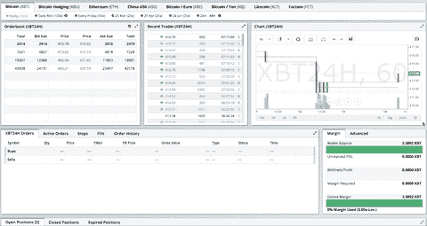
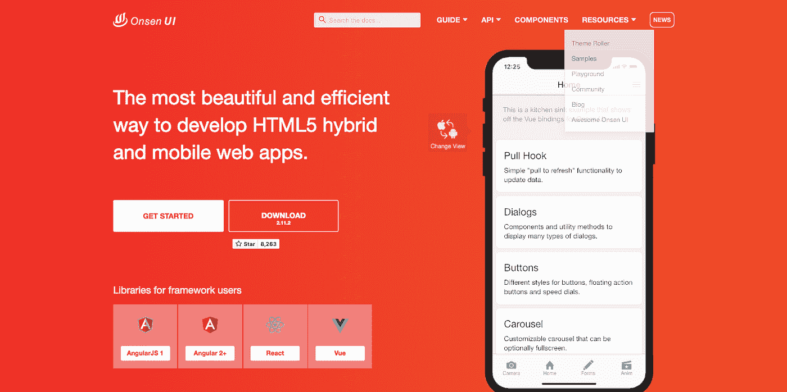

# 30 个有用的 React 资源，初学者可以用来更好地编程

> 原文：<https://javascript.plainenglish.io/30-useful-react-resources-you-can-use-for-free-80c7e95eaee4?source=collection_archive---------9----------------------->

## 充分利用这些资源。

Source: [Medium](https://medium.com/@adityaa803/i-made-a-simple-animation-of-the-react-logo-with-css-and-svg-here-66041004f597) / [Aditya Agarwal](https://medium.com/u/9c555799c00e?source=post_page-----80c7e95eaee4--------------------------------)

周末我有充足的时间，我想做一些 React 社区有希望喜欢的有用的东西。我花时间在 Github 上寻找有用的 React UI 组件、框架、动画等。,

当我在网上寻找很酷的东西时，Github 是我的首选资源，所以我想专注于那里。我没有随便放我找到的东西。我只列出了那些在 Github 上获得超过 1k 颗星的。

让我们开始吧。

## 1.网格— [反应数据网格](https://github.com/adazzle/react-data-grid)

如果您想创建一个类似于 excel 的数据网格表，可以使用这个组件。

*   Github Stars — 4.4k
*   npm 安装反应数据网格

Photo screenshot by the author

## 2.表— [反应表](https://github.com/tannerlinsley/react-table)

这是一个为 React 构建的轻量级、快速且可扩展的数据网格。

*   Github Stars — 13.6k
*   纱线添加反应-表-6
*   npm 安装反应-表 6

Photo screenshot by the author

## 3.菜单— [反应汉堡菜单](https://github.com/negomi/react-burger-menu)

画布外侧边栏 React 组件使用 CSS 过渡和 SVG 路径动画收集效果和样式。

*   Github Stars — 4.3k
*   npm 安装反应-汉堡-菜单-保存

Photo screenshot by the author

## 4.无限滚动— [反应虚拟化](https://github.com/bvaughn/react-virtualized)

该组件将帮助您创建大型列表和表格数据的高效呈现。

*   Github Stars — 21.1k
*   npm 安装反应-虚拟化-保存

Photo screenshot by the author

## 5.叠加效果— [温馨提示](https://github.com/sweetalert2/sweetalert2)

您可以使用此工具在您的网站上创建不同的 pop 效果。

*   Github Stars — 12.5k
*   npm 安装—保存 sweetalert2

Photo screenshot by the author

## 6.通知— [反应迟钝](https://github.com/fkhadra/react-toastify)

您可以使用该组件为您的网站查找和使用不同的通知设计。尝试这些设计，它们会在你的网站上表现得最好。

*   Github Stars — 12.5k
*   npm 安装—保存 sweetalert2

Source: [https://github.com/fkhadra/react-toastify](https://github.com/fkhadra/react-toastify)

## 7.粘性标题— [反应余量](https://github.com/KyleAMathews/react-headroom)

这将帮助你在你的网站上创建一个粘性标题。我喜欢这个粘性标题的原因是它不是很持久。它只会在你向上滚动时出现，向下滚动时消失。

*   Github Stars —1.5k
*   npm 安装反应空间

Photo screenshot by the author

## 7.标签— [反应标签](https://github.com/reactjs/react-tabs)

从简单到复杂的不同设计，React 标签都易于访问和使用。

*   Github Stars — 2.4k
*   纱线添加反应标签
*   npm 安装—保存反应标签

Photo screenshot by the author

## 8.加载器— [反应骨架](https://github.com/danilowoz/react-content-loader)

您可以使用该组件通过 React 创建一个漂亮的动画加载器。在这个组件中你可以做 70 多种设计。

*   Github Stars — 10.5k
*   npm 我反应-内容-加载器-保存
*   纱线添加反应成分加载器

Photo screenshot by the author

## 9.旋转木马— [反应滑溜](https://github.com/akiran/react-slick)

这个工具将允许你用 React 在你的网站上创建一个旋转木马效果。

*   Github Stars — 9.3k
*   npm 安装 react-slick —保存
*   纱线添加反应润滑剂

Photo screenshot by the author

## 10.按钮——很棒的按钮

这个 React 组件将允许你在你的网站上创建动画 3D UI 按钮。有不同的主题可供您选择，每个主题将向您展示不同的效果。

*   Github Stars — 9.3k
*   npm 安装-保存 react-awesome-按钮

Source: [https://github.com/rcaferati/react-awesome-button](https://github.com/rcaferati/react-awesome-button)

## 11.图表— [充值](https://github.com/recharts/recharts)

您可以使用该组件创建任何 react 图表，而不会遇到任何麻烦。您可以选择不同的图表设计。您可以从中选择不同的图表设计，如雷达图、饼图、条形图等。

*   Github Stars —15.9k
*   npm 安装费用

Photo screenshot by the author

## 12.贴图— [反应贴图 GL](https://github.com/visgl/react-map-gl)

这是一个对 MapboxGL JS 友好的 API 包装器。

*   Github Stars — 5.8k
*   npm 安装-保存反应图-总帐

Photo screenshot by the author

## 13.照片显示— [反应图像库](https://github.com/xiaolin/react-image-gallery)

该组件允许您创建一个响应迅速且灵活的 carousel 设计，并为 React 提供缩略图支持。

*   Github Stars — 5.8k
*   npm 安装反应-图像库

Source: [https://github.com/xiaolin/react-image-gallery](https://github.com/xiaolin/react-image-gallery)

## 14.图标— [反应图标](https://react-icons.github.io/react-icons/)

你可以用这个工具在你的网站上选择图标，从蚂蚁设计，自举，游戏，到简单的图标。

*   Github Stars — 5.9k
*   npm 安装反应图标—保存
*   纱线添加反应图标

Photo screenshot by the author

## 15.分页器— [反应分页器](https://github.com/AdeleD/react-paginate)

您可以使用此工具在您的网站内容上创建分页。

*   Github Stars — 1.9k
*   npm 安装反应-分页-保存

Source: [https://github.com/AdeleD/react-paginate](https://github.com/AdeleD/react-paginate)

或者

Source: [https://github.com/AdeleD/react-paginate](https://github.com/AdeleD/react-paginate)

## 16.自动完成— [反应打印头](https://github.com/fmoo/react-typeahead)

您可以使用这个 JavaScript 库快速自动完成文本输入，因为 typeahead 允许您选择多个结果。

*   Github Stars — 1.9k
*   npm 安装反应-分页-保存

Source: [https://github.com/fmoo/react-typeahead](https://github.com/fmoo/react-typeahead)

## 17.颜色选择器— [反应颜色](https://github.com/casesandberg/react-color)

这是一个不同来源的颜色选择器的集合，如 Photoshop、Chrome、Github、Twitter 等。

*   Github Stars — 9.5k
*   npm 安装反应-颜色-保存

Source: [https://github.com/casesandberg/react-color](https://github.com/casesandberg/react-color)

## 18.拖拽— [反应漂亮 DND](https://github.com/atlassian/react-beautiful-dnd)

这个组件将帮助你用 React 做一个漂亮的拖放。

*   Github Stars — 9.5k
*   纱线添加反应-美丽-dnd
*   npm 安装 react-beautiful-dnd-保存

Source: [https://github.com/atlassian/react-beautiful-dnd](https://github.com/atlassian/react-beautiful-dnd)

## 19.拖放— [反应可拖动](https://github.com/react-grid-layout/react-draggable)

使用该组件创建可拖动的简单元素。

*   Github Stars — 6.5k
*   npm 安装反应-可拖动

Source: [https://github.com/react-grid-layout/react-draggable](https://github.com/react-grid-layout/react-draggable)

## 20.可分类的— [可分类的](https://github.com/SortableJS/Sortable)

这是一个 JavaScript 库，用于同一列表中可重新排序的拖放列表。

*   Github Stars —22k
*   npm 安装 sortablejs 保存
*   bower 安装—保存排序表

Gif provided by the author

## 21.富文本编辑器— [Draft.js](https://github.com/facebook/draft-js)

这是一个专门为 react 构建的 JavaScript 富文本编辑器框架。

*   Github Stars — 19.9k
*   纱线添加牵伸-js 反应-反应

Source: [https://github.com/facebook/draft-js](https://github.com/facebook/draft-js)

## 22.图像处理— [对图像裁剪做出反应](https://github.com/DominicTobias/react-image-crop)

这是 React 的一个响应裁剪工具

*   Github Stars — 2.6k
*   npm 我反应-图像-裁剪-保存

Source: [https://github.com/DominicTobias/react-image-crop](https://github.com/DominicTobias/react-image-crop)

## 23.[自动响应反应](https://github.com/xudafeng/autoresponsive-react)

这是 React 的自动响应网格布局。

*   Github Stars —1.4k
*   npm i 自动响应-反应-保存-开发

Source: [https://github.com/xudafeng/autoresponsive-react](https://github.com/xudafeng/autoresponsive-react)

## 24.[反应网格布局](https://github.com/react-grid-layout/react-grid-layout)

您可以使用它为 React 创建一个带有响应断点的拖放网格布局。

*   Github Stars — 12.9k
*   npm 安装反应网格布局

Source: [https://github.com/react-grid-layout/react-grid-layout](https://github.com/react-grid-layout/react-grid-layout)

## 25.[反作用弹簧](https://github.com/pmndrs/react-spring)

有了这个 React UI 库，创建动画效果就容易多了。这涵盖了许多与 UI 相关的动画效果。

*   Github Stars — 19.5k
*   npm 安装反作用弹簧

Source: [https://github.com/pmndrs/react-spring](https://github.com/pmndrs/react-spring)

## 26.材料设计— [材料界面](https://github.com/mui-org/material-ui)

Material-UI 是一个简单且可定制的组件库，用于构建更快、更漂亮、更易访问的 React 应用程序。遵循自己的设计体系，或者从材料设计开始。

*   Github Stars — 65.6k
*   npm 安装@material-ui/core
*   纱线添加@材料-用户界面/核心

Source: https://material-ui.com

## 27.手机— [蚂蚁设计手机](https://github.com/ant-design/ant-design-mobile)

一个可配置的移动 UI 规范和基于 React 的实现。

*   Github Stars — 8.7k
*   npm 安装 antd-mobile —保存

Photo screenshot by the author

## 28.手机— [OnsenUI](https://github.com/OnsenUI/OnsenUI/)

您可以使用这个框架来创建漂亮且高性能的跨平台移动应用程序。

*   Github Stars — 8.7k
*   npm 安装 antd-mobile —保存

Photo screenshot by the author

## 28.组件集合— [蓝图](https://github.com/palantir/blueprint)

一个基于 React 的 web 用户界面工具包

*   Github Stars — 17.4k

Source: [https://blueprintjs.com/](https://blueprintjs.com/)

## 29.组件集合— [反应管理员](https://github.com/marmelab/react-admin)

用于构建在浏览器中运行的数据驱动应用程序的前端框架。

*   Github Stars —16.1k
*   npm 安装反应-管理
*   纱线添加反应-管理

Source: [https://github.com/marmelab/react-admin](https://github.com/marmelab/react-admin)

## 30.组件集合— [Rsuite](https://github.com/rsuite/rsuite)

一套 React 组件、明智的 UI 设计和友好的开发体验。

*   Github Stars — 5.3k
*   npm i rsuite@next —保存
*   纱线添加套件@next

Photo screenshot by the author

我想添加更多，但我没有足够的时间。如果能再来一轮，我一定会一试，但希望这个对你有用。