# 30 用于 Web 开发的 Visual Studio 代码扩展

> 原文：<https://javascript.plainenglish.io/30-visual-studio-code-extension-for-web-development-e5580b1262d3?source=collection_archive---------4----------------------->

## 优秀的 VS 代码扩展，可以用于 web 开发。

# 什么是 Visual Studio 代码

Visual Studio 代码是开源的，由微软开发，所以你可以放心使用，因为它是完全免费的，并且总是更新到最新版本。不仅如此，它还非常适合开发大型、复杂的项目，并且还支持 Git 集成。这个工具还提供了扩展来帮助我们更快地编码，更有效地管理文件。

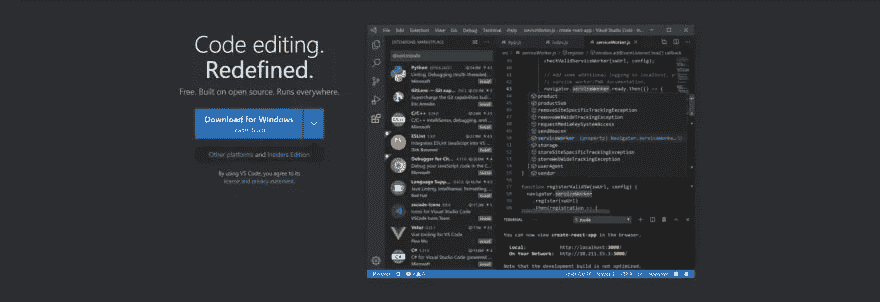

[Visual Studio 代码](https://code.visualstudio.com/)

# Visual Studio 代码扩展

# Chrome 调试器

调试器可以帮助你在 VS 代码中调试程序代码错误，而不用打开谷歌浏览器使用开发者工具。它有许多有用的功能，如设置断点，显示控制台。

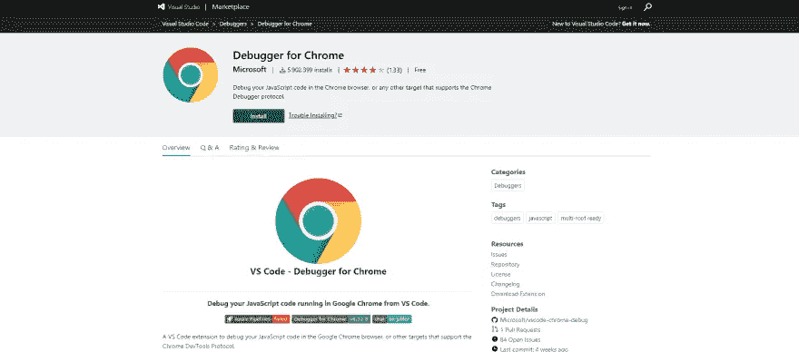

[Chrome 的调试器](https://marketplace.visualstudio.com/items?itemName=msjsdiag.debugger-for-chrome&ssr=false#overview)

# JavaScript (ES6)代码片段

JavaScript (ES6)代码片段使得通过提供的语法快速调用函数或属性的结构成为可能。比如你输入 clg，它会自动编译到 console.log(object)。可以参考其设置页面上的注释表。此外，它还支持文件扩展名中的许多语言，如 TypeScript、JavaScript React、TypeScript React、HTML 和 Vue.js。

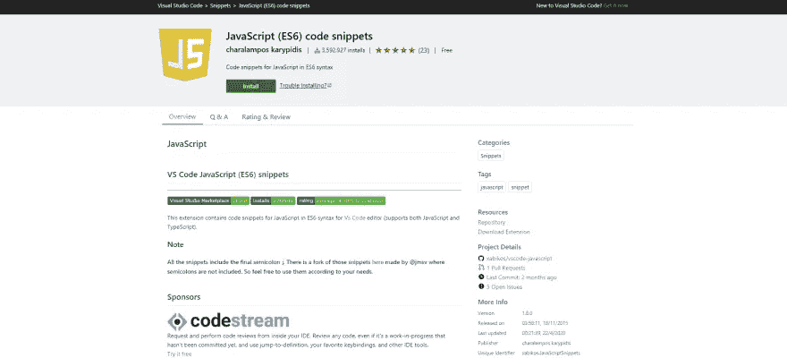

[JavaScript (ES6)代码片段](https://marketplace.visualstudio.com/items?itemName=xabikos.JavaScriptSnippets)

# 实时服务器

Live Server 通过静态和动态网页的实时自动重新加载，帮助快速启动本地服务器。例如，当你改变一个 HTML 页面上的一条信息时，它会自动更新，而不需要我们在浏览器上点击重载。它还有许多用户设置选项，如自定义端口号、默认浏览器设置、SVG 支持、HTTPS、代理等。

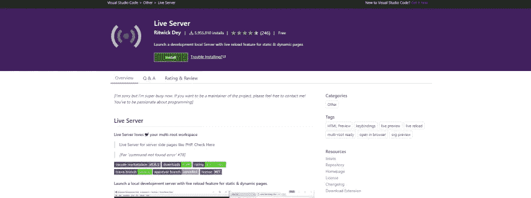

[直播服务器](https://marketplace.visualstudio.com/items?itemName=ritwickdey.LiveServer)

# 自动关闭标签

自动关闭标签可以帮助您在打开标签时自动关闭标签。比如你打字的时候，它会自动添加。此外，它还支持许多其他语言，如 XML、PHP、Vue.js、JavaScript、TypeScript、JSX、TSX 等。它也有一些设置，使它很容易调整，如设置非自动标签列表动态关闭，使用键盘快捷键手动添加关闭标签。

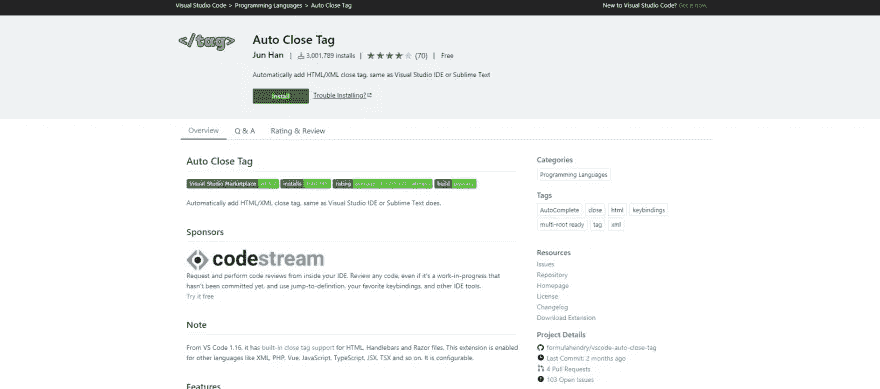

[自动关闭标签](https://marketplace.visualstudio.com/items?itemName=formulahendry.auto-close-tag)

# 更漂亮—代码格式化程序

更漂亮——代码格式化程序帮助您自动重新格式化代码，并通过扩展定义的规则为编程团队创建通用的代码样式。还支持 JavaScript、TypeScript、Flow、JSX、JSON、HTML、Vue.js、Angular 等多种语言。

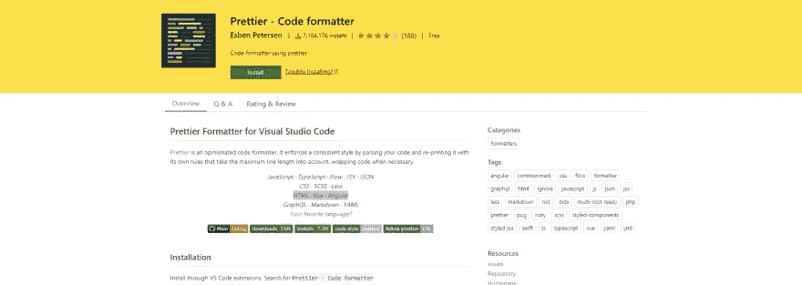

[更漂亮——代码格式化程序](https://marketplace.visualstudio.com/items?itemName=esbenp.prettier-vscode)

# 待办事项突出显示

TODO Highlight 帮助您突出显示代码中的重要注释，以便后来的程序员或我们自己能够理解在使用和编码之前要注意什么或要做什么。此外，它还拥有许多设计精美的主题，支持 JavaScript、HTML、CSS、PHP 等多种语言。

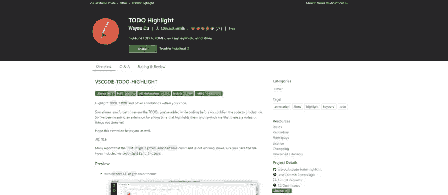

[待办事宜高亮](https://marketplace.visualstudio.com/items?itemName=wayou.vscode-todo-highlight)

# 自动重命名标签

自动重命名标签有助于自动重命名 HTML、XML 中的两对标签。例如，当您更改开始标记的名称时，相应的结束标记也会自动更改。你可以在用法部分看到一个详细的例子。

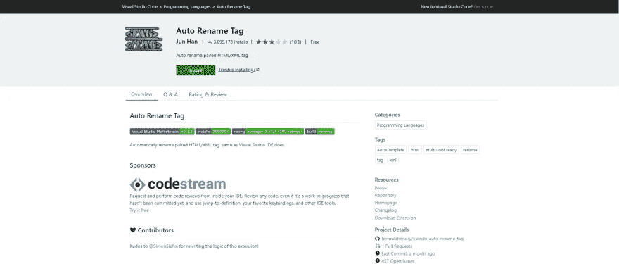

[自动重命名标签](https://marketplace.visualstudio.com/items?itemName=formulahendry.auto-rename-tag)

# 更好的评论

更好的注释在单独的类别中显示注释，使分类和可视化更容易，例如要突出显示的重要公告、警告、待办事项等。此外，您可以根据自己的目的和偏好进行定制，例如设置注释语法、编辑注释的背景颜色。

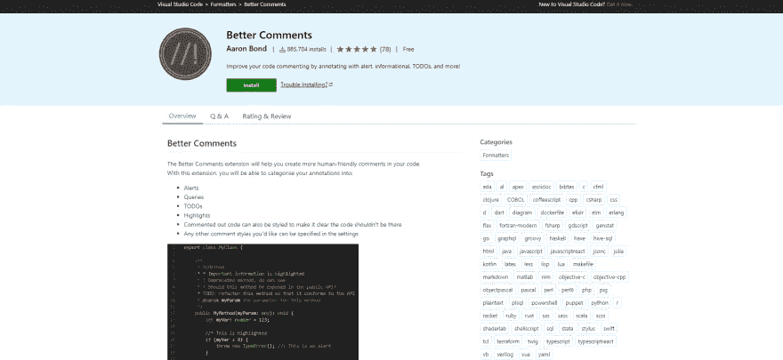

[更好的评论](https://marketplace.visualstudio.com/items?itemName=aaron-bond.better-comments)

# 埃斯林特

ESLint 是一个工具，它分析程序中的代码，找出错误以及需要改进的代码。此外，它还为您提供了更快地优化或修复错误的解决方案。您还可以定制 ESLint 的解析器来适应您的目的或项目。

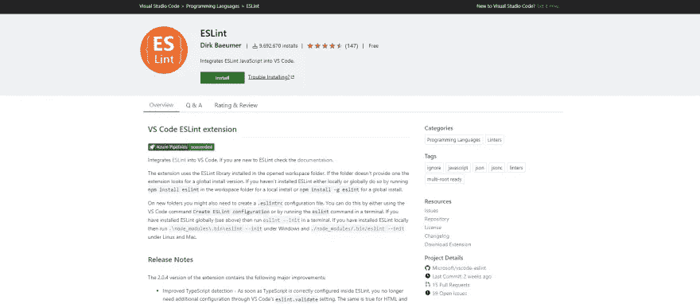

[ESLint](https://marketplace.visualstudio.com/items?itemName=dbaeumer.vscode-eslint)

# 美化

美化是一个实用程序，它可以帮助你以一种更漂亮的方式重新格式化你的代码。它支持流行的语言，如 JavaScript、JSON、CSS、Sass 和 HTML。

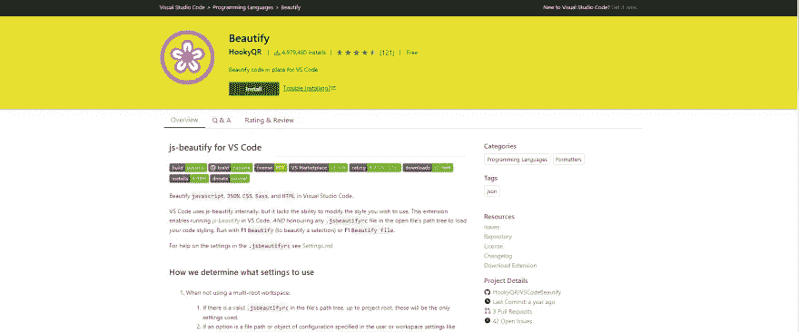

[美化](https://marketplace.visualstudio.com/items?itemName=HookyQR.beautify)

# 括号对着色机

括号对着色程序是一个扩展，它通过使用颜色来突出代码中相应的括号。当代码中有太多嵌套的括号时，它可以帮助您轻松地检测到缺少的括号，或者直观地查看一下。

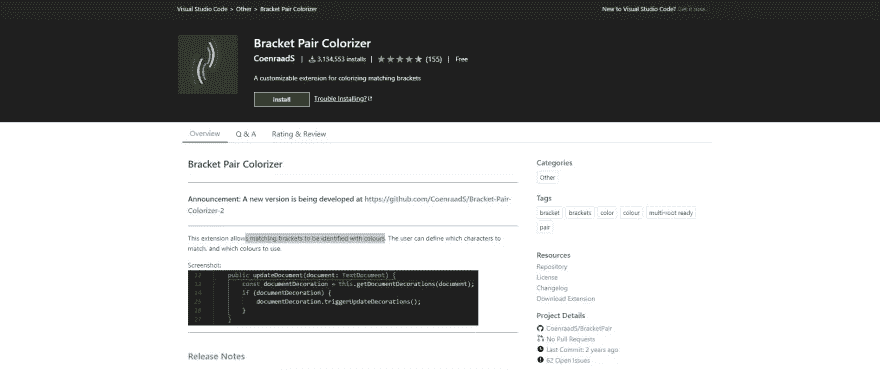

[括号对上色器](https://marketplace.visualstudio.com/items?itemName=CoenraadS.bracket-pair-colorizer)

# 路径智能感知

Path Intellisense 是一个扩展，它通过在每次键入文件存储位置的路径时建议路径来帮助您自动执行文件名(自动完成文件名)。

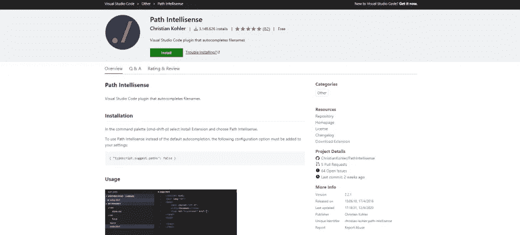

[路径智能感知](https://marketplace.visualstudio.com/items?itemName=christian-kohler.path-intellisense&ssr=false#overview)

# 进口成本

Import Cost 使我们在导入时可以通过代码中直接显示的信息轻松检查导入文件的大小。

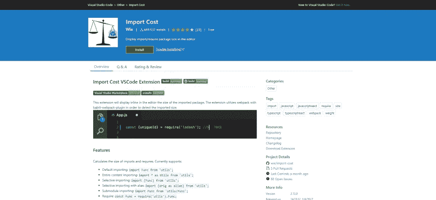

[进口成本](https://marketplace.visualstudio.com/items?itemName=wix.vscode-import-cost)

# 代码时间

代码时间帮助您计算处理 visual studio 代码的时间。此外，它还总结了您在每个项目上花费的时间，通过一周中各天的图表显示您工作时间的平均值。

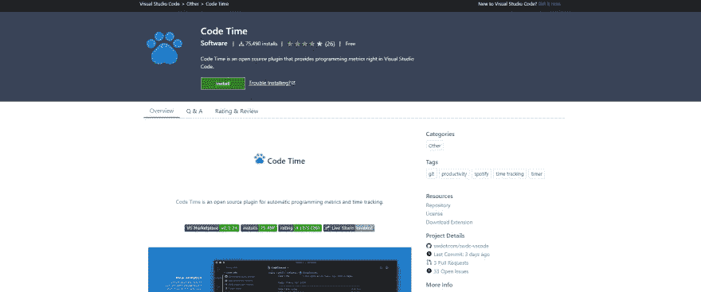

[代码时间](https://marketplace.visualstudio.com/items?itemName=softwaredotcom.swdc-vscode)

# CSS Peek

CSS Peek 扩展有助于在包含这些类或属性的 CSS 文件中找到 HTML 标记的 id 或类。此外，它还允许您立即转到那些 CSS 文件。

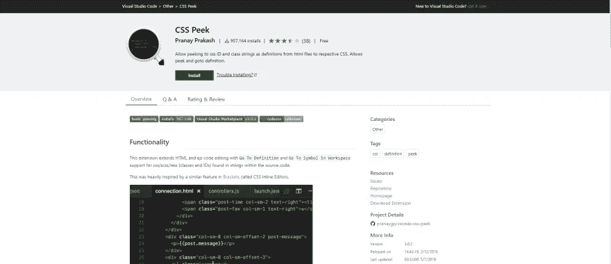

[CSS Peek](https://marketplace.visualstudio.com/items?itemName=pranaygp.vscode-css-peek)

# 项目管理人

项目管理器扩展使得在 VS 代码中切换项目变得容易。它提供了一个子菜单，以便您可以存储要处理的项目，并快速地来回切换。

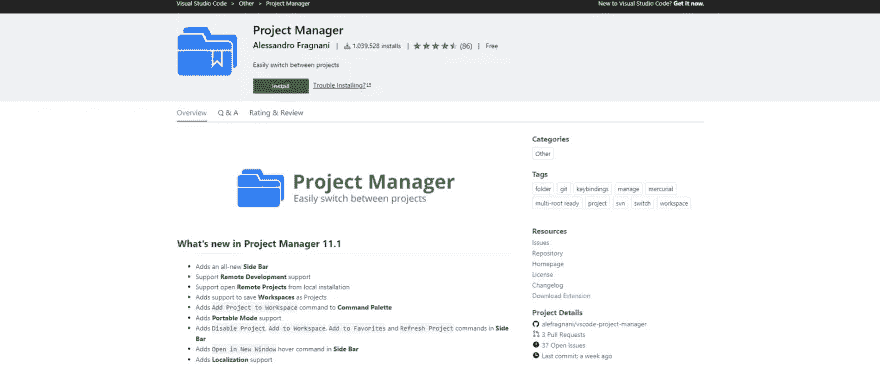

[项目经理](https://marketplace.visualstudio.com/items?itemName=alefragnani.project-manager&ssr=false#overview)

# 浏览器预览

浏览器预览在 Visual Studio 代码上直接显示浏览器，这样您可以更容易地查看结果以及调试程序。

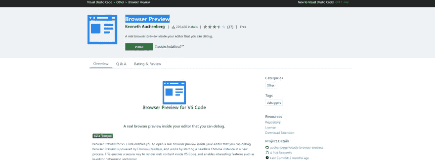

[浏览器预览](https://marketplace.visualstudio.com/items?itemName=auchenberg.vscode-browser-preview)

# GitLens — Git 增压

Git lens——Git super charged 是一个实用程序，它提供了许多有用的功能来帮助您更好地使用 Git，例如显示关于提交开发人员的每行代码的注释，显示关于文件中修订代码的详细信息。

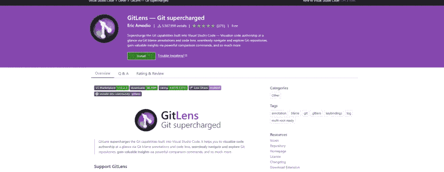

[GitLens — Git 增压](https://marketplace.visualstudio.com/items?itemName=eamodio.gitlens)

# 波拉科德

Polacode 是一个实用程序，可以帮助您轻松地将代码拍照并保存在您的计算机上。此外，还可以选择预先设计好的主题，帮助代码在拍摄过程中脱颖而出，更加美观。

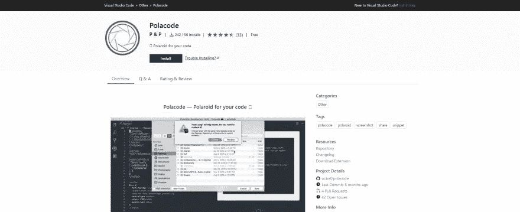

[波拉科德](https://marketplace.visualstudio.com/items?itemName=pnp.polacode)

# 虚拟代码-图标

vscode-icons 是一个实用程序，我们可以为 Visual Studio 代码设置许多漂亮的图标。

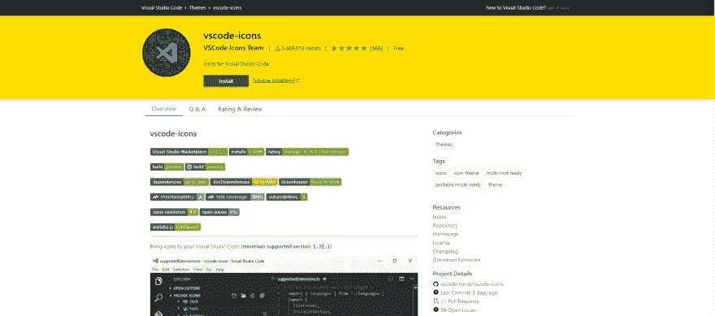

[虚拟代码图标](https://marketplace.visualstudio.com/items?itemName=vscode-icons-team.vscode-icons)

# 设置同步

Settings Sync 使您可以轻松地在 GitHub 上保存您的计算机上的 Visual Studio 代码的设置，并轻松地在其他计算机上使用它，例如关于扩展的信息或您需要的设置。已经设置好了。现在，您可以轻松地为许多不同的机器进行设置，而不必回忆为 VS 代码安装的扩展和设置。

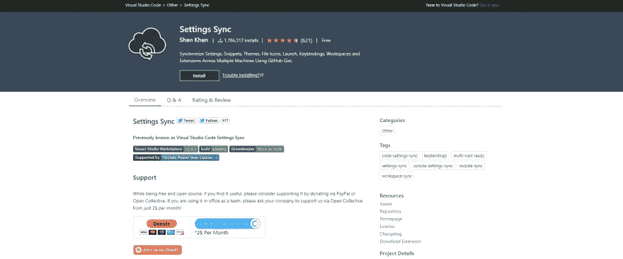

[设置同步](https://marketplace.visualstudio.com/items?itemName=Shan.code-settings-sync)

# 阔卡

Quokka 让你可以测试每一小段 JavaScript，键入脚本代码并直接在 VS 代码上显示，而不需要使用 console.log()在浏览器中显示。

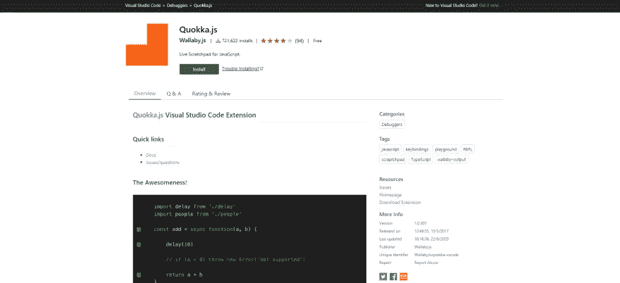

[阔卡](https://marketplace.visualstudio.com/items?itemName=WallabyJs.quokka-vscode)

# 编辑器配置

EditorConfig 是一个扩展，有助于为从事同一项目的多个开发人员保持代码风格的一致性。每个程序员都可以在许多不同的代码编辑器上工作，如 VS Code、Atom、Notepad++等，它都支持每个平台上的插件，帮助程序员一次读取和编辑一个样式代码。简单的方法。

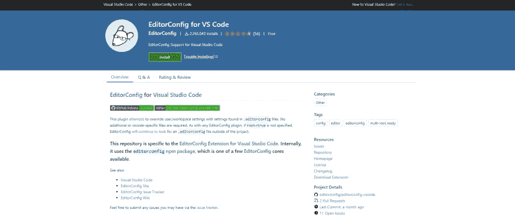

[编辑配置](https://marketplace.visualstudio.com/items?itemName=EditorConfig.EditorConfig)

# 材料图标主题

材质图标主题是 Visual Studio 代码的材质设计图标设置实用程序。

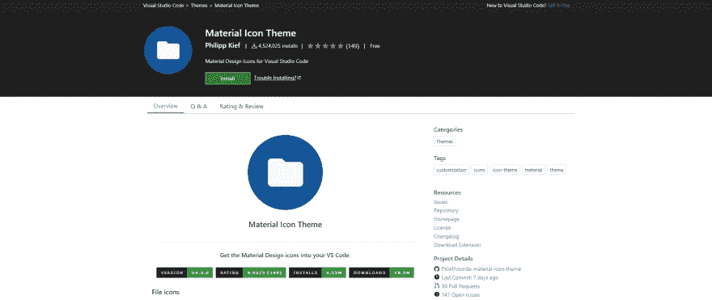

[素材图标主题](https://marketplace.visualstudio.com/items?itemName=PKief.material-icon-theme)

# 彩色高光

颜色突出显示是一个实用程序，帮助您显示页面上的对象的颜色。例如，许多 VS 代码无法显示的颜色代码，这个工具是您的绝佳选择。

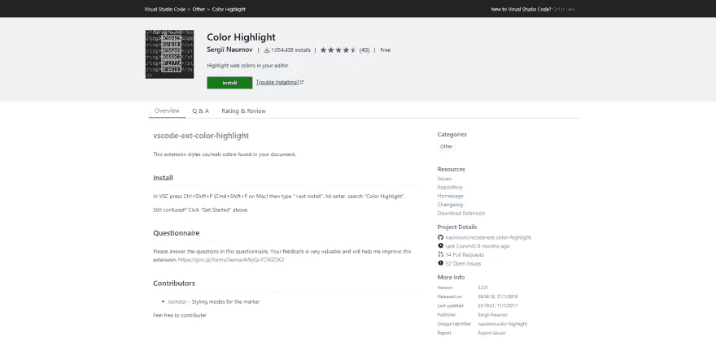

[颜色高亮](https://marketplace.visualstudio.com/items?itemName=naumovs.color-highlight)

# REST 客户端

REST 客户端允许您发送 HTTP 请求，并直接在 Visual Studio 代码中查看结果。

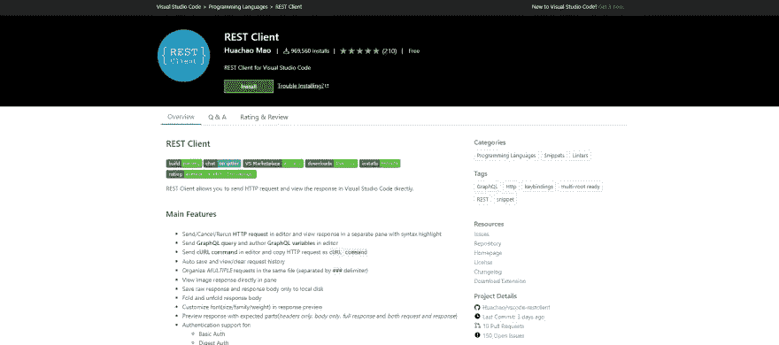

[休息客户端](https://marketplace.visualstudio.com/items?itemName=humao.rest-client)

# 实时分享

Live Share 帮助团队中的开发人员实时共享程序中的代码，以轻松编辑和调试程序，如共享调试会话、终端实例、本地主机 web 应用程序、语音呼叫。

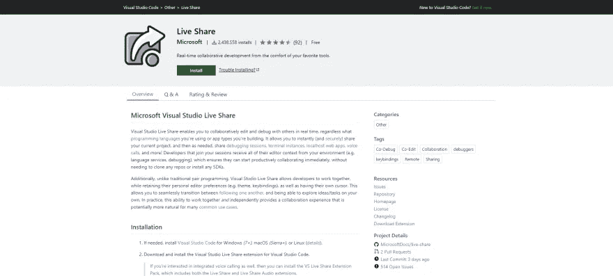

[现场分享](https://marketplace.visualstudio.com/items?itemName=MS-vsliveshare.vsliveshare)

# 代码拼写检查器

代码拼写检查器帮助您检查程序中代码的拼写。然而，它只支持英语，瑞典语，法语，德语等语言。

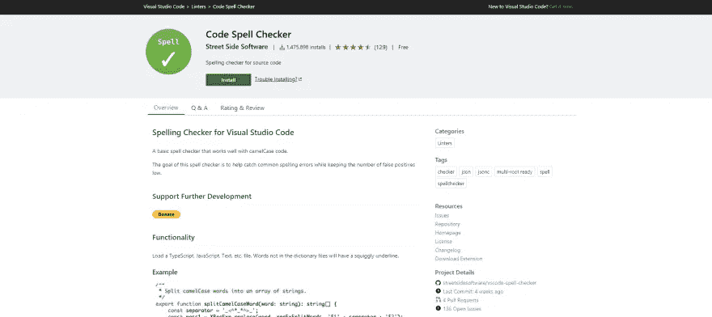

[代码拼写检查器](https://marketplace.visualstudio.com/items?itemName=streetsidesoftware.code-spell-checker)

# 韦图尔

Vetur 是一个扩展，为 Vue.js 提供有用的工具，如调试、错误检查、语法高亮、代码片段。

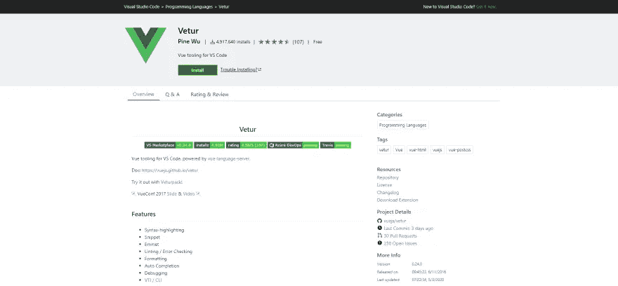

[韦图尔](https://marketplace.visualstudio.com/items?itemName=octref.vetur)

# ES7 React/Redux/graph QL/React-本机代码片段

ES7 React/Redux/GraphQL/React-Native snippets 是一个扩展，为 ES7 解决方案的 JS/TS 中的 React、Redux 和 graph QL 提供代码片段。可以参考其主页上的语法表！

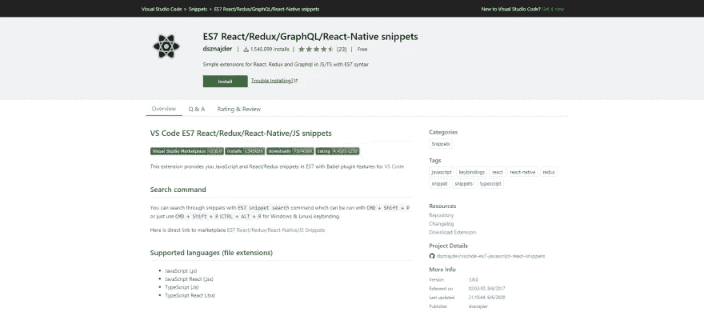

[ES7 React/Redux/graph QL/React-Native 片段](https://marketplace.visualstudio.com/items?itemName=dsznajder.es7-react-js-snippets)

相关文章:

*   [面向 Web 开发人员的备忘单](https://us.niemvuilaptrinh.com/article/top-cheat-sheets-for-web-developer)
*   [面向前端开发者的开源项目](https://us.niemvuilaptrinh.com/article/63-open-source-web-development-tools)
*   [Web 开发者扩展](https://us.niemvuilaptrinh.com/article/24-google-chrome-extensions-for-web-development)

*更多内容看* [***说白了就是***](http://plainenglish.io/) *。报名参加我们的* [***免费周报***](http://newsletter.plainenglish.io/) *。在我们的* [***社区不和谐***](https://discord.gg/GtDtUAvyhW) *获得独家获取写作机会和建议。*