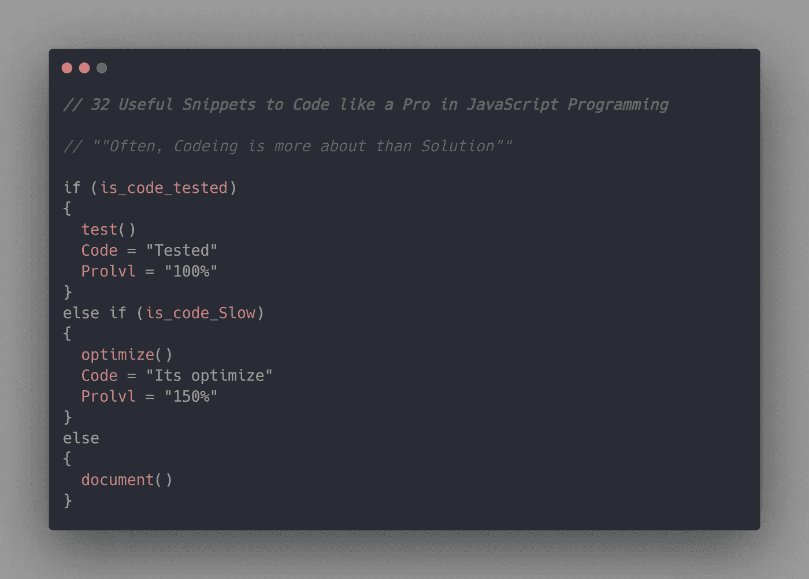

# 32 个有用的 JavaScript 代码片段

> 原文：<https://javascript.plainenglish.io/32-useful-snippets-to-code-like-a-pro-in-javascript-c8b5be11752f?source=collection_archive---------11----------------------->



JavaScript 无疑是 web 开发中最流行的语言之一。无论你选择使用 Angular、jQuery、Vue.js 还是 React，JavaScript 在所有这些工具中都扮演着重要角色。由于庞大的 JavaScript 社区，他们有大量的内置库来解决你的日常问题。

在这篇文章中，我们将看 32 个代码片段来像专业人员一样用 JavaScript 编码。我们将看到一些有趣的代码片段，它们将帮助你解决编程中的日常问题，你将学习如何一般性地编码。其中一些你可能已经知道了，但是大部分对你来说是新的和有趣的。

## 1.字节大小

这个片段将显示字符串或整数的字节大小。简单地说，它会显示你的字符串或整数的长度。

```
const byteSize1 = str => new Blob([str]).size;
const byteSize2 = int => new Blob([int]).size;byteSize1("JavaScript") // 10
byteSize2(101) // 3
```

## 2.转换为数组

这个简单的 snippet 方法将把非数组值或数据转换成数组形式。

```
const convertToArray = val => (Array.isArray(val) ? val : [val]);convertToArray("Pro") // [Pro]
convertToArray(101) // [101]
```

## 3.大写

这个 snippet 方法将以大写形式转换字符串中字符的每个第一个字母。检查下面的代码，了解它是如何工作的。

```
const capitalize = str => str.replace(/\b[a-z]/g, char => char.toUpperCase());capitalize('code'); //Code
capitalize('javascript programming'); //Javascript Programming
```

## 4.获取当前 Url

这个片段对于获取 javascript 正在运行的当前 URL 非常有用。这在前端调试中很方便。

```
const currentURL = () => window.location.href;currentURL() // https://medium.com/@codedev101
```

## 5.数字化

这个令人敬畏的片段将把你的数字转换成一个数字数组。查看下面的代码示例。

```
const digitize = n => [...`${n}`].map(i => parseInt(i));digitize(345) // [3,4,5]
digitize(123) // [1,2,3]
digitize(6) // [6]
```

## 6.计数出现次数

这段代码将计算数组中某个值的出现次数。当您想知道一个值在一个大数组中出现了多少次时，这就很方便了。

```
const countOccurrences = (arr, val) => arr.reduce((a, v) => (v === val ? a + 1 : a), 0);countOccurrences([2,4,6,2,5,2], 2)  // 3
countOccurrences([1,4,6,2,5,6], 6)  // 2
```

## 7.变位词

这个代码片段用于检查一个特定的字符串是否是一个变位词。变位词是可以重新组织成另一个词的词。

```
const Anagram = (string1, string2) => {
  const normalize = str =>str 
  .toLowerCase() 
  .replace(/[^a-z0-9]/gi, '')
  .split('')
  .sort()
  .join('');
  return normalize(string1) === normalize(string2);
};Anagram("race", "care") // true
Anagram("part", "trap") // true
```

## 8.检查浏览器选项卡焦点

这段代码将告诉您 javaScript 当前运行的浏览器选项卡是否被聚焦。

```
const Browser_Tab_Focused = () => !document.hidden;Browser_Tab_Focused(); // true
```

## 9.检查浏览器

这段代码会告诉你 JavaScript 运行的环境是不是浏览器。正如我们所知，我们可以用浏览器和`node js`运行 JavaScript，如果我们能检查我们在哪个环境中工作，那会很好。

```
const isBrowser = () => ![typeof window, typeof document].includes('undefined');isBrowser() // true   if on isBrowser
isBrowser() // false  if we are on node js or any other environment
```

## 10.检查空值

这段代码将检查变量或值是否为空。

```
const checkNull = val => val === undefined || val === null;checkNull() // true
checkNull(234) // false
```

## 11.isNumber

这个简单的代码片段将检查值的变量是否是一个数字。

```
function isNumeric(num) {
  return !isNaN(parseFloat(num)) && isFinite(num);
}isNumeric(324) //true
isNumeric("Code") // false
```

## 12.isString

这段代码将检查变量或值是否是字符串。

```
const isString = val => typeof val === 'string';isString('hello world'); // true
isString('1234'); // true
isString(345); // false
```

## 13.最大数量

这个 snippet 方法将返回列表中最大的数字。这是从列表中找到最大数的最快方法。

```
const maxN = (arr, n = 1) => [...arr].sort((a, b) => b - a).slice(0, n);maxN([3,8,7]) // 8
maxN([1,5,6,23]) // 23
```

## 14.反面的

这段代码只是简单地颠倒了字符串。这在你需要反转一个字符串或检查回文的短任务中很方便。

```
const reverseStr = str => [...str].reverse().join('');console.log(reverseStr("JavaScript"))  // tpircSavaJ
console.log(reverseStr("123"))  // 321
```

## 15.从列表中随机选择

这段代码用于从列表中选择一个随机数。

```
const random = arr => arr[Math.floor(Math.random() * arr.length)];console.log(random([1,4,5,6])) // 6
console.log(random([1,4,0,6])) // 1
```

## 16.重定向到 Url

这个片段是我最喜欢的一个，它会把你重定向到 URL。当您重定向到一个网站时，这在 web 开发中很方便。当用户执行任何动作时

```
const redirect = (url, asLink = true) => asLink ? (window.location.href = url) : window.location.replace(url);redirect('https://medium.com/')
redirect('https://codedev101.medium.com/')
```

## 17.列表的头元素

这段代码将展示如何快速获取任何列表的第一个元素。

```
const head = arr => arr[0];head([1,2,3]) // 1
head(["JavaScript", "Python", "C++"]) // JavaScript
```

## 18.列表的尾部元素

这段代码将展示如何以一种简单快捷的方式获得任何列表的尾部元素。

```
const tail = arr => arr[arr.length - 1];console.log(tail([1,2,3])); // 1
console.log(tail(["JavaScript", "Python", "C++"])); // JavaScript
```

## 19.最小数

这段代码将快速返回列表中最小的数字。

```
const minimum = (arr, n = 1) => [...arr].sort((a, b) => a - b).slice(0, n);console.log(minimum([2,4,6,1]))   // 1
console.log(minimum([22, 55, 66, 77, 11, 19]))  // 11
```

## 20.I 上壳

当您想要检查字符串是否为大写时，这段代码片段将非常有用。

```
const isUpperCase = str => str === str.toUpperCase();isUpperCase("Code") //false
isUpperCase("PROGRAMMING") //true
isUpperCase("aB") //false
```

## 21.小写字母

我们看到的这个代码片段会检查字符串是否是小写的。

```
const isLowerCase = str => str === str.toLowerCase();isLowerCase("code") //true
isLowerCase("PROGRAMMING") //false
```

## 22.范围生成器中的整数数组

这段代码将向您展示如何生成一个带有`n`数字并且在一个范围内的随机整数数组。检查下面的代码，了解它是如何工作的。

```
const randomIntArrayInRange = (min, max, n = 1) =>
  Array.from({ length: n }, () => Math.floor(Math.random() * (max - min + 1)) + min);console.log(randomIntArrayInRange(10, 15, 5)); // [ 14, 11, 15, 10, 13 ]
```

## 23.范围生成器中的随机整数

这段代码用于生成给定范围内的随机整数。

```
const randomInteger = (min, max) => Math.floor(Math.random() * (max - min + 1)) + min;console.log(randomInteger(1,10)) // 6
console.log(randomInteger(1,20)) // 8
```

## 24.获取类型

这段代码片段可用于检查 JavaScript 中任何变量或值的类型。

```
const getType = v => v === undefined ? 'undefined' : v === null ? 'null' : v.constructor.name.toLowerCase();getType([3,4,5]) //array
getType("JavaScript")  //string
getType(true)  //boolean
```

## 25.从数组中删除重复项

这个代码片段是从数组中删除重复项的一个快速而简单的方法。

```
const filterNonUnique = arr => [...new Set(arr)];console.log(filterNonUnique([2,2,5,5,7,7,8])) // [2,5,7,8]
console.log(filterNonUnique([1,2,3,2,3,6]))  // [1,2,3,6]
```

## 26.半径度数

这段代码将向您展示如何快速简便地将度数转换为半径。

```
const degreesToRad = deg => (deg * Math.PI) / 180.0;degreesToRad(80.0) // 1.3962634015954636
degreesToRad(360.0) // 6.283185307179586
```

## 27.一年中的某一天

这段代码将返回一年中的某一天。

```
const dayOfYear = date => Math.floor((date - new Date(date.getFullYear(), 0, 0)) / 1000 / 60 / 60 / 24);dayOfYear(new Date()) // 140
```

## 28.从列表中删除错误元素

这个 snippet 方法将从列表中删除 false 元素，如 null、false、0 或空元素。

```
const compactJs = arr => arr.filter(Boolean);compactJs([2,4,false,NaN,5,"",0]) //[2,4,5]
```

## 29.检查所有平等

这个代码片段将检查数组的所有元素是否相等。

```
const AllEqual = arr => arr.every(val => val === arr[0]);AllEqual([1, 2, 3]); // false
AllEqual([1, 2, 2]); // false
AllEqual([2, 2, 2]); // true
```

## 30.丢弃元素

这段代码从左侧的列表中删除元素。

```
const drop = (arr, n = 1) => arr.slice(n);console.log(drop([2, 4, 6])) // [4, 6]
console.log(drop([2, 4, 6], 2))  //[6]
```

## 31.获得时间

这段代码将以字符串格式从数据对象返回当前时间。

```
const getTime = date => date.toTimeString().slice(0, 8);getTime(new Date()) // "10:45:12"
```

## 32.读取文件行

这段代码将读取一个文件，并以数组格式存储它的行。

```
const fs = require('fs');const readFileLines = filename =>fs
  .readFileSync(filename)
  .toString('UTF8')
  .split('\n');let arr = readFileLines('test.txt');
console.log(arr); // ['line 1', 'line 2', 'line 3' ,'line 4]
```

## 最后的想法

我希望这篇文章对你有帮助。这些代码片段对初学者和当前的 JavaScript 开发人员都有帮助，有助于提高他们的编码技能。如果我错过了任何有用的片段，让我知道作为回应。分享您对本文的反馈和**快乐的 JavaScript 编码！**

***你可以看看我的其他文章。希望你会觉得有趣和有帮助。***

[](/9-must-know-array-methods-to-boost-your-javascript-skills-4ae1822f7751) [## 提高 JavaScript 技能的 9 个必须知道的数组方法

### JavaScript 有一些内置的数组方法，可以在不同的情况下使用。了解这些将会提高你的…

javascript.plainenglish.io](/9-must-know-array-methods-to-boost-your-javascript-skills-4ae1822f7751) [](/puppeteer-js-web-scraping-with-a-headless-browser-b5c5151c24a5) [## js:使用无头浏览器进行网络抓取

### Web 开发在很大程度上依赖于测试机制，在我们将它们投入生产之前进行质量检查…

javascript.plainenglish.io](/puppeteer-js-web-scraping-with-a-headless-browser-b5c5151c24a5) 

*更多内容请看*[*plain English . io*](http://plainenglish.io/)